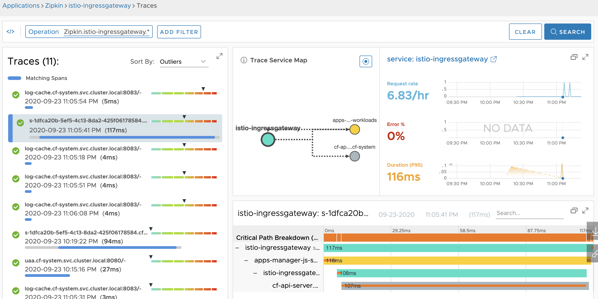
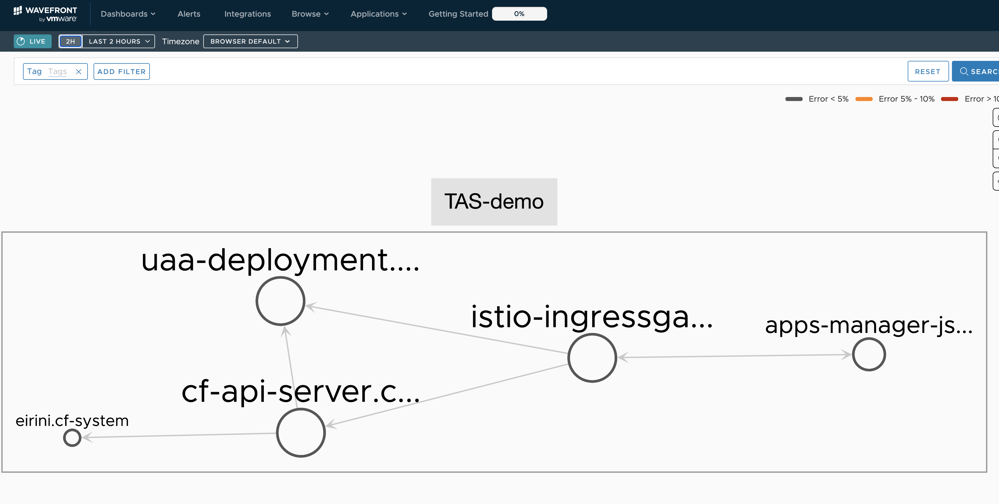

Distributed traces from Tanzu Application Service (for k8s) can be forwarded to Wavefront.

# Introduction

Tanzu Application Service for k8s (TAS4K8S from here on) is VMware's commercial distribution of cf-for-k8s.

As listed below, cf-for-k8s ships with Istio as its service mesh — and having Istio means distributed tracing is available.

https://github.com/cloudfoundry/cf-for-k8s/tree/develop#built-with

This post shows how to send TAS tracing data to Tanzu Observability (Wavefront).

# Caution

This is not an officially supported procedure, so proceed at your own risk.

# Steps

The steps are almost disappointingly simple; you basically follow the installation instructions here:

https://docs.pivotal.io/tas-kubernetes/0-3/installing-tas-for-kubernetes.html#install-tas-for-k8s-from-network

Before kicking off the TAS installation, create the following `configuration-value/zipkin-url.yaml`.
Replace `externalName: wavefront-proxy.wavefront.svc.cluster.local` with the URL where your wavefront-proxy runs.

```yaml
#@ load("@ytt:data", "data")
---
apiVersion: v1
kind: Service
metadata:
  name: zipkin
  namespace: istio-system
spec:
  type: ExternalName
  externalName: wavefront-proxy.wavefront.svc.cluster.local
```

Next, create `configuration-value/istio-distributed-tracing.yaml`.

```yaml
#@ load("@ytt:overlay", "overlay")

#@overlay/match by=overlay.subset({"kind": "Deployment", "metadata": {"name": "istiod"}})
---
spec:
  template:
    spec:
      containers:
      #@overlay/match by="name"
      - name: discovery
        env:
        #@overlay/match by="name"
        - name: PILOT_TRACE_SAMPLING
          value: "100"
```

That's it. Then install as described in the manual.

```
./bin/install-tas.sh ../configuration-values
```


# Result

If everything is configured correctly, you can see the traces in Wavefront like this:





# Summary

Forwarding TAS4K8S traces to an external system is easy.
