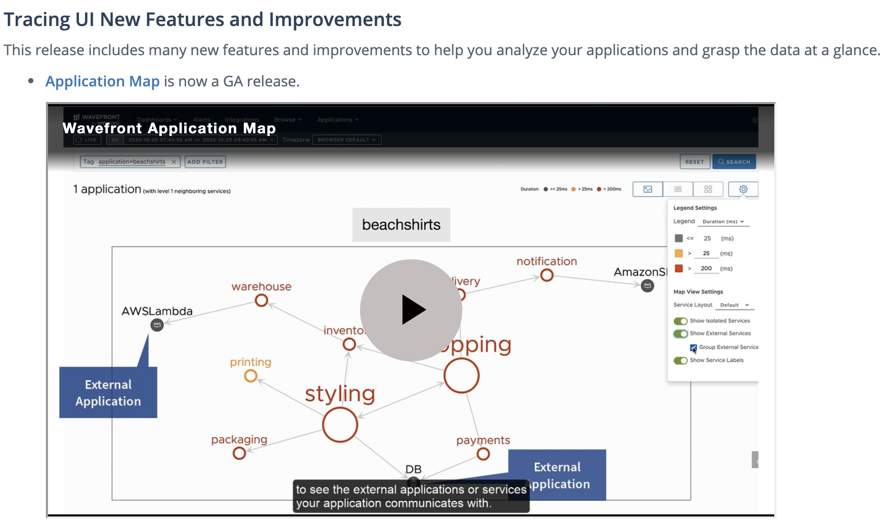
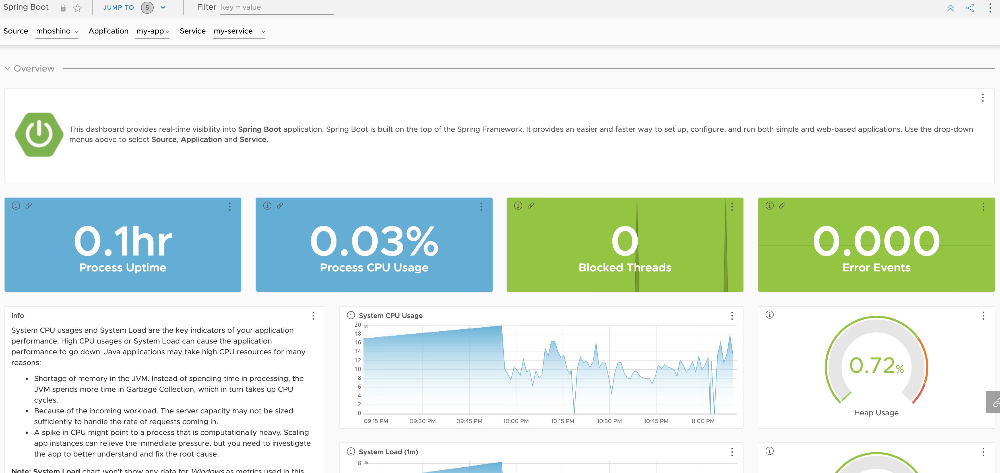
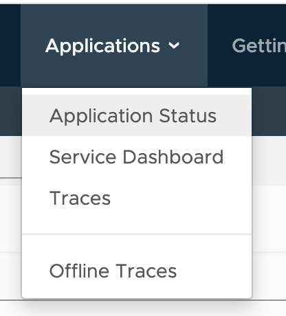
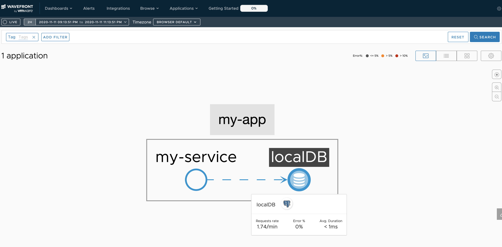
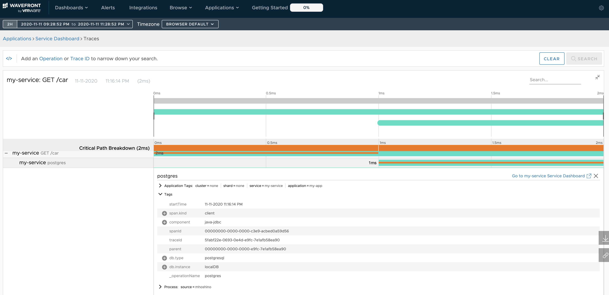
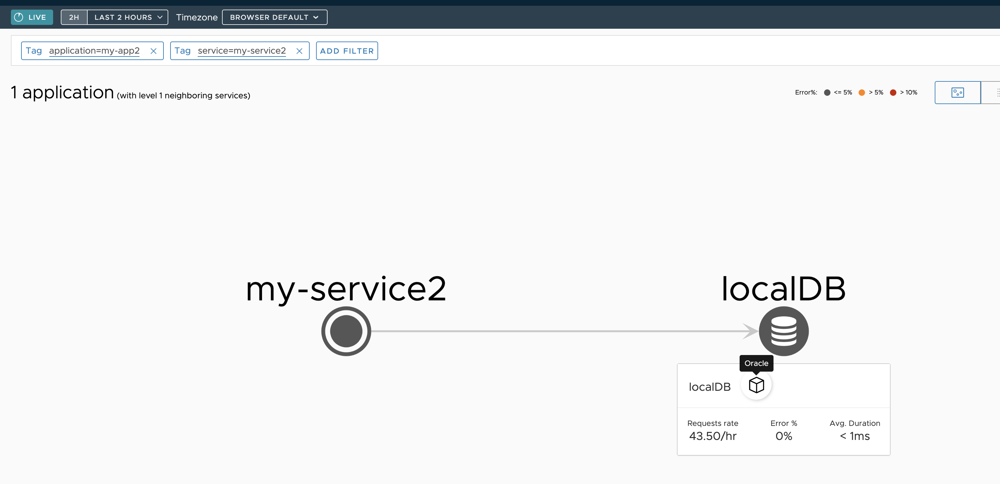

Tanzu Observability can now visualize database traffic. Amazing.<!--more-->

## Introduction

Tanzu Observability (TO from here on) published [Release 2020-38.0](https://docs.wavefront.com/2020.38.x_release_notes.html#tracing-ui-new-features-and-improvements).
It is the first major update in a while, and it adds visualization of Amazon services and database traffic to distributed tracing.



As covered in [part 6](https://blog.lespaulstudioplus.info/posts/wf-demanabu-dt/) of this [series](https://blog.lespaulstudioplus.info/posts/wf-demanabu-dt/), TO's distributed tracing could already visualize AMQP traffic in addition to HTTP traffic. For databases, however, nothing intuitive was offered yet — it was a missing piece.

With this update, database traffic can now be visualized too, and I believe TO is on its way to becoming fully usable for application monitoring.

This post shows how.

## Prerequisites

* A rough understanding of this [series](https://blog.lespaulstudioplus.info/posts/wf-demanabu-dt/)

## Preparation

Prepare a workstation with the following installed:

* Java JDK 8+

Install the JDK following [Oracle JDK](https://www.oracle.com/java/technologies/javase-downloads.html).

Additionally, install PostgreSQL on the workstation and do the initial setup of username/password. See:

https://www.postgresql.org/docs/9.3/tutorial-install.html

Only the user and database are needed; tables are generated automatically from the code.

## Source code

Published here:

https://github.com/mhoshi-vm/wavefront-ext-dt

## Just try it first

Let's postpone the code walkthrough and start it right away.
First download the source code above.

```
git clone https://github.com/mhoshi-vm/wavefront-ext-dt
cd wavefront-ext-dt
```

Next, update `src/main/resources/application.properties` for your environment.
In particular, change `spring.datasource.url`, `spring.datasource.username` and `spring.datasource.password`.

```
wavefront.application.name=my-app
wavefront.application.service=my-service

spring.datasource.driver-class-name=org.postgresql.Driver

spring.datasource.url=jdbc:postgresql://localhost:5432/example-db
spring.datasource.username=spring
spring.datasource.password=spring
```

Now start the application.

```
./mvnw spring-boot:run
```

The first startup may take a while, so be patient.
Keep the URL printed at the end — you will access it later.

```
2020-11-11 23:02:51.824  INFO [,,,] 919 --- [           main] c.e.p.PostgreSluethApplication           : Started PostgreSluethApplication in 4.131 seconds (JVM running for 4.379)

Your existing Wavefront account information has been restored from disk.

To share this account, make sure the following is added to your configuration:

	management.metrics.export.wavefront.api-token=XXXXXX
	management.metrics.export.wavefront.uri=https://wavefront.surf

Connect to your Wavefront dashboard using this one-time use link:
https://wavefront.surf/us/XXXXXX
```

Then open another prompt and keep sending requests with:

```
watch curl -sS localhost:8080/car
```

If the code runs correctly, you should see output like:

```
[{id=1, name=Avalon}, {id=2, name=Corolla}, {id=3, name=Crown}, {id=4, name=Levin}, {id=5, name=Yaris}, {id=6, name=Vios}, {id=7, name=Glanza}, {id=8, name=Aygo}]
```

After about five minutes, access the URL from earlier.
You should see a screen like this:




The screen is already stylish and may catch your eye, but instead go to the upper tabs and open [Applications] > [Application Status].



You should now see the connection between the application and the database like this:



Success. Amazing.

## How it works

How Tanzu Observability sees this database tracing information is described in the manual:

https://docs.wavefront.com/tracing_external_services.html

In short:

* Displaying the DB is not much different from regular distributed tracing
* On the TO side, "certain tags" on the submitted spans identify them as DB traces

The "certain tags" are these three:

* component: which application connects? Fixed to "java-jdbc" at the time of writing
* db.type: what kind of DB? postgresql, Oracle, etc.
* db.instance: the display name on TO

In other words, as long as you can send spans carrying these tags, TO renders them automatically.
The document above points you to a dedicated SDK, but once you understand the mechanism, you can implement it with standard libraries such as Spring Boot's Sleuth, as in this sample app.

The heart of the code is here:

https://github.com/mhoshi-vm/wavefront-ext-dt/blob/main/src/main/java/com/example/postgreslueth/PostgreSluethApplication.java#L36-L49

```java
String performSql(String SQL) {
  Span newSpan = this.tracer.nextSpan().name("postgres").start();
  try {
    newSpan.tag("component", "java-jdbc");
    newSpan.tag("span.kind", "client");
    newSpan.tag("db.type", "postgresql");
    newSpan.tag("db.instance", "localDB");
    List<Map<String, Object>> list;
    list = jdbcTemplate.queryForList(SQL);
    return list.toString();
  } finally {
    newSpan.finish();
  }
}
```

Open [Applications] > [Traces] and you can see the spans carrying those tags.



As you can see, every SQL execution creates a span and adds the tags.
By the way, if you set `db.type` to another DB, it displays like below. Sadly there's no Oracle icon yet, which is a little lonely...



Unfortunately it doesn't reach "no code changes at all", but as you can see it's quite simple to build. My own coding skills aren't great, yet... with a bit more work you could add spans without much thought via shared helper functions.

And best of all! Everything shown here is free. TO is generous indeed!

## Summary

TO's new DB tracing feature is fairly easy to implement and broadens the scope of application monitoring.
