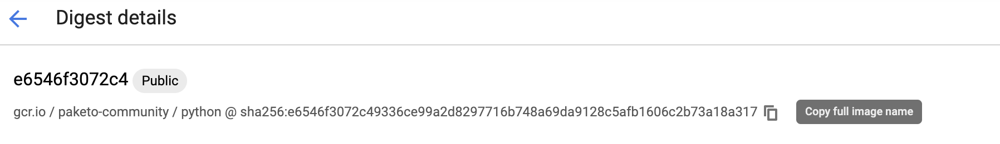

In the [previous post](../7) I showed a way to install the Python Buildpack on Tanzu Application Service (Beta). That approach had a problem, though: it was not persisted every time the install script (kapp) ran, so it had to be re-applied. This revised post shows how to make the buildpack installation persistent.

## Caution

This is still not an official procedure, so beware.


## Steps

### 1. Find the Python buildpack you want to use

Log into the following URL:

https://console.cloud.google.com/gcrpython?gcrImageListsize=30

Select the Python Buildpack you want to use and save its URL.



This example proceeds with version 0.0.3.

### 2. Override the Python buildpack to the desired version

Prepare a YAML file like the one below as `../configuration-values/python-buildpack.yaml`. Replace the value after `image:` with what you copied in the previous step.

```yaml
#@ load("@ytt:overlay", "overlay")

#@overlay/match by=overlay.subset({"kind": "Store","metadata": {"name": "cf-buildpack-store"}})
---
spec:
  sources:
  #@overlay/match by=overlay.all
  #@overlay/match by=lambda x, y, z: y["image"].startswith("gcr.io/paketo-community/python"), expects="1+"
  #@overlay/replace
  - image: gcr.io/paketo-community/python@sha256:e6546f3072c49336ce99a2d8297716b748a69da9128c5afb1606c2b73a18a317
```

Also, if the following file exists, move it to `config-optional`:

```
mv config/omit-community-buildpacks.yml config-optional/
```

### 3. Re-run the installation

Re-run the install described here:

https://docs.pivotal.io/tas-kubernetes/0-3/installing-tas-for-kubernetes.html#install-tas-for-k8s-from-network

## Verification

If the Python buildpack shows up in the `Store` like below, you succeeded.

```yaml
$ kubectl get store cf-buildpack-store -o yaml
...
- api: "0.2"
	buildpackage:
		id: paketo-community/python
		version: 0.0.3
	diffId: sha256:10c2a652e1089dfc757f8041099ee287dbeb24645dc6810585e09c76cf7cf3be
	digest: sha256:a99f8b9f7854ebd520ce682aa23733dca6635b848fcaa61779fdfcd4b012ce22
	id: paketo-community/pip
	size: 5023166
	stacks:
	- id: io.buildpacks.stacks.bionic
	- id: org.cloudfoundry.stacks.cflinuxfs3
	storeImage:
		image: gcr.io/paketo-community/python@sha256:e6546f3072c49336ce99a2d8297716b748a69da9128c5afb1606c2b73a18a317
	version: 0.0.139
```

## Summary

 The Python buildpack can be persisted as well.
