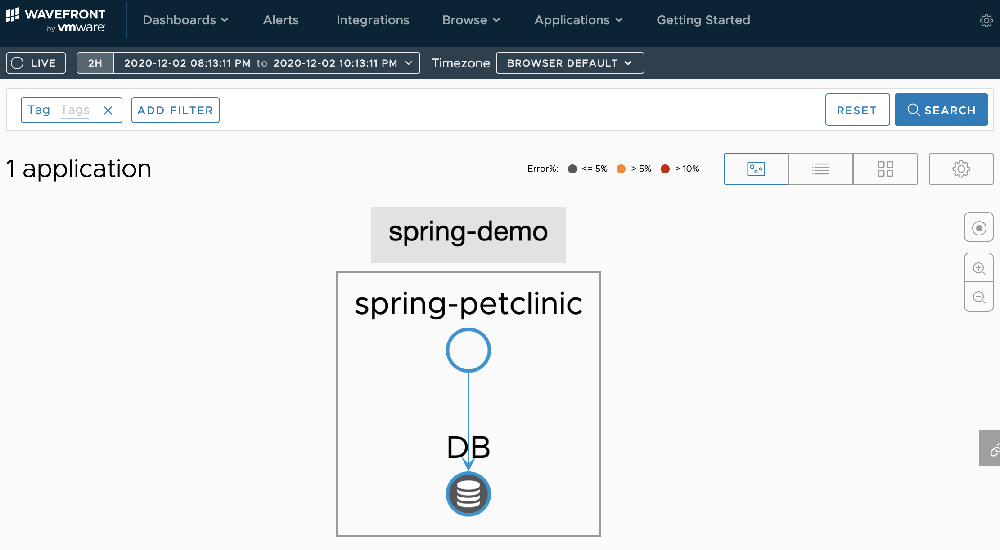
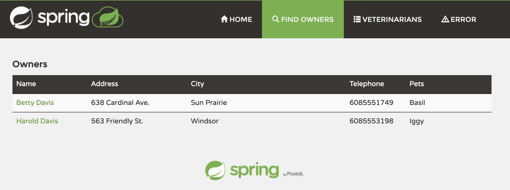
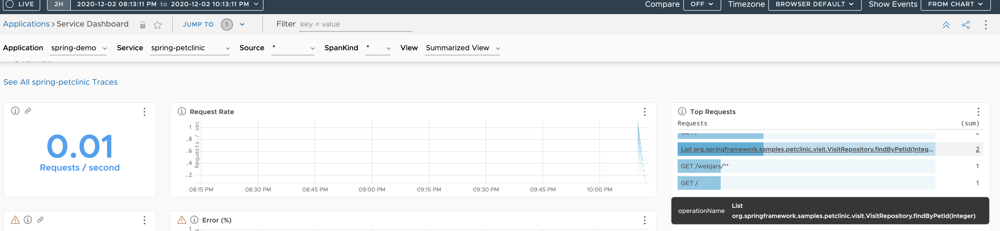

With Spring AOP, adding the span information for Tanzu Observability's DB tracing becomes easy.<!--more-->




## Introduction

In [this post](../10) I introduced how to visualize DB traffic in Tanzu Observability.
As mentioned there, visualizing DB traffic requires adding specific tags to the spans.

At the time I commented:

> Unfortunately it doesn't reach "no code changes at all", but as you can see it's quite simple to build. My own coding skills aren't great, yet... with a bit more work you could add spans without much thought via shared helper functions.

After thinking about it for a while, I realized Spring AOP (Aspect Oriented Programming) makes this easier than expected.

Spring AOP is a coding style that looks across your Spring code and inserts the necessary code cross-cuttingly. Since we want to hook into every SQL-related operation across the board, it is a perfect match. Partly as an AOP study exercise, let's do it this way.

This post shows how to generate the required spans comprehensively using Spring AOP.
The target is Petclinic, an application with somewhat complex logic:

https://github.com/spring-projects/spring-petclinic

## Prerequisites

* A rough understanding of this [series](https://blog.lespaulstudioplus.info/posts/wf-demanabu-dt/)

## Preparation

Prepare a workstation with the following installed:

* Java JDK 8+

Install the JDK following [Oracle JDK](https://www.oracle.com/java/technologies/javase-downloads.html).

## Source code

Published here:

https://github.com/mhoshi-vm/spring-petclinic

## Steps

The steps are not that complicated, but here they are.

### 1. Download Spring Petclinic

Naturally, first clone Petclinic.

```
git clone https://github.com/spring-projects/spring-petclinic
```

### 2. Code the AOP part

Save the following code as `src/main/java/org/springframework/samples/petclinic/PetClinicAspect.java`.

```java
package org.springframework.samples.petclinic;

import org.aspectj.lang.ProceedingJoinPoint;
import org.aspectj.lang.annotation.Around;
import org.aspectj.lang.annotation.Aspect;
import org.springframework.beans.factory.annotation.Autowired;
import org.springframework.beans.factory.annotation.Value;
import org.springframework.stereotype.Component;

import brave.Span;
import brave.Span.Kind;
import brave.Tracer;

@Aspect
@Component
public class PetClinicAspect {

	@Value("${petclinic.db.type:local}")
	String dbType;

	@Value("${petclinic.db.instance:localDB}")
	String dbInstance;

	@Autowired
	Tracer tracer;


	@Around("execution(* org.springframework.samples.petclinic.*.*Repository+.*(..)))")
	public Object AddSpan(ProceedingJoinPoint joinpoint) throws Throwable {
		Span newSpan = this.tracer.nextSpan().name(joinpoint.getSignature().toString()).start();

		try {
			newSpan.tag("component", "java-jdbc");
			newSpan.kind(Kind.CLIENT);
			newSpan.tag("db.type", dbType);
			newSpan.tag("db.instance", dbInstance);
			Object result = joinpoint.proceed();

			return result;
		}
		finally {
			newSpan.finish();
		}

	}

}
```

What this code means is covered later.

### 3. Turn on Tanzu Observability integration

Basically, follow this:

https://docs.wavefront.com/wavefront_springboot_tutorial.html

This commit log is the result of following it:

https://github.com/mhoshi-vm/spring-petclinic/commit/2cf6a34adda9d8aac420ca62229797f42309cf5c

That's about it for the steps. Easy.

## Verification

Let's verify right away. Start the Spring Boot app.

```
./mvnw spring-boot:run
```

Save the URL that appears at startup:

```
A Wavefront account has been provisioned successfully and the API token has been saved to disk.

To share this account, make sure the following is added to your configuration:

	management.metrics.export.wavefront.api-token=XXXXX
	management.metrics.export.wavefront.uri=https://wavefront.surf

Connect to your Wavefront dashboard using this one-time use link:
https://wavefront.surf/us/XXXXXXX
```

Then log into:

http://localhost:8080

We need to generate some DB traffic, so keep clicking buttons.
The best option is running some searches in Find Owners.



After about five minutes, log into the URL you saved earlier.
After logging in, select [Applications] > [Application Status].
If all went well, it should look like this:


Success. Nice.

Open [Application] > [Services Dashboard]. Besides HTTP requests you'll see Java methods like the ones below (explained later) — these are the Java methods executing SQL.



## Explanation

So what was Spring AOP doing here? The key is this code in `src/main/java/org/springframework/samples/petclinic/PetClinicAspect.java`:

```java
...
@Around("execution(* org.springframework.samples.petclinic.*.*Repository+.*(..)))")
public Object AddSpan(ProceedingJoinPoint joinpoint) throws Throwable {
	Span newSpan = this.tracer.nextSpan().name(joinpoint.getSignature().toString()).start();
...
```

This expression is what's called a pointcut — it describes which methods to inject the logic into.
The search part is `"execution(* org.springframework.samples.petclinic.*.*Repository+.*(..)))"`. It takes advantage of the Spring convention that database access lives in `*Repository.java` files, and targets every method in those files. Namely this source code:

```
spring-petclinic % find . -name "*Repository.java"
./src/main/java/org/springframework/samples/petclinic/vet/VetRepository.java
./src/main/java/org/springframework/samples/petclinic/owner/PetRepository.java
./src/main/java/org/springframework/samples/petclinic/owner/OwnerRepository.java
./src/main/java/org/springframework/samples/petclinic/visit/VisitRepository.java
```

The `@Around` annotation lets us add logic before and after those methods are invoked. What we added is code to create a Span around each of them.

This way, with minimal code, we could cross-cuttingly generate the desired spans for SQL operations.

## Summary

Tanzu Observability's new feature makes DB traffic visible. The concern was having to touch the code, but with Spring AOP the required code shrinks considerably and the barrier feels much lower.
