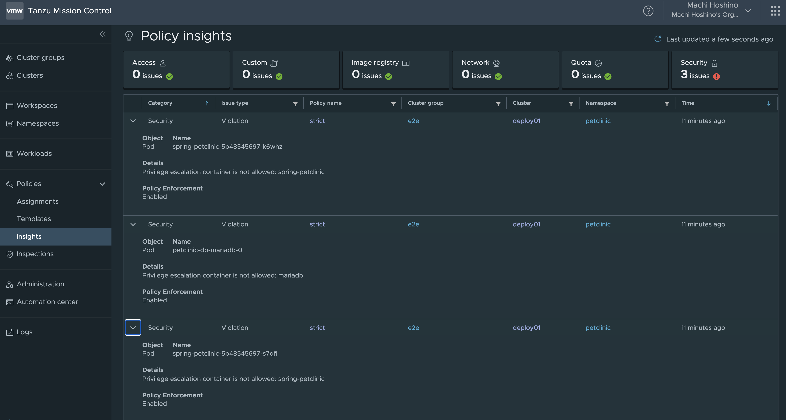
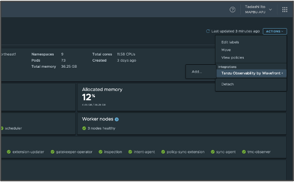
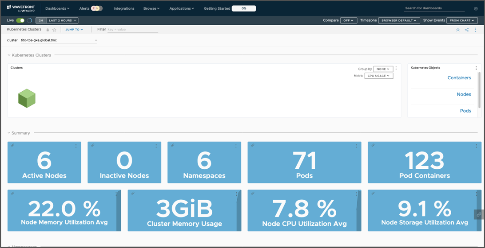
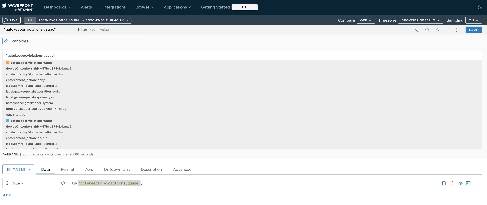

Tanzu Mission Control(TMC)の報告するポリシー違反情報はOpen Policy Agentの仕組みを使って、動作しています。そしてそれをTanzu Observability(TO)からモニターすることができます。<!--more-->

## はじめに

この[シリーズ](https://blog.lespaulstudioplus.info/posts/tmc-demanabu-opa/)でも紹介したように、TMCのポリシー管理の裏の仕組みにOPAが使われていることを紹介させていただきました。

さて、今回はその中で取り上げるこのPolicy Insightsの機能です。



[TMCのOpen Policy Agentを遊んでみる](../tmc-demanabu-opa-02)  でも紹介しましたが、これはOpen Policy Agent(OPA)が報告している違反の値です。さて、TMCには今のところ特にアラート機能はないです。なので、このPolicy Insightsの情報は有用なのですが、モニターができていないです。アラートのモニターの機能といったら、Tanzu Observabilityです。[OPAはデフォルトでメトリクスが定義されて](https://www.openpolicyagent.org/docs/latest/monitoring/)おり、これをTOと連携する、といったことを今回やってみます。

## 前提

* Kubernetesをもっている
* TMCのアカウントをもっている(ないなら[HOLをつかう](https://qiita.com/hmachi/items/a2f5eeb5abd7c72a4873))
* TOのアカウントをもっている(ないなら[Free Trialに申し込む](https://tanzu.vmware.com/observability))

## 手順

### 1. KubernetesをTMCに登録する

これのやり方はHOLとかで共有されているので割愛

### 2. KubernetesでTMCのポリシーを有効にする

[TMCのOpen Policy Agentを遊んでみる](../tmc-demanabu-opa-02) でやり方を説明しているので割愛

### 3. Tanzu Observabilityの設定をする

TMCがある場合、TOへの設定は簡単です。対象のクラスターを選択後、[Actions] > [Integrations] > [Tanzu Observability by Wavefront]を選択します。



TOのアカウント情報などをいれて実行してしばらくまちます。そうするとTO側で自然に以下のように表示されるようになります。



### 4. OPAディスカバリー用ファイルを作成する

TMCからTOを設定した場合、デフォルトでRuntime Configという機能が有効になっています。

https://github.com/wavefrontHQ/wavefront-collector-for-kubernetes/blob/master/docs/discovery.md#runtime-configurations

この場合、`ConfigMap`経由で追加でスクレイプしたい対象を定義できます。以下のようなファイルを用意します。これは、opaに関連したpodを見つけ出し、`8888`ポートをスクレイプします。

```
apiVersion: v1
kind: ConfigMap
metadata:
  name: opa-collector
  namespace: tanzu-observability-saas
  annotations:
    # This annotation is required for runtime configurations
    wavefront.com/discovery-config: 'true'
data:
  collector.yaml: |
    # specify a list of discovery rules (plugins)
    plugins:
    # memcached
    - name: opa
      type: prometheus
      selectors:
        labels:
          gatekeeper.sh/system:
          - yes
      port: 8888
```

### 5. 適用する

そしてあとは、kubectlを適用するぐらいです。

```
kubectl apply -f <4.のファイル>
```

以上です。

## みてみる

TOの画面にログインします。そして[Browse] > [Metrics]から以下のパスを選びます。
そして`"gatekeeper.violations.gauge"`をみます。すると以下のような感じで見えてきます。



この際、`enforcement_action: deny`の値がついているものがポリシー違反のものです。この値はTMCが報告している値を一致します(はず)。ここまでくればあとはTOの世界です。アラートを定義することでポリシー違反に対して通知などを設定できます。

## まとめ

TMCのポリシー違反はOPAでできているので、簡単にTOに連携できます。
