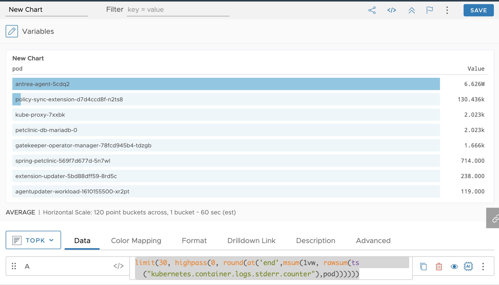

Kubernetes環境のログ監視を、FluentdとTanzu Observabilityのみを使った簡易なものをがんばって実現しようとしました。<!--more-->

## はじめに

[前回](../16)につづき頑張ってFluentdのみでKubernetesのログ管理の仕組みを調べて作ってみました。

前回では、fluentdのPrometheusプラグインを使い、メトリクスをfluentd側で生成する方法をとりました。しかし、この方法は以下の問題があり、実際の運用で使う上では考慮点が残りました。

* fluentdのメモリーを食い潰す
* Tanzu Observabilityの課金に直結するPPSは、スクレイプあたりのデータ数に依存するので、どんどん課金データが肥大化する

これは根本的に、fluentd側で停止したPodを判別できず、メトリクスのエントリーがずっと残り続けるという問題から派生した問題でした。fluentdの再起動ぐらいしか、メトリクスのリフレッシュ方法はなく、なので、fluentd側でメトリクスを生み出すのはこのケースでは難しいと判断しました。

そこで、今回は、前回と異なり、マニュアルに案内されている[Sending Log Data to a Wavefront Proxy With TCP](https://docs.wavefront.com/integrations_log_data.html#sending-log-data-to-a-wavefront-proxy-with-tcp)を使った方法を紹介したいと思います。


この方法は、ログのデータをWavefront Proxyに送信してしまい、Wavefront Proxy側で転送されるログを元にデータをGrokパターン(あとで解説します)で解析、そしてそれをメトリクスとして転送するというものです。

## 注意点

今回紹介する記事は全てサポートされる方法を使っており、サポートとして問題ないはずですが、マニュアルなどに明記されていない手順のため、検証などは自己責任で実施いただくようお願いします。

また、この方法（も)ですが、完璧ではなく問題もあるので、このページの"この方法での問題点"もご参照ください。


## 環境

以下のような環境を用意してください。

* Kubernetes環境 (TKGなど)
* Wavefront CollectorおよびWavefront Proxyをインストールしている([HELMでやる方法が簡単です](https://github.com/wavefrontHQ/helm/tree/master/wavefront))

なお、Wavefront Collectorをインストールする場合、[Annotation Based Discovery機能](https://github.com/wavefrontHQ/helm/tree/master/wavefront)はオンにしてください。デフォルト有効なので、明示的に無効にしない限り、そのままで大丈夫なはずです。

## ソースコードなど

いかに公開しています。

https://github.com/mhoshi-vm/tanzu-observability-k8s-fluentd


## 検証

とりあえず、さくっと試します。

### fluentdのデプロイ

今回は[Tanzu Application Catalog](https://bitnami.com/tanzu-application-catalog)で公開されているDemo用のFluentdのhelmチャートを利用します。

まずは、gitをクローンします。

```
git clone https://github.com/mhoshi-vm/tanzu-observability-k8s-fluentd
```

その後、namespaceとConfigMapを一つ作ります。これは後ほど解説します。

```
kubectl create ns fluentd
kubectl apply -f to-fluentd-cm.yaml
```

その後、Helmチャートのデプロイを行います。

```
helm repo add tac https://charts.trials.tac.bitnami.com/demo
helm install fluentd tac/fluentd -n fluentd -f to-fluentd.yaml
```

この後にfluentdのnamespaceにpodが上がってくれば成功です。

### wavefrontで確認

Wavefrontに入り、`Create Chart`を選択して、以下のクエリを入れます。

```
limit(30, highpass(0, round(at('end',msum(1vw, rawsum(ts("kubernetes.container.logs.stderr.counter"),pod))))))
```

グラフはTop-Kなど選んでみましょう。そうすると以下のような物が表示されます。



これは、標準エラー(STDERR)を出力しているコンテナを多い順に表示しているものです。
似たような結果がでれば、ひとまずOKです。


## 解説

今回どのようにやっているかというと、[fluentdのPrometheusプラグイン](https://docs.fluentd.org/monitoring-fluentd/monitoring-prometheus)を使っています。このPluginを使うことで、Fluentd経由で特定のログに対してメトリクスを指定することができます。

https://github.com/mhoshi-vm/tanzu-observability-k8s-fluentd/blob/main/to-fluentd-cm.yaml

このファイルの以下の行が最初のポイントです。

```
# Copy stdout stderror to different tags
<match kubernetes.**>
  @type copy
  <store>
    @type rewrite_tag_filter
    <rule>
      key stream
      pattern stdout
      tag metric.stdout
    </rule>
    <rule>
      key stream
      pattern stderr
      tag metric.stderr
    </rule>
  </store>
</match>
<match metric.**>
  @type relabel
  @label @metrics
</match>
```

この`<match kubernetes.**>`でKubernetesのログをフィルターします。
そして際`<rule>`にあるよう、`stdout`と`stderr`の値をもとに新しいtagである`metric.stdout`と`metrics.stderr`を定義します。さらに、 `<match metric.**>`で、これらのタグのついたものを`@metrics`にrelabelしています。

さらに、ポイントが以下です。

```
    # Generate prometheus tags
    <label @metrics>
      <filter metric.stdout>
        @type prometheus
        <labels>
          host ${hostname}
          pod $.kubernetes.pod_name
          container $.kubernetes.container_name
          namespace $.kubernetes.namespace_name
        </labels>
        <metric>
          name kubernetes_container_logs_stdout
          type counter
          desc The total lines of stdout output
        </metric>
      </filter>
      <filter metric.stderr>
        @type prometheus
        <labels>
          host ${hostname}
          pod $.kubernetes.pod_name
          container $.kubernetes.container_name
          namespace $.kubernetes.namespace_name
        </labels>
        <metric>
          name kubernetes_container_logs_stderr
          type counter
          desc The total lines of stderr output
        </metric>
      </filter>
      <match **>
        @type null
      </match>
    </label>
```

これによって、`metric.stdout`のタグをPrometheusフォーマットの`kubernetes_container_logs_stdout`および、`metric.stderr`のタグを`kubernetes_container_logs_stderr`に変換しています。

ここまで設定すると、fluentdの24231ポートの`/metrics`からPrometheus型のメトリクスが表示されるようになります。

```
/ # curl  172.20.1.184:24231/metrics
# TYPE kubernetes_container_logs_stdout counter
# HELP kubernetes_container_logs_stdout The total lines of stdout output
kubernetes_container_logs_stdout{host="fluentd-5wtxd",pod="extension-updater-5bd88dff59-8rd5c",container="extension-updater",namespace="vmware-system-tmc"} 7959.0
kubernetes_container_logs_stdout{host="fluentd-5wtxd",pod="cluster-health-extension-57d8b9c867-2dhsj",container="cluster-health-extension",namespace="vmware-system-tmc"} 40250.0
kubernetes_container_logs_stdout{host="fluentd-5wtxd",pod="wavefront-proxy-7c89bc4b4b-4wrtn",container="wavefront-proxy",namespace="tanzu-observability-saas"} 24081.0
kubernetes_container_logs_stdout{host="fluentd-5wtxd",pod="sync-agent-7d5866944f-d86tp",container="sync-agent",namespace="vmware-system-tmc"} 40159.0
kubernetes_container_logs_stdout{host="fluentd-5wtxd",pod="wavefront-collector-xzxds",container="wavefront-collector",namespace="tanzu-observability-saas"} 43285.0
kubernetes_container_logs_stdout{host="fluentd-5wtxd",pod="agentupdater-workload-1610949660-nk96d",container="agentupdater-workload",namespace="vmware-system-tmc"} 3.0
kubernetes_container_logs_stdout{host="fluentd-5wtxd",pod="intent-agent-6c6d54b956-llrqg",container="intent-agent",namespace="vmware-system-tmc"} 10682.0
```

あとはこの情報をWavefront側でスクレイプすれば完了です。
Wavefront-collectorは[Annotation Based Discovery機能](https://github.com/wavefrontHQ/helm/tree/master/wavefront)が有効時は以下のannotationがpodにあれば自動的にスクレイプしに言ってくれます。

```
prometheus.io/scrape: "true"
prometheus.io/port: "24231"
prometheus.io/path: "/metrics"
```

## この方法の問題点

さて、この方法ですが、個人的には実装できたとき、「これでいいじゃん！シンプルで簡単!」と思っていたのですが、弱点もあります。

端的にいうと、Podが消えて無くなる頻度が高い環境ではこの方法は向きません。
私の環境でしばらく走らせていた所、fluentd側のメトリクスが以下のようにメトリクスが溢れ出しました。

```
# TYPE kubernetes_container_logs_stdout counter
# HELP kubernetes_container_logs_stdout The total lines of stdout output

kubernetes_container_logs_stdout{host="fluentd-5wtxd",pod="agentupdater-workload-1610949720-227t6",container="agentupdater-workload",namespace="vmware-system-tmc"} 3.0
kubernetes_container_logs_stdout{host="fluentd-5wtxd",pod="agentupdater-workload-1610949780-77njk",container="agentupdater-workload",namespace="vmware-system-tmc"} 3.0
kubernetes_container_logs_stdout{host="fluentd-5wtxd",pod="agentupdater-workload-1610949840-ntrkw",container="agentupdater-workload",namespace="vmware-system-tmc"} 3.0
kubernetes_container_logs_stdout{host="fluentd-5wtxd",pod="agentupdater-workload-1610949900-khwsl",container="agentupdater-workload",namespace="vmware-system-tmc"} 3.0
kubernetes_container_logs_stdout{host="fluentd-5wtxd",pod="agentupdater-workload-1610949960-c74qz",container="agentupdater-workload",namespace="vmware-system-tmc"} 3.0
kubernetes_container_logs_stdout{host="fluentd-5wtxd",pod="agentupdater-workload-1610950020-hvjqq",container="agentupdater-workload",namespace="vmware-system-tmc"} 3.0
kubernetes_container_logs_stdout{host="fluentd-5wtxd",pod="agentupdater-workload-1610950080-pf6w7",container="agentupdater-workload",namespace="vmware-system-tmc"} 3.0
kubernetes_container_logs_stdout{host="fluentd-5wtxd",pod="agentupdater-workload-1610950140-7vqrs",container="agentupdater-workload",namespace="vmware-system-tmc"} 3.0
kubernetes_container_logs_stdout{host="fluentd-5wtxd",pod="agentupdater-workload-1610950200-txkrb",container="agentupdater-workload",namespace="vmware-system-tmc"} 3.0
kubernetes_container_logs_stdout{host="fluentd-5wtxd",pod="agentupdater-workload-1610950260-rrf4z",container="agentupdater-workload",namespace="vmware-system-tmc"} 3.0
kubernetes_container_logs_stdout{host="fluentd-5wtxd",pod="agentupdater-workload-1610950320-t9zx8",container="agentupdater-workload",namespace="vmware-system-tmc"} 3.0
kubernetes_container_logs_stdout{host="fluentd-5wtxd",pod="agentupdater-workload-1610950380-ngwxj",container="agentupdater-workload",namespace="vmware-system-tmc"} 3.0
kubernetes_container_logs_stdout{host="fluentd-5wtxd",pod="agentupdater-workload-1610950440-sxtb7",container="agentupdater-workload",namespace="vmware-system-tmc"} 3.0
kubernetes_container_logs_stdout{host="fluentd-5wtxd",pod="agentupdater-workload-1610950500-l46vd",container="agentupdater-workload",namespace="vmware-system-tmc"} 3.0
kubernetes_container_logs_stdout{host="fluentd-5wtxd",pod="agentupdater-workload-1610950560-kjplm",container="agentupdater-workload",namespace="vmware-system-tmc"} 3.0
kubernetes_container_logs_stdout{host="fluentd-5wtxd",pod="agentupdater-workload-1610950620-v8sg8",container="agentupdater-workload",namespace="vmware-system-tmc"} 3.0
kubernetes_container_logs_stdout{host="fluentd-5wtxd",pod="agentupdater-workload-1610950680-4t7rm",container="agentupdater-workload",namespace="vmware-system-tmc"} 3.0
kubernetes_container_logs_stdout{host="fluentd-5wtxd",pod="agentupdater-workload-1610950740-vfwk2",container="agentupdater-workload",namespace="vmware-system-tmc"} 3.0
kubernetes_container_logs_stdout{host="fluentd-5wtxd",pod="agentupdater-workload-1610950800-qxmtb",container="agentupdater-workload",namespace="vmware-system-tmc"} 3.0
kubernetes_container_logs_stdout{host="fluentd-5wtxd",pod="agentupdater-workload-1610950860-frn24",container="agentupdater-workload",namespace="vmware-system-tmc"} 3.0
kubernetes_container_logs_stdout{host="fluentd-5wtxd",pod="agentupdater-workload-1610950920-7mwb7",container="agentupdater-workload",namespace="vmware-system-tmc"} 3.0
...
```

みての通り、`pod="agentupdater-workload-1610950920-*"`のエントリーが大量にできているのですが、これ自体は、KubernetesのJobであり、pod側は定期的に実行されて消えていきます。

問題なのが、**fluentd側でこのメトリクスがクリアされない**という点です。つまりpodが停止していてもうログを出力することないにもかかわらず、スクレイプするたびに、同じデータを報告しつづけます。

結果として以下の問題が発生します。

* fluentdのメモリーを食い潰す
* Tanzu Observabilityの課金に直結するPPSは、スクレイプあたりのデータ数に依存するので、どんどん課金データが肥大化する

回避方法としては、fluentdの再起動によるデータのflushぐらいです。([SIGUSR2シグナル](https://docs.fluentd.org/deployment/signals)も試しましたがデータがクリアされなかったです)

よって、この方法だけだと、環境によっては問題があるようです。

## まとめ

Fluentのみを使ってKubernetesのログモニタリングする方法を紹介しました。
ただ、問題もありそのまま使えない感じです。この問題を解消できる方法を見つけ次第、"part-2"を公開する予定です。
