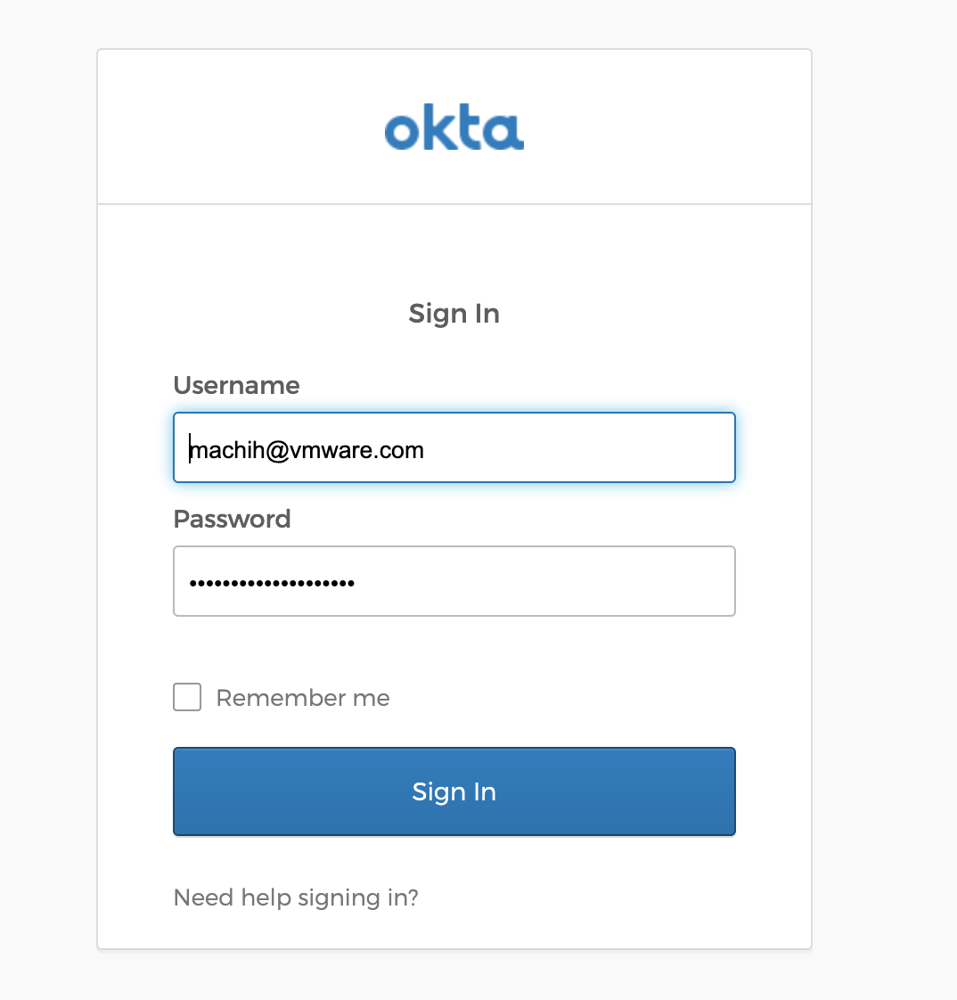

An open-source project called Pinniped makes it easy to set up OIDC access to Kubernetes.<!--more-->

## Introduction

An open-source project called Pinniped was [released last November](https://twitter.com/projectpinniped/status/1326933022059401217). An [external blog](https://thenewstack.io/how-to-make-identity-and-config-operations-boring-in-kubernetes/) describes the project like this:

> Once you have Pinniped installed on your clusters, the first time that you run a kubectl command it will prompt you to click on a URL. That URL in your browser will redirect you to interactively log in to your upstream IDP and complete authentication.

In other words, the first time you run kubectl, a URL is shown and you log in through it. Once that login completes, you can just keep working.

Configuring Kubernetes user authentication has been confusing for a long time, but this approach might make it quite easy — so I tried it right away.


## Prerequisites

I followed this manual:

https://pinniped.dev/docs/concierge-and-supervisor-demo/

Some parts were a bit unclear, though, so I customized things myself.
This walkthrough assumes:

* Supervisor Cluster: 1 Kubernetes cluster that can create Loadbalancer resources and reach the internet
* Workload Cluster: 1 Kubernetes cluster — anything that can reach the Supervisor Cluster over the network
* An account that lets you manage a DNS service (I pay for Google Domains)

## Steps

### Think up a DNS entry

Anything works.
For convenience we'll use the following. Give `DOMAIN` a DNS name matching the DNS service you own.

```
pinniped.DOMAIN
```

### Set up an Okta Dev Account

To test OIDC, configure the following.
First access this URL:
https://developer.okta.com/signup/

Then configure as follows:

Applications (top menu) > Add Application > Create New App > Web

After selecting Next, set:

* App name: pinniped
* Base URL: pinniped.DOMAIN
* Login redirect URIs: pinniped.DOMAIN/callback
* Logout redirect URIs: pinniped.DOMAIN
* Grant type allowed: Authorization Code

Keep the clientID and clientSecret that appear — they are used later.

### Install the Pinniped Supervisor

**Run the following steps on the Supervisor Cluster**

First, install the Pinniped Supervisor:

```
kubectl apply -f https://get.pinniped.dev/latest/install-pinniped-supervisor.yaml
```

Next, expose the Loadbalancer port:

```
kubectl expose  deployment --type LoadBalancer pinniped-supervisor -n pinniped-supervisor --port=443 --target-port=8443
```

Check the load balancer IP address assigned at this point:

```
kubectl get svc -n pinniped-supervisor
```

### Configure DNS and get a Let's Encrypt certificate

Register the IP address you found as an A record for `pinniped.DOMAIN` in your DNS service.
This differs per DNS service, so I'll skip the details.

Next, obtain a certificate from Let's Encrypt. In my environment the cluster isn't reachable from the internet, so I used the DNS challenge method. There are many ways to do this; this is just one example. Install the `certbot` CLI if you don't have it.

```
certbot --server https://acme-v02.api.letsencrypt.org/directory -d pinniped.DOMAIN --manual \
    --preferred-challenges dns-01 certonly \
    --work-dir /tmp/certbot/wd --config-dir /tmp/certbot/cfg \
    --logs-dir /tmp/certbot/logs
```

As you answer the various prompts, you'll be instructed to create a TXT record like this:

```
- - - - - - - - - - - - - - - - - - - - - - - - - - - - - - - - - - - - - - - -
Please deploy a DNS TXT record under the name
_acme-challenge.pinniped.DOMAIN with the following value:

XXxxxxxxxxxxxxxxxxx

Before continuing, verify the record is deployed.
- - - - - - - - - - - - - - - - - - - - - - - - - - - - - - - - - - - - - - - -
```

Register the TXT record with your DNS service as instructed, press Enter, and the certificate is issued.

### Configure the Pinniped Supervisor

**Run the following steps on the Supervisor Cluster**


First, register the certificate created above as a Secret:

```
kubectl create secret tls my-federation-domain-tls -n pinniped-supervisor --cert=/tmp/certbot/cfg/live/pinniped.DOMAIN/fullchain.pem --key=/tmp/certbot/cfg/live/pinniped.DOMAIN/privkey.pem
```

Then register it in a `FederationDomain`:

```
cat <<EOF | kubectl create --namespace pinniped-supervisor -f -
apiVersion: config.supervisor.pinniped.dev/v1alpha1
kind: FederationDomain
metadata:
  name: my-federation-domain
spec:
  issuer: https://pinniped.DOMAIN
  tls:
    secretName: my-federation-domain-tls
EOF
```

Next, register the clientID and clientSecret from the Okta app creation:

```
kubectl create secret generic my-oidc-identity-provider-client \
  --namespace pinniped-supervisor \
  --type secrets.pinniped.dev/oidc-client \
  --from-literal=clientID=xxxxx \
  --from-literal=clientSecret=yyyyyy
```

Finally, register the `OIDCIdentityProvider`. The `issuer` value here is the domain id generated by Okta.

```
cat <<EOF | kubectl create --namespace pinniped-supervisor -f -
apiVersion: idp.supervisor.pinniped.dev/v1alpha1
kind: OIDCIdentityProvider
metadata:
  name: my-oidc-identity-provider
spec:
  issuer: https://dev-xxxxxx.okta.com/oauth2/default
  claims:
    username: email
  authorizationConfig:
    additionalScopes: ['email']
  client:
    secretName: my-oidc-identity-provider-client
EOF
```

### Configure the Pinniped Concierge

**Run the following steps on the Workload Cluster**

Install with:

```
kubectl apply -f https://get.pinniped.dev/latest/install-pinniped-concierge.yaml
```

Next, generate a random value for the Audience:

```
audience="$(openssl rand -hex 8)"
```

Then configure the `JWTAuthenticator`:

```
cat <<EOF | kubectl create --namespace pinniped-concierge -f -
apiVersion: authentication.concierge.pinniped.dev/v1alpha1
kind: JWTAuthenticator
metadata:
  name: my-jwt-authenticator
spec:
  issuer: https://pinniped.DOMAIN
  audience: $audience
EOF
```

### Generate the Pinniped CLI and Kubeconfig

**Run the following steps on the Workload Cluster**

Download and install the [Pinniped CLI](https://github.com/vmware-tanzu/pinniped/releases/latest). Then generate a kubeconfig via the Pinniped CLI:

```
pinniped get kubeconfig --concierge-namespace pinniped-concierge --concierge-authenticator-type jwt --concierge-authenticator-name my-jwt-authenticator > /tmp/pinniped-kubeconfig
```

That's it for the setup.

## Testing

First, grant a role to the executing user. `<okta user>` is the username registered in Okta.

```
kubectl create clusterrolebinding okta-can-read --clusterrole view --user <okta user>
```

Run with:

```
kubectl --kubeconfig /tmp/pinniped-kubeconfig get pods -n pinniped-concierge
```

If you get redirected to this Okta URL, it's working:



And after authenticating, if you get a pod list like below, you've succeeded:

```
kubectl --kubeconfig /tmp/pinniped-kubeconfig get pods -n pinniped-concierge
NAME                                          READY   STATUS    RESTARTS   AGE
pinniped-concierge-869566cb49-6zqrw           1/1     Running   0          23h
pinniped-concierge-869566cb49-82776           1/1     Running   0          23h
pinniped-concierge-kube-cert-agent-e9561a48   1/1     Running   0          23h
```

## Summary

This post introduced a quick way to install Pinniped.
