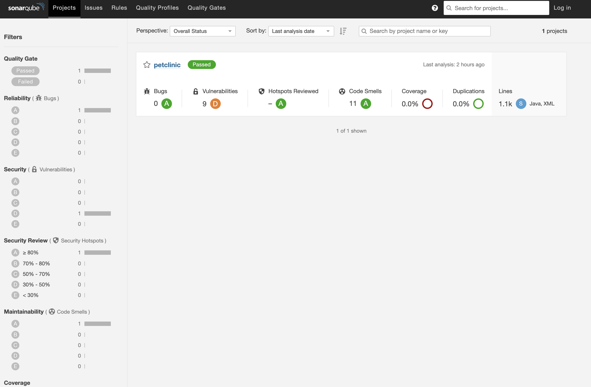
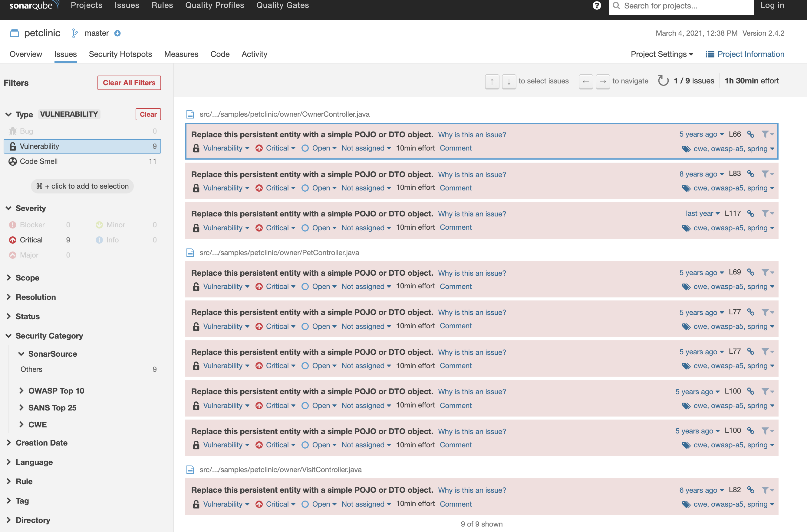
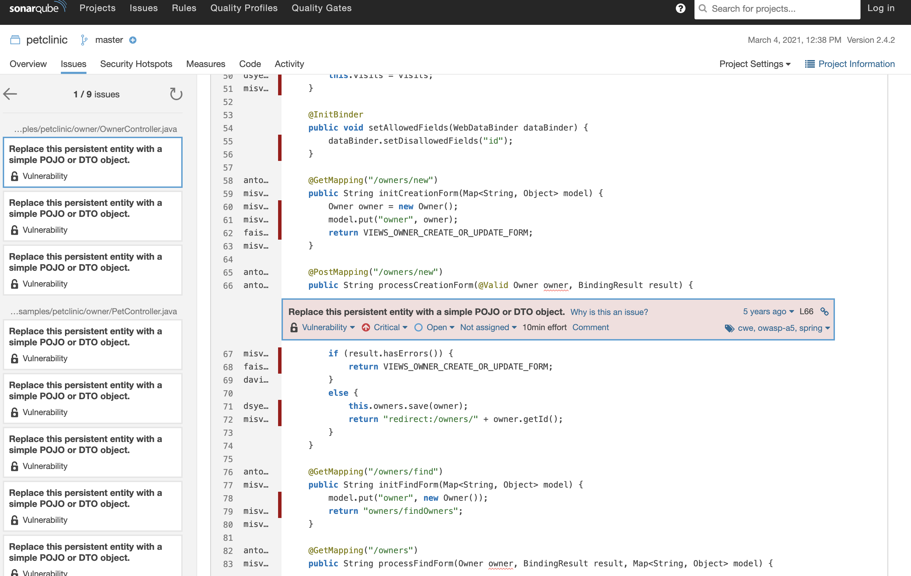

Tanzu Java Buildpackのビルド時にSonarQubeの静的コード解析と組み合わせて実施することも可能です。<!--more-->

## はじめに

Tanzu Java Buildpackというより、[kpack](https://github.com/pivotal/kpack)は様々なカスタマイズができるようになっています。[この回](https://blog.lespaulstudioplus.info/posts/24/)でも紹介しましたが、3rd Party連携などもできます。

厳密にいうと、これはCloud Native BuildpacksのBindingsという機能が可能にしています。

https://paketo.io/docs/buildpacks/configuration/#what-is-a-binding

今回はこれをもう少し遊んでみて、maven経由でSonarQubeの静的コード解析をTanzu Build Serviceのイメージビルド中に呼び出してみたいと思います。

https://docs.sonarqube.org/latest/analysis/scan/sonarscanner-for-maven/

## 環境

Tanzu Build Service 1.1.1

SonarQubeはTBSと同じKubernetes上に同居させています。
手順はこのHelmチャートをインストールするだけ。

https://github.com/Oteemo/charts/tree/master/charts/sonarqube

コマンドでいうと以下です。

```
kubectl create ns sonar
helm repo add oteemocharts https://oteemo.github.io/charts
helm install sonar oteemocharts/sonarqube -n sonar
```


## 試す

以下クィックに試します。
なお、やり方ですが、[この回](https://blog.lespaulstudioplus.info/posts/24/)でも紹介したkpackのService Bindings機能から実施します。

https://github.com/pivotal/kpack/blob/master/docs/servicebindings.md

そして、この際呼び出すのは、maven packeto-buildpacksです。

https://github.com/paketo-buildpacks/maven


### SonarQube側でTokenを取得

SonarQubeのUIからTokenを取得します。ここは大した手順ではないので割愛。

### Imageリソースを生成

以下のようなYamlファイルを作成します。なお`tag`に入る値は環境によって異なるので設定を変えてください。

```yaml
apiVersion: kpack.io/v1alpha1
kind: Image
metadata:
  name: spring-petclinic-sonar
spec:
  builder:
    kind: ClusterBuilder
    name: default
  source:
    git:
      revision: main
      url: https://github.com/spring-projects/spring-petclinic
  tag: <REPO>/<LIBRARY>/<IMAGE>
  build:
    env:
    - name: "BP_MAVEN_BUILD_ARGUMENTS"
      value: "-Dmaven.test.skip=true verify sonar:sonar"
    bindings:
    - name: settings
      secretRef:
        name: settings-xml
      metadataRef:
        name: settings-binding-metadata
---
apiVersion: v1
kind: Secret
metadata:
  name: settings-xml
type: Opaque
stringData:
  settings.xml: |
    <settings>
        <pluginGroups>
            <pluginGroup>org.sonarsource.scanner.maven</pluginGroup>
        </pluginGroups>
        <profiles>
            <profile>
                <id>sonar</id>
                <activation>
                    <activeByDefault>true</activeByDefault>
                </activation>
                <properties>
                    <sonar.login>
                      XXXXXXXXXXXXXXXXXX
                    </sonar.login>
                    <sonar.host.url>
                      http://sonar-sonarqube.sonar.svc.cluster.local:9000
                    </sonar.host.url>
                </properties>
            </profile>
         </profiles>
    </settings>
---
apiVersion: v1
kind: ConfigMap
metadata:
  name: settings-binding-metadata
data:
  kind: maven
  provider: sonar
```

なお、以下の値は環境に合わせて変更すること。`sonar.host.url`はTBSと同一のKubernetesクラスターかつ、Helmチャートでインストールしている場合、このままで大丈夫です。もし、別の方法でいれたらな正しい値にアップデートすること。`sonar.login`には、前手順で取得したTokenを入れます。

```
    <sonar.login>
      XXXXXXXXXXXXXXXXXX
    </sonar.login>
    <sonar.host.url>
      http://sonar-sonarqube.sonar.svc.cluster.local:9000
    </sonar.host.url>
```


### 適用

そして上のYamlファイルを適用します。

```
kubectl apply -f <Yaml名> -n <Namespace名>
```

以上です。あとは動作を確認します。

## 動作確認

しばらくすると、いかのように成功したJobが出現します。

```
kubectl get po -n petclinic-build
NAME                                             READY   STATUS      RESTARTS   AGE
spring-petclinic-sonar-build-3-rn5gs-build-pod   0/1     Completed   0          98m
```
まずBuildフェーズのログの最後の箇所をみると、sonarqubeへのコード解析をしているのがわかります。

```
# kubectl logs spring-petclinic-sonar-build-3-rn5gs-build-pod -n petclinic-build -c build
...
[INFO] ANALYSIS SUCCESSFUL, you can browse http://sonar-sonarqube.sonar.svc.cluster.local:9000/dashboard?id=org.springframework.samples%3Aspring-petclinic
[INFO] Note that you will be able to access the updated dashboard once the server has processed the submitted analysis report
[INFO] More about the report processing at http://sonar-sonarqube.sonar.svc.cluster.local:9000/api/ce/task?id=AXf7USO50EPOcLxf9tIV
```

### SonarQube側で確認

SonarQube側をみると確かにテストが走っているのが確認できます。



テスト結果もみれます。






これが役に立つかの是非はあるかと思いますが、かならずイメージビルドの際に静的コード解析を通すというガバナンスは適用できるかと思います。いわゆるSecure by Defaultですね。

個人的にはなによりもCloud Native BuildPackpackがkpackがこういったことが柔軟的にできる点がよいとおもいました。

## まとめ

イメージビルドの際にSonarQubeなどの静的コード解析を組みわせることはTanzu Buildpacksであれば簡単にできます。
