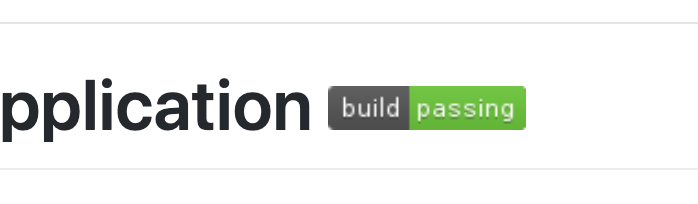

ConcourseとGithubについてまとめました<!--more-->

## はじめに

ConcourseをメインのCIツールとして利用した場合のGithubとの相性についてまとめました。
検証もしながらすこしづつ更新していきます。

## Trigger

Githubのレポジトリーをモニターして、コミットをトリガーをするのは簡単にできます。
Jobs内の`trigger: true`をつけることで、Concourseがアップデートを検知したタイミングで、タスクを走らせることができます。

```
resources:
- name: upstream-source-code
  type: git
  source:
    uri: https://github.com/<project>/<repo>
    branch: <branch>
jobs:
- name: Code updated
  plan:
    - get: upstream-source-code
      trigger: true
    - task: something
      // Do Something
```


## Push

これも簡単にできます。
ポイントが`outputs`に値をいれることで、最終的にレポジトリーへのpushがされます。以下を参照。

https://github.com/concourse/git-resource#out-push-to-a-repository

Githubにpushに使うprivate_keyなどは変数化して外部のCredential管理機能に使うとよさそう。

https://concourse-ci.org/creds.html


```
resources:
- name: source-code
  type: git
  source:
    uri: https://github.com/<project>/<repo>
    branch: <branch>
    private_key: ((sourceKey))
    private_key_user: ((sourceUser))
jobs:
- name: merge-upstream
  plan:
    - get: source-code
    - task: commit-push
      config:
        platform: linux
        image_resource:
          type: docker-image
          source:
            repository: alpine/git
            tag: latest
        inputs:
          - name: source-code
        outputs:
        - name: source-code
        run:
          path: /bin/bash
          args:
            - -c
            - |
              set -x
              cd source-code
              git config --global user.name "concourse"
              git config --global user.email "concourse@local"
              // Modify Code
              git add .
              git commit -m "Commit and Push"

```

## Pull Request

正式なものではないですが、以下のリソースがそれにあたるもののようです。

https://github.com/telia-oss/github-pr-resource

## Status Badge

あります。  
Readmeによく含まれるのですが、特定のジョブの最新のステータスを表示するもの機能です。

たとえば、[Spring Petclinic](https://github.com/spring-projects/spring-petclinic)のReadmeなどに含まれる、この`build/passing`などと表示されている機能です。



さすがにこの機能はないかと思っていたところ、ちゃんとAPIが用意されていました。
以下のAPIドキュメントに紹介されていますが、パイプライン全体の状態だけでなく、各Jobのステータスも拾えるようになっています。

https://concourse-ci.org/observation.html#badges
