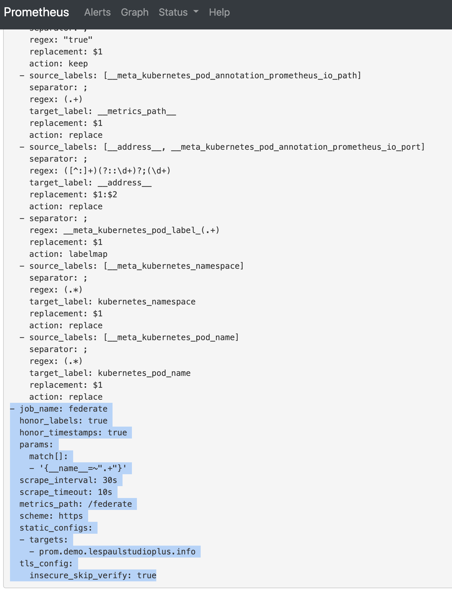
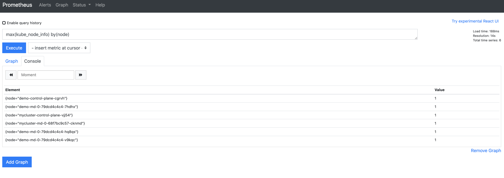

TKGでのPrometheusを一つにまとめました<!--more-->

## はじめに

VMwareが提供するTanzu Kubernets Grid Extensionsによって簡単にPrometheusがインストールすることができます。ところがマニュアルでは、カスタマイズできる箇所は以下のみが掲載されています。

https://docs.vmware.com/en/VMware-Tanzu-Kubernetes-Grid/1.3/vmware-tanzu-kubernetes-grid-13/GUID-extensions-prometheus.html#customize

残念ながら、Prometheusの全ての機能を網羅しているとはいえないです。では、マニュアルに書かれていないところは諦めないといけないかというとそうではなく、yttを駆使して任意の設定を差し込むことができます。ここでは、そのやり方を紹介します。今回ためすのは、[PrometheusのFederation](https://prometheus.io/docs/prometheus/latest/federation/)です。

## 注意点

以下の方法はまだ正式サポートが表明されていない手段ですのでご注意ください。

## 前提

* [公式の手順](https://docs.vmware.com/en/VMware-Tanzu-Kubernetes-Grid/1.3/vmware-tanzu-kubernetes-grid-13/GUID-extensions-prometheus.html)にしたがってPrometheusを導入ずみ
* 2つ以上のPrometheusがある
* YTTの仕様をある程度理解している。おすすめは、[こちらのリンク](https://ik.am/categories/Dev,Carvel,ytt/entries)です。

## 手順

### 1. アップデートファイルの用意

以下のようなファイルを用意します。いったん`/tmp/prometheus.yaml`などで大丈夫です。
なお、`targets`の値は私の環境のものですが、環境に合わせ正しいものをいれてください。

```yaml
#@ load("@ytt:overlay", "overlay")
#@ load("@ytt:yaml", "yaml")

#@ def remote_write_config():
#@overlay/match missing_ok=True
#@overlay/match-child-defaults missing_ok=True
scrape_configs:
  #@overlay/append
  - job_name: 'federate'
    scrape_interval: 30s
    honor_labels: true
    metrics_path: '/federate'
    scheme: https
    tls_config:
      insecure_skip_verify: true
    params:
      match[]:
      - '{__name__=~".+"}'
    static_configs:
      - targets:
        - prom.demo.lespaulstudioplus.info
#@ end

#@overlay/match by=overlay.subset({"kind": "ConfigMap","metadata": {"name": "prometheus-server"}})
---
data:
  #@overlay/replace via=lambda a,_: yaml.encode(overlay.apply(yaml.decode(a), remote_write_config()))
  prometheus.yml:
```

### 2. 設定の検証

上のファイルの設定が問題ないかをみてみます。まずTanzu Extensionsを設定したファイルに移動します。

```
cd tkg-extensions-v1.3.1+vmware.1/monitoring/prometheus
```

そして、以下のコマンドを入力します。事前にyttコマンドが実機にインストールされているか確認してください。

```
ytt -f /common/ \
  -f ./ \
	-f /extensions/monitoring/prometheus/prometheus-data-values.yaml \
	-f /tmp/prometheus.yaml --ignore-unknown-comments | less
```

出力結果に data.[prometheus.yml] の一番したにremote_writeが追加されていれば想定結果です。

```yaml
apiVersion: v1
kind: ConfigMap
metadata:
  labels:
    component: server
    app: prometheus
  name: prometheus-server
  namespace: tanzu-system-monitoring
data:
# ...
  prometheus.yml: |
	  #....
	  scrape_configs:
			- job_name: federate
	      scrape_interval: ##
	      honor_labels: true
	      metrics_path: /federate
	      scheme: https
	      params:
	        match[]:
	        - '{__name__=~".+"}'
	      static_configs:
	      - targets:
	        - prom.demo.lespaulstudioplus.info
```

### 3. 作ったファイルをシークレットとして登録

以下のようにして作ったファイルをシークレットとして登録します。

```
kubectl create secret generic prometheus-update-yaml --from-file=prometheus-update-yaml=/tmp/prometheus.yaml -n tanzu-system-monitoring
```
`secret/prometheus-update-yaml created`とでれば次へ進みます。

### 4. Extensionsの更新

PrometheusのExtensionsをアップデートしていきます。
以下のコマンドを実行します。

```
kubectl edit apps prometheus -n tanzu-system-monitoring -o yaml
```

`template[0].ytt.inline.pathsFrom`に新しく作ったSecretを指定します。

```yaml
spec:
  deploy:
  - kapp:
      rawOptions:
      - --wait-timeout=5m
  fetch:
  - image:
      url: projects.registry.vmware.com/tkg/tkg-extensions-templates:v1.3.1_vmware.1
  serviceAccountName: prometheus-extension-sa
  syncPeriod: 5m0s
  template:
  - ytt:
      ignoreUnknownComments: true
      inline:
        pathsFrom:
        # !!!Update from here!!!!!!!!!
        - secretRef:
            name: prometheus-update-yaml
        #!!!!!!!!!!!!
        - secretRef:
            name: prometheus-data-values
      paths:
      - tkg-extensions/common
      - tkg-extensions/monitoring/prometheus
```

### 5. 設定の確認

しばらくすると、Reconcileが走るので結果をみます。`kubectl get apps prometheus -n tanzu-system-monitoring -o yaml`などで確認できます。
Reconcileが完了したら設定を確認します。手取り早いのが、PrometheusのUIにアクセスをして、Status > Configurationで確認することです。



なお、この設定では、複数Prometheusを一箇所に集約していますので、node_infoも集約された全クラスター分みえてきます。
以下の設定では、"mycluster"と"demo"と作った両方のtkgが見えてきます。




## まとめ

YTTを応用すると、PrometheusのFederationなど拡張設定が行えます。
