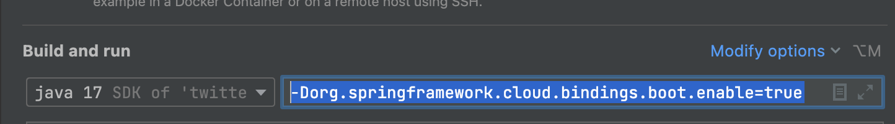
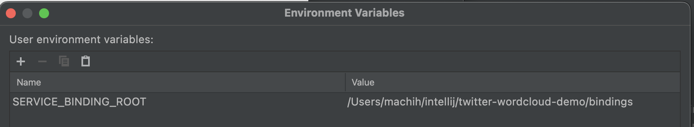

Spring Cloud Bindings をコンテナ化せずに利用する方法を記載します。<!--more-->
流れとしては以下の順です。

- 必要な System Property を設定する
- SERVICE_BINDING_ROOT　環境変数の設定
- pom.xml のアップデート
- (オプショナル)　自作のBindingsを作る

Service Bindings そのものについては以下のとおり。

https://servicebinding.io/

##  必要な System Property を設定する

Spring Boot 起動時に、System Propery を以下の値を設定する

```
org.springframework.cloud.bindings.boot.enable=true
```

Intellij などを使う場合は以下のように設定する。
`Run → Edit Configurations...` 以下の設定をいれる。



## SERVICE_BINDING_ROOT の環境変数を設定する

Service Bindings の開始ディレクトリーを設定する。

Intellij などを使う場合は以下のように設定する。
`Run → Edit Configurations...` 以下の設定をいれる。



## pom.xml のアップデート

必要な依存関係は以下のように追加する。
この際`<spring-cloud-bindings.version>` の値は更新する


```xml
  <properties>
    ...
    <spring-cloud-bindings.version>1.10.0</spring-cloud-bindings.version>
    ...
  </properties>
  <dependencies>
      ...
      <dependency>
          <groupId>org.springframework.cloud</groupId>
          <artifactId>spring-cloud-bindings</artifactId>
          <version>${spring-cloud-bindings.version}</version>
      </dependency>
    　...
  </dependencies>
  <repositories>
        ...
        <repository>
            <id>spring-releases</id>
            <url>https://repo.spring.io/release/</url>
            <releases>
                <enabled>true</enabled>
            </releases>
            <snapshots>
                <enabled>false</enabled>
            </snapshots>
        </repository>
        ...
  </repositories>
  <build>
        <plugins>
            <plugin>
                <groupId>org.springframework.boot</groupId>
                <artifactId>spring-boot-maven-plugin</artifactId>
                <configuration>
                    <excludes>
                        <exclude>
                            <groupId>org.springframework.cloud</groupId>
                            <artifactId>spring-cloud-bindings</artifactId>
                        </exclude>
                    </excludes>
                </configuration>
            </plugin>
        </plugins>
  </build>
```
なお以下のブロックをいれておかないと、のちにコンテナ化する際に、Spring Bootのビルドパックの更新の動きと衝突してエラーになる。

```
<configuration>
    <excludes>
        <exclude>
            <groupId>org.springframework.cloud</groupId>
            <artifactId>spring-cloud-bindings</artifactId>
        </exclude>
    </excludes>
</configuration>
```

## (オプショナル)　自作のBindingsを作る

ここまで設定すれば、あとは自作のBindingsを作ることも可能になる。
例えば、以下のようなコードを用意する。

```java
package jp.vmware.tanzu.twitterwordclouddemo.utils;

import org.jetbrains.annotations.NotNull;
import org.springframework.cloud.bindings.Binding;
import org.springframework.cloud.bindings.Bindings;
import org.springframework.cloud.bindings.boot.BindingsPropertiesProcessor;
import org.springframework.core.env.Environment;

import java.util.List;
import java.util.Map;

public class TwitterBindingsPropertiesProcessor implements BindingsPropertiesProcessor {

	public static final String TYPE = "twitter";

	@Override
	public void process(Environment environment, @NotNull Bindings bindings, @NotNull Map<String, Object> properties) {
		if (!environment.getProperty("jp.vmware.tanzu.bindings.boot.twitter.enable", Boolean.class, true)) {
			return;
		}
		List<Binding> myBindings = bindings.filterBindings(TYPE);
		if (myBindings.size() == 0) {
			return;
		}
		properties.put("twitter.bearer.token", myBindings.get(0).getSecret().get("bearer-token"));
	}

}
```

さらに `META-INF/spring.factories` を以下のように作成する

```
org.springframework.cloud.bindings.boot.BindingsPropertiesProcessor=jp.vmware.tanzu.twitterwordclouddemo.utils.TwitterBindingsPropertiesProcessor
```

そして、以下のようなディレクトリー構成を SERVICE_BINDING_ROOT で設定したディレクトリに配置すれば、起動時にService Bindings が有効になる。


