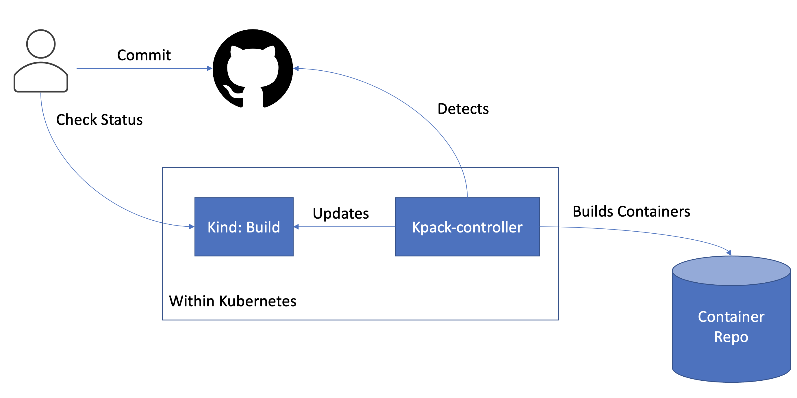
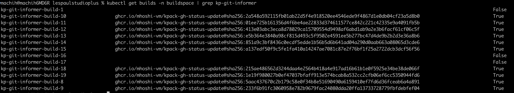
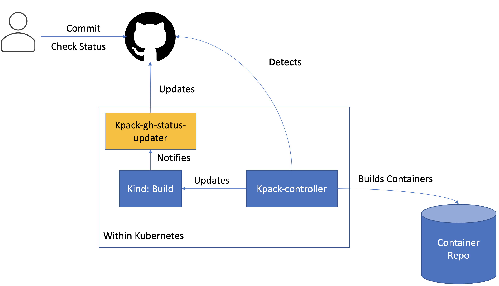
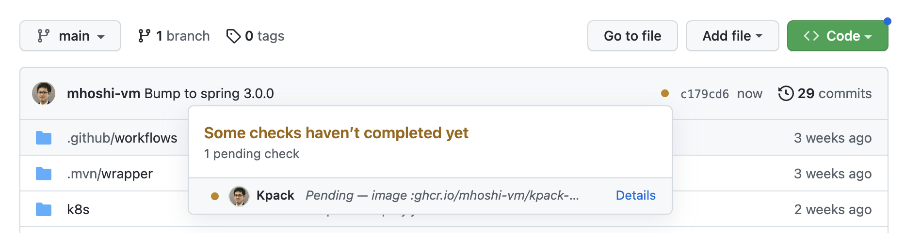
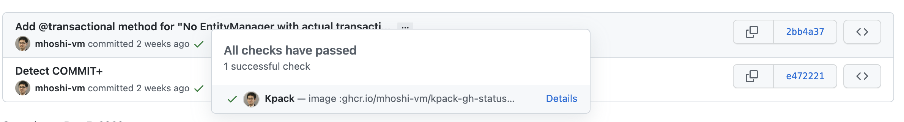
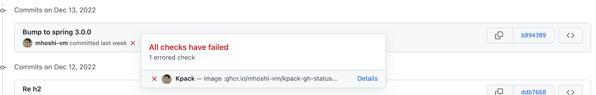
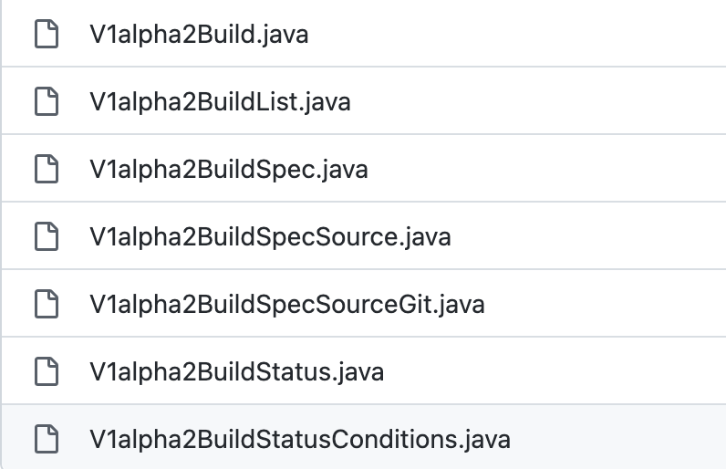

After committing source code, it's hard to tell whether the Kpack image build finished! So I built a notification mechanism using a Kubernetes Controller.<!--more-->

# Source code

The finished result is here:

https://github.com/mhoshi-vm/kpack-gh-status-updater

# First, some terminology

Terms appearing in this article:

- kpack:  
  A tool that uses [Cloud Native Buildpacks](https://buildpacks.io/) to build Stores and buildpacks via Kubernetes Custom Resource Definitions (CRDs).
- Kubernetes Controller:   
  Something that can perform specific operations when an event occurs on a CRD in Kubernetes. This time I implemented it in Java with Spring Boot.
- Github Commit Status:   
  Lets you attach checks to each Github commit and see their status. Usually it displays CI pipeline success/failure, but it can be updated directly via the REST API. Details [here](https://docs.github.com/en/rest/commits/statuses?apiVersion=2022-11-28).

Of these, the Kubernetes Controller — especially implementing it with the Java framework Spring — is probably the hardest to understand.

I borrowed heavily from this SpringOne content, so watching it will deepen your understanding if you have time:

https://www.youtube.com/watch?v=5IROOj7sLKg

# What did I want to solve?

Below is the picture of kpack without this project's deliverable. kpack itself is a wonderful tool, but when you commit source code, checking whether the image was built successfully required going to look at the Kubernetes resource status every single time.

For reference, the build status looks like this:

The information I wanted wasn't detailed — just success or failure.
I could have written some polling script, but I wanted something event-driven, as close to real time as possible, so I decided to implement it as a Kubernetes Controller.

The update turns the picture into the one below: by watching Github alone, you can see whether the image completed.

# The finished product

When a kpack build starts for a specific commit, you can see it building like this:

When the kpack image completes for a specific commit, it's reflected like this:

On failure it looks like this — the "ah, it failed, I'd better go look" moment:

# Development walkthrough

Some of you may be thinking "a Kubernetes Controller in Spring Boot!?", so here's how it was developed.

## 1. Register the Kubernetes Client in pom.xml

It builds with maven, but the pom.xml is as simple as one generated by [start.spring.io](start.spring.io). Only the [Kubernetes Client dependency](https://github.com/mhoshi-vm/kpack-gh-status-updater/blob/b89438913f649a9de25dc1a3b95ee5867e9c2a36/pom.xml#L25-L29
) is added manually.

## 2. Create the CRD YAML file

The first thing to develop when building a Kubernetes Controller is the Kubernetes CRD definition YAML.
This time I developed it as follows:

https://github.com/mhoshi-vm/kpack-gh-status-updater/blob/main/k8s/crd/build.yaml

For reference, kpack's own CRD definition is here:

https://github.com/pivotal/kpack/blob/main/config/build.yaml

Comparing them, they're quite different. The original kpack doesn't define many values in its schema, which causes trouble in later steps, so [I defined the parts I need myself](https://github.com/mhoshi-vm/kpack-gh-status-updater/blob/7cdc706788bd4f317fe99c6469bd510c5214a846/k8s/crd/build.yaml#L27-L49).

## 3. Generate a Model from the CRD via CodeGen

After defining the CRD, set it up using Github Actions like below. The official guide is [here](https://github.com/kubernetes-client/java/wiki/5.-Generate-Java-CRD-Model).

I use the Github Actions approach, defined like this:

https://github.com/mhoshi-vm/kpack-gh-status-updater/blob/main/.github/workflows/generate-crd.yaml

Feeding the CRD from before as input produces a Zip file containing the Model.
Extracting it pretty much as-is gives the following:

https://github.com/mhoshi-vm/kpack-gh-status-updater/tree/main/src/main/java/jp/co/vmware/tanzu/kpackghstatusupdater/models

These files in this directory:

## 4. Define the Controller

This phase is almost pure "incantation". Built exactly as instructed:

https://github.com/mhoshi-vm/kpack-gh-status-updater/blob/main/src/main/java/jp/co/vmware/tanzu/kpackghstatusupdater/configuration/BuildControllerConfiguration.java

One detail: parts of it must point at the Model created in step 3, but beyond that there is little that varies here.

## 5. Define the Reconciler

The Reconciler definition:

https://github.com/mhoshi-vm/kpack-gh-status-updater/blob/main/src/main/java/jp/co/vmware/tanzu/kpackghstatusupdater/reconciler/BuildReconciler.java

Basically you add your business logic in the `@Override` part. Watch out for the following:

- For the final result, on success you return `new Result(false)` to signal the processing completed. Returning `Result(true)` causes the event to be re-queued.
- If the resource in the event doesn't exist, interpret it as "deleted". So add [that handling](https://github.com/mhoshi-vm/kpack-gh-status-updater/blob/e472221f063b9b2f9925ff29d8b2cb17e99109f5/src/main/java/jp/co/vmware/tanzu/kpackghstatusupdater/reconciler/BuildReconciler.java#L43-L46).
- Every time you `get` a resource, add an [existence check](https://github.com/mhoshi-vm/kpack-gh-status-updater/blob/e472221f063b9b2f9925ff29d8b2cb17e99109f5/src/main/java/jp/co/vmware/tanzu/kpackghstatusupdater/reconciler/BuildReconciler.java#L48-L65).

## 6. Fill in the business logic (Github notification)

From here on it's plain Java code. Starting at [this line](https://github.com/mhoshi-vm/kpack-gh-status-updater/blob/e472221f063b9b2f9925ff29d8b2cb17e99109f5/src/main/java/jp/co/vmware/tanzu/kpackghstatusupdater/reconciler/BuildReconciler.java#L77), write the [Github status update logic](https://github.com/mhoshi-vm/kpack-gh-status-updater/blob/main/src/main/java/jp/co/vmware/tanzu/kpackghstatusupdater/service/CommitStatusService.java).

## 7. Deploy to the Kubernetes environment

After containerizing the finished code (using kpack for exactly this), deploy it to the Kubernetes environment. The YAML files are [here](https://github.com/mhoshi-vm/kpack-gh-status-updater/tree/main/k8s/install).

Take care to configure Role permissions so the CRD can be accessed correctly. In my case, [access to the Build Resource](https://github.com/mhoshi-vm/kpack-gh-status-updater/blob/8db0d62a0d7d960c6e922b056eac2ad088c8e8a8/k8s/install/deploy.yaml#L42-L49) defined in step 2.

# Conclusion

Briefly, this introduced Github notifications using a Kubernetes Controller. Being able to develop the Kubernetes Controller in familiar Spring made the barrier to entry feel much lower.

I intend to keep updating the code, and to use it for other applications too.
