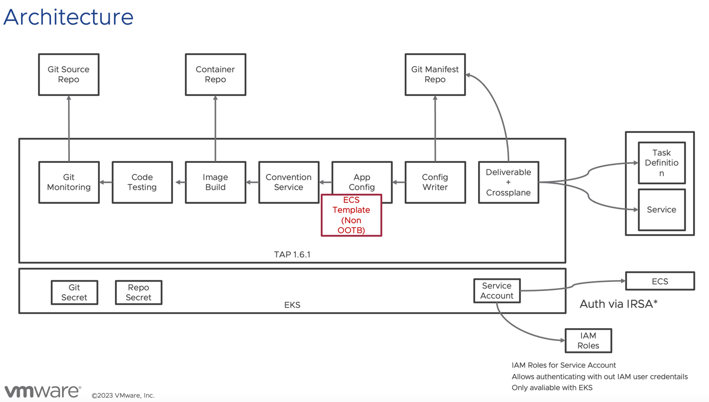
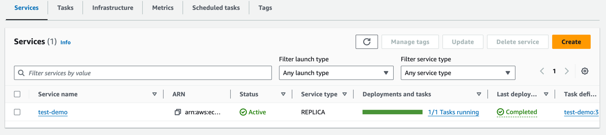
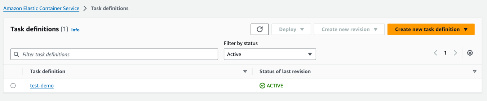
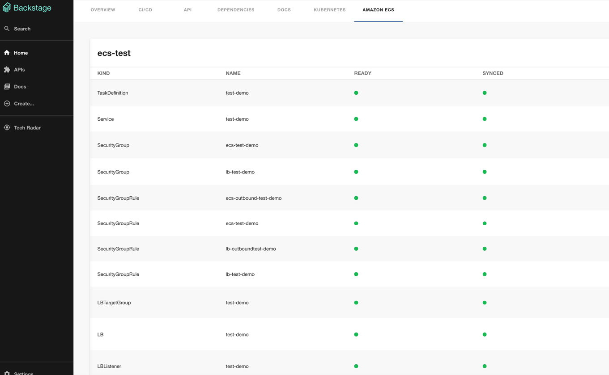

Containers don't automatically mean Kubernetes — plenty of people use Amazon ECS heavily.
This article shows how to deploy from Tanzu Application Platform (TAP from here on) to Amazon ECS.<!--more-->

## Why I wrote this article

While the TAP product promises higher development efficiency, it assumes Kubernetes, and for teams not used to operating Kubernetes it can actually feel harder. 
Also, from user feedback I sense that the pattern of using Amazon ECS is increasing.

TAP's SupplyChain is highly customizable. So, as in the diagram below, I wondered whether TAP could be used purely for the build while deploying to Amazon ECS.



Two important TAP updates made this architecture diagram possible:

- TAP 1.4 introduced the ability to swap in just the final ClusterConfigTemplate without defining the whole supply chain.
This enables supply chain changes with minimal customization.
https://docs.vmware.com/en/VMware-Tanzu-Application-Platform/1.4/tap/workloads-server.html#define-a-workload-type-that-exposes-server-workloads-outside-the-cluster-5
- TAP 1.5 added Crossplane support. Using Crossplane, Kubernetes can manage AWS — in this case, ECS.


I built this for verification purposes.

## Caution

The steps below were built purely to try out the concept. They are in no way production-ready, and note that no vendor provides any warranty whatsoever.

## Preparation

Prepare the following:

- Amazon EKS
- Tanzu Application Platform 1.7.2 (tested with)
- An IAM Role able to update Amazon ECR, EC2, ELB2 (*this got so complex I plan to cover the details in a separate article)

## Installing the demo content

I set things up as follows. First add the package repository:

```
tanzu package repository add ghcr-mhoshi \
  --url ghcr.io/mhoshi-vm/tap-carvel:latest  -n tap-install
```

Then prepare an `ecs-supply-chain.yaml` like this:
```
aws:
  accountId: <account>
  alb:
    subnets:
      - <subnet for alb>
  cluster: <ecs cluster name>
  ecs:
    subnets:
      - <ecs subnet>
  region: <region>
  vpcId: <vpc>
backstage:
  workload:
    deploy: false
```

Apply it with:

```
tanzu package install tap-ecs -p tap-ecs-supplychain.tanzu.japan.com -v 1.7.1 --values-file ecs-supply-chain.yaml -n tap-install
```


Add the following to tap-values (`ootb_supply_chain_testing_scanning` differs depending on how TAP was installed):

```
ootb_supply_chain_testing_scanning:
  supported_workloads:
    - cluster_config_template_name: config-template
      type: web
    - cluster_config_template_name: server-template
      type: server
    - cluster_config_template_name: worker-template
      type: worker
    - cluster_config_template_name: ecs-template
      type: ecs
```
After installation, confirm `ecs-template` is enabled:

```
kubectl get clusterconfigtemplate ecs-template
Warning: Use tokens from the TokenRequest API or manually created secret-based tokens instead of auto-generated secret-based tokens.
NAME           AGE
ecs-template   5m8s

```

## Sample deployment

```
tanzu apps workload apply \
  -n demo \
   --app ecs-test \
  --type ecs \
  --git-repo https://github.com/mhoshi-vm/volume-mount-convention \
  --git-branch main \
  --param cluster="hoge" \
  --build-env BP_JVM_VERSION=17 \
  --label apps.tanzu.vmware.com/has-tests=true \
> test
```

## State after deployment





In the Backstage UI I'm developing separately, it looks like this:

https://github.com/mhoshi-vm/backstage-crossplane-aws



