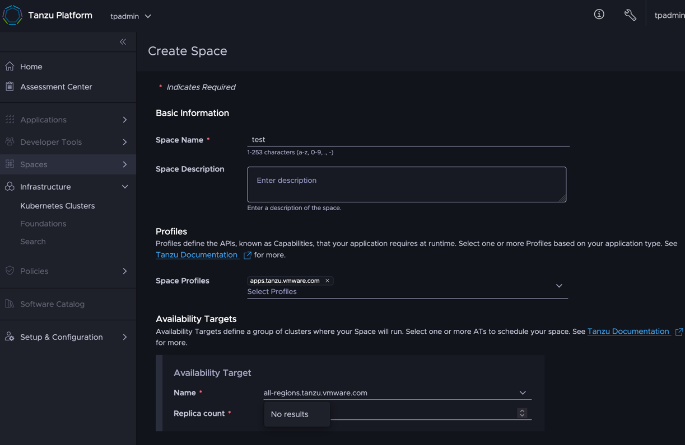
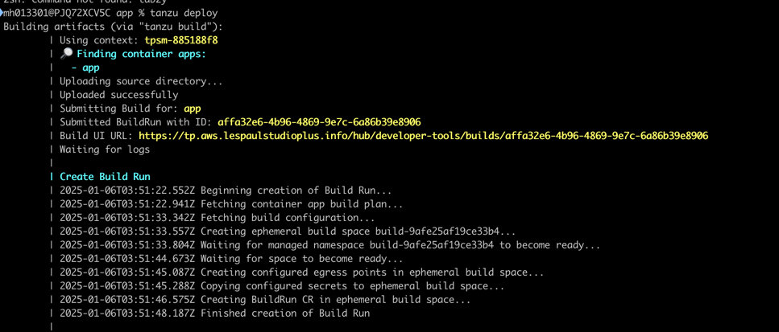
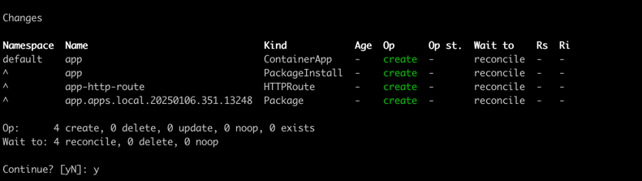
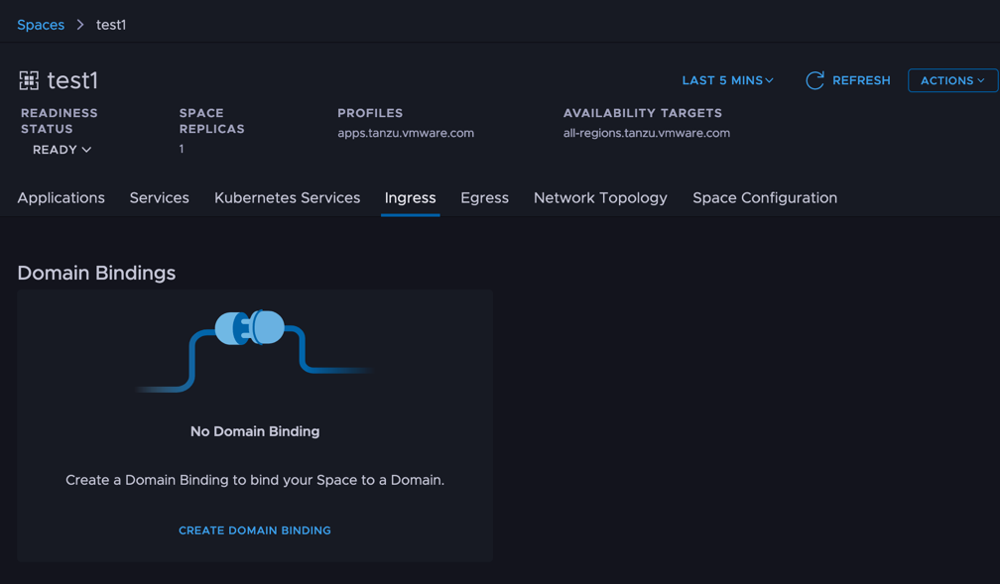
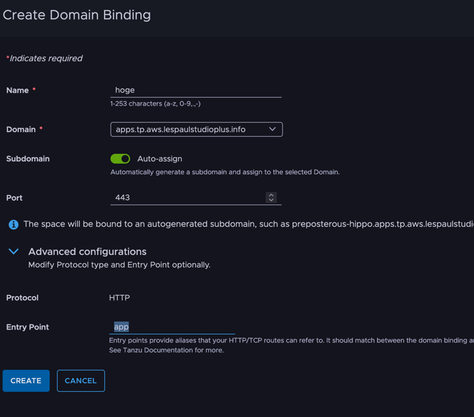
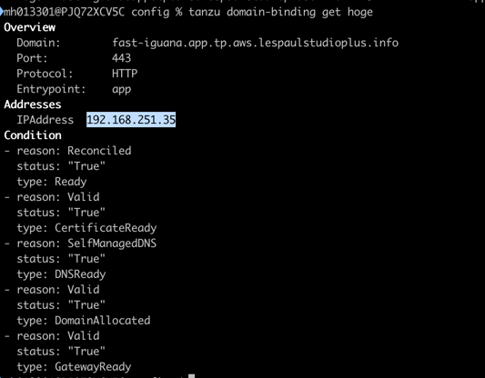
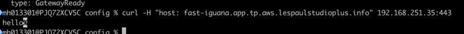

Let's try the on-prem edition of the latest product, Tanzu Platform.

This post describes how TP users operate it.<!--more-->

# Series

- [Installation](../34)
- [For admins: Project setup](../35)
- **Here>** For users: Deploying to a Space
- [For admins: Slimming down the deploy target](../37)
- [For admins: Enabling HTTPS](../38)
- [For admins: Automatic DNS registration](../39)

Bonus: [The "Things You Don't Need to Know about Tanzu Platform" series](/categories/tanzu-platform-for-maniacs/)

# Creating a Space

From [Spaces] > [Overview], select [Create Space].
Give it any name; for Space Profiles select app.tanzu.vmware.com, and for AvailabilityTargets select all-region.tanzu.vmware.com.



Leave it alone until it becomes Healthy.

# Deploying

Confirm the space created in the previous step is visible:

```
tanzu space list
```

Make the space active:

```
tanzu space use test
```

Prepare an app. Any app that starts on port 8080 can be tested right away.
If you don't have one handy, create a skeleton app with:

```
mkdir app
cd app
curl https://start.spring.io/starter.tgz \
    -d dependencies=web,actuator | tar -xzvf -
```

After downloading, turn `src/main/java/com/example/demo/DemoApplication.java` into a quick hello world app:

```
package com.example.demo;

import org.springframework.boot.SpringApplication;
import org.springframework.boot.autoconfigure.SpringBootApplication;
import org.springframework.web.bind.annotation.GetMapping;
import org.springframework.web.bind.annotation.RestController;

@RestController
@SpringBootApplication
public class DemoApplication {

	public static void main(String[] args) {
		SpringApplication.run(DemoApplication.class, args);
	}

	@GetMapping
	String hello(){return "hello";}
}
```

Initialize the app configuration. All the options shown can stay at their defaults for now.

```
% tanzu apps init
[i] Refreshing plugin inventory cache for "projects.packages.broadcom.com/tanzu_cli/plugins/plugin-inventory:latest", this will take a few seconds.
? What is your app's name? tp-learn
? Which directory contains your app's source code? .
? Select container build type to use for this app: buildpacks
? Should your app be accessible through HTTP? Yes

✓ Created tanzu.yml
✓ Recorded app configuration to .tanzu/config/tp-learn.yml

Hint: Use the "tanzu app config *" commands to further configure the application
```

Since Spring Boot 3 only supports Java 17+ by default, set this build option:

```
tanzu apps config build non-secret-env set BP_JVM_VERSION=17
```

When done, deploy:

```
tanzu deploy
```

On the first deploy it may look stuck like below.
Most likely it's just the offline buildpack download to the targeted cluster taking time, so wait patiently (max 30 minutes?).
Incidentally, you can check progress in [ Developer Tools ] > [ Builds ].



After a while you'll be asked to confirm the deployment — enter "y".



A little later, the application deployment completes.

# Binding a domain to the application

Now bind the application's domain. Select [ Spaces ] > [ Overview ] > the app in question > [ Ingress ].



Select [ Create Domain Binding ]. Any Name will do. The gotcha: in Advanced Configuration, the Entry Point must be changed from `main` to your app name.



# To the URL

At this point, all that's left is checking the URL responds.
I'll cover this in a separate article, but the address to resolve differs by configuration. Here's the method that works under this condition:

- Only one Kubernetes cluster is assigned to the Run cluster group

The endpoint URL can currently be obtained via CLI:

```
tanzu domain-binding list
```

Then, with the binding name you found, enter:

```
tanzu domain-binding get <domain binding name>
```

In the output, the Addresses value shows a reachable IP address.




In this state, curl gets a response. For the "-H" host header, specify the value returned by domain-bindings.
For the IP address, add port 443 to the previous command's output. (Following the steps so far, traffic is unencrypted.)

```
% curl -H "host: <name seen in domainbindings>" <IP from previous step>:443
```



That completes deploying the application.
