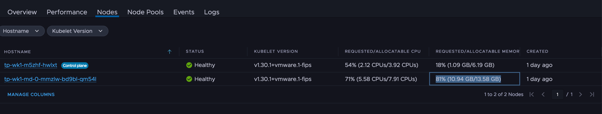
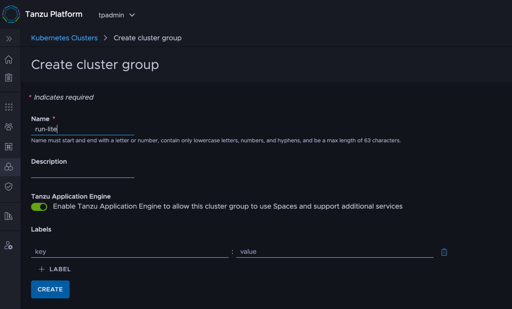
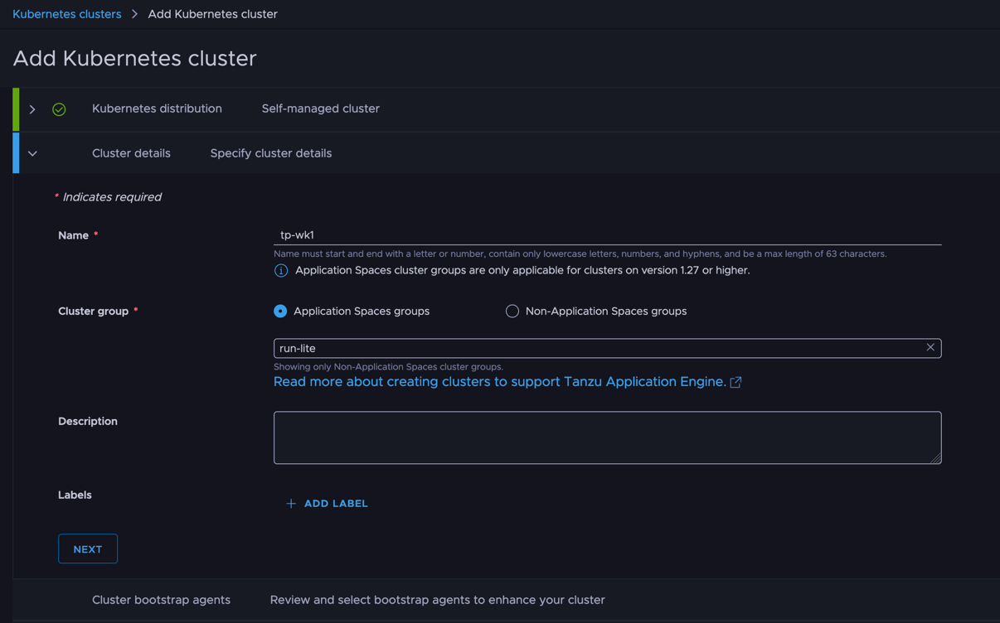
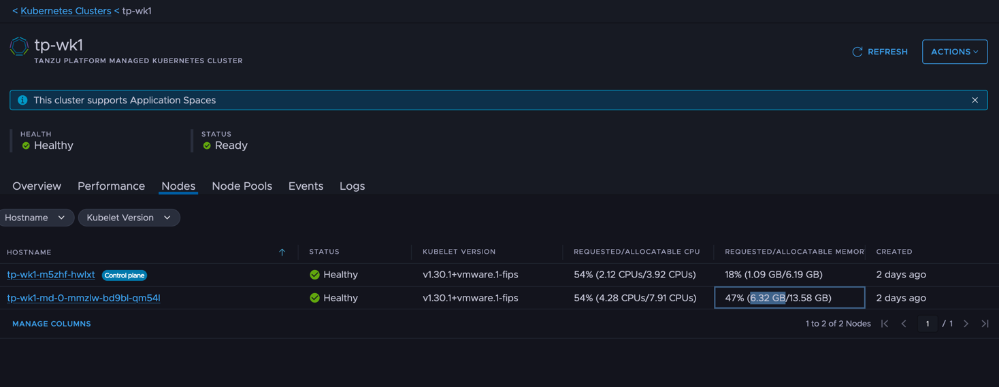

Let's try the on-prem edition of the latest product, Tanzu Platform.

With TP's default ClusterGroup `run`, the Kubernetes install target ends up needing quite a lot of resources.
This time, let's slim it down.
<!--more-->

# Series

- [Installation](../34)
- [For admins: Project setup](../35)
- [For users: Deploying to a Space](../36)
- **Here>** For admins: Slimming down the deploy target
- [For admins: Enabling HTTPS](../38)
- [For admins: Automatic DNS registration](../39)

Bonus: [The "Things You Don't Need to Know about Tanzu Platform" series](/categories/tanzu-platform-for-maniacs/)

# Resources of the default `run` Cluster Group

Below is the resource reservation of the Run ClusterGroup with no applications deployed at all (more than this amount is always required).
Most striking is the memory reservation, which comes to about 10GB.



In this state, deploying even one app maxes out the resources, making a second and subsequent applications difficult to deploy.

# Creating a `run-lite` ClusterGroup

So let's create a cluster group aiming for something lighter, called `run-lite`.
Select [ Infrastructure ] > [ Kubernetes Clusters ] > [ Cluster Groups ] > [ ADD Cluster Group ] and create `run-lite`.



# Installing Packages onto `run-lite`

Now specify the packages installed by default on `run-lite`.
You could do it one by one from [ Space ] > [ Capabilities ], but the CLI way is simpler, so we'll base this on that.

First, target the `run-lite` cluster group:


```
tanzu operations clustergroup use run-lite
```

Next, install the packages. To keep it simple I prepared this git repository:
https://github.com/mhoshi-vm/tp-run-lite

Apply with:

```
git clone https://github.com/mhoshi-vm/tp-run-lite
cd tp-run-lite/clustergroup
tanzu deploy --only .
```

That's it — and here's a comparison of `run-lite` versus `run`:

|                                         | run | run-lite | Notes                                          |
| --------------------------------------- | --- | -------- |----------------------------------------------|
| bitnami.services.tanzu.vmware.com       | ○   |          | Loses bitnami create-service, but removed due to high resource consumption |
| cert-manager.tanzu.vmware.com           | ○   | ○        |                                              |
| container-apps.tanzu.vmware.com         | ○   | ○        |                                              |
| controller.build.tanzu.vmware.com       |     | ○        | Needed for platform builds. Not in regular run, but added for simplicity |
| crossplane.tanzu.vmware.com             | ○   |          | Loses bitnami create-service, but removed due to high resource consumption |
| egress.tanzu.vmware.com                 | ○   | ○        |                                              |
| health.spaces.tanzu.vmware.com          | ○   | ○        |                                              |
| horizontal-autoscaling.tanzu.vmware.com | ○   | ○        |                                              |
| ingress.tanzu.vmware.com                | ○   | ○        |                                              |
| k8sgateway.tanzu.vmware.com             | ○   | ○        |                                              |
| mtls.tanzu.vmware.com                   | ○   | ○        |                                              |
| observability.tanzu.vmware.com          | ○   | ○        |                                              |
| servicebinding.tanzu.vmware.com         | ○   | ○        |                                              |
| spring-cloud-gateway.tanzu.vmware.com   | ○   |          | High memory consumption and SCG isn't usually used anyway, so removed |
| tanzu-servicebinding.tanzu.vmware.com   | ○   | ○        |                                              |
| tcs.tanzu.vmware.com                    | ○   | △        | High resource consumption but required by other features, so registered with reduced resources |

The last one, `tcs.tanzu.vmware.com`, is used to install `istiod`, but this [Hack](https://github.com/mhoshi-vm/tp-run-lite/blob/main/clustergroup/istiod-lite-hack.yaml) keeps its resource consumption down.
In particular, the Replica count is set to 1, so note that fault tolerance is reduced.

# Registering a cluster with `run-lite`

Now register a k8s cluster with `run-lite`.
Unfortunately, moving a cluster already registered with `run` over to `run-lite` isn't possible at the time of writing.
Either prepare a new cluster, or `detach` the current one and re-attach it.

This can be done from [ Infrastructure ] > [ Kubernetes Clusters ].



# Resource usage of `run-lite`

Noticeably lower — memory in particular is around 6.5 GB.



# Deploying applications

From here on it's regular application deployment.
Just deploy to a `Space` based on the `apps.tanzu.vmware.com` profile as usual.
See the [previous article](../36).

That covers slimming down the deploy target.
