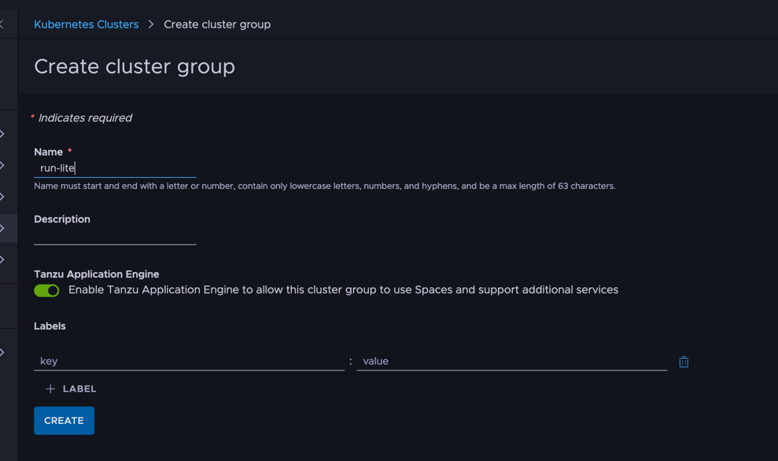
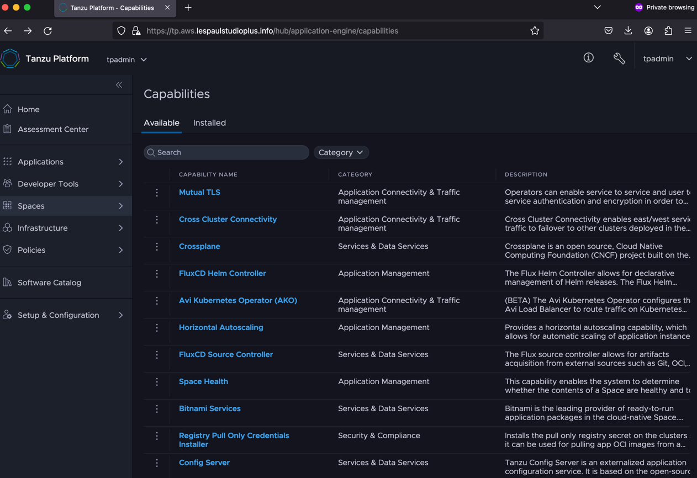

    
最新製品である Tanzu Platform のオンプレ版を試していきます。
なお、この記事は[前回の記事](../34) にしたがったPoC重視の手順であり、正式にサポートされていなく、また製品とも微妙にことなる可能性がございます。

アプリケーションの外部からの接続について
<!--more-->

# 目次

- [Install編](../34)
- [管理者向けProjectセットアップ編](../35)
- **ここ>** [利用者向けSpaceへのデプロイ編](../36)

# Capability ? Traits ?

TP をさわっていると、Capabilities と Traits という言葉がでてくると思います。ざっくり説明すると以下と思えばいいです。

- Capabilities : 該当のCustom Resource Definition(CRD)が定義されているか確認するためのもの
- Traits：CRDを使ったカスタマイズ

# "apps.tanzu.vmware.com" の中身

TPのデプロイに使われるでデフォルトのプロファイルは、"apps.tanzu.vmware.com"と呼ばれるものです。
以下のCapabilitiesを要求してきます。


Provides service directory and capability to bind services to applications

The observability capability package relies on this feature to intercept traffic and enhance the metrics metadata.

Observability enables observability-operator and servicemesh-collector to enrich metrics for the services in a space where observability-trait is enabled.

This capability enables the system to determine whether the contents of a Space are healthy and to make decisions based on that information. This ensures that various system operations work with the strongest possible chance of zero downtime during changes.

Provides a horizontal autoscaling capability, which allows for automatic scaling of application instances to match demand.

An ingress gateway enables Operators to route traffic from external to the space users or services to Space workloads. This is commonly referred to as publishing services.

Gateway API is an official Kubernetes project focused on L4 and L7 routing in Kubernetes. This project represents the next generation of Kubernetes Ingress, Load Balancing, and Service Mesh APIs.

Operators can enable service to service and user to service authentication and encryption in order to protect in-transit data integrity and confidentiality and comply with regulatory guidelines.

ContainerApp configuration represents an application at microservice-level granularity. Examples: Rails web application, Rails worker, Spring Boot WebApp, Spring Cloud Task App.

--


|   |   |   |
|---|---|---|
|tanzu-servicebinding.tanzu.vmware.com   |   |   |
|servicemesh-observability.tanzu.vmware.com   |   |   |
|observability.tanzu.vmware.com  |   |   |
|health.spaces.tanzu.vmware.com   |   |   |
|horizontal-autoscaling.tanzu.vmware.com|||
|ingress.tanzu.vmware.com|||
|k8sgateway.tanzu.vmware.com|||
|mtls.tanzu.vmware.com|||
|container-app.tanzu.vmware.com|||
|package-management.tanzu.vmware.com|||
|






# Spaceの作成

[Spaces] > [Overview]から[Create Space]を選択します。
適当な名前を与えつつ、Space Profiles では、app.tanzu.vmware.com を選択、AvailabiltiyTargetsはall-region.tanzu.vmware.comを選択します。


Healthyになるまでしばらく放置

# デプロイ

前手順で作成したスペースがみえることを確認します。

```
tanzu space list
```

スペースを使える状態にします。

```
tanzu space use test
```

アプリを準備します。一応はポート8080で起動するアプリならすぐにテストできます。
手元にない場合、以下のコマンドで雛形アプリを作ってください。

```
mkdir app
cd app
curl https://start.spring.io/starter.tgz \
    -d dependencies=web,actuator | tar -xzvf -
```

ダウンロード後に、`src/main/java/com/example/demo/DemoApplication.java`をいかにしてとりあえずのhello worldアプリにします。

```
package com.example.demo;

import org.springframework.boot.SpringApplication;
import org.springframework.boot.autoconfigure.SpringBootApplication;
import org.springframework.web.bind.annotation.GetMapping;
import org.springframework.web.bind.annotation.RestController;

@RestController
@SpringBootApplication
public class DemoApplication {

	public static void main(String[] args) {
		SpringApplication.run(DemoApplication.class, args);
	}

	@GetMapping
	String hello(){return "hello";}
}
```

アプリの構成の初期化を行います。表示されるすべてのオプションはとりあえず、デフォルトでいいと思います。

```
% tanzu apps init
[i] Refreshing plugin inventory cache for "projects.packages.broadcom.com/tanzu_cli/plugins/plugin-inventory:latest", this will take a few seconds.
? What is your app's name? tp-learn
? Which directory contains your app's source code? .
? Select container build type to use for this app: buildpacks
? Should your app be accessible through HTTP? Yes

✓ Created tanzu.yml
✓ Recorded app configuration to .tanzu/config/tp-learn.yml

Hint: Use the "tanzu app config *" commands to further configure the application
```

Spring Boot 3からデフォルトでJava17以降しかサポートしないので、ビルド時の以下のオプションを指定します。

```
tanzu apps config build non-secret-env set BP_JVM_VERSION=17
```

完了したらデプロイします。

```
tanzu deploy
```

初めてのデプロイのときは以下でとまっているかのようにみえることがあります。
おそらくですが、ターゲットされたクラスタに対してmオフラインビルドパックダウンロードに時間がかかっているだけなのでと思うので気長(MAX 30分？)にまちます。
ちなみにですが、[ Developer Tools ] > [ Builds ] でも進捗が確認できます。


しばらくするとデプロイをする確認を求められるので "y" を入力します。


しばらくすれば、アプリケーションのデプロイ完了です。

# アプリケーションへのドメインの紐付け

アプリケーションのドメインを紐づけていきます。[ Spaces ] > [ Overview ] > 該当のアプリを選択 > [ Ingress] を選択します。


[ Create Domain Binding ] を選択します。Nameは適当でいいです。注意が必要なのが Advanced Configuration の Entry Point を`main`からアプリ名にする必要がございます。


# URL へ

ここまでくると、あとはURLに対して、応答があるか見ます。
別記事でとりあげますが、構成によって解決するべきアドレスが異なってきます。ここでは、以下の条件のもとでできる方法を紹介します。

- Run クラスタグループに対して、Kubernetes クラスタを一つしかアサインしていない

[ Infrastructures ] > [ Kubernetes Clusters ] > [ Actions ] > [ Access this clusters ] にて [ Download kubeconfig file] を選択します。


ダウンロードした Kubeconfig を Export します。

```
export KUBECONFIG=<ダウンロードファイル>
```

そして以下でIPアドレスを確認します。

```
kubectl get svc -n tanzu-ingress default-istio -o jsonpath="{.status.loadBalancer.ingress[0].ip}"
```

この状態で curl をすると応答が返ってきます。"-H" の host ヘッダーには、domainbindingsで返ってきた値を指定します。
IPアドレスは前コマンドにポート番号443を加えます。（ここまでの手順に従えば、暗号化なし）

```
% curl -H "host: <domainbindingsでみた名前>" <前手順のIP>:443
```


以上アプリケーションのデプロイまで行いました。