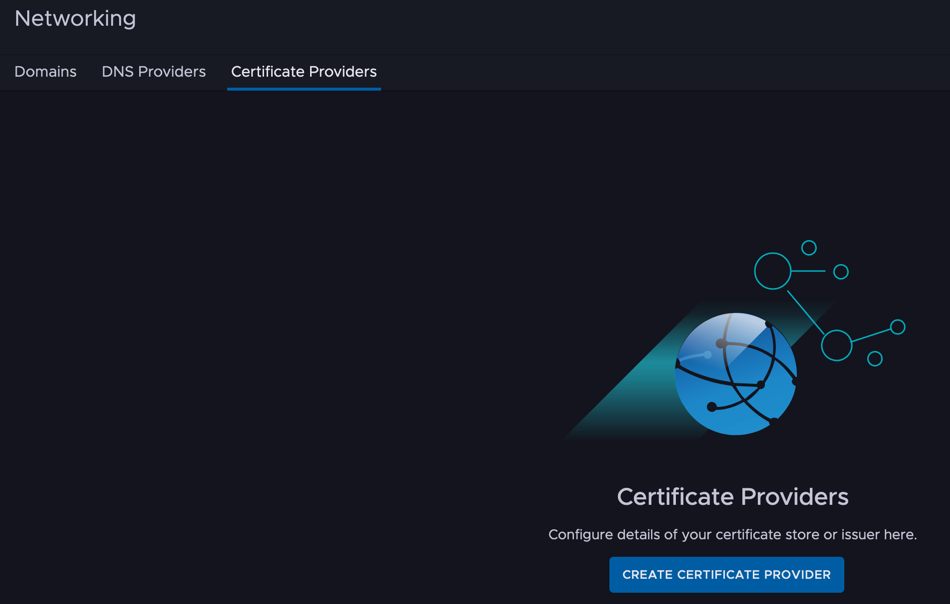
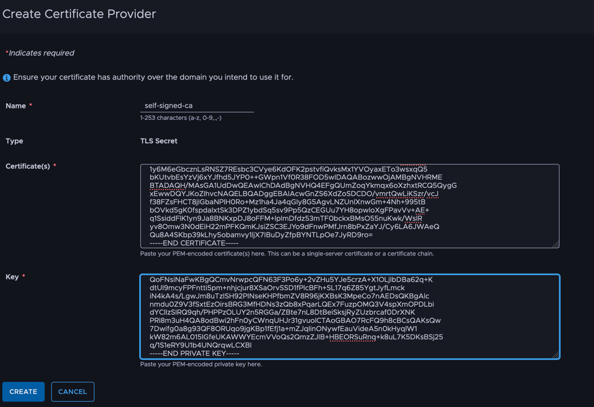
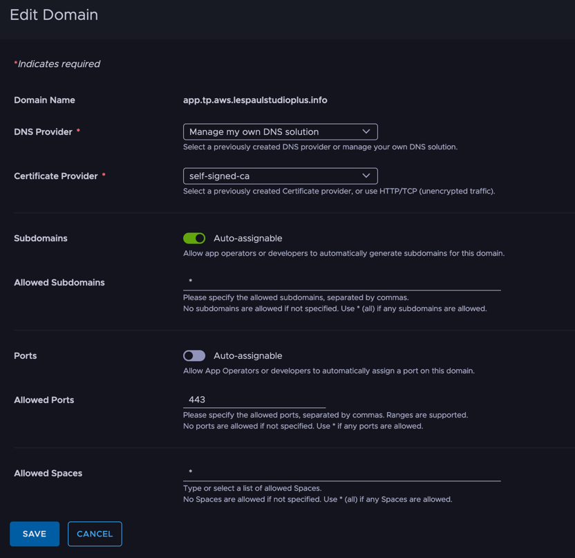
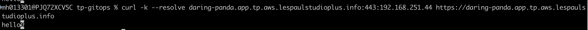
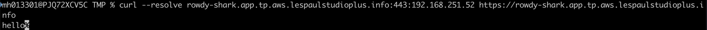

Let's try the on-prem edition of the latest product, Tanzu Platform.

This post shows how to enable HTTPS for application traffic.
<!--more-->

# Series

- [Installation](../34)
- [For admins: Project setup](../35)
- [For users: Deploying to a Space](../36)
- [For admins: Slimming down the deploy target](../37)
- **Here>** For admins: Enabling HTTPS
- [For admins: Automatic DNS registration](../39)

Bonus: [The "Things You Don't Need to Know about Tanzu Platform" series](/categories/tanzu-platform-for-maniacs/)

# Making application traffic HTTPS

Application HTTP traffic is governed by the [Certificate Provider] setting in TP's [Networking] > [Domains].
Up to the previous posts we had selected [use HTTP/TCP (unecrypted traffic)], so no traffic was encrypted.

To encrypt traffic, you need to create a certificate and register it with a Certificate Provider.

Here are the steps.

# HTTPS with a self-signed CA certificate

Let's create a self-signed certificate first. Start by specifying your own domain in an environment variable:

```
export APP_DOMAIN=<your app domain fqdn>
```

Then create the certificate with these commands:

```
DIR=TMP
mkdir -p $DIR

openssl req -new -nodes -out ${DIR}/ca.csr -keyout ${DIR}/ca.key -subj "/CN=${APP_DOMAIN}/O=tanzu/C=JP"
chmod og-rwx ${DIR}/ca.key

cat <<EOF > ${DIR}/ext_ca.txt
basicConstraints=CA:TRUE
keyUsage=digitalSignature,dataEncipherment,keyEncipherment,keyAgreement
extendedKeyUsage=serverAuth,clientAuth
subjectAltName = @alt_names
[alt_names]
DNS.1 = ${APP_DOMAIN}
DNS.2 = *.${APP_DOMAIN}
EOF

openssl x509 -req -in ${DIR}/ca.csr -days 3650 -signkey ${DIR}/ca.key -out ${DIR}/ca.crt -extfile ${DIR}/ext_ca.txt
```

Register this with a Certificate Provider. From [Networking] > [Certificate Providers], select [Create Certificate Provider].



Register the contents of the ca.crt generated above under Certificates, and ca.key under Key.



Go back to [Networking] > [Domains] and set the Certificate Provider to the newly created one.



That's it. Now deploy the app again as introduced in the [previous article](../36).

After registering the domain, curl with the command below and HTTPS communication works.
Two caveats: `-k` is added because the certificate is self-signed. And Istio's HTTPS routes by SNI header rather than Host header, so without a temporary DNS entry via `--resolve`, communication fails.

```
curl -k --resolve <app domain>:443:<app IP> https://<app domain>
```

Here's the result:



# HTTPS with a Let's Encrypt certificate

Basically the same procedure, but let's also do it with a Let's Encrypt certificate.

Create the Let's Encrypt certificate with the command below. Caveat: the endpoint IP address isn't stable, so a DNS challenge is unavoidable.
In that case you must own the DNS for <app domain>.

```
export APP_DOMAIN=<your app domain fqdn>
```

Then:

```
sudo certbot certonly --manual --preferred-challenges dns -d "*.${APP_DOMAIN}"
```

Register the TXT record shown along the way in your DNS, and obtain fullchain.pem and privkey.pem.

The flow after that is the same:

- Register fullchain.pem as the Certificate Provider's Certificate
- Register privkey.pem as the Certificate Provider's Key

Once everything is done, you can connect with the curl below.
Since it's Let's Encrypt, "-k" is no longer needed.

```
curl --resolve <app domain>:443:<app IP> https://<app domain>
```

Here's the result:




HTTPS is now enabled.
