最新製品である Tanzu Platform のオンプレ版を試していきまます。

ここでは、 デプロイしたアプリのDNSの登録について紹介します。
<!--more-->

# シリーズ

- [Install編](../34)
- [管理者向け:Projectセットアップ編](../35)
- [利用者向け:Spaceへのデプロイ編](../36)
- [管理者向け:デプロイ先の軽量化編](../37)
- [管理者向け:通信のHTTPS化](../38)
- **ここ>**　管理者向け:DNSへの自動登録

おまけ：[「Tanzu Platform の知らなくてもいい話」シリーズ](/categories/tanzu-platform-for-maniacs/)


# アプリケーションのDNSの自動登録

[この記事](../36)や[この記事](../38)で紹介したように、curlに host ヘッダーやSNIヘッダーをいちいち登録していました。
ただし、実際の環境ではDNSに登録されるべきというケースがほとんどと思われます。

執筆時点で、TPからDNSの自動登録を行えるのは、NSX ALB (aka AVI) のみのサポートです。
"NSX ALB (aka AVI) のみのサポート" と書くと、AVIをつかっていないユーザーからすると、たいそうな構成が必要に思われるかも知れないですが、使うのは
AVIのDNS機能だけです。AVIも同じインフラに存在する必要なく、パブクラや別クラウドでデプロイしてもいいです。つまり思っているより疎結合な関係でAVIをインストールできます。

今回は筆者の環境はTPはオンプレの vSphere 上(AVI未使用:HAproxy利用)でデプロイしたのですが、AWSにいるAVIでDNSの自動登録を行ってみます。
絵に表すと以下の感じです。

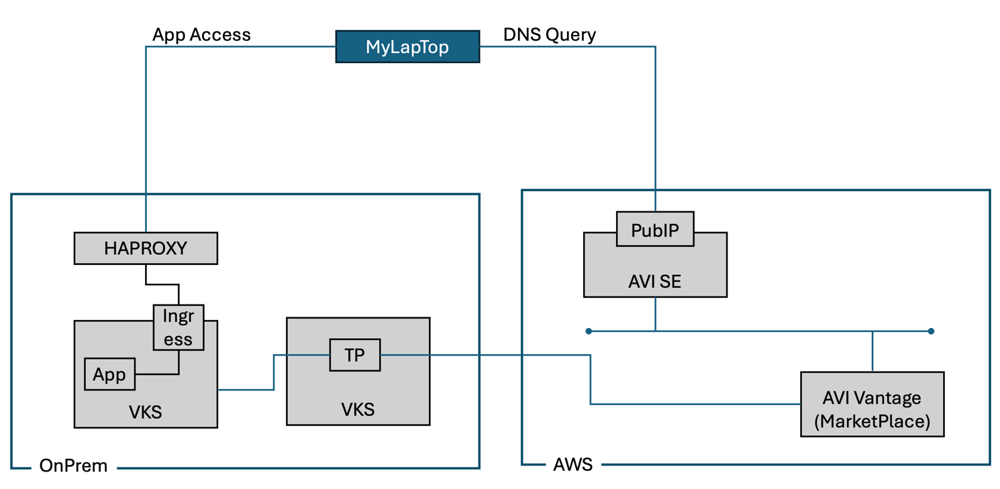

# AVIをEC2にデプロイ

AVIをEC2にデプロイします。いかに従いします。AWS Marketplaceが用意されているので、ここまでの手順は簡単です。

https://techdocs.broadcom.com/us/en/vmware-security-load-balancing/avi-load-balancer/avi-load-balancer/30-2/vmware-avi-load-balancer-installation-guide/installing-nsx-advanced-load-balancer-in-amazon-web-services/installing-avi-controller-using-iam-shared-key/deploying-an-ec2-instance.html

インストール後、パスワードを設定する必要がありますので、CLIで以下のコマンドを実行します。
しばらくまつと、HTTPSでadminポートにつながります。

```
admin@10-0-11-45:~$ sudo /opt/avi/scripts/initialize_admin_user.py
Please enter new password for user 'admin' :
Please re-enter the password  :
Resetting password for user admin.
WARNING: proto: file "metrics.proto" is already registered
See https://protobuf.dev/reference/go/faq#namespace-conflict

2025/01/17 01:46:29.694 [D]  init global config instance failed. If you donot use this, just ignore it.  open conf/app.conf: no such file or directory
Password reset complete
admin@10-0-11-45:~$
```

HTTPSでアクセスできるようになったら一旦のセットアップを完了します。

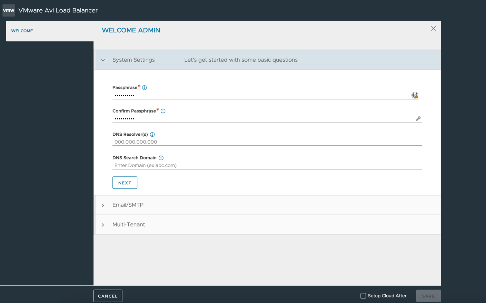

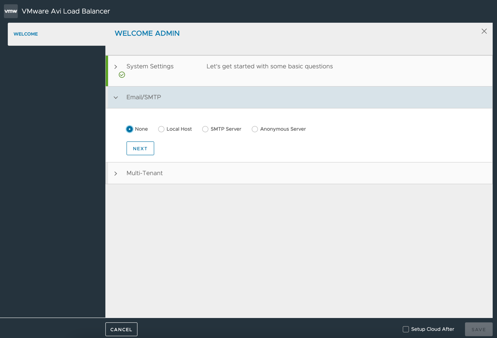

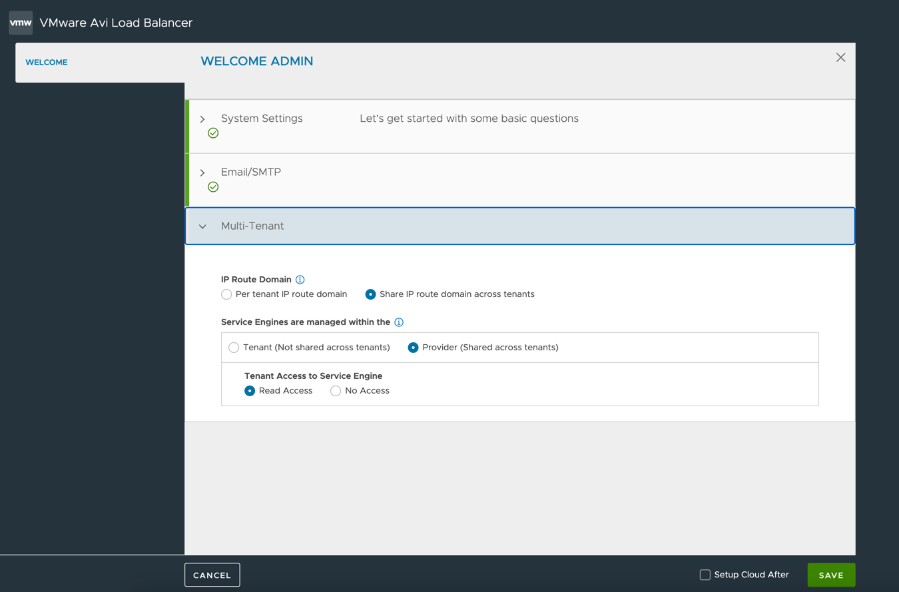

完了するとAVIの管理画面に入れるようになると思います。

TPからAVIへのAPIにアクセスする上でTLS証明書の修正が必要となるので直していきます。

[Templates] > [Security] > [SSL/TLS Certificate] で Createを選択します。

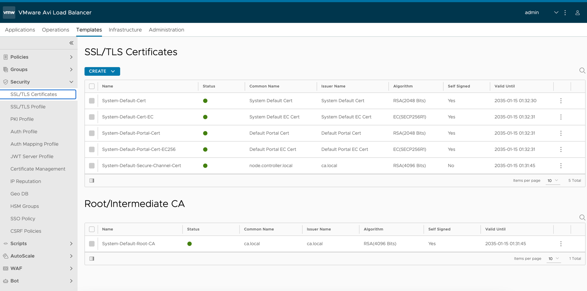

ポイントとしてCommonName と Subject Alternate Name をブラウザのアクセスに利用しているIPアドレスを指定します。

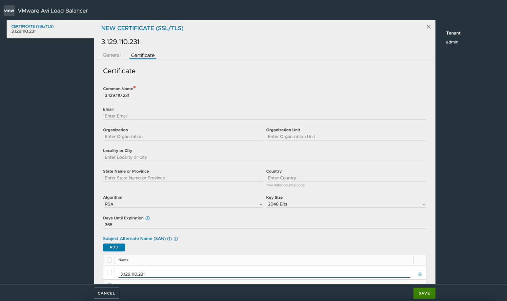

その後、[Administration] > [System Settings]を選択し、[Edit]を選択します。
SSL/TLS Certificateをすでに設定されているものを全部消して、新しいものを登録します。

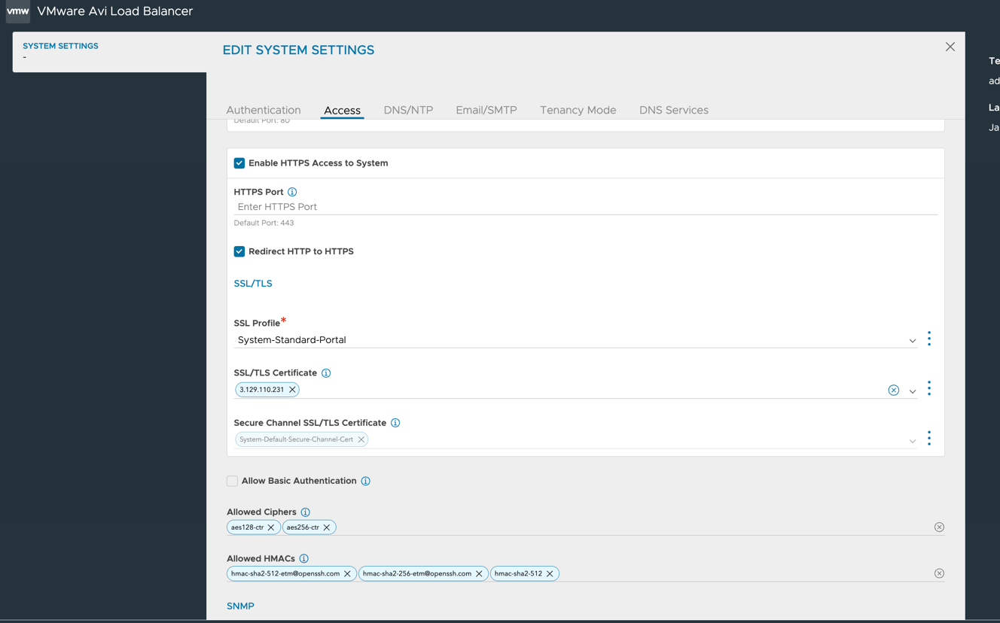

実行後、ブラウザを再ログインすると、証明書エラーになるので、もう一度解消するようにします。


セットアップの最後は、AVI Controller の [Administration] > [Licensing] でなんらかのライセンス登録が必要となります。
一旦Enterprise Tierと入力すれば、Evaluationの30日間が使えます。
その他、ライセンス違反にならないように注意してください。

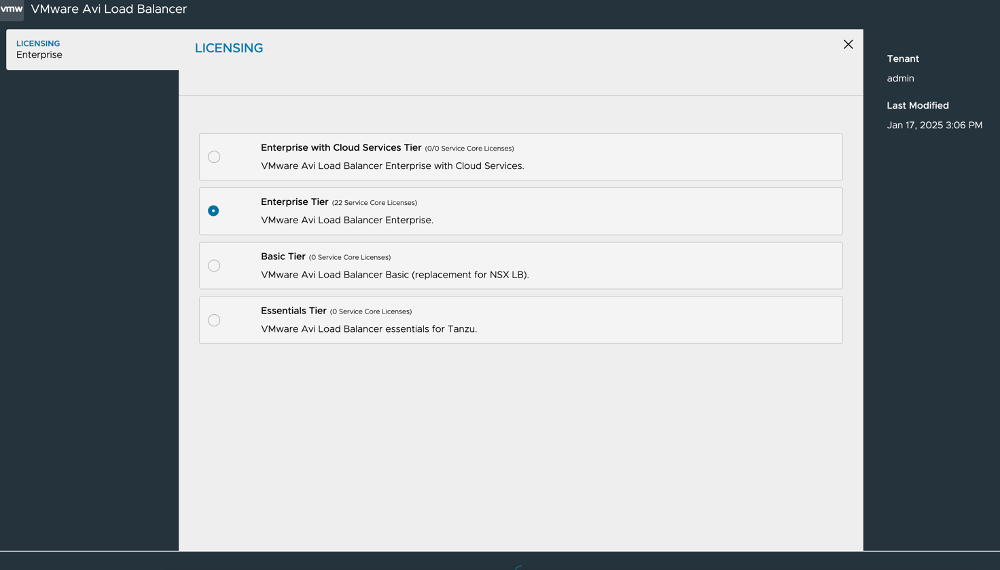

# AVI の IAM Role 作成

AVIのControllerはAWSの様々なオブジェクトと連携するためには、IAMの権限が必要です。
セキュリティを考慮すると、IAM Roleで行うことが推奨されます。AVIの詳細なセットアップの前にこれを設定してきます。

以下の Github に AWSと連携するIAMのルールが一式あるのでダウンロードします。

```
git clone https://github.com/avinetworks/devops.git
cd devops/tools/aws/iam-policies
```

AWSのアカウントIDをExportします。

```
export ACCOUNT_ID=<AWS ACCOUNT ID>
```

あとは[マニュアル](https://techdocs.broadcom.com/us/en/vmware-security-load-balancing/avi-load-balancer/avi-load-balancer/30-2/vmware-avi-load-balancer-installation-guide/installing-nsx-advanced-load-balancer-in-amazon-web-services/considerations-for-deploying-avi-in-aws/installation-options/accounts-and-iam-roles/using-the-aws-cli.html
)に従った形で、CLIでインストールしたいのですが、執筆時点でかなり間違っており、最終的には以下のコマンドが必要でした。

```
aws iam create-role --role-name vmimport --assume-role-policy-document file://vmimport-role-trust.json 
aws iam put-role-policy --role-name vmimport --policy-name vmimport --policy-document file://vmimport-role-policy.json 
aws iam put-role-policy --role-name vmimport --policy-name AviController-vmimport-KMS-Policy --policy-document file://avicontroller-kms-vmimport.json 
aws iam create-role --role-name AviController-Refined-Role --assume-role-policy-document file://avicontroller-role-trust.json 
aws iam put-role-policy --role-name AviController-Refined-Role --policy-name iam-policy --policy-document file://avicontroller-iam-policy.json
aws iam create-policy --policy-name AviController-EC2-Policy --policy-document file://avicontroller-ec2-policy.json 
aws iam create-policy --policy-name AviController-S3-Policy --policy-document file://avicontroller-s3-policy.json 
aws iam create-policy --policy-name AviController-IAM-Policy --policy-document file://avicontroller-iam-policy.json 
aws iam create-policy --policy-name AviController-R53-Policy --policy-document file://avicontroller-r53-policy.json 
aws iam create-policy --policy-name AviController-ASG-Policy --policy-document file://avicontroller-asg-policy.json 
aws iam create-policy --policy-name AviController-SQS-SNS-Policy --policy-document file://avicontroller-sqs-sns-policy.json 
aws iam create-policy --policy-name AviController-KMS-Policy --policy-document file://avicontroller-kms-policy.json 
aws iam attach-role-policy --role-name AviController-Refined-Role --policy-arn "arn:aws:iam::${ACCOUNT_ID}:policy/AviController-EC2-Policy"
aws iam attach-role-policy --role-name AviController-Refined-Role --policy-arn "arn:aws:iam::${ACCOUNT_ID}:policy/AviController-S3-Policy"
aws iam attach-role-policy --role-name AviController-Refined-Role --policy-arn "arn:aws:iam::${ACCOUNT_ID}:policy/AviController-R53-Policy"
aws iam attach-role-policy --role-name AviController-Refined-Role --policy-arn "arn:aws:iam::${ACCOUNT_ID}:policy/AviController-ASG-Policy"
aws iam attach-role-policy --role-name AviController-Refined-Role --policy-arn "arn:aws:iam::${ACCOUNT_ID}:policy/AviController-SQS-SNS-Policy"
aws iam attach-role-policy --role-name AviController-Refined-Role --policy-arn "arn:aws:iam::${ACCOUNT_ID}:policy/AviController-ASG-Policy"
aws iam attach-role-policy --role-name AviController-Refined-Role --policy-arn "arn:aws:iam::${ACCOUNT_ID}:policy/AviController-KMS-Policy"
aws iam create-instance-profile --instance-profile-name AviController-Refined-Role
aws iam add-role-to-instance-profile --instance-profile-name AviController-Refined-Role --role-name AviController-Refined-Rol
```

さらにこれもマニュアルになかったのですが、最終的にInstance ProfileをAVIに紐づける必要があるので、以下を実行しました。

以下の環境変数をExportします。
```
export REGION=<REGION>
export INSTANCE_ID=<AVI Controller EC2 Instance ID>
```

作ったインスタンスプロファイルとAVIのControllerを連携します。
```
aws ec2 associate-iam-instance-profile --iam-instance-profile Name=AviController-Refined-Role --instance-id ${INSTANCE_ID} --region ${REGION}
```

IAM Roleの設定は以上です。

なお以降の手順がうまく行かない場合、ほとんどの場合はここのIAM Roleの設定を間違えた時のようです。
そのときは、AVIのコントローラの`/opt/avi/log/cc_agent_go_<cloudname>.log`を見ると失敗原因がのっているケースが多いです。

# AVI のセットアップ

まず、DNS Profileを作ります。[Templates] タブを開いて [IPAM/DNS Profiles] を選択します。

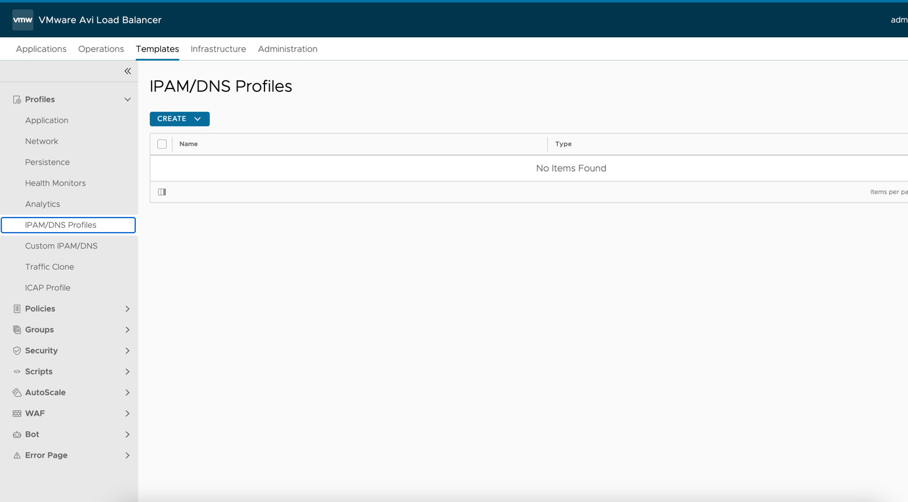

DNS Server DomainsにTPのアプリが使うドメインを設定します。

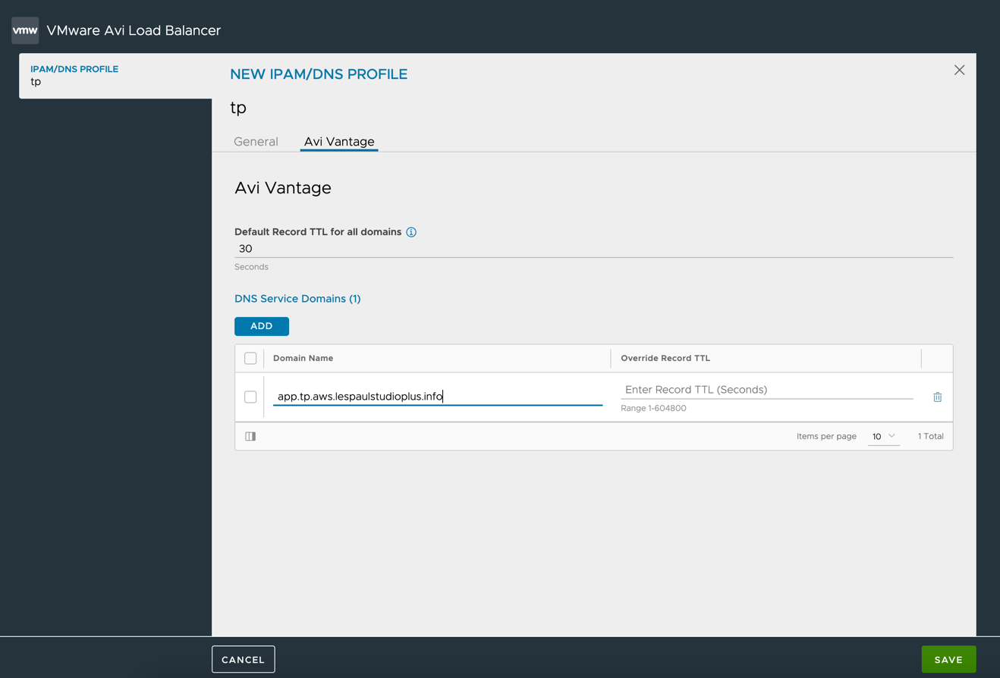

次に Cloud を設定します。[Infrastructure]タブを開いて[Clouds] を選択します。[Create] を選択すると、
クラウドを選びますが[Amazon Web Services]を選択します。

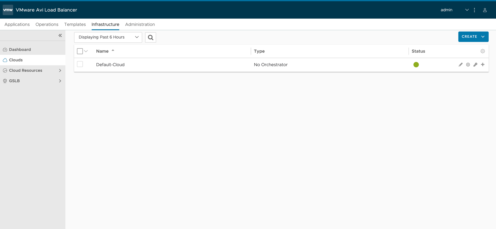

AWSのセクションでは、リージョン選択後、[Set Crendentials]で[Use IAM Roles]を選択します。
（設定に問題がなければエラーなく、いけるはずです。）

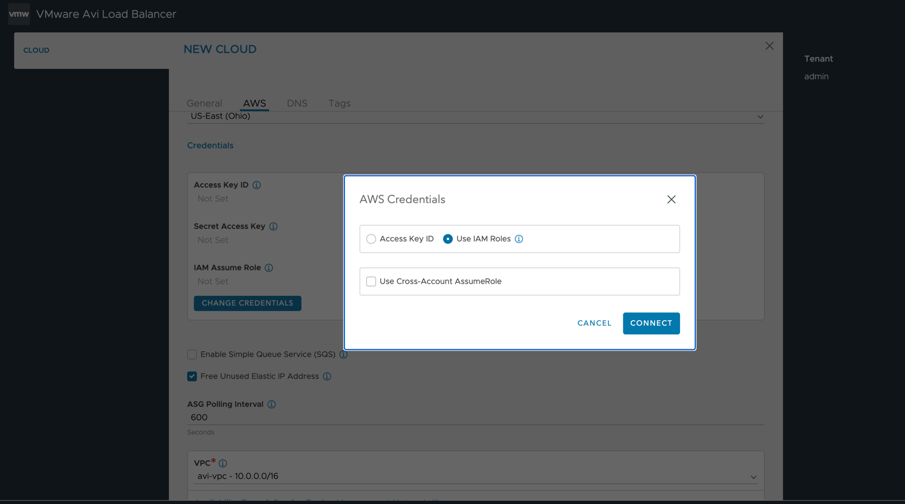

次の画面のVPCなどは自動でプルダウンで出現すると思います。


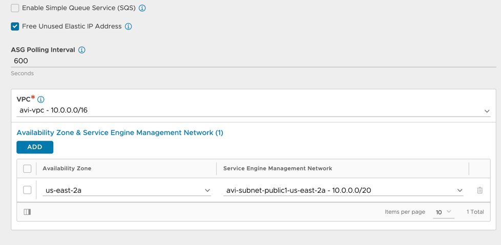

DNS Profile では前手順で作成したものを選択します。

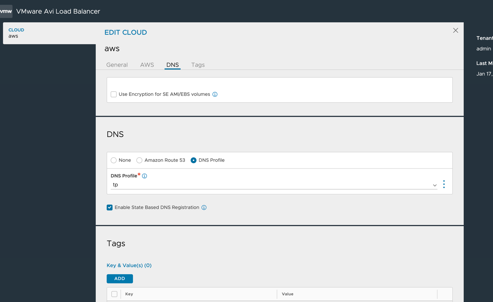

Cloudの作成はこれで完了します。

# AVI DNS Service 作成

DNS Service用の Virtual Serviceを作ります。[Applications] > [Create Virtual Service]を選択します。
作ったクラウドを選択して、まずは、Application Profileを System DNS にします。

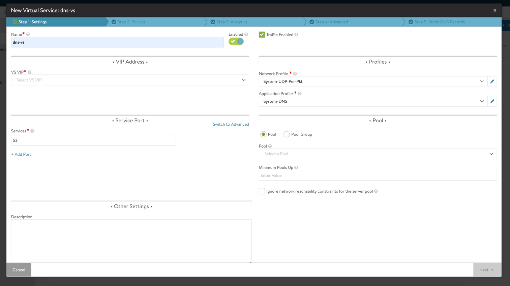

その後、VIPを選択し、[Create VIP]を選択します。このVIPはTPからアクセスできることを想定して、パブリックの通信も許可します。

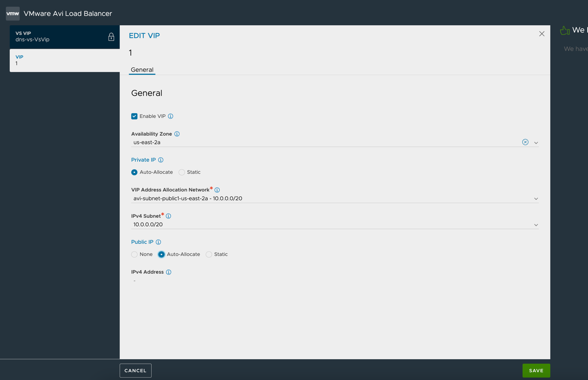

次にDNSのレコードはオプショナルですが、つくります。これはデフォルトのまま作ります。

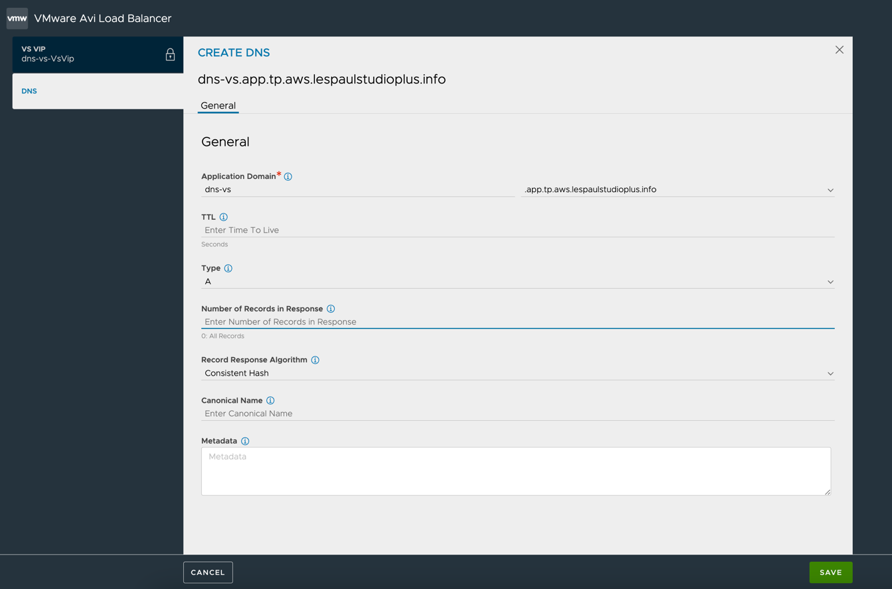

その後、Nextを選択していきます。全てデフォルトのままVirtual Serviceを作成します。

初めて Virtual Service を作ったタイミングでSE（EC2 インスタンス）が始まります。
裏では、S3 にイメージ作成 > AMI の作成 > SE のデプロイをやっていくので、5分ほど待ちます。
逆にうまく行かない場合、IAM Roleを疑ってください。

Virtual Serviceの作成が完了したら、[Administration] > [System Settings]を選択し、[Edit]を選択します。
DNS Services タブで、作成したVirtual Serviceを指定します。

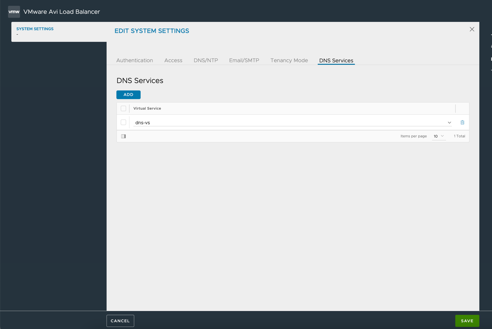

出来上がったら、手元の端末から、以下のコマンドで応答があることを確認します。

```
 nslookup dns-vs.<domain名> <AVIのパブリックIP>
```

こんな感じで応答があると思います。
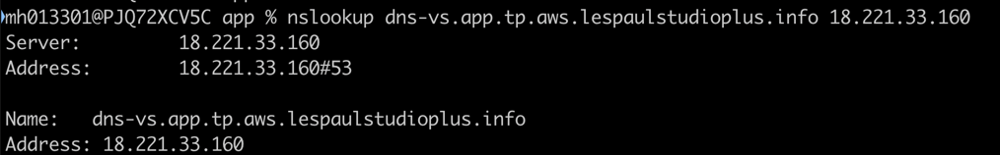


# AVI GSLB の構成

ま、まだあるのか・・・はい、もうちょっとです。
最後にGSLBを構成します。[Infrastructure] > [GSLB] > [Site] からCreateを実行します。この際、[New Site]を選択します。

まず、一番上にサイト名を入れます。


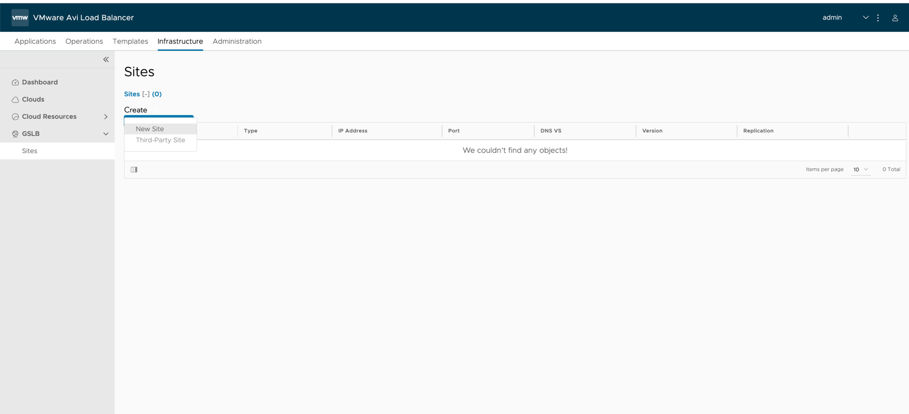
次に Change Credentials でAVI Controllerのユーザー名とパスワードを入れます。


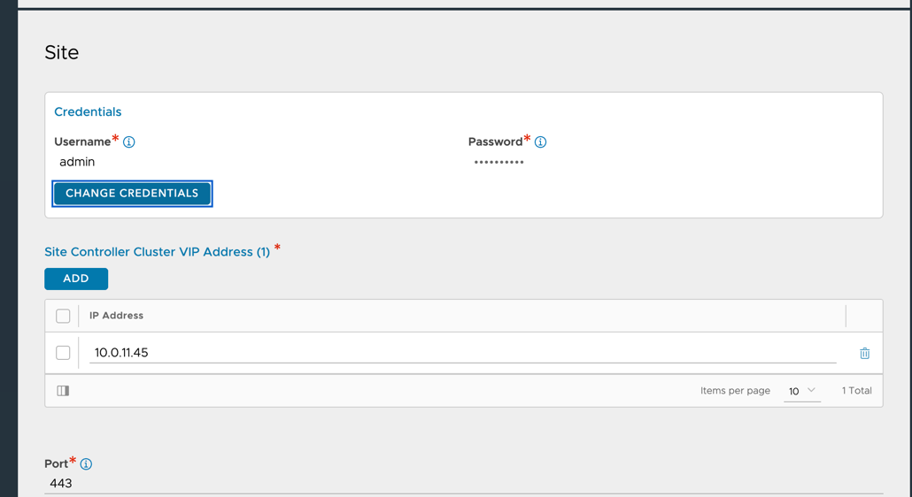
SubDomainsにはアプリで使う名前解決の情報をいれます。


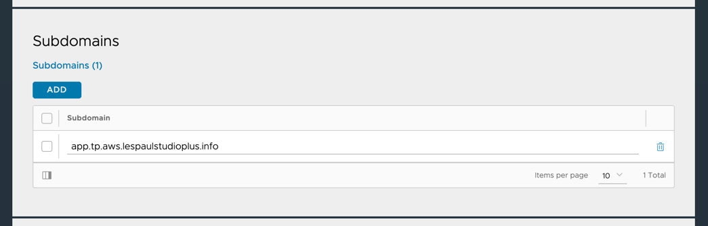
最後に Placements で、前手順で作成した DNS Virtual Serviceを指定します。

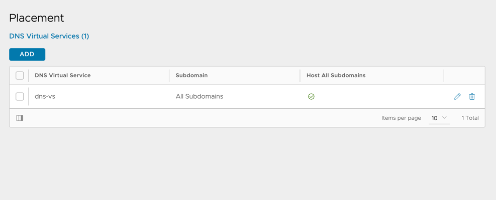

お疲れ様でした。これでAVIのセットアップ完了です。

# TPのセットアップ

TP側でセットアップしたAVIの情報を入れます。[Setup & Configurations]の[Networking]>[DNS Providers]から Create を実行します。

以下の画面ショットのように入れます。
- Name は適当
- Zone はアプリのドメイン
- AVIの認証情報を入力
- Custom root/CA Certifcate には AVI Controllerのセットアップに新しく作ったTLS証明書をExportしたものを入れます。

この構成の場合、非常に重要なのが HealthCheck ですが、AVIの環境がTPのアプリケーションにアクセスできないのであれば、Disableにします。

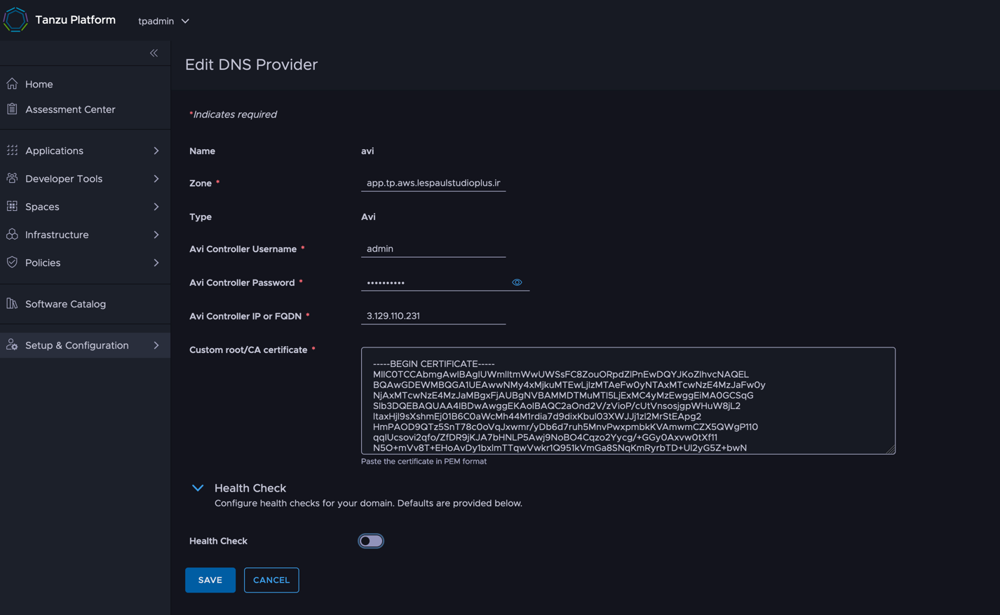

登録後、[Setup & Configurations]の[Networking]>[Domains]のDNS Provider値をアップデートします。

この状態で[前記事](../36)のようにアプリをデプロイします。
アプリデプロイ後、アプリのドメインをDNSに問い合わせると、ちゃんと正しいIPアドレスが返ってきます。

```
mh013301@PJQ72XCV5C app % nslookup busy-penguin.app.tp.aws.lespaulstudioplus.info 18.221.33.160
Server:		18.221.33.160
Address:	18.221.33.160#53

Name:	busy-penguin.app.tp.aws.lespaulstudioplus.info
Address: 192.168.251.40
```

AVI側では、[Applications]>[GSLB Services]をみると、名前解決情報をみることができます。

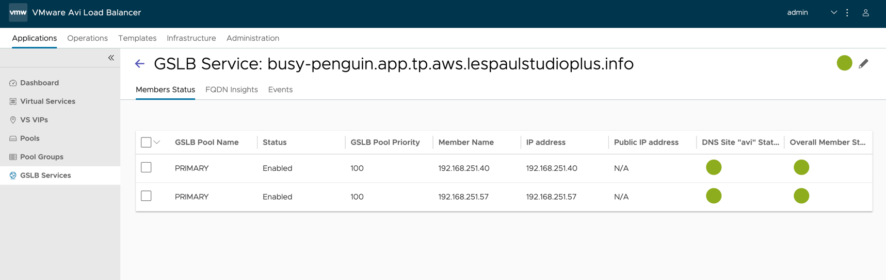

なお、Availability Tagret内に二つ以上のクラスタが存在する場合に限定されますがSpaceの設定を変えてReplicaを2にしてみます。
こうすることで、アプリケーションが二つのクラスタにまたがってデプロイされます。

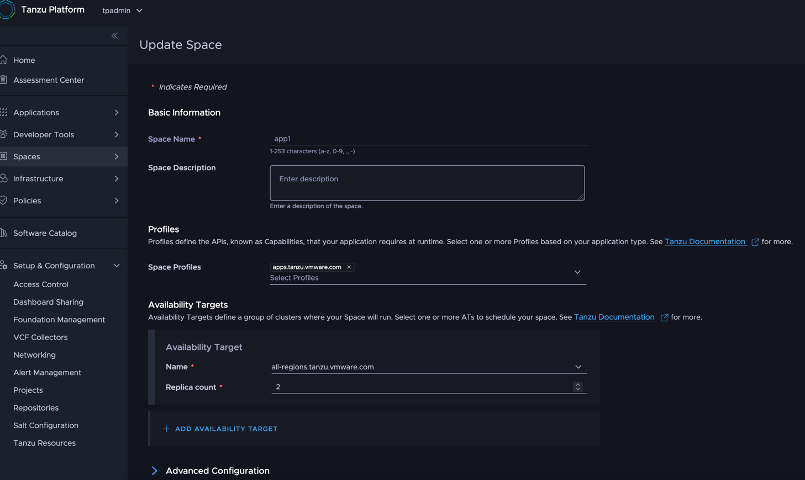

その際AVI側で、DNSの応答LBして、返すようになります。以下のように、nslookupの結果が変わっているのがわかります。

```
mh013301@PJQ72XCV5C app % nslookup busy-penguin.app.tp.aws.lespaulstudioplus.info 18.221.33.160
Server:		18.221.33.160
Address:	18.221.33.160#53

Name:	busy-penguin.app.tp.aws.lespaulstudioplus.info
Address: 192.168.251.57

mh013301@PJQ72XCV5C app % nslookup busy-penguin.app.tp.aws.lespaulstudioplus.info 18.221.33.160
Server:		18.221.33.160
Address:	18.221.33.160#53

Name:	busy-penguin.app.tp.aws.lespaulstudioplus.info
Address: 192.168.251.40
```

AVIの検証は以上です。なお、AVIにはさらに外部ロードバランサーのRoute53とも連携する機能があるので、パブリックのDNSにまで登録することが可能です。
(また記事にするかも)

https://techdocs.broadcom.com/us/en/vmware-security-load-balancing/avi-load-balancer/avi-load-balancer/30-2/vmware-avi-load-balancer-installation-guide/installing-nsx-advanced-load-balancer-in-amazon-web-services/additional-configuration-options-for-aws-/nsx-advanced-load-balancer-integration-with-aws-route-53-hosted-in-a-different-aws-account.html

以上DNSの自動登録を記載しました。