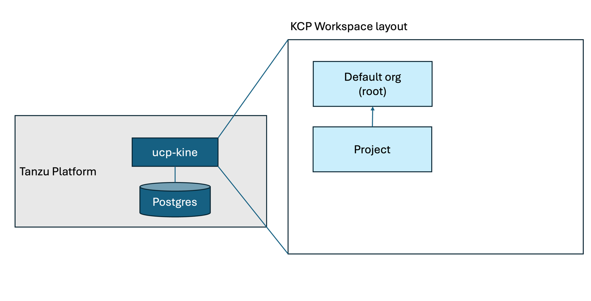
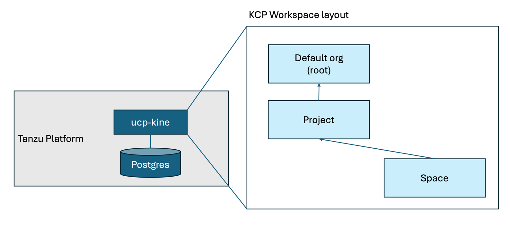
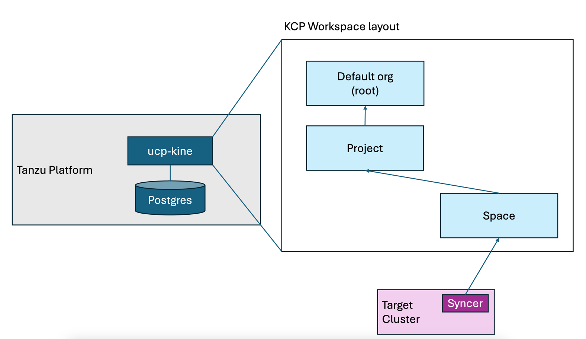

最新製品である Tanzu Platform のマニアックすぎてブログに書くのを躊躇した内容を書いていきます。
注意点ですが、ここから書くことは「知らなくてもいい」ことです。

今回は Kine / KCP を解説します。
<!--more-->

# Kine ? KCP ?

TP のKubernetes管理の重要コンポーネントに Unified Control Plane (UCP) というものがあります。
これが Space や、Capabilitiesを管理しているコンポーネントです。

UCPは最初ふれるとKubernetes上級者でも聞き慣れない用語が多く、独自実装をしていると誤解するかもしれませんが、実は世にあるOSSプロジェクトを活用しているものです。

UCPの中でも重要なコンポーネントになるのが Kine / KCP です。

- [Kine](https://github.com/k3s-io/kine): Kubernetesのプロジェクトであり、Standaloneかつ、etcd以外のDBでも稼働する軽量Kubernetes APIサーバーです。
- [KCP](https://github.com/kcp-dev/kcp): KubernetesのAPIをWorkspaceという単位で分割して提供する手段です。

# アーキテクチャ

執筆時点でのTPでの Kine / KCP の使い方はこんなアーキテクチャになっています。


Tanzu Platform の中に、Kineが存在します。この Kine は Postgres をデータベースにしています。実際にコマンドでみると以下のようにみつけることができます。

```
% kubectl get po -n tanzusm | egrep "ucp-kine|postgres"
postgres-endpoint-controller-6b75bf6bdd-qccss           1/1     Running     0               13d
postgresql-0                                            2/2     Running     0               13d
ucp-kine-85d49b4bbd-f4p6d                               1/1     Running     0               13d
ucp-kine-85d49b4bbd-zjkbh                               1/1     Running     0               13d
```

Tanzu Platform を運用する過程で Kine を意識することはないと思います。
強いて言えば、Tanzu Platform 側の K8s クラスタ内のAPIオブジェクトをみたとしても実際のアプリケーションの問題判別にほとんどつかえないです。
たとえば、TPが稼働するクラスタで `kubectl api-resources`を実行しても、デプロイされたアプリケーションの状態を表すものはないほとんどないです。
（ちなみに、Tanzu Platform 側からデプロイされたアプリケーションの状態を知るには `graphql` が使えます。が、これもマニアックすぎるので別記事でとりあげます。）

この Kine ですが、ただのKubernetesではなくKCPのクラスタを構成するために存在します。 
ここからもう少し深掘りするのが、この KCP です。

# tanzu xxx use と KCP の関係

いままで、TPの記事の中で、以下のようなコマンドが登場しました。

- `tanzu project use`
- `tanzu space use`
- `tanzu operations clustergroup use`

この `tanzu xxx use` 系のコマンドは全て、KCPのワークスペースとよばれる概念の切り替えをになっています。

`tanzu login` を行うと、その端末上に `~/.config/tanzu/kube/config` に kubeconfig ファイルが保管されます。
この Kubeconfig ですが、`tanzu xxx use`　をするたびに中身が変わります。

たとえば、`tanzu project use` をすると・・・

```
% tanzu project use tpadmin
✓ Successfully set project to tpadmin
```

もとのファイルと比較すると差異が確認できます。

```
% diff ~/.config/tanzu/kube/config /tmp/tp-config
5,6c5,6
<     server: https://tp.aws.lespaulstudioplus.info/org/c957a32b-b30c-21f7-95e1-f22cffe0eecf/project/dc7d70e1-d928-4bb2-88f5-ac0fc25c8524
<   name: tanzu-cli-tpsm-885188f8:tpadmin
---
>     server: https://tp.aws.lespaulstudioplus.info/org/c957a32b-b30c-21f7-95e1-f22cffe0eecf/project/dc7d70e1-d928-4bb2-88f5-ac0fc25c8524/clustergroup/run-lite
>   name: tanzu-cli-tpsm-885188f8:tpadmin:run-lite
9c9
<     cluster: tanzu-cli-tpsm-885188f8:tpadmin
---
>     cluster: tanzu-cli-tpsm-885188f8:tpadmin:run-lite
11,12c11,12
<   name: tanzu-cli-tpsm-885188f8:tpadmin
< current-context: tanzu-cli-tpsm-885188f8:tpadmin
---
>   name: tanzu-cli-tpsm-885188f8:tpadmin:run-lite
> current-context: tanzu-cli-tpsm-885188f8:tpadmin:run-lite
```

この状態から　`tanzu space use`　をすると・・・

```

% tanzu space use app1
✓ Successfully set space to app1
```

また差異が確認できます。

```
mh013301@PJQ72XCV5C manifests % diff ~/.config/tanzu/kube/config /tmp/tp-config
5,6c5,6
<     server: https://tp.aws.lespaulstudioplus.info/org/c957a32b-b30c-21f7-95e1-f22cffe0eecf/project/dc7d70e1-d928-4bb2-88f5-ac0fc25c8524/space/app1
<   name: tanzu-cli-tpsm-885188f8:tpadmin:app1
---
>     server: https://tp.aws.lespaulstudioplus.info/org/c957a32b-b30c-21f7-95e1-f22cffe0eecf/project/dc7d70e1-d928-4bb2-88f5-ac0fc25c8524
>   name: tanzu-cli-tpsm-885188f8:tpadmin
9c9
<     cluster: tanzu-cli-tpsm-885188f8:tpadmin:app1
---
>     cluster: tanzu-cli-tpsm-885188f8:tpadmin
11,12c11,12
<   name: tanzu-cli-tpsm-885188f8:tpadmin:app1
< current-context: tanzu-cli-tpsm-885188f8:tpadmin:app1
---
>   name: tanzu-cli-tpsm-885188f8:tpadmin
> current-context: tanzu-cli-tpsm-885188f8:tpadmin
```

さらに、`tanzu operations clustergroup use`　をすると ・・・

```
% tanzu operations clustergroup use run
ℹ  project has been set to tpadmin
ℹ  successfully set clustergroup to run
```

またまた差異が確認できます。

```
mh013301@PJQ72XCV5C manifests % diff ~/.config/tanzu/kube/config /tmp/tp-config
5,6c5,6
<     server: https://tp.aws.lespaulstudioplus.info/org/c957a32b-b30c-21f7-95e1-f22cffe0eecf/project/dc7d70e1-d928-4bb2-88f5-ac0fc25c8524/clustergroup/run
<   name: tanzu-cli-tpsm-885188f8:tpadmin:run
---
>     server: https://tp.aws.lespaulstudioplus.info/org/c957a32b-b30c-21f7-95e1-f22cffe0eecf/project/dc7d70e1-d928-4bb2-88f5-ac0fc25c8524
>   name: tanzu-cli-tpsm-885188f8:tpadmin
9c9
<     cluster: tanzu-cli-tpsm-885188f8:tpadmin:run
---
>     cluster: tanzu-cli-tpsm-885188f8:tpadmin
11,12c11,12
<   name: tanzu-cli-tpsm-885188f8:tpadmin:run
< current-context: tanzu-cli-tpsm-885188f8:tpadmin:run
---
>   name: tanzu-cli-tpsm-885188f8:tpadmin
> current-context: tanzu-cli-tpsm-885188f8:tpadmin
```

こんな感じで、すべて異なる応答が返ってきます。
二つのポイントがあり、まずは`server:` の値です。URLのPATHは変わっていますが、基本的にすべて、`tp.aws.lespaulstudioplus.info` という私の環境のTPにつながっていることがわかります。
もう一つのポイントが、` cluster:` の値であり、`tanzu-cli-tpsm-885188f8:<project名>:<space名 or clustergroup名>`になっている点です。
これが KCP のワークスペースにあたります。KCPのワークスペースは、Virtual Clusterとよばれる、仮想のk8sクラスタが割り当てられます。
この仮想の k8s クラスタは、etcdなどを必要とせず瞬時につくれるKubernetesです。

TPでは KCP を拡張したものを利用しています。その一つ理由が、それぞれのワークスペースが完全な隔離された空間になり、RBACの構成を組みやすくなるためです。
実際TPのRBACのドキュメントをみると、KCPの構成と似た絵が出現し、それぞれにRBACが組めることが記載されています。

https://techdocs.broadcom.com/us/en/vmware-tanzu/platform/tanzu-platform/10-0/tnz-platform/users-projects-about-rbac.html

# tanzu deploy を改めてみると

これを知った上で、[この記事](../36)のデプロイ後の状態をみてみましょう。
まず、Kubeconfigを `~/.config/tanzu/kube/config`にします。

```
export KUBECONFIG=~/.config/tanzu/kube/config
```

Projectに切り替えます。

```
tanzu project use tpadmin
```

これを実行することでKCP的にはこの絵の上になります。



tanzu cli ではなく、kubectl を使って中身をみていきます。
`kubectl api-resources` を実行すると、このワークスペースで実行が可能なAPI一覧がみられます。
[この記事](../35)でプラットフォームビルドの設定をしていましたが、その設定も確認できます。
これが各スペースに共有されていきます。

```
% kubectl get buildconfigurations
NAME
dev-project-bld-cfg
```

さらに、このプロジェクトに紐づいている ClusterGroup や Space の一覧がみられます。

```
% kubectl get clustergroups
NAME
run
run-lite
% kubectl get spaces
NAME   AGE
app1   3d16h
```

では、スペースに切り替えます。

```
tanzu space use app1 
```
絵にすることこの状態になります。




この状態で`kubectl api-resources` を実行すると、先ほどのProject選択時とはだいぶ異なる結果になるのがわかります。
たとえば、ClusterGroup や Space　一覧をここで実行してもそんなAPIはないと怒られます。
これは想定通りの結果であり、ワークスペースがかわったので、実行できるAPIセットも変わったからです。

```
% kubectl get clustergroups
error: the server doesn't have a resource type "clustergroups"
% kubectl get spaces
error: the server doesn't have a resource type "spaces"
```

このワークスペースにはアプリの情報があり、`ContainerApps` がデプロイ情報です。

```
% kubectl get containerapps
NAME   DESCRIPTION   AGE     STATUS
app                  3d16h   DeploySucceeded
```

なんどか登場してるドメインバインドの情報もこのワークスペースにあります。

```
% kubectl get domainbindings
NAME   DOMAIN                                           PORT   HTTP
bar    busy-penguin.app.tp.aws.lespaulstudioplus.info   443    {}
```

Spaceで定義されたリソースは、Syncerとよばれるプロセスによって対抗のKubernetesへと情報が同期されます。
絵で表すとこの状態です。



この Syncer は双方向であり、単純にKCPに書かれたリソースを実行するだけでなく、その実行結果をKCP側に伝え直すことができるのでステータスなどがKCP側から見られます。
たとえば、以下のコマンドのようにドメインバインドのステータスをみると、本来は実行先しかしらない、エンドポイントのIPアドレスがKCP側でも確認できます。
[この記事](../36) で紹介した、`tanzu domain-bindings get` がこの出力を利用しています。

```
% kubectl get domainbindings bar -o jsonpath='{.status.addresses[].value}'
192.168.251.40%
```

本来は、tanzu cli でのみ、Space のオブジェクトを加工したりするべきですが、テクニカルには、kubectl で作ることもできます。
例えば、このSpacedでSecretを作ってみます。

```
kubectl create secret generic sync-test --from-literal=sync=test
```

Space上に Secret が作られました。

```
% kubectl get secret
NAME
sync-test
```

もし、デプロイ先の k8s クラスタにアクセスがある場合、ここで作ったSecretが同期されていることがわかります。

```
% export KUBECONFIG=<デプロイ先kubeconfig>
% kubectl get secret -n app1-674bb96796-cfj79
NAME                       TYPE                             DATA   AGE
app-fetch-0                kubernetes.io/dockerconfigjson   1      3d17h
app-registry               kubernetes.io/dockerconfigjson   1      3d17h
app-values                 Opaque                           1      3d17h
app2-fetch-0               kubernetes.io/dockerconfigjson   1      23h
app2-registry              kubernetes.io/dockerconfigjson   1      23h
app2-values                Opaque                           1      23h
sync-test                  Opaque                           1      3m46s  <<<<<<<<<<<<<<
tanzu-sidecar-fetch-cred   kubernetes.io/dockerconfigjson   1      3d17h
```

このように KCP への操作だけで、デプロイ先にオブジェクトをつくったり、反映したりができます。

TPはこれを利用することで、RBACもそうですが、開発者がTPへのユーザー認証するだけで、k8sのデプロイをできるようにしています。
多くのお客様で kubeconfig の作成・管理の運用が煩雑でこまっているとのフィードバックをうけていますが、これで解決できるかもしれません。

さて、Spaceに入った時の `api-resources` が、対向クラスタで同期が可能なAPI一覧であると書きました。
しかし、みると、非常に限られたAPIに感じると思い、カスタマイズしたい・・・と思いますよね？
ここのカスタマイズに重要なのが、CapabilitiesとProfileなのですが、これもマニアックすぎるトピックなので別記事で取り上げます。

以上 Kine/KCP の紹介でした。