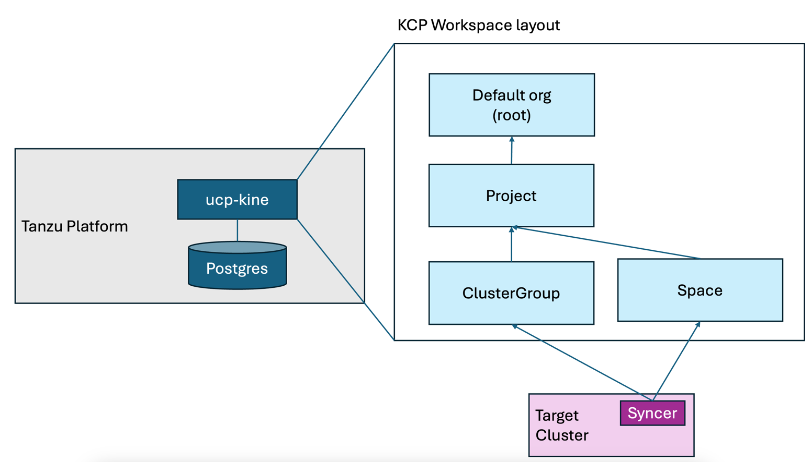
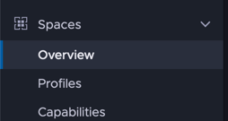
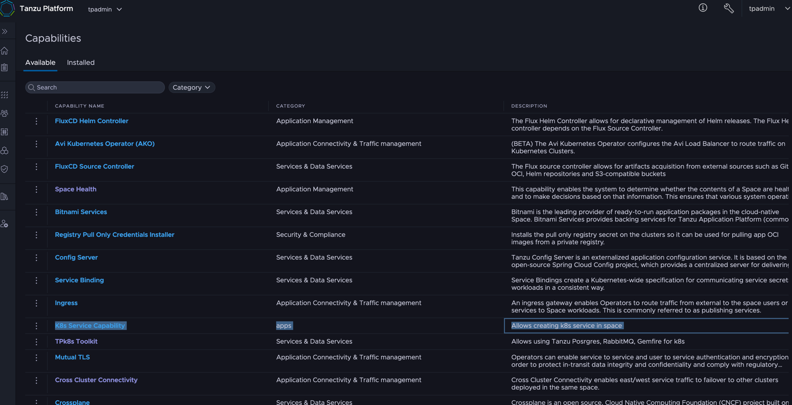
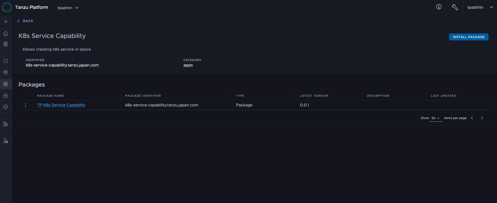
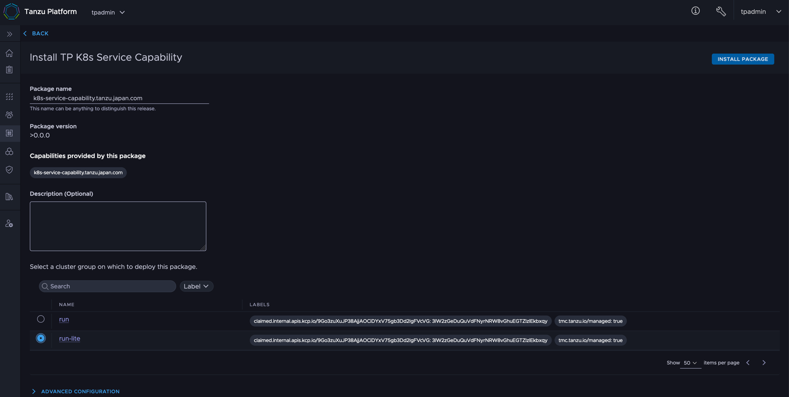
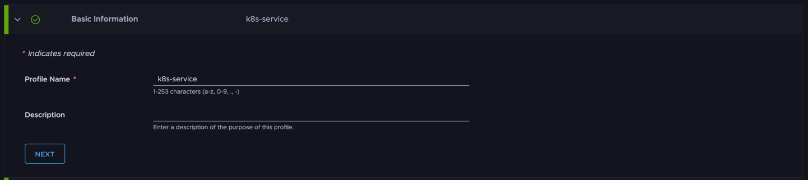
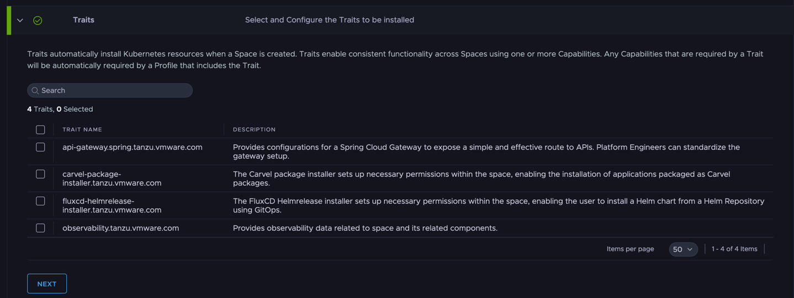
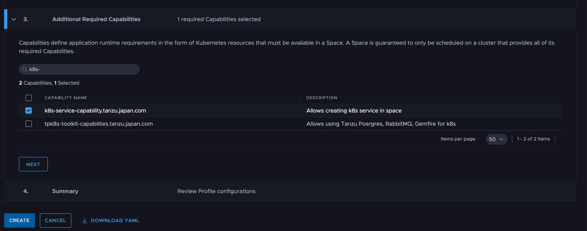
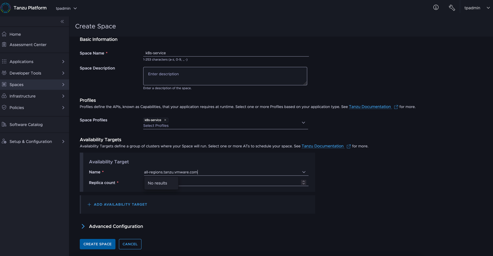

最新製品である Tanzu Platform のマニアックすぎてブログに書くのを躊躇した内容を書いていきます。
注意点ですが、ここから書くことは「知らなくてもいい」ことです。

今回は Capabilities / Profiles を解説します。なお、この記事は [KCP/Kine](../40) の理解が前提です。
<!--more-->

# Space での利用可能なAPIとCapabilitiesとProfiles

[KCP/Kine](../40) でも紹介した以下の絵にあるよう、Space や ClusterGroup で定義したリソースが Syncer を経由して、対向のk8sに情報が反映されます。



ここでの利用可能なAPI一覧はワークスペースを切り替え `kubectl api-resources`　をすれば確認ができます。
ポイントがSpaceからなんでもかんでも実行できるわけではないという点です。では、APIが足りないときはどうすればいいのでしょうか？

この中で、ClusterGroup のAPI一覧はカスタマイズできる手段は筆者はまだ見つけることができていません。
しかし、Spaceであれば、カスタマイズができます。それが TP を理解する上で、個人的には鬼門、「なんじゃこりゃ」の総本山、CapabilitiesとProfilesです。

TP GUIから確認できる、これです。



KCPの概念を知った上で解説すると以下の機能をもっています。

- Profiles : SpaceワークスペースへAPIを追加する方法
- Capabilities : [Carvel](https://carvel.dev/)の[Package Management](https://carvel.dev/kapp-controller/docs/v0.54.x/packaging/)をベースに、APIのインストールと定義を担っており、これがProfilesから参照される

ここからもう少し、細かくみていきます。

# CapabilitiesとProfile を使って Space から k8s service をいじる

通常のSpace のワークスペースからは、Kubernetesでは一般的に使われる core/v1の Service  が定義されていません。
以下のコマンドは失敗しますが、想定どおりです。

```
% tanzu space use
# 適当なスペースを選択
% kubectl get svc
error: the server doesn't have a resource type "svc"
```

ここでは、Profile と Capabilities から Space  から K8s Service をコントロールできるようにします。その過程で、Capabilities と Pod の理解を試みます。

## 自作 Capabilities の登録

ここではオフィシャルサポートが一切ないですが、自作の Capabilities を Tanzu Platform に登録してきます。
該当のパッケージ情報はいかに存在しています。

コード：https://github.com/mhoshi-vm/tp-k8s-service-from-space  
コンテナイメージ：https://github.com/mhoshi-vm/tp-k8s-service-from-space/pkgs/container/tp-k8s-service-from-space

これらは、[Carvel](https://carvel.dev/)の[Package Management](https://carvel.dev/kapp-controller/docs/v0.54.x/packaging/)を元に作成しているものですが、テーマからは逸脱するので説明を省きます。

TPに切り替え、まずはプロジェクトのワークスペースに入ります。

```
tanzu project use tpadmin
```

ここで、今回の自作パッケージを登録していきます。

```
tanzu package repository add tp-k8s-service-from-space --url ghcr.io/mhoshi-vm/tp-k8s-service-from-space:latest
```

kubectl にはなりますが、登録も確認できます。

```
% kubectl get pkgr
NAME                        AGE   DESCRIPTION
tap-saas-sha256-e989369     14d   Ready
tp-k8s-service-from-space   4s    Ready
```

[//]: # (Readyになると以下のようにパッケージが見えます。)

```
% kubectl get package | grep "k8s-service.*0.0.1"
k8s-service-capability.tanzu.japan.com.0.0.1
```

この状態でTPのGUIの [Spaces] > [Capabilities] > [Available] を見ると、`K8s Service Capabilites` という名のものが確認できます。



コードをみていきます。

https://github.com/mhoshi-vm/tp-k8s-service-from-space/blob/main/packages/k8s-service-capability.tanzu.japan.com/0.0.1.yaml#L5

これらの情報は、`kind: Pacakge` の `annotations.capability.tanzu.vmware.com/provides` のJSONの情報を参照してTP GUIに反映され、Capabilitiesとして登録されます。
逆をいえば、この annotation がないと、TP GUIには出現しません。さらに重要なのが[groupVersionKinds](https://github.com/mhoshi-vm/tp-k8s-service-from-space/blob/main/packages/k8s-service-capability.tanzu.japan.com/0.0.1.yaml#L11)にどのAPIをSpaceに公開したいかを一覧化していきます。

なお、今回のケースは不要ですが、3rdパーティのAPIを追加するときは、[template](https://github.com/mhoshi-vm/tp-k8s-service-from-space/blob/main/packages/k8s-service-capability.tanzu.japan.com/0.0.1.yaml#L23) に必要なコントローラのインストールなども定義していきます。

# 自作 Capabilities を ClusterGroup にインストール

Capabilities を ClusterGroup にインストールします。
以下のコマンドで ClusterGroupのワークスペースに切り替えます。途中プロンプトで、どのClusterGroupに対してインストールするか聞かれるので選択します。

```
tanzu operations clustergroup use
```

ワークスペース切り替え後、以下のコマンドで自作Capabilityのインストール準備はします。
`tanzu project use`と同じコマンドとおもうかもですが、執筆時点では、Projectのワークスペースに対するSyncerが定義されていないので、実際の対向K8sには反映されません。
なので、ClusterGroupで実行することで実際の対向K8sに反映します。

```
tanzu package repository add tp-k8s-service-from-space --url ghcr.io/mhoshi-vm/tp-k8s-service-from-space:latest
```

執筆時点だと、実行後以下のような出力になりますが、問題なく実行できていると思って結構です。

```
% kubectl get pkgr
NAME                        AGE    DESCRIPTION
tp-k8s-service-from-space   18s    Not Ready: the server could not find the requested resource (get packages.data.packaging.carvel.dev)
```

そして、この状態で、[Spaces] > [Capabilities] > [Available] の`K8s Service Capabilites`を選択します。


右上の Install Package を実行します。



"Select a cluster group on which to deploy the package" でインストールする先のクラスタを選択して `Install Package` を実行します。



# Profile の作成

SpaceにAPIをみえるようにするためには、前段でインストールした自作 Capability を定義した Profile を作成します。
[Spaces] > [Profiles] から [Create Profiles] を選択します。

名前はなんでもいいですが、ここでは `k8s-service` にしています。



Traitsですが、今回は無視してください。別記事でとりあげるかもしれません。



Capabilitiesで自作Capabilityを登録します。そのまま Create を実行します。



# Space を作成 / K8s Service の作成

いよいよ準備ができたのでSpaceを作って実際のk8s serviceを作っていきます。

[Spaces] > [Overview] > [Create Space] を選択します。
Space Profiles にさきほど作成したProfileを選択します。AvailabilityTargetはいつもどおりの設定でいいです。



ここからはCLIです。スペースのワークスペースに切り替えます。

```
tanzu space use k8s-service
```

API一覧をのぞきます。すると本来は存在しない、Services のAPIが並んでいることがわかります。

```
% kubectl api-resources
NAME                        SHORTNAMES   APIVERSION                     NAMESPACED   KIND
configmaps                               v1                             true         ConfigMap
events                                   v1                             true         Event
limitranges                              v1                             true         LimitRange
resourcequotas                           v1                             true         ResourceQuota
secrets                                  v1                             true         Secret
serviceaccounts                          v1                             true         ServiceAccount
services                    svc          v1                             true         Service　<<<注目<<<<<<<<<<<<<<<<<<<<<<<<<<<<
localsubjectaccessreviews                authorization.k8s.io/v1        true         LocalSubjectAccessReview
selfsubjectaccessreviews                 authorization.k8s.io/v1        false        SelfSubjectAccessReview
selfsubjectrulesreviews                  authorization.k8s.io/v1        false        SelfSubjectRulesReview
subjectaccessreviews                     authorization.k8s.io/v1        false        SubjectAccessReview
events                                   events.k8s.io/v1               true         Event
clusterrolebindings                      rbac.authorization.k8s.io/v1   false        ClusterRoleBinding
clusterroles                             rbac.authorization.k8s.io/v1   false        ClusterRole
rolebindings                             rbac.authorization.k8s.io/v1   true         RoleBinding
roles                                    rbac.authorization.k8s.io/v1   true         Role
syncresourcesets            srs          ucp.tanzu.vmware.com/v1        true         SyncResourceSet
```

ここで、Type: Loadbalancer の k8s service を作ってみます。

```
kubectl create svc loadbalancer hoge --tcp=8080:8080
```

しばらくすると実行が完了すると思います。なお、普通の k8s で Type: Loadbalancer を作成すれば、.status.loadBalancer に接続先のエンドポイント情報が表示されますが、何も表示されません。

```
% kubectl get svc hoge -o yaml
apiVersion: v1
kind: Service
metadata:
  annotations: {}
  creationTimestamp: "2025-01-21T08:44:59Z"
  generation: 1
  labels:
    app: hoge
  name: hoge
  namespace: default
  resourceVersion: "1426062"
  uid: eafa02f8-3042-41f8-bd2b-35338b0de673
spec:
  ports:
  - name: 8080-8080
    port: 8080
    protocol: TCP
    targetPort: 8080
  selector:
    app: hoge
  type: LoadBalancer
status:
  loadBalancer: {}　<<<注目<<<<<<<<<<<<<<<<<<<<<<<<<<<<<<
```

TPでは、対向クラスタのステータスなどは、Sync Resource Set (SRS)でみられます。

```
% kubectl get srs -o yaml
```

実際出力をみると、こちらには、Type: Loadbalancer の実行結果とエンドポイントが表示されます。

```
status:
...
    data:
      tp-wk1:
        k8s-service-7f7ff58bf8-mmr9t:
          hoge:
            results:
              .metadata.annotations:
                agent.tanzu.vmware.com/clusterpath: root:c957a32b-b30c-21f7-95e1-f22cffe0eecf:dc7d70e1-d928-4bb2-88f5-ac0fc25c8524:k8s-service
                agent.tanzu.vmware.com/upstream-namespace: default
                agent.tanzu.vmware.com/upstream-uid: eafa02f8-3042-41f8-bd2b-35338b0de673
                kcp.io/cluster: j1f1tjgos93ryang
              .metadata.creationTimestamp: "2025-01-21T08:45:40Z"
              .metadata.generation: 1
              .metadata.labels:
                agent.tanzu.vmware.com/syncer-selector: txbta4fvbvkhprrg7xb7ejeo6owkcmmhaeqa3jukk7klxfspxtla....h
                app: hoge
              .metadata.name: hoge
              .metadata.namespace: k8s-service-7f7ff58bf8-mmr9t
              .metadata.resourceVersion: "10359689"
              .metadata.uid: 942dd0f2-27b1-4dd0-8f5f-5827891c70f4
              .status:
                loadBalancer:
                  ingress:
                  - ip: 192.168.251.49   <<<注目<<<<<<<
                    ipMode: VIP
```

もし、対向K8sのKubeconfigがあれば、同じIPアドレスが表示された、Type：Loadbalancerが作成されることを確認できるかと思います。

```
% export KUBECONFIG=<Deploy Cluster Kubeconfig>
% kubectl get svc -o yaml -n k8s-service-7f7ff58bf8-mmr9t
apiVersion: v1
items:
- apiVersion: v1
  kind: Service
  metadata:
    annotations:
      agent.tanzu.vmware.com/clusterpath: root:c957a32b-b30c-21f7-95e1-f22cffe0eecf:dc7d70e1-d928-4bb2-88f5-ac0fc25c8524:k8s-service
      agent.tanzu.vmware.com/upstream-namespace: default
      agent.tanzu.vmware.com/upstream-uid: eafa02f8-3042-41f8-bd2b-35338b0de673
      kcp.io/cluster: j1f1tjgos93ryang
    creationTimestamp: "2025-01-21T08:45:40Z"
    finalizers:
    - service.kubernetes.io/load-balancer-cleanup
    generation: 1
    labels:
      agent.tanzu.vmware.com/syncer-selector: txbta4fvbvkhprrg7xb7ejeo6owkcmmhaeqa3jukk7klxfspxtla....h
      app: hoge
    name: hoge
    namespace: k8s-service-7f7ff58bf8-mmr9t
    resourceVersion: "10359689"
    uid: 942dd0f2-27b1-4dd0-8f5f-5827891c70f4
  spec:
    allocateLoadBalancerNodePorts: true
    clusterIP: 10.96.168.56
    clusterIPs:
    - 10.96.168.56
    externalTrafficPolicy: Cluster
    internalTrafficPolicy: Cluster
    ipFamilies:
    - IPv4
    ipFamilyPolicy: SingleStack
    ports:
    - name: 8080-8080
      nodePort: 32057
      port: 8080
      protocol: TCP
      targetPort: 8080
    selector:
      app: hoge
    sessionAffinity: None
    type: LoadBalancer
  status:
    loadBalancer:
      ingress:
      - ip: 192.168.251.49 <<<注目<<<<<<<
        ipMode: VIP
kind: List
metadata:
  resourceVersion: ""
```

今回は、あくまで非常にシンプルな K8s Service の例ですが、この仕組みがわかれば、自動化を行う上で、足りないAPIをスペースにどんどん追加できます。
とはいえ、この記事が「知らなくてもいい」とあるよう、基本的にはお客様には、こういったカスタマイズをしなくてもいいように開発が勧められているので、カスタマイズはほどほどにしたほうがいいと思います。

以上 Capabilities/Profiles を解説しました。