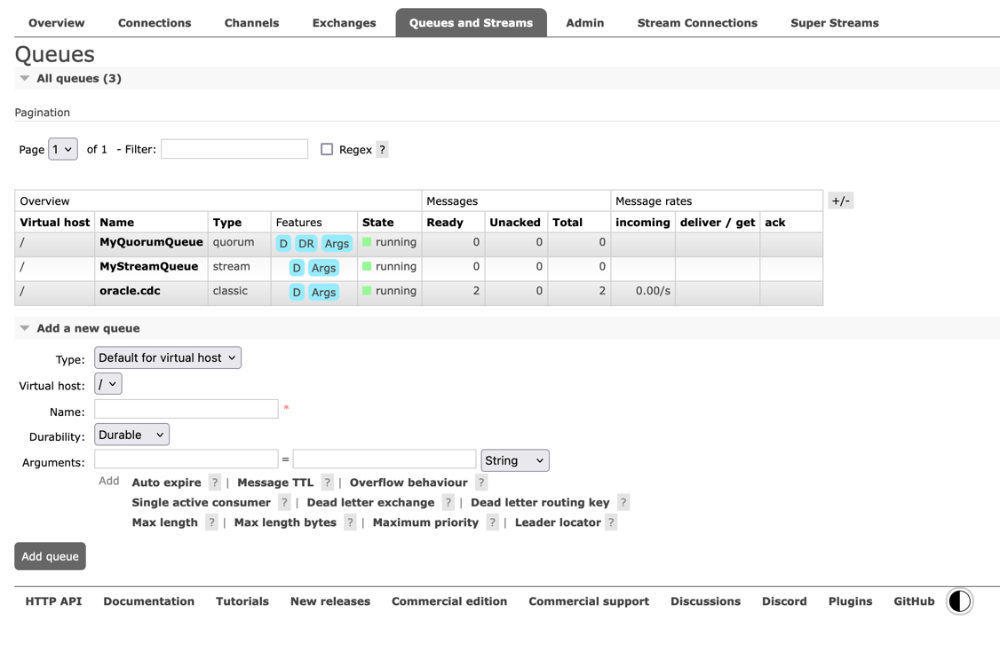

This time, I'll try out how to replicate change data (CDC: Change Data Capture) from an Oracle Database to RabbitMQ using Oracle GoldenGate.
Personally, I went through RabbitMQ's JMS client, which I hadn't really used before.
<!--more--> 

Here is the repository in question.
[mhoshi-vm/oracle-gg-to-rabbitmq](https://github.com/mhoshi-vm/oracle-gg-to-rabbitmq)

## Introduction

To capture updates from an Oracle database in real time (this is often called CDC), GoldenGate is commonly used. Furthermore, when integrating that data with microservices, the messaging service Kafka is usually the natural choice.
RabbitMQ, which is essentially the same kind of thing as Kafka, should be able to do the same, but RabbitMQ is not listed among the [Oracle GoldenGate targets](https://docs.oracle.com/en/database/goldengate/big-data/26/gadbd/target.html).
Because of that, I think "GoldenGate does not support RabbitMQ" has long been the common understanding.

However, [Oracle GoldenGate supports the JMS protocol](https://docs.oracle.com/en/database/goldengate/big-data/26/gadbd/java-message-service-jms1.html#GUID-66A87483-8428-4B13-B043-F6ABFD74E7D3),
and [RabbitMQ also supports JMS](https://www.rabbitmq.com/client-libraries/jms-client).
That means, if you combine these, you can actually stream that long-dreamed-of Oracle CDC into RabbitMQ!? — so I gave it a try.


The integration uses Oracle GoldenGate (OGG) Big Data Adapters together with RabbitMQ's JMS client.
Here, I'll walk through the architecture and configuration needed to make that integration work.

## Architecture

As I wrote at the beginning, the integration uses JMS, which both Oracle and RabbitMQ support.
The approach is as follows.


1. OGG's Extract process captures the transaction logs (Redo logs) inside the Oracle Database
2. OGG's Replicat process (Big Data Adapter) reads the change data (Trail files)
3. The OGG Big Data Adapter publishes to a RabbitMQ Exchange / Queue in a format such as JSON via JMS (Java Message Service)

```
┌─────────────────────────┐     redo      ┌──────────────────────┐
│   Oracle DB Free 23ai   │─────logs─────▶│  GoldenGate Capture  │
│   (CDB / FREEPDB1 PDB)  │   (LogMiner)  │  goldengate-oracle   │
└─────────────────────────┘               └──────────┬───────────┘
                                                     │ trail files
                                              shared Docker volume
                                                     │
                                          ┌──────────▼───────────┐
                                          │  GoldenGate DAA      │
                                          │  goldengate-daa      │
                                          │  (JMS handler)       │
                                          └──────────┬───────────┘
                                                     │ JMS
                                          ┌──────────▼────────────────────┐
                                          │  RabbitMQ 4.3                 │
                                          │  jms.durable.queues exchange  │
                                          │  oracle.cdc                   │
                                          └───────────────────────────────┘
```

## Repository Contents and Prerequisites

The repository I created this time, [mhoshi-vm/oracle-gg-to-rabbitmq](https://github.com/mhoshi-vm/oracle-gg-to-rabbitmq), contains a set of Docker Compose files for quickly spinning up a test environment, along with sample OGG property files (`.prm` / `.properties`).
The basic setup is also described in the README.md.

### Required Environment

*   Docker and Docker Compose
*   A **commercial license** for Oracle GoldenGate for Big Data (this cannot be done with the free license)

### Result

As noted in the repository, once the setup is done, the SQL you run on Oracle propagates to RabbitMQ.

In this setup, messages accumulate along the path `jms.durable.queues` > `oracle.cdc`.



I've also posted further test results there, including a run of 100,000 SQL statements below.

[https://github.com/mhoshi-vm/oracle-gg-to-rabbitmq/blob/main/TESTING_RESULT.md](https://github.com/mhoshi-vm/oracle-gg-to-rabbitmq/blob/main/TESTING_RESULT.md)

I was able to confirm that operations such as INSERT, UPDATE, and DELETE are picked up, and that their ordering is preserved as well.

## Conclusion

I'm relieved to have proven that Oracle GG and RabbitMQ can be integrated.
