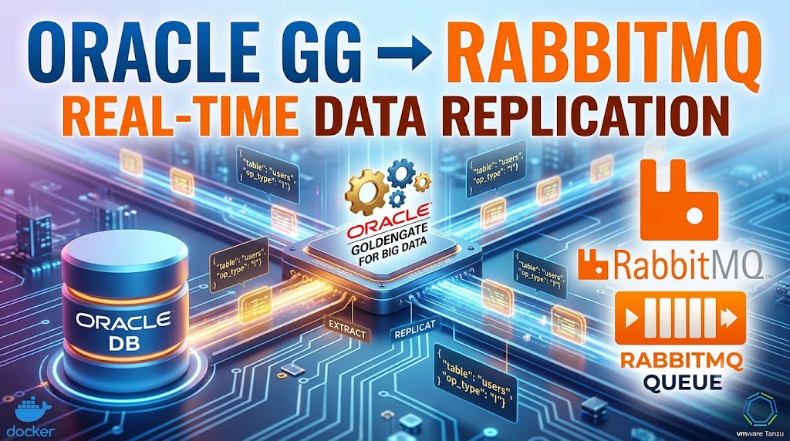

今回は、Oracle GoldenGate を利用して Oracle Database の変更データ（CDC: Change Data Capture）を RabbitMQ へ連携（レプリケーション）する方法を試していきます。
個人的にはあまり使ったことがない、RabbitMQのJMSクライアントを経由しています。

対象のレポジトリはこちらです。
[mhoshi-vm/oracle-gg-to-rabbitmq](https://github.com/mhoshi-vm/oracle-gg-to-rabbitmq)

## はじめに

Oracleのデータベースをリアルタイムに更新を取得（これをCDCと呼んだりします）するには、GoldenGateを使うことが多いです。
そのデータをマクロサービスと連携する場合、メッセージングサービスKafka が選ばれることが普通です。
Kafkaと本質的に一緒なRabbitMQでも同様にできるはずなのですが、[Oracle GoldenGateのターゲット](https://docs.oracle.com/en/database/goldengate/big-data/26/gadbd/target.html)にRabbitMQが記載されていないです。
ところが、[Oracle GoldenGateはJMSプロトコルをサポート](https://docs.oracle.com/en/database/goldengate/big-data/26/gadbd/java-message-service-jms1.html#GUID-66A87483-8428-4B13-B043-F6ABFD74E7D3)しており、
[RabbitMQもJMSをサポート](https://www.rabbitmq.com/client-libraries/jms-client)しています。
ということは実はこれを組み合わせれば、夢にまで見たOracleのCDCをRabbitMQに流すことができる！？を試してみました。


Oracle GoldenGate (OGG) の Big Data Adapters と RabbitMQ のJMSクライアントを使って連携をします。
ここでは、その連携を行うための構成や設定方法を解説していきます。

## アーキテクチャ

冒頭にも書きましたが、OracleとRabbitMQが双方でサポートするJMSを使って連携します。


1. Oracle Database 内のトランザクションログ (Redoログ) を OGG の Extract プロセスがキャプチャ
2. 変更データ（Trailファイル）を OGG の Replicat プロセス (Big Data Adapter) が読み取る
3. OGG Big Data Adapter が JMS (Java Message Service) または RabbitMQ Java Client を介して RabbitMQ の Exchange / Queue に JSON 形式等で Publish する

## レポジトリの内容と前提条件

今回作成したレポジトリ [mhoshi-vm/oracle-gg-to-rabbitmq](https://github.com/mhoshi-vm/oracle-gg-to-rabbitmq) には、検証環境をサクッと立ち上げるための Docker Compose ファイル群と、OGG 側のプロパティファイル（`.prm` / `.properties`）のサンプルを格納しています。

### 必要な環境

*   Docker および Docker Compose
*   Oracle GoldenGate for Big Data のバイナリ (事前に Oracle のサイトからダウンロードして、所定のディレクトリに配置する必要があります)
*   RabbitMQ の環境 (今回は `docker-compose.yml` に含めています)

## 設定のポイント

連携にあたり、最も重要になるのが **Replicat の設定ファイル (`.prm`)** と、**Java Adapter のプロパティファイル (`.properties`)** です。

### 1. Replicat の設定 (replicat.prm)

Replicat プロセスがどのデータをキャプチャし、どのようにマッピングするかを定義します。

```text
REPLICAT rmqrep
TARGETDB LIBMAX DEFAULT MACRO ArraySize 1000
-- 必要に応じてマッピングルールやフィルタリングを設定
MAP ORCL.MY_SCHEMA.*, TARGET *.*;
```

### 2. RabbitMQ 向けプロパティ設定 (rmq.props)

GoldenGate Big Data Adapter 向けに、RabbitMQ と通信するためのプロパティを設定します。RabbitMQ は公式に JMS クライアント機能を提供しているため、これを利用して JNDI 経由で接続するのが定石です。

```properties
# ハンドラとしてJMSを指定
gg.handlerlist=rabbitmq
gg.handler.rabbitmq.type=jms
gg.handler.rabbitmq.format=json

# RabbitMQのキューおよびコネクションファクトリ指定
gg.handler.rabbitmq.DestinationName=dynamicQueues/MyGGQueue
gg.handler.rabbitmq.ConnectionFactoryName=ConnectionFactory

# JNDIの設定
java.naming.factory.initial=com.sun.jndi.fscontext.RefFSContextFactory
java.naming.provider.url=file:/path/to/jndi/bindings
```

> **注意点:** RabbitMQ JMS クライアントライブラリ (`rabbitmq-jms-*.jar`) と、それに依存するライブラリを OGG のクラスパス (`gg.classpath`) に含める必要があります。ライブラリの配置先や具体的な依存関係については、レポジトリの README にも記載しています。

## 動かしてみる

設定が完了してプロセスが正常に起動したら、実際に Oracle Database 側でデータを `INSERT` または `UPDATE` してみましょう。

```sql
INSERT INTO MY_SCHEMA.USERS (id, name) VALUES (1, 'Tanzu Taro');
COMMIT;
```

RabbitMQ の Management UI (`http://localhost:15672/`) から `MyGGQueue` キューの中身を覗いてみると、GoldenGate によってキャプチャされた変更データが JSON フォーマットでリアルタイムに到着していることが確認できるはずです。

```json
{
  "table": "ORCL.MY_SCHEMA.USERS",
  "op_type": "I",
  "op_ts": "2026-07-13 10:00:00.000",
  "after": {
    "ID": 1,
    "NAME": "Tanzu Taro"
  }
}
```

## おわりに

少しマニアックな内容だったかもしれませんが、Oracle Database と RabbitMQ のリアルタイム連携を構築することができました。
RabbitMQ にメッセージさえ届けば、あとは Tanzu Application Platform などを利用してデプロイした Spring Boot アプリケーションから `@RabbitListener` を使って、簡単にイベント駆動型の処理を実装できますね。

設定の詳細や全体のコードは [mhoshi-vm/oracle-gg-to-rabbitmq](https://github.com/mhoshi-vm/oracle-gg-to-rabbitmq) で公開していますので、ぜひ参考にしてみてください！