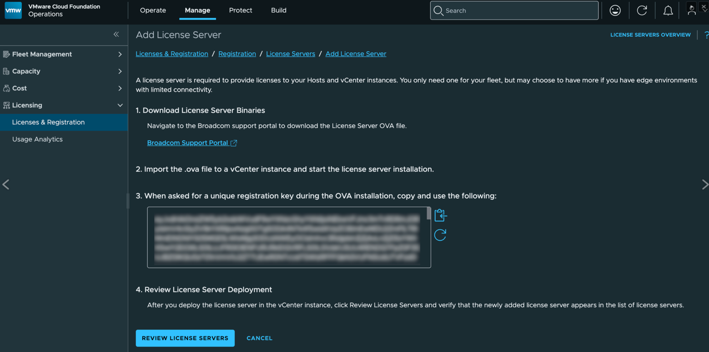

VVF の検証環境を作るときのメモです。私の環境の都合で、なるべく CLI だけで完了させる前提で作っています。
License Server でライセンスが取れるところまでやります。
<!--more--> 

## 前提

- ESXi 8 系（無料版）のインストールが完了している
- DHCP サーバーが稼働している
- VVF のライセンスを持っている
- 以下のソフトウェアを Broadcom ポータルからダウンロードしている
  - ESXi 9.1 Depot (ファイル例：VMware-ESXi-9.1.0.0200.25557999-depot.zip)
  - vCenter 9.1 (ファイル例：VMware-VCSA-all-9.1.0.0300.25629530.iso)
  - VCF Ops 9.1 (ファイル例：Operations-Appliance-9.1.0.0400.25541561.ova)
  - VCF License Server 9.1 (ファイル例：Vcf-License-Server-9.1.0.0400.25541557.ova)

## ESXi のアップグレード

ESXi 9.1 Depot ファイルを ESXi にアップロードして、以下を実行する。

```bash
export ESXI_DEPOT=<DEPOT FILE PATH>
```

プロファイルの一覧を取得する。

```bash
esxcli software sources profile list -d ${ESXI_DEPOT}
```

アップグレードを適用する。

```bash
esxcli software profile update -p <上記で確認したプロファイル> -d ${ESXI_DEPOT}
```

サポート対象外の HW などの警告が出たら、自己責任のもと `--no-hardware-warning` を追加して実行する。
適用後はリブートする。

## vCenter のインストール

vCenter の ISO ファイルを、ESXi にアクセスできる Linux マシンに転送する。

```bash
export VCENTER_ISO=<VCENTER ISO PATH>
```

その上でマウントする。

```bash
mount ${VCENTER_ISO} /mnt
```

`embedded_vCSA_on_ESXi.json` を取り出す。

```bash
cp /mnt/vcsa-cli-installer/templates/install/embedded_vCSA_on_ESXi.json ~/
```

`embedded_vCSA_on_ESXi.json` を編集する。
（編集方法はファイルを見ながら自己判断）

```bash
vi ~/embedded_vCSA_on_ESXi.json
```

vCenter をインストールする。

```bash
/mnt/vcsa-cli-installer/lin64/vcsa-deploy install ~/embedded_vCSA_on_ESXi.json --accept-eula --acknowledge-ceip --no-ssl-certificate-verification
```

vCenter のインストール後に ESXi を接続してセットアップを行う。

## VCF Ops をインストールする

vCenter / ESXi のライセンス登録のために、VCF Ops をインストールする。
VCF Ops の OVA イメージを、vCenter にアクセスできる Linux マシンに転送する。

```bash
export VCFOPS_OVA=<VCF OPS PATH>
```

必要な環境変数をセットアップする。

```bash
export NET_NAME=<Port Group>
export DS_NAME=<Datastore name>
export ROOT_PASSWORD=<Root Password>
export VCENTER=<vCenter IP>
export DC_NAME=<vCenter DataCenter Name>
export VC_NAME=<vCenter Cluster Name>
```

OVA のパラメーターを確認する。

```bash
./ovftool --acceptAllEulas ${VCFOPS_OVA}
```

OVA をデプロイする。
（以下は DHCP を前提としているが、静的 IP アドレスにしたい場合は、前手順で確認したパラメーターに必要な値を入れる）

```bash
./ovftool --acceptAllEulas -n=vcfops \
  --network=${NET_NAME} \
  -ds=${DS_NAME} \
  --powerOn \
  -dm=thin \
  --prop:root_password=${ROOT_PASSWORD} \
  --deploymentOption=xsmall \
  ${VCFOPS_OVA} \
  vi://${VCENTER}/${DC_NAME}/host/${VC_NAME}
```

VCF Ops をインストールして vCenter を登録した後、以下の手順を実施して、ボカシ部分の値をコピーする。

```bash
Manage > Licensing > Licenses & Registration > Manage > License Servers 
```


## VCF License Server をインストールする

VVF 9.1 から必須になった License Server をインストールする。
VCF License Server の OVA イメージを、vCenter にアクセスできる Linux マシンに転送する。

```bash
export VCFLIC_OVA=<VCF LIC PATH>
```

前手順でコピーした VCF Ops の REGISTRATION CODE をペーストする。

```bash
export VCF_OPERATIONS_LICENSE_SERVER_REGISTRATION_CODE=<VCF REG CODE>
```

必要な環境変数をセットアップする。

```bash
export NET_NAME=<Port Group>
export DS_NAME=<Datastore name>
export VCENTER=<vCenter IP>
export DC_NAME=<vCenter DataCenter Name>
export VC_NAME=<vCenter Cluster Name>
```

OVA のパラメーターを確認する。

```bash
./ovftool --acceptAllEulas --noSSLVerify --skipManifestCheck \
  --X:injectOvfEnv --allowExtraConfig --X:waitForIp --sourceType=OVA \
  ${VCFLIC_OVA}
```

OVA をデプロイする。
（以下は DHCP を前提としているが、静的 IP アドレスにしたい場合は、前手順で確認したパラメーターに必要な値を入れる）

```bash
./ovftool --acceptAllEulas --noSSLVerify --skipManifestCheck \
  --X:injectOvfEnv --allowExtraConfig --X:waitForIp --sourceType=OVA \
  --powerOn \
  "--net:Network 1=${NET_NAME}" \
  --datastore=${DS_NAME} \
  --diskMode=thin \
  --name=vcflc \
  --prop:otk=${VCF_OPERATIONS_LICENSE_SERVER_REGISTRATION_CODE} \
  ${VCFLIC_OVA} \
  vi://${VCENTER}/${DC_NAME}/host/${VC_NAME}
```

これで、VVF に必要な環境のインストールが完了。
その後、ライセンスを VCF Ops から登録する。

## まとめ

VVF 9.1 の環境を CLI 経由で作れました。