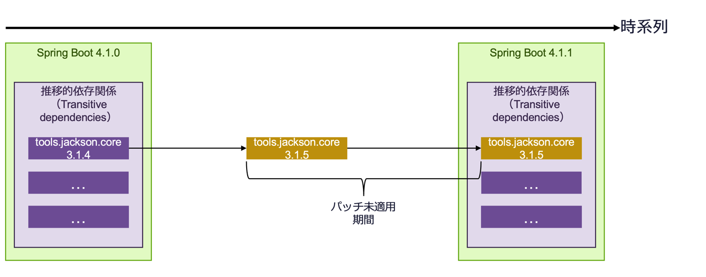
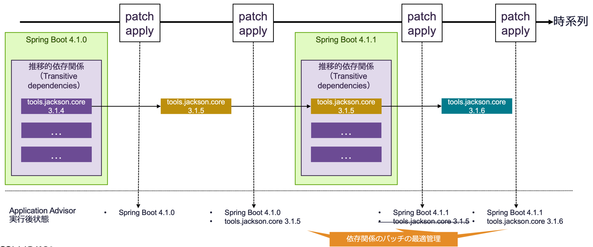
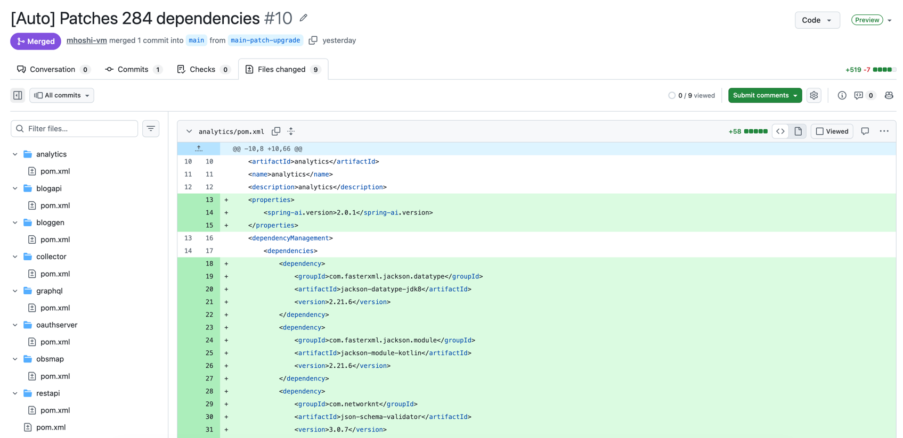
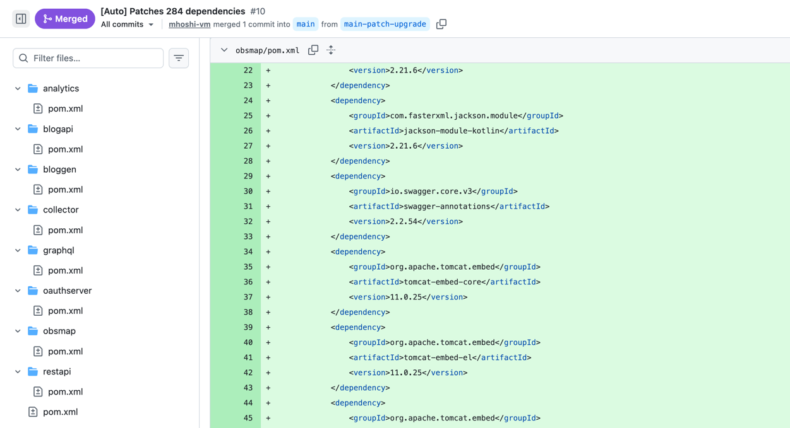

Spring Enterprise に付いてくる Application Advisor を、マニュアルを補足する形で紹介します。
このエントリでは、`patch apply` の機能に絞って紹介します。
<!--more-->

## はじめに

Spring Enterprise（商用版）を購入したお客様には、Application Advisor と呼ばれる製品がついてきます。
Application Advisor のマニュアルは[こちら(v1.6)](https://techdocs.broadcom.com/us/en/vmware-tanzu/spring/application-advisor/1-6.html)です。

Application Advisor は、大きく二つのパッチ機能を提供します。

- `advisor patch apply`:
ホットフィックスおよびパッチバージョンの適用に使用
- `advisor upgrade-plan apply`:
マイナーバージョンおよびメジャーバージョンのアップグレードに使用

`patch apply` は、セキュリティ脆弱性への対応をすばやく行いたいお客様向けの機能です。
主に以下を提供します。

- Spring の長期サポート期間にも対応
- GitHub への自動 Pull Request 生成
- Spring の推移的依存関係（Transitive dependencies）のパッチ管理


## 「Spring の推移的依存関係（Transitive dependencies）」とは

`patch apply` の解説を見ると、よく「推移的依存関係（Transitive dependencies）」という言葉が出てきます。

Spring Framework / Spring Boot 自体が、多くの管理外の Java ライブラリに依存しています。
Spring Boot の外部の依存関係は以下にリストアップされています。
たとえば、JSON へのシリアライズ・デシリアライズには、Jackson / tools.jackson.core と呼ばれるライブラリが使われています。


https://docs.spring.io/spring-boot/appendix/dependency-versions/coordinates.html

これらは、`pom.xml` や `build.gradle` に明示的に指定しなくても使えます。
これが「推移的依存関係（Transitive dependencies）」にあたります。

さて、Spring Framework / Spring Boot は、現在 1.5〜2 ヶ月周期でパッチがリリースされます。
ところが、これら Spring 管理外の依存関係は、この周期とは別のタイミングでリリースされる可能性があります。
外部依存関係のリリースに脆弱性の修正が含まれていた場合、Spring 側がそれを取り込むまでの期間、意図しない形で脆弱性に晒されることになります。

図示すると、以下のようなイメージです。あくまで一例ですが、事実 tools.jackson.core の 3.1.5 が 2026 年 7 月にリリースされた一方、それを取り込んだ Spring Boot 4.1.1 のリリースは 2026 年 8 月でした。


昨今の LLM を使った脆弱性攻撃を踏まえると、この 1 ヶ月の差は無視できなくなりつつあります。
`patch apply` はこれに対して、実行したタイミングごとに推移的依存関係のパッチも洗い出し、必要に応じて依存関係を追記してくれます。さらに、後のリリースでそれらが取り込まれて不要になったら、削除もしてくれます。
図示すると、以下のようなイメージです。




Application Advisor は、コードの依存関係を洗い出し、Maven のリポジトリに問い合わせながら、上記の状態を自動的に作ってくれます。
なお、ここでは Spring を中心に書いていますが、基本的にはアプリケーションの依存関係を総なめするので、Spring 以外のライブラリにも対応できます。

執筆時点では、`patch apply` は Java の各依存関係の [Semantic Versioning](https://semver.org/) に基づいて、適用するパッチバージョンを決めています。
tools.jackson.core を例にすると、2026 年時点で 3.2.x がリリースされていますが、Spring Boot 4.1 が同梱する 3.1.x から見るとマイナーバージョンアップになってしまうので、適用しません。
つまり 3.1.4 → 3.1.5 は適用しますが、3.1.4 → 3.2.2 は適用しません。
Java の依存関係のメジャー・マイナーバージョンのアップグレードには、`patch apply` ではなく `upgrade-plan apply` を使うことになります。

## Application Advisor を実行するまで

Application Advisor の `patch apply` は、二つのステップで実行できます。

### 1. CLI のダウンロード

マニュアルの以下の手順に従います（リンクは 1.6 のものです）。

https://techdocs.broadcom.com/us/en/vmware-tanzu/spring/application-advisor/1-6/app-advisor/run-app-advisor-cli.html#download-the-native-application-advisor-cli

なお、マニュアルでは curl を使う方法が紹介されていますが、Spring Enterprise Repository を構成していれば、以下のようなコマンドでもダウンロードできます。
（以下は Mac ARM64 用の 1.6.7 をダウンロードする例です）
このコマンドを実行すると、tar ファイルは `~/.m2/repository/com/vmware/tanzu/spring/application-advisor-cli-macos-arm64/` に配置されます。

```
mvn -U dependency:get -Dartifact=com.vmware.tanzu.spring:application-advisor-cli-macos-arm64:1.6.7:tar -Dtransitive=false
```

### 2. 実行

対象のソースコードのディレクトリ、かつ Maven などでビルドできる場所で以下を実行します。

```
advisor patch apply
```

基本的には、これだけです。実行後は依存関係の細かい解決が走るので、5 分以上かかることは覚悟してください。
（手作業での実行ではなく、CI や Cron からの実行が推奨されます）

出力は以下のようなフォーマットです。

```
   /path/to/your-app/pom.xml
      scope: compile
         tools.jackson.core:jackson-databind:3.1.4 → 3.1.5
         org.apache.commons:commons-lang3:3.17.0 → 3.17.1

🚀 Patch apply complete: 2 dependency(-ies) upgraded in 1 file(s).
```

パッチが一つもない場合は、以下だけが出力されます。

```
✅ All dependencies are up to date. No new patches available.
```

`--push` を追加すると、Git ディレクトリを判別して、PR の作成までやってくれます。
PR 作成まわりのオプションは以下です。

- `GIT_TOKEN_FOR_PRS` 環境変数 : PR 作成権限をもつトークン。`--push` を使うなら必須。
- `--token` : 上記環境変数のかわりにトークンを直接渡す（デフォルトは `$GIT_TOKEN_FOR_PRS`）
- `--scm-host` : **自前でホストしている GitHub Enterprise / GitLab を使っている場合は必須**。`github.com` と `gitlab.com` 以外では、これを指定しないと失敗します（例: `gitlab.mycompany.com`、デフォルトは `$ADVISOR_SCM_HOST`）
- `--branch-prefix` : 作成するブランチのプレフィックス（例: `advisor/`）
- `--current-branch` : PR の作成元ブランチを明示的に指定する

実際にあるソースコードに対して実行した結果は以下です。



## Patch Apply を本番で使うためには？

その他、これを本番で使っていくためのコツを書いていきます。

### 実行方法・場所は？

上にも書いたように、advisor は実行時に Java の依存関係を解決しにいきます。
よって、advisor の実行場所は以下の条件を満たしている必要があります。

- ソースコードをビルドするための Maven Repository にアクセスできる
- Spring Enterprise Repository のトークンもセットアップされている

以下は必須でないものの、`--push` を成功させるために必要なものです。

- ソースコードのGitリポジトリ

これらが満たされた上で、以下がおすすめかと思います。

-  **おすすめ◎：どこかのサーバーで Cron で日次実行**

Spring やその他の依存関係を追跡するという意図であれば、日次の実行で十分かと思います。
基本的には `--push` を付けて実行し、あくまで Pull Request として出して、適用するかどうかは開発者に判断させるやり方が現実的かと思います。

- **おすすめ△：CIでコミットのたびに**

マニュアルはこれを勧めているように読めますが、個人的には懐疑的です。
もちろん、コミットのたびに開発者がその運用をまわせるのであれば理想形ですが、ノイジーな通知として無視されてしまいそうな気がします。
また、結局は依存関係のパッチが出て初めて効果があるものなので、CI のような不定期な周期ではなく、Cron で十分かと思います。

### 実行場所に Java をインストールする必要がある？

必要です。
advisor cli 自体は GraalVM のネイティブバイナリなので Java は不要ですが、依存関係の一覧を取得するために内部でビルドツール（`mvnw` / `mvn` / `gradlew` / `gradle`）を呼び出します。この実行に JDK が必要になります。

関連して、以下のオプションがあります。

- `--build-tool` : 使うビルドツールを指定（デフォルトはラッパーがあれば `mvnw`、なければ `mvn`）
- `--build-tool-options` : ビルドツールに渡す引数
- `--build-tool-jvm-args` : ビルドツールに渡す JVM 引数（デフォルトは `$BUILD_TOOL_JVM_ARGS`）。Cron サーバーでメモリを絞りたいときに使えます。

### エアギャップ環境はいける？

advisor cli はエアギャップ環境に対応しています。ただし、上で書いたように、依存関係を解決するために Maven のリポジトリへのアクセスは必須です。
とはいえ、これは社内ミラー（Artifactory / Nexus など）でかまいません。インターネットへの直接の疎通が必要という意味ではありません。

### Advisor CLI の更新頻度は？

`patch apply` の運用を継続するという目的であれば、advisor cli を更新する必要はありません。
とはいえ、advisor cli のバグが修正されている可能性もあるので、可能な限り最新を試すのがおすすめです。

### どれくらい複雑なコードでいける？

少なくとも、マルチモジュールプロジェクトでも実行できました。
以下は、root の `pom.xml` を各モジュールが参照するような構成のコードで実行した例です。
その際は、root のディレクトリから `advisor cli` を実行します。

以下、実際に試したプロジェクトの例です。


### Spring Framework もいける？

Spring Boot だけでなく、仕様上 Spring Framework でも動きます。

### パッチを当ててもコードに影響はない？

`patch apply` は、仕様上、確かに Spring Boot としては未リリース・未テストの依存関係を先んじて適用していることになります。
これに関しては、「各ライブラリが Semantic Versioning を守っていることを信用する」という前提で開発されているようです。
advisor が適用するのは、特定の依存関係のパッチバージョンのみです（例：tools.jackson.core の 3.1.4 → 3.1.5 は適用するが、3.1.4 → 3.2.2 は適用しない）。
つまり、パッチバージョン間の互換性をライブラリの開発者が守っている前提で適用していきます。

とはいえ、一部の依存関係がそれを守っていない可能性はあるので、その場合は以下のように除外していきます。

### 特定の依存関係は無視できる？

`.advisor.yml` ファイルに、特定の依存関係を無視する設定を書けます。

https://techdocs.broadcom.com/us/en/vmware-tanzu/spring/application-advisor/1-6/app-advisor/patch-spring-app.html#enable-continuous-patches

書式は Dependabot に似ています。

```yaml
version: 1
updates:
  - package-ecosystem: "maven"
    directory: "/"
    ignore:
      # このライブラリは一切パッチしない
      - dependency-name: "com.example:lib-a"
      # 6.x 系だけ除外する
      - dependency-name: "org.springframework:spring-web"
        versions: ["6.x"]
```

いくつか注意点です。

- `enabled: false` を書くと、そのプロジェクトでは `patch apply` 自体がスキップされます。CI や Cron から一律で叩いている場合に、特定のリポジトリだけ止めたいときに使えます。
- 空の `.advisor.yml` はパースエラーになります。「とりあえず空ファイルを置く」ということはしないでください。

## まとめ

Application Advisor の `patch apply` について書きました。
次回は、もう一方の `advisor upgrade-plan apply`（マイナー・メジャーバージョンのアップグレード）について書く予定です。
