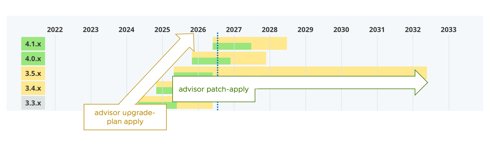
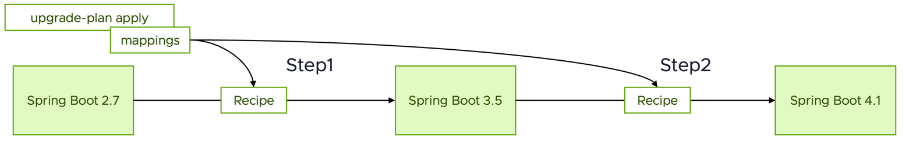
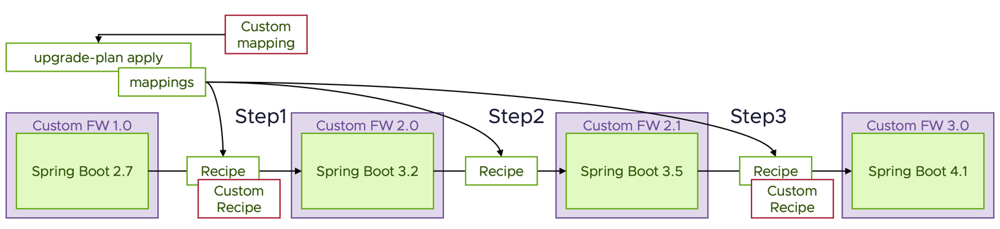

This post introduces Application Advisor, which comes with Spring Enterprise, as a supplement to the official manual.
Following on from `patch apply` in [the previous post](../50), this entry focuses on the `upgrade-plan apply` feature.
<!--more-->

## Introduction

As I wrote last time, Application Advisor provides two major patching features.

- `advisor patch apply`:
used for hotfixes and patch versions only
- `advisor upgrade-plan apply`:
used for minor and major version upgrades

This time it's the latter. The manual is [here (v1.6)](https://techdocs.broadcom.com/us/en/vmware-tanzu/spring/application-advisor/1-6.html).



Where `patch apply` only looks at patch versions such as "3.1.4 → 3.1.5",
`upgrade-plan apply` takes care of upgrades that cross generations, such as "Spring Boot 2.7 → 3.5".

Note that the patches and minor upgrades I refer to here assume [Semantic Versioning](https://semver.org/) for each Java dependency.
In other words, think of it in these terms:

- 3.1.4 → 3.1.5 : applying a patch
- 3.1.4 → 3.2.2 : a minor upgrade
- 3.1.4 → 4.0.3 : a major upgrade

Patching is built on the assumption that user code is unaffected.
That is why `patch apply` updates dependencies without touching user code.
Major and minor upgrades, on the other hand, can affect user code, so they need a different design from `patch apply`.

## What are recipes and mapping coordinates?

The `upgrade-plan apply` command brings in concepts that `patch apply` does not have:
`Recipes` and `Mapping Coordinates`.

They cover the following:

- `Recipe`: code written on top of the OpenRewrite framework to fix incompatible code that comes up across major and minor upgrades
- `Mapping Coordinates`: acts as a correspondence table of versions for each dependency, and is used to work out the number of `step`s

The Application Advisor CLI ships with recipes and mapping coordinates.
The manual describes them in detail here.

- [The recipe index for Application Advisor 1.6](https://techdocs.broadcom.com/us/en/vmware-tanzu/spring/application-advisor/1-6/app-advisor/recipes-index-index-boot-recipes.html)
- [Mapping coordinates for Application Advisor v1.6.7](https://techdocs.broadcom.com/us/en/vmware-tanzu/spring/application-advisor/1-6/app-advisor/coverage-1-6-7.html)

For a simple upgrade, it looks like this.



Application Advisor uses the mapping coordinates to calculate units of execution called Steps.
For each of these units, `upgrade-plan` runs the recipes and completes successfully. In the diagram above, that is two Steps.
(Note: upgrading from 2.7 for real takes considerably more steps than this.)
The manual [walks through this using Spring Petclinic as an example](https://techdocs.broadcom.com/us/en/vmware-tanzu/spring/application-advisor/1-6/app-advisor/how-to-guides-upgrade-boot.html).

Application Advisor lets you customize these recipes and mapping coordinates.
Doing so makes upgrades like the following possible.



The example in this diagram assumes a custom framework that bundles Spring.
Based on the customized mapping coordinates, Advisor learns which Spring Boot version goes with each version of that custom framework.
With that, the steps required to reach the upgrade are recalculated. In this diagram, that adds one Step.
You can also run your own recipes at each of those steps.

Recipes themselves are written on top of [OpenRewrite](https://docs.openrewrite.org/).
A whole range of approaches is supported, from minor fixes that use the recipes included by default, through to writing a recipe of your own in Java.

This makes it possible to upgrade not only plain Spring Boot but custom packages as well.
Also, I have written this on the assumption of Spring Boot so far, but it can also be used with Spring Framework and other Java frameworks.

Right then — from here on I will walk through custom recipes and mapping coordinates.
Be aware, though, that this is inevitably difficult at first. If you are going to do it for real, I recommend going in with some form of support from Broadcom behind you.

# Attempting an automated TERASOLUNA upgrade

To put the approach above into practice, let's see whether we can upgrade [TERASOLUNA](https://www.nttdata.com/jp/ja/lineup/terasoluna/), a Japanese-made framework.

## How TERASOLUNA versions map to Spring Framework

TERASOLUNA and Spring Framework line up as follows (based on my own research).

| TERASOLUNA | spring-framework | spring-data-commons | spring-security |
| --- | --- | --- | --- |
| `5.7.x` | 5.3.39 | 2.7.18 | 5.7.13 |
| `5.8.x` | 6.0.3 | 3.0.0 | 6.0.1 |
| `5.9.x` | 6.1.3 | 3.2.2 | 6.2.1 |
| `5.10.x` | 6.2.15 | 3.5.7 | 6.5.7 |
| `5.11.x` | 7.0.3 | 4.0.2 | 7.0.2 |

As you can see, 5.7 → 5.8 comes with a major change, from the Spring Framework 5 line to the 6 line.
Let's see whether Application Advisor can carry out that upgrade.

## Sample code

I put it here.

https://github.com/mhoshi-vm/simple-terasoluna

## Running upgrade-plan without customization

First, let's run `upgrade-plan` without any customization.

### 1. Downloading the CLI

Same as [last time](../50). Follow the steps in the manual, or if you have the Spring Enterprise Repository configured you can also fetch it with the following.
(This downloads 1.6.7 for Mac ARM64.)

```
mvn -U dependency:get -Dartifact=com.vmware.tanzu.spring:application-advisor-cli-macos-arm64:1.6.7:tar -Dtransitive=false
```

### 2. Checking the plan

Move to the root directory of the source code and
run `upgrade-plan`.

```
advisor upgrade-plan get
```

With 1.6.7, the latest at the time of writing, the output was as follows.

```bash
advisor upgrade-plan get
     
🚀 Existing build-configuration is already up-to-date


🏃 Fetching and processing upgrade plan details [00m 01s] ok

Projects discovered:
        - junit: 6.0.x (no upgrades available)
        - junit-platform: 6.0.x (no upgrades available)

The projects ["spring-framework", "spring-data-commons"] could not be included in the Upgrade Plan because they are used as transitive dependencies for other projects, and no upgrades are configured for them.
Please request your administrator to configure the projects of the following dependencies:

        - org.terasoluna.gfw:terasoluna-gfw-common
                uses:
                        - spring-framework
                        - spring-data-commons
                blocking upgrades for:
                        - spring-data-commons
        - org.terasoluna.gfw:terasoluna-gfw-web
                uses:
                        - spring-framework
                        - spring-data-commons
                blocking upgrades for:
                        - spring-data-commons
        - org.terasoluna.gfw:terasoluna-gfw-jodatime
                uses:
                        - spring-framework
                        - spring-data-commons
                blocking upgrades for:
                        - spring-data-commons

In order to learn more about publishing upgrade mappings, visit https://techdocs.broadcom.com/us/en/vmware-tanzu/spring/tanzu-spring/commercial/spring-tanzu/app-advisor-custom-upgrades.html

No upgrade plans available - your project seems to be up to date.
```

The `could not be included in the Upgrade Plan because they are used as transitive dependencies for other projects, and no upgrades are configured for them.` line in the output,
mapped onto this context, means the following.

- ["spring-framework", "spring-data-commons"] are transitive dependencies of TERASOLUNA (the "for other projects" part)
- The relationship between those transitive dependencies and TERASOLUNA is unknown
- Therefore the upgrade cannot be performed

This output suggests that TERASOLUNA's related libraries cannot be updated.

```
        - org.terasoluna.gfw:terasoluna-gfw-common
                uses:
                        - spring-framework
                        - spring-data-commons
                blocking upgrades for:
                        - spring-data-commons
        - org.terasoluna.gfw:terasoluna-gfw-web
                uses:
                        - spring-framework
                        - spring-data-commons
                blocking upgrades for:
                        - spring-data-commons
        - org.terasoluna.gfw:terasoluna-gfw-jodatime
                uses:
                        - spring-framework
                        - spring-data-commons
                blocking upgrades for:
                        - spring-data-commons
```

In other words, it errored out and nothing could be upgraded.
Since no mapping has been supplied, this is as expected so far.

## Running upgrade-plan with a custom mapping

Create the following custom mapping in a directory of your choice.
The file name is up to you as well; I will use `terasoluna.json`.

```json
{
  "slug": "terasoluna-gfw",
  "coordinates": [
    "org.terasoluna.gfw:terasoluna-gfw-common",
    "org.terasoluna.gfw:terasoluna-gfw-web",
    "org.terasoluna.gfw:terasoluna-gfw-jodatime"
  ],
  "repositoryUrl": "https://github.com/terasolunaorg/terasoluna-gfw",
  "rewrite": {
    "5.7.x": {
      "recipes": [],
      "nextRewrite": {
        "version": "5.8.x"
      },
      "requirements": {
        "supportedGenerations": {
          "spring-data-commons": "2.7.x",
          "spring-framework": "5.3.x",
          "spring-security": "5.7.x"
        },
        "excludedArtifacts": []
      }
    },
    "5.8.x": {
      "recipes": [],
      "nextRewrite": {
      },
      "requirements": {
        "supportedGenerations": {
          "spring-data-commons": "3.0.x",
          "spring-framework": "6.0.x",
          "spring-security": "6.0.x"
        },
        "excludedArtifacts": []
      }
    }
  }
}
```

The key points of its contents are as follows.

- The mappings that the original code could not resolve go in `coordinates`
- The versions of the dependency go in `rewrite`, and the other Spring libraries it depends on go in `requirements`
- The next version goes in `nextRewrite`

Strictly speaking, TERASOLUNA 5.9.x and later should be described here as well, but I have left them out this time.

Then export the following environment variable.

```bash
export SPRING_ADVISOR_MAPPING_CUSTOM_0_FILEPATH=<directory>/terasoluna.json
```

Running Advisor CLI v1.6.7 in this state gives the following.

```bash
advisor upgrade-plan get
     
🚀 Existing build-configuration is already up-to-date


🏃 [ 1 / 2 ] Validating syntax of upgrade mappings [00m 01s] ok
🏃 [ 2 / 2 ] Fetching and processing upgrade plan details [00m 01s] ok

Projects discovered:
        - junit: 6.0.x (no upgrades available)
        - junit-platform: 6.0.x (no upgrades available)
        - terasoluna-gfw: 5.7.x → 5.8.x
        - spring-data-commons: 2.7.x → 4.1.x
        - spring-framework: 5.3.x → 7.0.x

Upgrade Plan for your Dependencies:
        - Step 1:
                * Upgrade terasoluna-gfw from 5.7.x to 5.8.x
                * Upgrade spring-data-commons from 2.7.x to 3.0.x
                * Upgrade spring-framework from 5.3.x to 6.0.x
        - Step 2:
                * Upgrade spring-framework from 6.0.x to 6.1.x
                * Upgrade spring-data-commons from 3.0.x to 3.2.x
        - Step 3:
                * Upgrade spring-framework from 6.1.x to 6.2.x
                * Upgrade spring-data-commons from 3.2.x to 3.5.x

Some upgrades were not included in the upgrade plan.
Please, upgrade and release if needed the following projects:
        * terasoluna-gfw:5.8.x
                Last version of spring-framework is 6.0.x
        * terasoluna-gfw:5.8.x
                Last version of spring-data-commons is 3.0.x
```

Here is the key part.

```diff
Upgrade Plan for your Dependencies:
        - Step 1:
+               * Upgrade terasoluna-gfw from 5.7.x to 5.8.x
                * Upgrade spring-data-commons from 2.7.x to 3.0.x
                * Upgrade spring-framework from 5.3.x to 6.0.x
        - Step 2:
                * Upgrade spring-framework from 6.0.x to 6.1.x
                * Upgrade spring-data-commons from 3.0.x to 3.2.x
        - Step 3:
                * Upgrade spring-framework from 6.1.x to 6.2.x
                * Upgrade spring-data-commons from 3.2.x to 3.5.x
```

As this output shows, the mapping coordinates file has made it possible to define the Steps.
In particular, the line `Upgrade terasoluna-gfw from 5.7.x to 5.8.x` shows that the update of the custom library is defined by the mapping coordinates file too.
The output below appears because the mapping coordinates file does not describe TERASOLUNA 5.9.x and later.

```
Some upgrades were not included in the upgrade plan.
Please, upgrade and release if needed the following projects:
        * terasoluna-gfw:5.8.x
                Last version of spring-framework is 6.0.x
        * terasoluna-gfw:5.8.x
                Last version of spring-data-commons is 3.0.x
```

From here, run `apply` to make the actual changes.

```bash
advisor upgrade-plan apply
```

Running it with Advisor CLI 1.6.7 produced the output below.

```bash
🚀 Existing build-configuration is already up-to-date


🏃 [ 1 / 4 ] Validating syntax of upgrade mappings [00m 01s] ok
🏃 [ 2 / 4 ] Validating the license of rewrite artifacts [00m 13s] ok
🏃 [ 3 / 4 ] Fetching and processing upgrade plan details [00m 01s] ok

Projects to upgrade:
        * terasoluna-gfw from 5.7.x to 5.8.x
        * spring-data-commons from 2.7.x to 3.0.x
        * spring-framework from 5.3.x to 6.0.x

🔨 [ 4 / 4 ] Upgrading sources... [00m 18s] ok

👍 Successfully applied upgrade.


⚠️  Warnings:

* Application Advisor might produce a partial upgrade and will incrementally cover all the required changes to upgrade all the Spring projects. If you have questions or are experimenting issues upgrading your applications, please request our help or support in https://support.broadcom.com
```

Looking at the actual changes with `git diff`, here is what we see.

First, the TERASOLUNA version has been raised.
Along with that, because the Spring Framework 6 line dropped Java 8 support, the Javax > Jakarta namespace change and the version refresh are carried out as well.

```diff
diff --git a/pom.xml b/pom.xml
index c170406..1d7b1e3 100644
--- a/pom.xml
+++ b/pom.xml
@@ -14,7 +14,7 @@
   <properties>
     <maven.compiler.release>17</maven.compiler.release>
     <project.build.sourceEncoding>UTF-8</project.build.sourceEncoding>
-    <terasoluna.version>5.7.4.RELEASE</terasoluna.version>
+    <terasoluna.version>5.8.1.RELEASE</terasoluna.version>
   </properties>
 
   <dependencyManagement>
@@ -60,8 +60,8 @@
     </dependency>
 
     <dependency>
-      <groupId>javax.servlet</groupId>
-      <artifactId>javax.servlet-api</artifactId>
+      <groupId>jakarta.servlet</groupId>
+      <artifactId>jakarta.servlet-api</artifactId>
       <scope>provided</scope>
     </dependency>

```

Furthermore, since Spring Framework 6 no longer matches a trailing "/" in URLs by default, it helps out with that too.
(This one comes from a recipe bundled with the Advisor CLI.)

```diff
diff --git a/src/main/java/com/example/demo/GreetingController.java b/src/main/java/com/example/demo/GreetingController.java
index b7d903f..09f6305 100644
--- a/src/main/java/com/example/demo/GreetingController.java
+++ b/src/main/java/com/example/demo/GreetingController.java
@@ -13,7 +13,7 @@ public class GreetingController {
         this.service = service;
     }
 
-    @GetMapping("/greet")
+    @GetMapping({"/greet", "/greet/"})
     public String greet(@RequestParam(defaultValue = "world") String who) {
         return service.greet(who);
     }
```

There was a time in the past when Spring Framework bean definitions were mainly written in XML rather than with JavaConfig, and that is handled as well.

```diff
diff --git a/src/main/resources/applicationContext.xml b/src/main/resources/applicationContext.xml
index a527888..f799a1e 100644
--- a/src/main/resources/applicationContext.xml
+++ b/src/main/resources/applicationContext.xml
@@ -5,11 +5,11 @@
        xmlns:mvc="http://www.springframework.org/schema/mvc"
        xsi:schemaLocation="
          http://www.springframework.org/schema/beans
-         http://www.springframework.org/schema/beans/spring-beans-4.3.xsd
+         https://www.springframework.org/schema/beans/spring-beans.xsd
          http://www.springframework.org/schema/context
-         http://www.springframework.org/schema/context/spring-context-4.3.xsd
+         https://www.springframework.org/schema/context/spring-context.xsd
          http://www.springframework.org/schema/mvc
-         http://www.springframework.org/schema/mvc/spring-mvc-4.3.xsd">
+         https://www.springframework.org/schema/mvc/spring-mvc.xsd">
 
   <!-- The whole application context. TERASOLUNA blank projects are wired in
        XML, not with @Configuration classes. -->
diff --git a/src/main/webapp/WEB-INF/web.xml b/src/main/webapp/WEB-INF/web.xml
index 21d02bd..82263d6 100644
--- a/src/main/webapp/WEB-INF/web.xml
+++ b/src/main/webapp/WEB-INF/web.xml
@@ -1,9 +1,8 @@
 <?xml version="1.0" encoding="UTF-8"?>
-<web-app xmlns="http://xmlns.jcp.org/xml/ns/javaee"
+<web-app xmlns="https://jakarta.ee/xml/ns/jakartaee"
          xmlns:xsi="http://www.w3.org/2001/XMLSchema-instance"
-         xsi:schemaLocation="http://xmlns.jcp.org/xml/ns/javaee
-                             http://xmlns.jcp.org/xml/ns/javaee/web-app_4_0.xsd"
-         version="4.0">
+         xsi:schemaLocation="https://jakarta.ee/xml/ns/jakartaee https://jakarta.ee/xml/ns/jakartaee/web-app_6_0.xsd"
+         version="6.0">
 
   <servlet>
     <servlet-name>dispatcher</servlet-name>
```


It also creates files called `sql-error-codes.xml` and `src/main/resources/META-INF/spring.factories`.
These are generated to preserve Spring Framework 5 behavior. That is not the point of this article, so do try it yourself.

## Running upgrade-plan with a custom recipe

Now let's go further and run it with a custom recipe added.
Here I will implement [2.15. [Step 15] Migrating from Joda Time to JSR-310](https://github.com/terasolunaorg/terasoluna-gfw/wiki/Migration-Guide-5.8.1_ja#step-15-joda-time-%E3%81%8B%E3%82%89-jsr-310-%E3%81%B8%E3%81%AE%E7%A7%BB%E8%A1%8C) from the TERASOLUNA guide.

First, reset the earlier changes for now.

```bash
git reset --hard HEAD
```

### Registering a recipe in the mapping file

Register the recipes in the mapping file as follows.
```diff
{
  "slug": "terasoluna-gfw",
  "coordinates": [
    "org.terasoluna.gfw:terasoluna-gfw-common",
    "org.terasoluna.gfw:terasoluna-gfw-web"
  ],
  "repositoryUrl": "https://github.com/terasolunaorg/terasoluna-gfw",
  "rewrite": {
    "5.7.x": {
      "recipes": [
+       {
+         "name": "org.openrewrite.java.dependencies.UpgradeDependencyVersion",
+         "params": {
+           "groupId": "org.terasoluna.gfw",
+           "artifactId": "*",
+           "newVersion": "5.8.x"
+         }
+       },
+       {
+         "name": "org.openrewrite.java.ChangeType",
+         "params": {
+           "oldFullyQualifiedTypeName": "org.terasoluna.gfw.common.date.jodatime.JodaTimeDateFactory",
+           "newFullyQualifiedTypeName": "org.terasoluna.gfw.common.date.ClassicDateFactory"
+         }
+       },
+       {
+         "name": "org.openrewrite.xml.ChangeTagAttribute",
+         "params": {
+            "elementName": "bean",
+            "attributeName": "class",
+            "oldValue": "org.terasoluna.gfw.common.date.jodatime.DefaultJodaTimeDateFactory",
+            "newValue": "org.terasoluna.gfw.common.date.DefaultClassicDateFactory"
+          }
+        },
+        {
+          "name": "org.openrewrite.java.dependencies.RemoveDependency",
+          "params": {
+            "groupId": "org.terasoluna.gfw",
+            "artifactId": "terasoluna-gfw-jodatime"
+          }
+        }
      ],
      "nextRewrite": {
        "version": "5.8.x"
      },
      "requirements": {
        "supportedGenerations": {
          "spring-data-commons": "2.7.x",
          "spring-framework": "5.3.x",
          "spring-security": "5.7.x"
        },
        "excludedArtifacts": []
      }
    },
    "5.8.x": {
      "recipes": [],
      "nextRewrite": {
      },
      "requirements": {
        "supportedGenerations": {
          "spring-data-commons": "3.0.x",
          "spring-framework": "6.0.x",
          "spring-security": "6.0.x"
        },
        "excludedArtifacts": []
      }
    }
  }
}
```

Building on the previous mapping coordinates file, I have added `recipes` to `5.7.x`.
Here, as described in the TERASOLUNA migration guide, the dependency swap is expressed through recipes.

Run it again.

```
export SPRING_ADVISOR_MAPPING_CUSTOM_0_FILEPATH=.advisor/mappings/terasoluna.json
advisor upgrade-plan apply  
```

I will skip the console output and look at `git diff` instead.
On top of the earlier result, the following has been applied, which shows that the recipe ran.

```diff
-    <!-- Joda-Time support. TERASOLUNA drops this at 5.8: the migration guide's
-         [Step 15] replaces it with the JSR-310 ClockFactory. -->
     <dependency>
-      <groupId>org.terasoluna.gfw</groupId>
-      <artifactId>terasoluna-gfw-jodatime</artifactId>
-      <version>${terasoluna.version}</version>
-    </dependency>
```

The code has been rewritten as well.

```diff
diff --git a/src/main/java/com/example/demo/GreetingService.java b/src/main/java/com/example/demo/GreetingService.java
index b9c704e..0cc8b2d 100644
--- a/src/main/java/com/example/demo/GreetingService.java
+++ b/src/main/java/com/example/demo/GreetingService.java
@@ -2,7 +2,7 @@ package com.example.demo;
 
 import java.util.Date;
 import org.springframework.stereotype.Service;
-import org.terasoluna.gfw.common.date.jodatime.JodaTimeDateFactory;
+import org.terasoluna.gfw.common.date.ClassicDateFactory;
 
 /**
  * TERASOLUNA's guideline marks service classes with Spring's @Service
@@ -14,9 +14,9 @@ import org.terasoluna.gfw.common.date.jodatime.JodaTimeDateFactory;
 @Service
 public class GreetingService {
 
 @Service
 public class GreetingService {
 
-    private final JodaTimeDateFactory dateFactory;
+    private final ClassicDateFactory dateFactory;
 
-    public GreetingService(JodaTimeDateFactory dateFactory) {
+    public GreetingService(ClassicDateFactory dateFactory) {
         this.dateFactory = dateFactory;
     }
```

With that, the upgrade we needed has been automated.
There are some simple tests in the project as well, and running `./mvnw test` completes without problems.
**(Note: the Joda Time migration done here is a fairly simple one. In practice you would follow the guide and draw up a more thorough plan.)**
And so we managed to upgrade TERASOLUNA, which the Advisor CLI knows nothing about.

All of the changes made up to this point can be seen here.

https://github.com/mhoshi-vm/simple-terasoluna/pull/1/changes

## What does it take to use upgrade-plan in production?

Here are some other tips for taking this into production.

### Managing recipes and mapping coordinates is a hassle...

Broadcom strives, as much as possible, to make recipes and mapping coordinates work by default so that users do not have to write them.
So my first recommendation is to raise a support ticket with Broadcom.
As long as the request is reasonable, bundling the recipes and mappings into a later release is possible.

The custom recipes and mappings shown here are really only for private dependencies that the world does not know about, or as a temporary workaround.

### Writing mapping coordinates is a hassle...

You can generate the mapping coordinates file automatically with the following command.

```
advisor mapping create -c='org.terasoluna.gfw:terasoluna-gfw-common' < /dev/null
```

What you pass to `-c` is a Maven coordinate (`groupId:artifactId`).

Note that this command resolves the Maven repository from where you run it and generates the coordinates file.
Here are a few things worth knowing before you run it.

- It tries to build coordinates for every version, so a single project can take close to 10 minutes
- The recipes between versions are provided empty
- **It waits on standard input**, so in a non-interactive setting (CI or a background run) it hangs silently unless you add `< /dev/null`. There is no output either, so you cannot tell whether it has hung or is simply taking a while
- Pass a single coordinate and it picks up the sibling artifacts of that project together. One run per project is enough, rather than one run per unattributed artifact

When you want to find out up front which projects are not covered, `advisor mapping search --prefix <prefix>` is quicker.

### Writing recipes is a hassle...

These days I would recommend having AI/LLMs write the recipes.
There is plenty of OpenRewrite knowledge on the internet, so you can get reasonable accuracy.

### Does it work in an air-gapped environment?

The Advisor CLI supports air-gapped environments.

### How often is the Advisor CLI updated?

`upgrade-plan` is always shipped as a set with the latest recipes.
Put another way, if you do not upgrade, the recipes for the newest patches are not included (for example, 1.6.5 does not include the recipe for moving to Spring Boot 4.1), which means you cannot upgrade from certain versions.
So when operating `upgrade-plan`, updating frequently is recommended.
Bugs in the Advisor CLI itself may also have been fixed, so it is best to try the latest version whenever you can.

## Want to learn more ?

The following link introduces application advisor from a different perspective.
Registration required but free.

[Tanzu Academy : Spring Application Advisor Introduction](https://spring.academy/guides/app-advisor-intro)

## Wrap-up

I wrote about Application Advisor's `upgrade-plan`.
