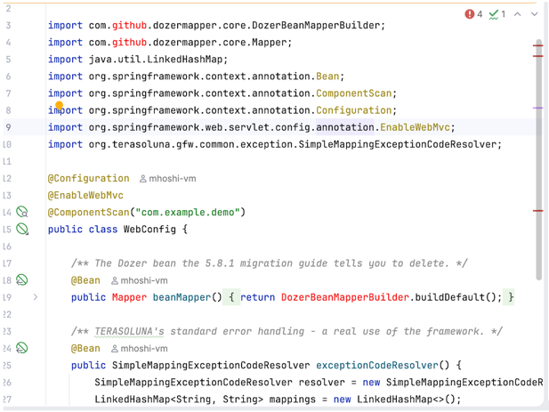

Spring Enterprise についてくる Application Advisor のマニュアルを補足する形で紹介します。
[前回](../50)の `patch apply` に続いて、このエントリでは `upgrade-plan apply` の機能に絞って紹介します。
<!--more-->

## はじめに

前回も書いたとおり、Application Advisor は大きく二つのパッチ機能を提供します。

- `advisor patch apply`:
ホットフィックスおよびパッチバージョン専用に使用
- `advisor upgrade-plan apply`:
マイナーバージョンおよびメジャーバージョンのアップグレードに使用

今回は後者です。マニュアルは[こちら(v1.6)](https://techdocs.broadcom.com/us/en/vmware-tanzu/spring/application-advisor/1-6.html)です。


`patch apply` が「3.1.4 → 3.1.5」のようなパッチバージョンだけを見るのに対して、
`upgrade-plan apply` は「Spring Boot 2.7 → 3.5」のような世代をまたぐアップグレードを担当します。

なお、ここでいう、パッチやマイナーアップグレードは、Java の各依存関係の [Semantic Versioning](https://semver.org/)を想定しています。
つまり、以下のように例で考えます。

- 3.1.4 > 3.1.5 : パッチ適用
- 3.1.4 > 3.2.2 : マイナーアップグレード
- 3.1.4 > 4.0.3 : メジャーアップグレード

パッチ適用の作りの前提としては、ユーザーコードには影響がないもの、想定しています。
そのため、`patch apply` は特にユーザーコードは弄らず、依存関係の更新を行うものでした。
ところが、メジャー・マイナーアップグレードはユーザーコードへの影響がありうるため、`patch apply`とは違う作りが必要になってきます。

## レシピとマッピング座標とは？

`upgrade-plan apply` コマンドには、`patch apply` にはない概念が登場します。
それが、`レシピ(Recipe)`と`マッピング座標(Mappign Coordinates)`です。

以下の概念を持ちます。

- `レシピ(Recipe)`：メジャー・マイナーアップグレード間で発生する非互換なコードを修正するため、OpenRewriteフレームワークをベースに書かれたコード
- `マッピング座標(Mappign Coordinates)` : 各依存関係のバージョンの対応表の役割をしており、`step` の回数を求めるのに使われます。

Application Advisor はCLIの中に、レシピとマッピング座標が同梱されております。
マニュアルのいかにその詳細が記載されています。

- [Application Advisor 1.6 のレシピ一覧](https://techdocs.broadcom.com/us/en/vmware-tanzu/spring/application-advisor/1-6/app-advisor/recipes-index-index-boot-recipes.html)
- [Application Advisor v1.6.7 のマッピング座標](https://techdocs.broadcom.com/us/en/vmware-tanzu/spring/application-advisor/1-6/app-advisor/coverage-1-6-7.html)

シンプルなアップグレードのケースでは、以下のようになります。


Application Advisor はマッピング座標を使い、Stepと呼ばれる実行の単位を算出します。
この実行の単位のたびに `upgrade-plan` はレシピを実行して正常終了します。上の絵の例では、2 Stepの実行です。
マニュアルでは、[Spring Petclinicを例にこれが取り上げられています](https://techdocs.broadcom.com/us/en/vmware-tanzu/spring/application-advisor/1-6/app-advisor/how-to-guides-upgrade-boot.html)。

Application Advisor は、このレシピとマッピング座標をカスタマイズすることが可能です。
これをすることに以下のようなアップグレードもサポートが可能です。


この絵の例では、あるSpringを同梱したカスタムフレームワークを想定しています。
カスタマイズしたマッピング座標をもとに、そのカスタムフレームワークのバージョンごとのSpring Bootの対応を知ります。
これをすることで、アップグレードまでの必要なステップが再計算されます。この絵で言えば、1 Step増えます。
また、そのステップごとに独自のRecipeを実行することもできます。

これをすることで、標準のSpringBootだけでなく、カスタムのパッケージのアップグレードを行うことが可能です。

なお、ここまで Spring Boot という前提で書いていますが、Spring Framework や他のJavaフレームワークでも利用することができます。

# TERASOLUNA の自動アップグレードに挑戦

今回は前の手順でのアップグレードを実践するために、日本国産フレームワークの [TERASOLUNA](https://www.nttdata.com/jp/ja/lineup/terasoluna/) をアップグレードできるかやってみます。

## TERASOLUNA とバージョンと Spring Framework の対応関係

TERASOLUNA と Spring Framework は以下の対応関係（私調べ）を持っています。

| TERASOLUNA | spring-framework | spring-data-commons | spring-security |
| --- | --- | --- | --- |
| `5.7.x` | 5.3.39 | 2.7.18 | 5.7.13 |
| `5.8.x` | 6.0.3 | 3.0.0 | 6.0.1 |
| `5.9.x` | 6.1.3 | 3.2.2 | 6.2.1 |
| `5.10.x` | 6.2.15 | 3.5.7 | 6.5.7 |
| `5.11.x` | 7.0.3 | 4.0.2 | 7.0.2 |

見ての通り、5.7 > 5.8 が Spring Framework 5系から6系へと大きな変更が伴っています。
これを Application Advisor でアップグレード可能かやってみます。

## サンプルコード

ここに配置しました。

## カスタマイズなしで upgrade-plan 実行

まず、カスタマイズなしでupgrade-planを実行します。

### 1. CLI のダウンロード

[前回](../50)と同じです。マニュアルの手順、または Spring Enterprise Repository を構成していれば以下でも取れます。
(以下は Mac ARM64用の 1.6.7 をダウンロードする )

```
mvn -U dependency:get -Dartifact=com.vmware.tanzu.spring:application-advisor-cli-macos-arm64:1.6.7:tar -Dtransitive=false
```

### 2. プランの確認

`upgrade-plan` を実行しています。

```
advisor upgrade-plan get
```

執筆時点の最新 1.6.7 では以下のような出力になりました。

```bash
Build configuration file does not exist! Generating it...
🏃 [ 1 / 6 ] Resolving build tool version [00m 01s] ok
🏃 [ 2 / 6 ] Resolving dependencies with mvnw [00m 03s] ok
🏃 [ 3 / 6 ] Resolving JDK version [00m 02s] ok
🏃 [ 4 / 6 ] Resolving Git repository [00m 01s] ok
🏃 [ 5 / 6 ] Resolving application modules [00m 01s] ok
🏃 [ 6 / 6 ] Obtaining dependency management artifacts [00m 02s] ok

🚀 The build-configuration has been generated in /Users/mh013301/terasoluna-gfw/target/.advisor/build-config.json

🏃 Fetching and processing upgrade plan details [00m 01s] ok

The projects ["apache-commons-collections", "apache-commons-lang", "spring-framework", "spring-data-commons"] could not be included in the Upgrade Plan because they are used as transitive dependencies for other projects, and no upgrades are configured for them.
Please request your administrator to configure the projects of the following dependencies:

        - commons-beanutils:commons-beanutils
                uses:
                        - apache-commons-collections
        - com.github.dozermapper:dozer-core
                uses:
                        - apache-commons-lang
                        - apache-commons-collections
        - org.terasoluna.gfw:terasoluna-gfw-common
                uses:
                        - spring-framework
                        - spring-data-commons
                blocking upgrades for:
                        - spring-data-commons
        - org.terasoluna.gfw:terasoluna-gfw-web
                uses:
                        - spring-framework
                        - spring-data-commons
                blocking upgrades for:
                        - spring-data-commons

In order to learn more about publishing upgrade mappings, visit https://techdocs.broadcom.com/us/en/vmware-tanzu/spring/tanzu-spring/commercial/spring-tanzu/app-advisor-custom-upgrades.html

No upgrade plans available - your project seems to be up to date.

```

出力の`could not be included in the Upgrade Plan because they are used as transitive dependencies for other projects, and no upgrades are configured for them.`は
このコンテキストにあわせると、以下のような意味となります。

- ["apache-commons-collections", "apache-commons-lang", "spring-framework", "spring-data-commons"] はTERASOLUNA(for other projects 部分)の推移的依存関係(Trasitive Dependency)
- これら推移的依存関係と TERASOLUNAの対応関係がわからない
- よって、アップグレードができない

つまり、エラーになって何もアップグレードできなかったというものです。
特にマッピングは指定していないので、ここまでは想定通りです。

## カスタマイズのマッピングで upgrade-plan 実行

以下のカスタムのマッピングを任意のディレクトリにつくります。
ファイル名も任意ですが、`terasoluna.json`にします。

```json
{
  "slug": "terasoluna-gfw",
  "coordinates": [
    "org.terasoluna.gfw:terasoluna-gfw-common",
    "org.terasoluna.gfw:terasoluna-gfw-web"
  ],
  "repositoryUrl": "https://github.com/terasolunaorg/terasoluna-gfw",
  "rewrite": {
    "5.7.x": {
      "recipes": [],
      "nextRewrite": {
        "version": "5.8.x"
      },
      "requirements": {
        "supportedGenerations": {
          "spring-data-commons": "2.7.x",
          "spring-framework": "5.3.x",
          "spring-security": "5.7.x"
        },
        "excludedArtifacts": []
      }
    },
    "5.8.x": {
      "recipes": [],
      "nextRewrite": {
      },
      "requirements": {
        "supportedGenerations": {
          "spring-data-commons": "3.0.x",
          "spring-framework": "6.0.x",
          "spring-security": "6.0.x"
        },
        "excludedArtifacts": []
      }
    }
  }
}
```

そして以下の環境変数を export します。

```bash
export SPRING_ADVISOR_MAPPING_CUSTOM_0_FILEPATH=<配置ディレクトリ>/terasoluna.json
```

この状態で Advisor CLI の v1.6.7 で実行すると、以下のようにエラーになっています。

```bash
mh013301@PJQ72XCV5C terasoluna-gfw % advisor upgrade-plan get
     
🚀 Existing build-configuration is already up-to-date


🏃 [ 1 / 2 ] Validating syntax of upgrade mappings [00m 01s] ok
🏃 [ 2 / 2 ] Fetching and processing upgrade plan details [00m 01s] ok

Projects discovered:
        - terasoluna-gfw: 5.7.x → 5.8.x
        - spring-data-commons: 2.7.x → 4.1.x
        - spring-framework: 5.3.x → 7.0.x

The projects ["apache-commons-collections", "apache-commons-lang"] could not be included in the Upgrade Plan because they are used as transitive dependencies for other projects, and no upgrades are configured for them.
Please request your administrator to configure the projects of the following dependencies:

        - commons-beanutils:commons-beanutils
                uses:
                        - apache-commons-collections
        - com.github.dozermapper:dozer-core
                uses:
                        - apache-commons-lang
                        - apache-commons-collections

In order to learn more about publishing upgrade mappings, visit https://techdocs.broadcom.com/us/en/vmware-tanzu/spring/tanzu-spring/commercial/spring-tanzu/app-advisor-custom-upgrades.html


Upgrade Plan for your Dependencies:
        - Step 1:
                * Upgrade terasoluna-gfw from 5.7.x to 5.8.x
                * Upgrade spring-data-commons from 2.7.x to 3.5.x
                * Upgrade spring-framework from 5.3.x to 6.2.x

Some upgrades were not included in the upgrade plan.
Please, upgrade and release if needed the following projects:
        * terasoluna-gfw:5.8.x
                Last version of spring-framework is 6.0.x
        * terasoluna-gfw:5.8.x
                Last version of spring-data-commons is 3.0.x
```

相変わらず、エラーはでていますが、以下がポイントです。

```
Upgrade Plan for your Dependencies:
        - Step 1:
                * Upgrade terasoluna-gfw from 5.7.x to 5.8.x
                * Upgrade spring-data-commons from 2.7.x to 3.5.x
                * Upgrade spring-framework from 5.3.x to 6.2.x
```

この状態にもあるように、マッピング座標ファイルにより、最初のStepが定義できております。
この状態で、`apply` を入れ実際の変更をしかけます。

```bash
advisor upgrade-plan get
```

advisor cli 1.6.7 で実行すると以下のような出力になりました。
色々なエラーはでていますが、最終的にバージョンのアップグレードを行っています。

```bash
     
🚀 Existing build-configuration is already up-to-date


🏃 [ 1 / 2 ] Validating syntax of upgrade mappings [00m 01s] ok
🏃 [ 2 / 2 ] Fetching and processing upgrade plan details [00m 01s] ok

Projects discovered:
        - terasoluna-gfw: 5.7.x → 5.8.x
        - spring-data-commons: 2.7.x → 4.1.x
        - spring-framework: 5.3.x → 7.0.x

The projects ["apache-commons-collections", "apache-commons-lang"] could not be included in the Upgrade Plan because they are used as transitive dependencies for other projects, and no upgrades are configured for them.
Please request your administrator to configure the projects of the following dependencies:

        - commons-beanutils:commons-beanutils
                uses:
                        - apache-commons-collections
        - com.github.dozermapper:dozer-core
                uses:
                        - apache-commons-lang
                        - apache-commons-collections

In order to learn more about publishing upgrade mappings, visit https://techdocs.broadcom.com/us/en/vmware-tanzu/spring/tanzu-spring/commercial/spring-tanzu/app-advisor-custom-upgrades.html


Upgrade Plan for your Dependencies:
        - Step 1:
                * Upgrade terasoluna-gfw from 5.7.x to 5.8.x
                * Upgrade spring-data-commons from 2.7.x to 3.5.x
                * Upgrade spring-framework from 5.3.x to 6.2.x

Some upgrades were not included in the upgrade plan.
Please, upgrade and release if needed the following projects:
        * terasoluna-gfw:5.8.x
                Last version of spring-framework is 6.0.x
        * terasoluna-gfw:5.8.x
                Last version of spring-data-commons is 3.0.x
mh013301@PJQ72XCV5C terasoluna-gfw % 
mh013301@PJQ72XCV5C terasoluna-gfw % 
mh013301@PJQ72XCV5C terasoluna-gfw % 
mh013301@PJQ72XCV5C terasoluna-gfw % advisor upgrade-plan apply
     
🚀 Existing build-configuration is already up-to-date


🏃 [ 1 / 4 ] Validating syntax of upgrade mappings [00m 01s] ok
🏃 [ 2 / 4 ] Validating the license of rewrite artifacts [00m 13s] ok
🏃 [ 3 / 4 ] Fetching and processing upgrade plan details [00m 01s] ok

The projects ["apache-commons-collections", "apache-commons-lang"] could not be included in the Upgrade Plan because they are used as transitive dependencies for other projects, and no upgrades are configured for them.
Please request your administrator to configure the projects of the following dependencies:

        - commons-beanutils:commons-beanutils
                uses:
                        - apache-commons-collections
        - com.github.dozermapper:dozer-core
                uses:
                        - apache-commons-lang
                        - apache-commons-collections

In order to learn more about publishing upgrade mappings, visit https://techdocs.broadcom.com/us/en/vmware-tanzu/spring/tanzu-spring/commercial/spring-tanzu/app-advisor-custom-upgrades.html


Projects to upgrade:
        * terasoluna-gfw from 5.7.x to 5.8.x
        * spring-data-commons from 2.7.x to 3.5.x
        * spring-framework from 5.3.x to 6.2.x

🔨 [ 4 / 4 ] Upgrading sources... [00m 14s] ok

👍 Successfully applied upgrade.


⚠️  Warnings:

* Application Advisor might produce a partial upgrade and will incrementally cover all the required changes to upgrade all the Spring projects. If you have questions or are experimenting issues upgrading your applications, please request our help or support in https://support.broadcom.com
```

advisorが行った変更は git に保存されます。
実際の変更を `git diff`でみると以下が見えます。

まず、TERASOLUNAのバージョンをあげています。

```
diff --git a/pom.xml b/pom.xml
index 801bfd3..6fe5e3e 100644
--- a/pom.xml
+++ b/pom.xml
@@ -15,7 +15,7 @@
   <properties>
     <maven.compiler.release>17</maven.compiler.release>
     <project.build.sourceEncoding>UTF-8</project.build.sourceEncoding>
-    <terasoluna.version>5.7.4.RELEASE</terasoluna.version>
+    <terasoluna.version>5.8.1.RELEASE</terasoluna.version>
   </properties>
    
   <dependencies>
```

さらには、Spring Framework 5系が Java8 のサポートを廃止したことにより、Javax > Jakarata ドメインの変更と最新化も行えています。

```bash

@@ -38,9 +38,9 @@
     </dependency>
 
     <dependency>
-      <groupId>javax.servlet</groupId>
-      <artifactId>javax.servlet-api</artifactId>
-      <version>4.0.1</version>
+      <groupId>jakarta.servlet</groupId>
+      <artifactId>jakarta.servlet-api</artifactId>
+      <version>6.1.0</version>
       <scope>provided</scope>
     </dependency>
   </dependencies>
```

さらに、Spring Framework 6 から標準になったURL末尾"/" の明示指定が必須になったので、それの補助もやっています。
（これは advisor cli の同梱レシピによるものです。）

```bash
diff --git a/src/main/java/com/example/demo/TodoController.java b/src/main/java/com/example/demo/TodoController.java
index 1813c87..d5ae2f5 100644
--- a/src/main/java/com/example/demo/TodoController.java
+++ b/src/main/java/com/example/demo/TodoController.java
@@ -18,7 +18,7 @@ public class TodoController {
         this.beanMapper = beanMapper;
     }
 
-    @PostMapping("/todos")
+    @PostMapping({"/todos", "/todos/"})
     public Todo create(@RequestBody TodoForm form) {
         return beanMapper.map(form, Todo.class);
     }
```

なお、さらに、`sql-error-codes.xml`と`src/main/resources/META-INF/spring.factories` というファイルができています。
これらは、Spring Framework 5の動作維持のために作られます。この記事の本質ではないのでぜひ、自分で試して実行してみてください。

## カスタマイズのレシピで upgrade-plan 実行

ここではさらにカスタマイズのレシピを入れて実行してみます。
ここでは、TERASOLUNAのガイドにある[2.14. [Step 14] Dozer から MapStruct への移行](https://github.com/terasolunaorg/terasoluna-gfw/wiki/Migration-Guide-5.8.1_ja#step-14-dozer-%E3%81%8B%E3%82%89-mapstruct-%E3%81%B8%E3%81%AE%E7%A7%BB%E8%A1%8C)を実装してみます。

まず、先ほどの変更を一旦リセットします。

```bash
git reset --hard HEAD~1
```

### マッピングファイルにレシピを登録

以下のマッピングファイルにレシピを登録します。
```json
{
  "slug": "terasoluna-gfw",
  "coordinates": [
    "org.terasoluna.gfw:terasoluna-gfw-common",
    "org.terasoluna.gfw:terasoluna-gfw-web"
  ],
  "repositoryUrl": "https://github.com/terasolunaorg/terasoluna-gfw",
  "rewrite": {
    "5.7.x": {
      "recipes": [
        {
          "name": "org.openrewrite.java.dependencies.UpgradeDependencyVersion",
          "params": {
            "groupId": "org.terasoluna.gfw",
            "artifactId": "*",
            "newVersion": "5.8.x"
          }
        },
        {
          "name": "org.openrewrite.java.dependencies.ChangeDependency",
          "params": {
            "oldGroupId": "com.github.dozermapper",
            "oldArtifactId": "dozer-core",
            "newGroupId": "org.mapstruct",
            "newArtifactId": "mapstruct",
            "newVersion": "1.5.3.Final"
          }
        }
      ],
      "nextRewrite": {
        "version": "5.8.x"
      },
      "requirements": {
        "supportedGenerations": {
          "spring-data-commons": "2.7.x",
          "spring-framework": "5.3.x",
          "spring-security": "5.7.x"
        },
        "excludedArtifacts": []
      }
    },
    "5.8.x": {
      "recipes": [],
      "nextRewrite": {
      },
      "requirements": {
        "supportedGenerations": {
          "spring-data-commons": "3.0.x",
          "spring-framework": "6.0.x",
          "spring-security": "6.0.x"
        },
        "excludedArtifacts": []
      }
    }
  }
}
```

再度実行します。

```
export SPRING_ADVISOR_MAPPING_CUSTOM_0_FILEPATH=.advisor/mappings/terasoluna.json
advisor upgrade-plan apply  
```

実行結果は省略して、`git diff` をみてみます。
すると先ほどの結果に加え以下が実行されており、レシピが実行されたことがわかります。

```bash
     <!-- The bean mapper TERASOLUNA 5.8.1 replaces with MapStruct. -->
     <dependency>
-      <groupId>com.github.dozermapper</groupId>
-      <artifactId>dozer-core</artifactId>
-      <version>6.5.2</version>
+      <groupId>org.mapstruct</groupId>
+      <artifactId>mapstruct</artifactId>
+      <version>1.5.3.Final</version>
     </dependency>
```

これでアップグレードは成功・・・と行きたいところなのですが、この段階では、中途半端な対応をしてしまったために、以下のように実際のコードはエラーになります。



これ以上やると本質からずれますが、このケースでは、もうすこし凝ったレシピが必要です・・・
いずれにせよ、advisor cli が知らないTERASOLUNAのアップグレードを行えました。


## upgrade-plan を本番で使うためには？

その他、これを本番で使っていくためのコツを書いていきます。

### え・・・レシピとマッピング座標を作るの面倒なのだけど・・・

Broadcomとしては、可能な限り、レシピとマッピングはユーザーが作らずともデフォルトで動くように努めています。
まずは、Broadcomに対して、サポートチケットをあげることをお勧めします。
ある程度、理にかなっていれば、レシピとマッピングを以後のリリースに同梱することは可能です。

カスタムのレシピとマッピングはあくまで、世に知られていないプライベートな依存関係や、一時的なワークアラウンドの目的で作るものです。

### マッピング座標つくるの面倒なのだけど・・・

マッピング座標ファイルは以下のコマンドで自動で作れます。

```
advisor mapping create -c <slug> -d
```

一度作ったマッピングは以下のコマンドで更新できます。

```
advisor mapping update
```

なお、このコマンドは、実行した場所からMavenレポジトリを解決して、座標ファイルを生成します。
以下のデメリットはあるので、実行の注意は必要です。

- 全てのバージョンに対して座標を作ろうとするので実行時間がない可能性がある
- バージョン間のレシピは空の状態で提供される

### レシピ作るの面倒なのだけど・・・

昨今でしたら、レシピはAI・LLMで作ることをお勧めします。
OpenRewriteの知見は十分にインターネット上にあるので、それなりの精度でつくれます。

### エアギャップ環境はいける？

advisor cli はエアギャップ環境に対応しています。

### Advisor CLI の更新頻度は？

`upgrade-plan` は、常に最新のレシピとともにセットしています。
いいかえると、アップグレードしないと、最新パッチのレシピが含まれない（例：1.6.5 には、Spring Boot 4.1 にあげるレシピが含まれない）ので、特定のバージョンからアップグレードできなくなります。
よって、`upgrade-plan`を運用するために高頻度で更新することが推奨されます。
とはいえ、advisor cli のバグが修正されている可能性もあるので、可能な限り最新を試すのがおすすめです。

## まとめ

Application Advisor の `upgrade-plan` について書きました。
