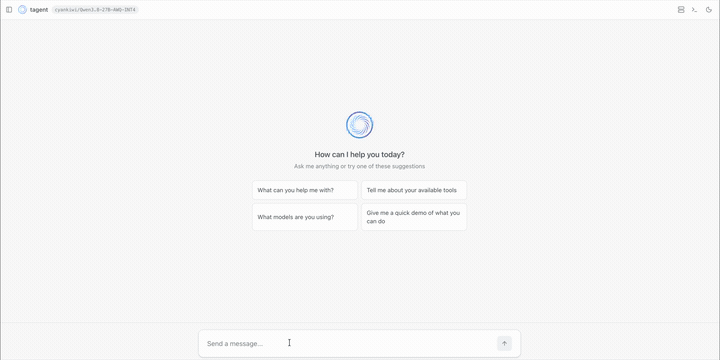

NVIDIA の GPU カード、A100(40GB) を入手したので、今話題の Qwen3.8:27B を動かしました。
結論だけいうと、40-50 Tokens/s 出ているのでそれなりに満足しています。
<!--more-->

## vLLM 上で 50 Token/s

まずは、細かい説明より、結果を。
vLLM は以下のパラメータで A100 上で起動しました。

```
vllm serve cyankiwi/Qwen3.8-27B-AWQ-INT4 \
  --quantization compressed-tensors \
  --tensor-parallel-size 1 \
  --gpu-memory-utilization 0.9601 \
  --max-model-len 225280 \
  --kv-cache-dtype auto \
  --reasoning-parser qwen3 \
  --enable-auto-tool-choice \
  --tool-call-parser qwen3_coder \
  --default-chat-template-kwargs '{"reasoning_effort": "low"}' \
  --enable-prefix-caching
```

結果としてこれぐらいのスピードで応答しています。現段階では何もストレスに感じないスピードです。




使い始めたばかりですが、以下のような所感です。

- それなりに複雑なタスクもこなしており、一つのプロンプトで数時間稼働できる。
- Claude Opus 5 などと比較すると、同じタスクでもだいぶ完了までに時間がかかる印象がある。
- 出来上がったコードは Opus 5 と比較しても（私レベルだと）遜色がない。
- A100 に、Qwen3.8:27b が乗ると、vRAM をほぼ使い尽くすため、その他何も乗る余地がない。
- vRAM から溢れないよう、256k のコンテキストウィンドウを 220k に絞っている。（もう少し攻められる気もする）
- 256k のコンテキストウィンドウが意外にも大きな弱点になりうる。
特に大規模なコードだと、最初の読み込み＋プラン策定だけで、半分近くのコンテキストを使い切ってしまうことがある。
コンテキストが限界に到達すると基本的に新しいタスクが受け付けられなくなる。
- 220K の max_model_len を設定してしまったせいで、フル長のリクエストの場合、基本的に 1 Concurrent Request ほどしか受け付けられない（実測では 225,280 トークンあたり 1.10x で、短いリクエストなら複数同時も可能）。
- 私レベルだと自由に使える Claude という印象で、単純に楽しい。

## A100 の特徴

私も GPU を利用した LLM は初めてですが、改めて各 GPU のキャラクター差が大きいことがわかりました。今回私が学んだ A100 の特徴です。

- データセンター向けモデルなので、vRAM のメモリ帯域が 1.6TB/s あります（80GB モデルだと 2.0TB/s）。
最新のハイエンドなコンシューマー向け GPU と比べても遜色ない（もしくはそれ以上の）帯域があり、これが Token/s に大きく寄与している。
- vRAM が 40GB あり、ミッドレンジの 20B ~ 30B パラメーターの LLM モデルを載せることができる。
- ただ、コンテキスト分の vRAM も必要であり、フル精度（bf16）のモデルではなく、量子化されたモデルを使って可能な限り、メモリの消費量をおさえることが望ましい。
- CPU 側のメモリにオフロードも可能だが、それを行うと極端にパフォーマンスが落ちるので慎重にやるべき。
- A100 の最大の弱点は「古い」こと。6年前のモデルなので、現代のモデルの量子化手法 FP8（H100/H200 モデル想定）、FP4、NVFP4（Blackwell モデル想定）などの量子化に対応できないため、メモリ圧縮の効率がわるい。
- 今でも高価（になってしまった）

## vLLM パラメーターの意味

以下のような意味をもちます。

- **cyankiwi/Qwen3.8-27B-AWQ-INT4** ：上にもあるよう、A100 だと、現代的な量子化がデフォルトでは選べないです。
（ネット上では動かした猛者もいるようですが・・・）[cyan.kiwi](https://cyan.kiwi/) が提供している、古い GPU に対して最適化されたモデルを使っています。
- **quantization compressed-tensors** : モデルは AWQ（Activation-aware Weight Quantization）の名前が入っているのですが、モデルカードによると [compressed tensors](https://pypi.org/project/compressed-tensors/) が有効になっていたようで、それを設定しました。
- **tensor-parallel-size** : 今回は GPU が1枚なので必然的に 1
- **gpu-memory-utilization** : これは起動時に `[gpu_worker.py:575] CUDA graph memory profiling is enabled (default since v0.21.0). The current --gpu-memory-utilization=0.9300 is equivalent to --gpu-memory-utilization=0.8999 without CUDA graph memory profiling. To maintain the same effective KV cache size as before, increase --gpu-memory-utilization to 0.9601. To disable, set VLLM_MEMORY_PROFILER_ESTIMATE_CUDAGRAPHS=0.`
というメッセージが vLLM から出てきたので、93%分のメモリを確保するために、この設定を入れました。もうすこし攻める余地はあると思う。
- **max-model-len**: `gpu-memory-utilization` を 93% に設定した結果、`[gpu_worker.py:560] Available KV cache memory: 15.45 GiB [kv_cache_utils.py:2177] GPU KV cache size: 246,735 tokens`という結果がかえってきた。
最終的には、この値まであげることができるのですが、一旦 220k で設定を止めました。なお、vLLM 起動時のログに「mamba page size」「qwen_gdn_attention_core」といった記述があり、これは qwen の [Gated DeltaNet](https://github.com/rasbt/LLMs-from-scratch/blob/main/ch04/08_deltanet/README.md)（線形アテンション）がハイブリッドで使われているためのようで、それによって KV Cache size がかなり圧縮されているようです。
- **kv-cache-dtype**: これは GPU 自体が対応しているかは関係なく、計算時のパラメーターなので、FP8 が設定可能なはずです。
FP16 より FP8 にすることで、メモリの使用量は半分にできる、というのが机上の考えです。ただ、上の max-model-len にあるよう、すでに KV Cache の圧縮がかなり効果がでているので、デフォルトの auto のままにしています。
今後コンテキストをさらに圧縮したい場合に検証します。
- **enable-auto-tool-choice** : Tool 実行をするためのパラメーターなので、ほぼ必須で入れています。
- **default-chat-template-kwargs '{"reasoning_effort": "low"}'** : Qwen のモデルはデフォルトで xhigh の理由づけが設定されており、
放っておくと、モデルが必要以上に長考を繰り返す可能性があるので、デフォルトを low にしておきます。
- **enable-prefix-caching** : これを起動した結果 `Warning: Prefix caching in Mamba cache 'align' mode is currently enabled. Its support for Mamba layers is experimental. Please report any issues you may observe.` と出ており、
Experimental ではあるものの、設定が有効になっているようで、Cache ヒット率も上がったので、有効にしました。

ちなみに、vLLM ではなく、Ollama でも最初は試していました。
ただし、Ollama の場合、以下のエラーに悩まされ、あまり細かいパフォーマンスチューニングができなかったです。

https://github.com/ollama/ollama/issues/17778

一般的にも、GPU 上で LLM を使い、より細かいチューニングをしたければ、vLLM を使用することが世の共通認識のようです。


## まとめ

A100 に最新のモデルをなかなかのスピードで動かせて嬉しいです。
