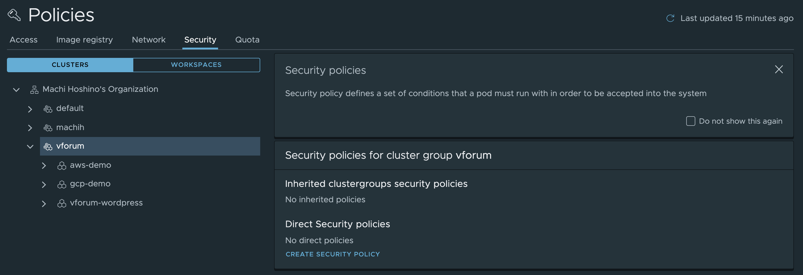
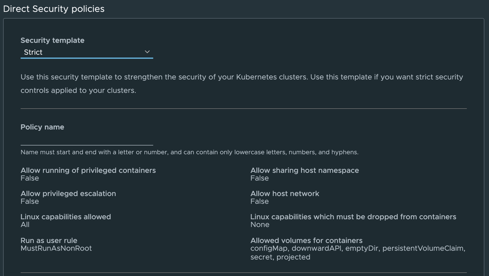
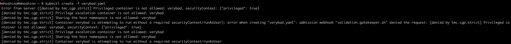
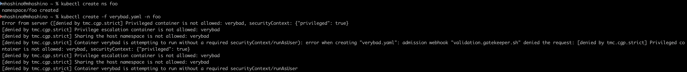
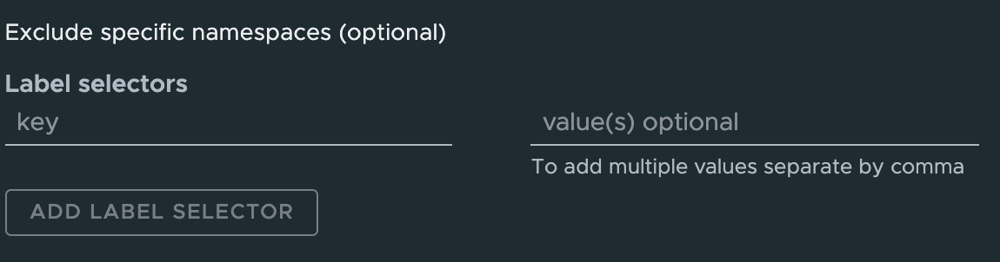
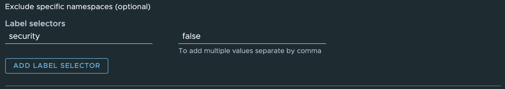
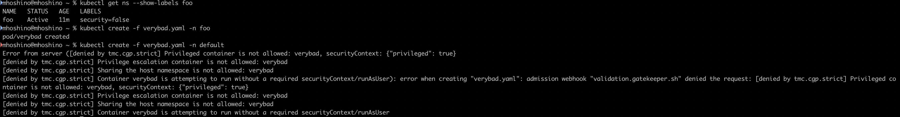

This article is part of the Learning Open Policy Agent with Tanzu Mission Control series.<!--more-->

# Series

Part 1 : [Overview](../tmc-demanabu-opa)     
Part 2 : Playing with TMC's Open Policy Agent  **< you are here**  
Part 3 : [Dissecting TMC's Open Policy Agent](../tmc-demanabu-opa-03)  
Part 4 : [Writing your own OPA policies from TMC](../tmc-demanabu-opa-04) 

# Introduction

As the [previous article](../tmc-demanabu-opa) showed, TMC lets you try OPA casually.
This time we'll try the feature out.

TMC implements OPA as Security Policies.
Let's look inside.

# Preparation

You'll need a TMC environment. If you don't have an account, the HOL (Hands on Lab) is the fastest way to get one.
Set up an environment based on this article:

[Trying Tanzu Mission Control casually (via HOL)](https://qiita.com/hmachi/items/a2f5eeb5abd7c72a4873)

For the test we use the YAML below — the one from last time that a malicious Pod could use for privilege escalation:

```yaml

apiVersion: v1
kind: Pod
metadata:
  name: verybad
spec:
  hostPID: true
  containers:
    - name: verybad
      image: alpine
      command: [ "sleep", "3600" ]
      securityContext:
          privileged: true
```
Running this on a k8s with no particular security configuration, it — as expected — just runs:

```
% kubectl create -f verybadsecurity.yaml
pod/verybad created
```

# Verification

## Just try it

First, enable a Policy on the TMC side.

Select the [ Policies ] > [Assignment] > [ Security ] tab in the left pane.


Select the target ClusterGroup and choose [ CREATE SECURITY POLICY ].



The other options are explained later.
For now, just create it with [ Create Policy ].

Now the escalated-privilege Pod that started successfully earlier gets thoroughly scolded and can no longer come up.


What's impressive: the operations above were done as ClusterAdmin, and the Pod settings configured in TMC still take effect.
Moreover, they apply even to newly created Namespaces. The example below confirms it also applies when creating a namespace called `foo`.



## Adding a Namespace exception

Say you want an exception for a specific Namespace.
Back in the TMC screen, select `Exclude specific namespaces (optional)` at the bottom of the created policy.



Enter the rule for the namespaces to exclude here.



Add this Label to the `foo` namespace created earlier:

```
kubectl label namespace foo security=false
```

Creating the violating Pod again in the `foo` namespace now runs without error. Namespaces not matching the Label continue to fail.



# Introducing Policy Insights!

Even more impressive is the Policy Insights feature added in a recent release.
If something is running in violation of policy, there's a screen listing them all.


# Wait — so where's OPA?

OPA hasn't appeared at all so far — but the technology working behind the scenes was in fact OPA.
In an environment with TMC Security Policies enabled, these `constrainttemplates` CRDs are created:

```
kubectl get constrainttemplates
NAME                                              AGE
vmware-system-tmc-allowed-host-paths-v1           23m
vmware-system-tmc-allowed-users-v1                23m
vmware-system-tmc-allowed-volumes-v1              23m
vmware-system-tmc-block-host-namespace-v1         23m
vmware-system-tmc-block-privilege-escalation-v1   23m
vmware-system-tmc-block-privileged-container-v1   23m
vmware-system-tmc-enforce-host-networking-v1      23m
vmware-system-tmc-linux-capabilities-v1           23m
```

Furthermore, running `kubectl get` on the resource name above also reveals something:

```
kubectl get vmware-system-tmc-block-host-namespace-v1
NAME             AGE
tmc.cgp.strict   24m
```

This configuration is related to OPA.

The finer details are saved for next time.
For now, just think of it as: use TMC, and OPA works behind the scenes doing something impressive.

# Summary

* TMC Security Policies can block illegitimate privilege escalation
* Policy Insights shows policy violations at a glance
* TMC uses OPA behind the scenes

Next: "[Dissecting TMC's Open Policy Agent](../tmc-demanabu-opa-03)".
