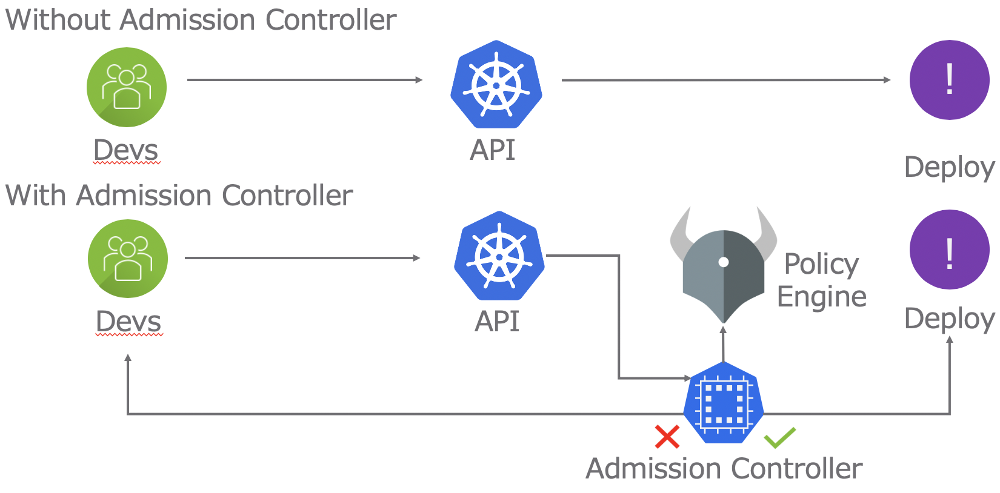
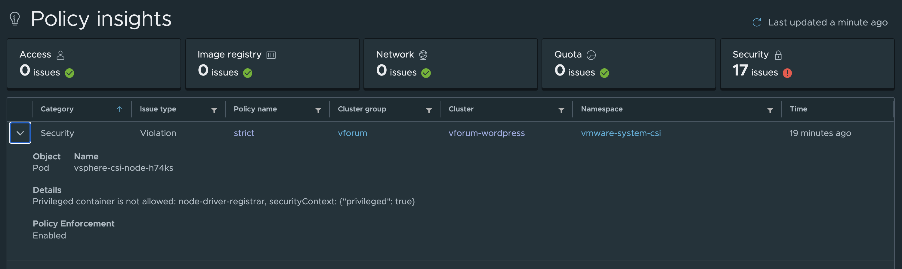
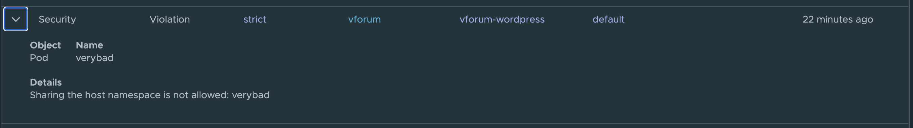

この記事はTanzu Mission Controlで学ぶ Open Policy Agentシリーズです。<!--more-->

# シリーズ

第一回 : [概要](../tmc-demanabu-opa)     
第二回 : [TMCのOpen Policy Agentを遊んでみる](../tmc-demanabu-opa-02)  
第三回 : TMCのOpen Policy Agentを解剖する **< いまここ**  
第四回 : [TMCからOPAポリシーを自作する](../tmc-demanabu-opa-04)

# はじめに

[概要編](../tmc-demanabu-opa)の記事にあるよう、OPAは以下のようなフローでKubernetesのリクエストに対しポリシーを定義します。



TMCからSecurity Policyを有効にした際これと同じ仕組みのものがうごいています。

以下TMCで、Security Policyを有効にした際に、どのような方法で[第二回目](../tmc-demanabu-opa-02)でのPodの起動を阻止していたのかを解剖します。

TMCで管理された環境がある前提です。上の"With Admission Controller"のフロー図をみながら参照してください。

# API > Admission Controller

TMCでは、以下のリソースがAPIをインターセプトするAdmission Controllerとして定義されています。

```
kubectl get validatingwebhookconfigurations gatekeeper-validating-webhook-configuration
NAME                                          CREATED AT
gatekeeper-validating-webhook-configuration   2020-09-30T14:43:48Z
```

`validatingwebhookconfigurations`リソースがAdmission Controllerの挙動を定義しています。詳細はマニュアルの[Dynamic Admission Control](https://kubernetes.io/docs/reference/access-authn-authz/extensible-admission-controllers/)を参照してください。

筆者が確認した時点では、中身は以下のようになっていました。
主要な部分のみ抜粋します。

```yaml
apiVersion: admissionregistration.k8s.io/v1
kind: ValidatingWebhookConfiguration
metadata:
  name: gatekeeper-validating-webhook-configuration
webhooks:
- admissionReviewVersions:
  - v1beta1
  clientConfig:
    service:
      name: gatekeeper-webhook-service
      namespace: gatekeeper-system
      path: /v1/admit
      port: 443
  failurePolicy: Ignore
  matchPolicy: Exact
  name: validation.gatekeeper.sh
  namespaceSelector:
    matchExpressions:
    - key: admission.gatekeeper.sh/ignore
      operator: DoesNotExist
  objectSelector: {}
  rules:
  - apiGroups:
    - '*'
    apiVersions:
    - '*'
    operations:
    - CREATE
    - UPDATE
    resources:
    - '*'
    scope: '*'
```

この中の以下の部分ですが、中身を見ると、全てのAPI、全てのリソースのCREATE、UPDATEの際にAdmission Webhookを発報することを意味しています。

```yaml
rules:
- apiGroups:
  - '*'
  apiVersions:
  - '*'
  operations:
  - CREATE
  - UPDATE
  resources:
  - '*'
  scope: '*'
```

さらに、以下の部分で、Webhookを送信先が記載されています。

```yaml
clientConfig:
  service:
    name: gatekeeper-webhook-service
    namespace: gatekeeper-system
    path: /v1/admit
    port: 443
```

つまり、まとめると以下のことがわかります。

* `validatingwebhookconfigurations`リソースでAdmission Controllerが定義されている
* 全てのAPI、全てのリソースのCREATE、UPDATEの際にAdmission Webhookを発報している
* Admisson Webhookの送信先は、`gatekeeper-system`の`gatekeeper-webhook-service:443/v1/admit`

次にいきます。

# Admission Controller > Policy Engine

Webhook先の稼働しているサービスを確認します。
前のステップの`gatekeeper-webhook-service:443`でサービスが起動していることがわかります。

```
kubectl get svc -n gatekeeper-system
NAME                         TYPE        CLUSTER-IP     EXTERNAL-IP   PORT(S)   AGE
gatekeeper-webhook-service   ClusterIP   10.101.28.83   <none>        443/TCP   18h
```

このサービスのSelectorは以下の通りです。

```yaml
# kubectl get svc -n gatekeeper-system -o yaml
apiVersion: v1
items:
...
- spec:
...
    selector:
      control-plane: controller-manager
      gatekeeper.sh/operation: webhook
      gatekeeper.sh/system: "yes"
```

該当するラベルで検索をかけます。すると以下の`gatekeeper-controller-manager-*`が３つ、つまりHAの状態でデプロイされていることが確認できます。
なお、これ自体はOPA Gatekeeperと呼ばれる、Kubernetesに対応したOPAのイメージです。

```
kubectl get pods -l control-plane=controller-manager -n gatekeeper-system
NAME                                            READY   STATUS    RESTARTS   AGE
gatekeeper-controller-manager-c97765cd6-bgkjx   1/1     Running   0          18h
gatekeeper-controller-manager-c97765cd6-hnvx2   1/1     Running   0          18h
gatekeeper-controller-manager-c97765cd6-znhqk   1/1     Running   0          18h
```

つまり、まとめると以下のことがわかります。

 * Webhookを発報した先には、OPA GatekeeperがHA化された状態で起動している

次に行きます。

# PolicyそしてRego言語

さて、いよいよOPAの中身をみていきます。
OPAには2つのリソースがあります。

* constrainttemplates : 各リソースについて、どのようなポリシーを定義するかを**Rego言語**で記載
* constraints : constrainttemplates 内容を元にどのように、Constraint(縛り)を設けるか定義

詳細は[OPA GatekeeperのGithubのREADMEを参照してください](https://github.com/open-policy-agent/gatekeeper)

ここでは、[第二回目](../tmc-demanabu-opa-02)でPod起動の際の以下のエラーがどのように出力されたかをみてきます。

```
[denied by tmc.cgp.strict] Sharing the host namespace is not allowed: verybad
```

## ConstraintTemplates

上記のエラーの定義は以下のファイルで行われています。

```
kubectl get constrainttemplate vmware-system-tmc-block-host-namespace-v1
NAME                                        AGE
vmware-system-tmc-block-host-namespace-v1   22h
```

筆者が確認したときは中身は以下のようになっていました。
主要な部分のみ抜粋しています。

```yaml
apiVersion: templates.gatekeeper.sh/v1beta1
kind: ConstraintTemplate
metadata:
  name: vmware-system-tmc-block-host-namespace-v1
spec:
  crd:
    spec:
      names:
        kind: vmware-system-tmc-block-host-namespace-v1
  targets:
  - rego: |-
      package k8spsphostnamespace
      violation[{"msg": msg, "details": {}}] {
          input_share_hostnamespace(input.review.object)
          msg := sprintf("Sharing the host namespace is not allowed: %v", [input.review.object.metadata.name])
      }
      input_share_hostnamespace(o) {
          o.spec.hostPID
      }
      input_share_hostnamespace(o) {
          o.spec.hostIPC
      }
    target: admission.k8s.gatekeeper.sh
```

ポイントが以下の箇所です。

```
- rego: |-
    package k8spsphostnamespace
    violation[{"msg": msg, "details": {}}] {
        input_share_hostnamespace(input.review.object)
        msg := sprintf("Sharing the host namespace is not allowed: %v", [input.review.object.metadata.name])
    }
    input_share_hostnamespace(o) {
        o.spec.hostPID
    }
    input_share_hostnamespace(o) {
        o.spec.hostIPC
    }
```

ここで使われているのがRegoといわれる言語です。
これをもう一段階理解するために、RegoのOnline Viewerを使います。

https://play.openpolicyagent.org/p/EWQB9RPi3K

上のリンクでは、Inputに[第二回目](../tmc-demanabu-opa-02)の`verybad.yaml`をAdmissionControllerから変換したものを記載しています。

コードには、ここに含まれているコードを含めています。

Input側の`"hostPID"`をTrue、Falseに切り替えてEvaluate結果をみてましょう。

Trueのときは以下のようにOutputが表示されます。

```
{
    "violation": [
        {
            "details": {},
            "msg": "Sharing the host namespace is not allowed: verybad"
        }
    ]
}
```

Falseのときは以下のようにOutputが表示されます。

```
{
    "violation": []
}
```

結果からみて分かる通り、`"hostPID": "true"`の時に``"violation"``に値をいれます。
そのなかには、`msg`は実際にうけとったメッセージと一致しています。

つまり、このRegoという言語で、TMCのSecurity Policyがどのように定義されているかわかります。

# Constraint

そしてもう一つ確認するものがConstraintです。これは先ほどRegoで定義したルールがどういう場合に有効かを定義します。

違和感ありますが、ConstraintTemplate名で`kubectl get`をします。
すると以下のようにみえてきます。

```
kubectl get vmware-system-tmc-block-host-namespace-v1
NAME             AGE
tmc.cgp.strict   23h
```

筆者が確認した時点では中身が以下のようになっていました。
主要な部分のみ抜粋しています。

```yaml
apiVersion: v1
items:
- apiVersion: constraints.gatekeeper.sh/v1beta1
  kind: vmware-system-tmc-block-host-namespace-v1
  metadata:
    name: tmc.cgp.strict
  spec:
    match:
      kinds:
      - apiGroups:
        - ""
        kinds:
        - Pod
      namespaceSelector:
        matchExpressions:
        - key: e2e-run
          operator: DoesNotExist
```

`spec.match`にどういった場合に、このConstraintが定義されているか記載されています。このルールではPodの操作がすべて定義されています。

よってまとめると

* TMCでは、自動でConstraintTemplate,Constraintsが作成され、ユーザーから透過的に操作がされる

# Policy Insightsのからくり

さて、前回はPolicy Insigtsというすごい機能で、ルール違反を一覧できるというものを紹介しました。



このカラクリですが、OPAのAudit機能を使っています。

https://github.com/open-policy-agent/gatekeeper#audit

これもConstraintの中身を確認するとCLIからも確認できます。
例えば、以下のようになっている場合

```yaml
status:
  totalViolations: 1
  violations:
  - enforcementAction: dryrun
    kind: Pod
    message: 'Sharing the host namespace is not allowed: verybad'
    name: verybad
    namespace: default
```

PolicyInsight側では以下のようになります。



つまりこの機能もOPAをつかっていることがわかります。

# まとめ

* TMCのSecurity PolicyはAdmissionController、OPA、そしてConstraintTemplateとConstraintsの仕組みを使っている
* ConstraintTemplateはRegoとよばれる言語で記載できる
* OPAはPolicy Insights機能にもつかわれている

なお、全三回の予定でしたが、この記事をかいた数日後にまた新しい機能が追加されることがアナウンスされました。この内容も[第四回](../tmc-demanabu-opa-04)としてまとめます。
