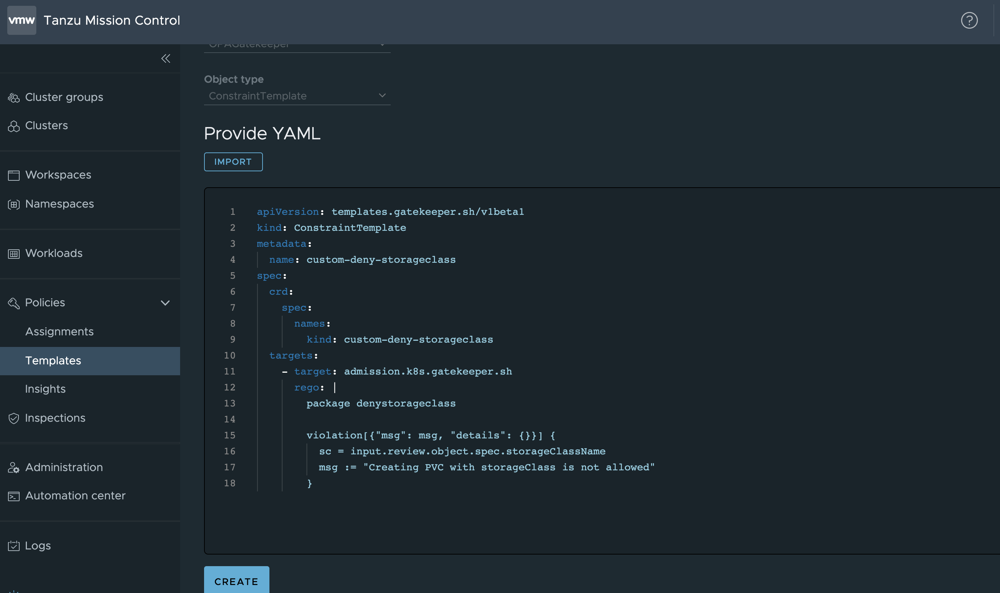
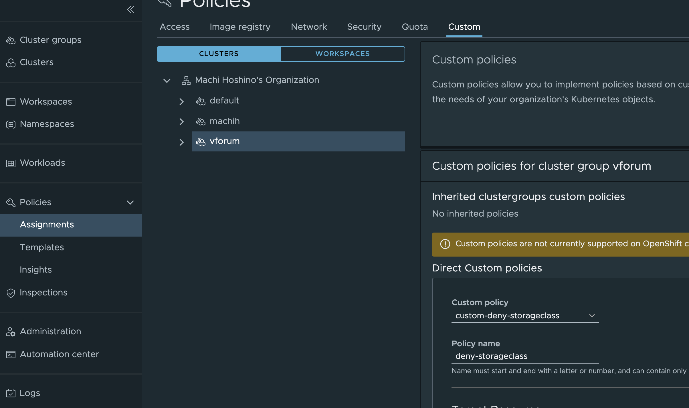
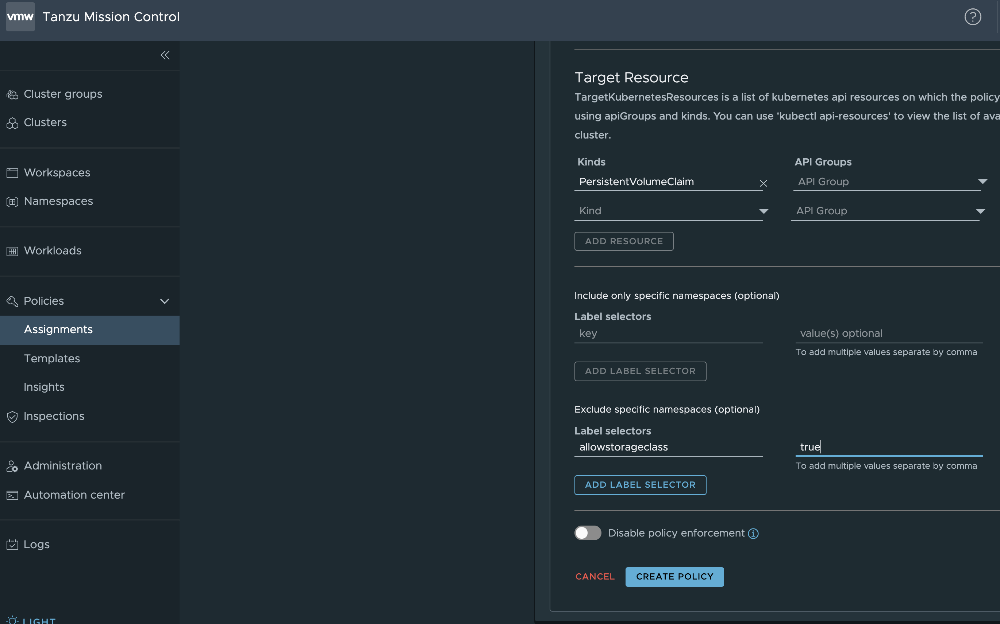

この記事はTanzu Mission Controlで学ぶ Open Policy Agentシリーズです。<!--more-->

# シリーズ

第一回 : [概要](../tmc-demanabu-opa)     
第二回 : [TMCのOpen Policy Agentを遊んでみる](../tmc-demanabu-opa-02)  
第三回 : [TMCのOpen Policy Agentを解剖する](../tmc-demanabu-opa-03)  
第四回 : TMCからOPAポリシーを自作する **<　いまここ**

# はじめに

[前回](../tmc-demanabu-opa-03)までで、TMCでOPAがどのように利用できるかを紹介させていただきました。

TMCには、これにさらにCustomPolicyとよばれ、OPAポリシーを自作し、TMCのUIから管理する機能を提供します。

このシリーズの最後には、この機能を紹介し、締め括りたいと思います。

# シナリオ - StorageClassをつかったPV作成を拒否

今回は以下のシナリオを想定します。

Kubernetesは通常、PersistentVolumeを作る場合、開発者はPersistentVolumeClaimを定義し、管理者側でPersistentVolumeを定義するような流れになります。

これがStaticなVolumeのアサインです。本来はこうすることで、開発者側に勝手にストレージを作られないようにするのが目的でした。

https://kubernetes.io/docs/concepts/storage/persistent-volumes/#static

ところが、この流れをバイパスして、PersistentVolumeClaimの時点でボリュームを動的につくる方法として、StorageClassとよばれる方法があります。

これがDynamicなVolumeのアサインです。これは便利な反面、いくらでも不正なストレージ要求を行えてしまう問題があります。

https://kubernetes.io/docs/concepts/storage/persistent-volumes/#dynamic
https://kubernetes.io/docs/concepts/storage/storage-classes/

一応Quotaによって制限もできますが、それはNamespace単位での設定のため、設定がもれてしまうリスクがあります。

https://kubernetes.io/docs/tasks/administer-cluster/limit-storage-consumption/

というわけでこれをOPAで守ろうとしてみます。

# OPAポリシーの作成

まず、OPAポリシーを作る必要があります。

[この回](../6.md)を参考にOPAに食わせるインプット情報を取り出します。
今回は、以下のようなPVC作成時のルールを定義します。以下のYamlにある`storageClassName: default`が定義されていたら作成を許可しない、というルールにします。

```
kind: PersistentVolumeClaim
apiVersion: v1
metadata:
  name: myclaim2
spec:
  accessModes:
  -  ReadWriteOnce
  resources:
    requests:
      storage: 1Gi
  storageClassName: default
```

インプット情報が取得できたら、Playgroundで、このポリシーを作ってみます。
出来上がったのが以下。

https://play.openpolicyagent.org/p/4cKZIuijl2

これは、非常に単純で、StorageClassNameがInputにある場合、拒否するというものです。

# TMCにOPAルールをTemplatesとして登録

このOPAのルールをTMCに定義します。
TMCの左ペインの[Templates]を選択し、[Create Templates]を選択します。
[Provide Yaml]ですが、これは[前回説明したConstraintTemplates](../tmc_demanabu_opa_03)を定義するための箇所です。
今回のシナリオでは以下のように記載します。



画面ショットの中のYamlは以下の通りです。

```yaml
apiVersion: templates.gatekeeper.sh/v1beta1
kind: ConstraintTemplate
metadata:
  name: custom-deny-storageclass
spec:
  crd:
    spec:
      names:
        kind: custom-deny-storageclass
  targets:
    - target: admission.k8s.gatekeeper.sh
      rego: |
        package denystorageclass

        violation[{"msg": msg, "details": {}}] {
          sc = input.review.object.spec.storageClassName
          msg := "Creating PVC with storageClass is not allowed"
        }
```

上にあるよう、`rego`以下には前手順でつくりあげたOPAポリシーをコピペします。
それ以外の箇所はほぼテンプレですが、ポイントとなるのが、`metadata.name`と`spec.crd.spec.names.kind`の値に他のルールと重複しないものを定義します。

# Customポリシーの定義

上記のTemplateを登録したあとは[Assignments] > [Custom] そして、ルールを適用したいクラスターを選択します。

さきほどつくったTemplateを選択し、名前も与えます。



次にTargetResourceには、どのリソースに対してルールを定義するかを選択します。
今回はPersistentVolumeClaimを選択します。さらに、"Exclude specific namespaces"には、このルールを例外とするNamespaceを任意に設定可能です。今回は、`allowstorageclass=true`を追加します。



この状態でCreate Policyを実行します。以上です。

# 試してみる

適用したクラスターで早速ポリシーを違反したPVCを作ってみます。
すると以下のようにうまくルールが適用され、作成が拒否されました。

```
% kubectl create -f pvc.yaml
Error from server ([denied by tmc.cgp.deny-storageclass] Creating PVC with storageClass is not allowed): error when creating "pvc.yaml": admission webhook "validation.gatekeeper.sh" denied the request: [denied by tmc.cgp.deny-storageclass] Creating PVC with storageClass is not allowed
```

さらにNamespaceの例外ルールも試してみます。
まずNamespaceを作成し、`allowstorageclass=true`のラベルを追加します。

```
% kubectl create ns test
namespace/test created
% kubectl label namespace test allowstorageclass=true
namespace/test labeled
```
すると、このNamespaceでは問題なく、PVCがつくれます。

```
% kubectl create -f pvc.yaml -n test
persistentvolumeclaim/myclaim2 created
% kubectl get pvc -n test
NAME       STATUS   VOLUME                                     CAPACITY   ACCESS MODES   STORAGECLASS   AGE
myclaim2   Bound    pvc-2116cbbd-7fb8-45b7-92cc-cfe43bbc899c   1Gi        RWO            default        6s
```

期待通りですね。

# まとめ

第四回では、TMCを使い自作OPAポリシーを自作する方法を紹介しました。
すごくシンプルにできることがわかりました。
またこのシリーズでは、TMCを使いOPAをより深く理解できるようになりました。
