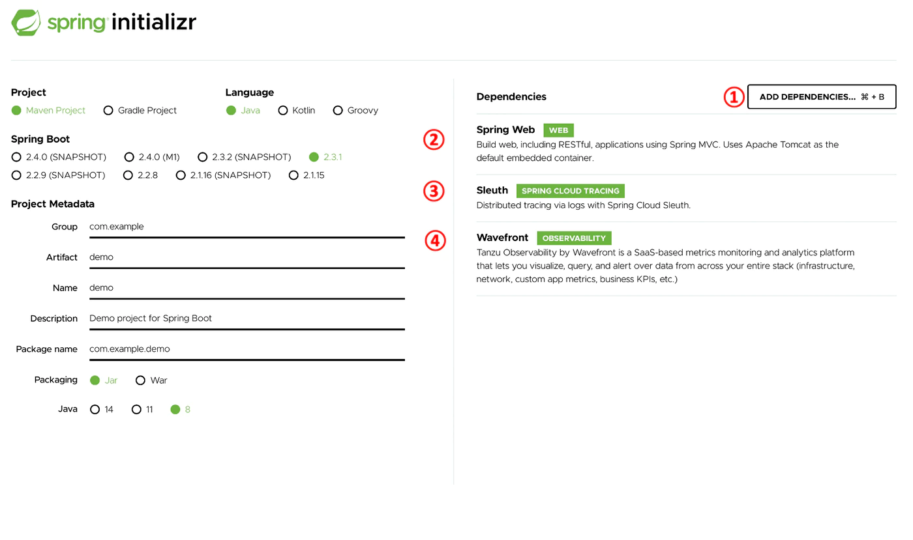
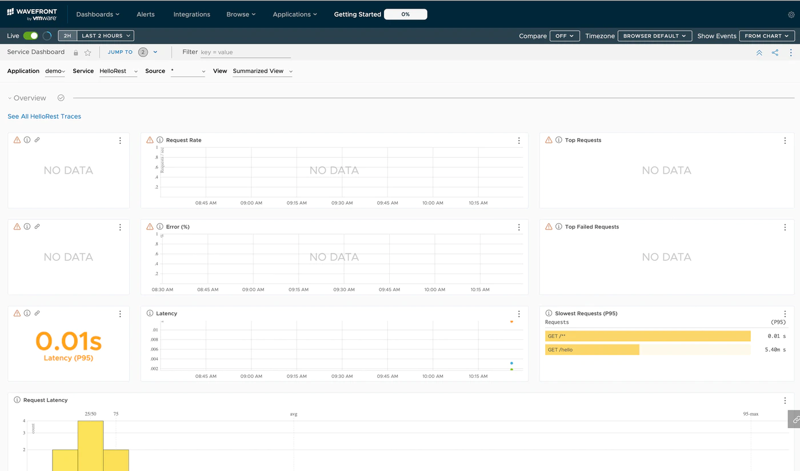
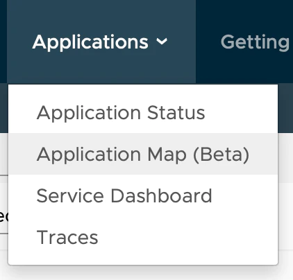
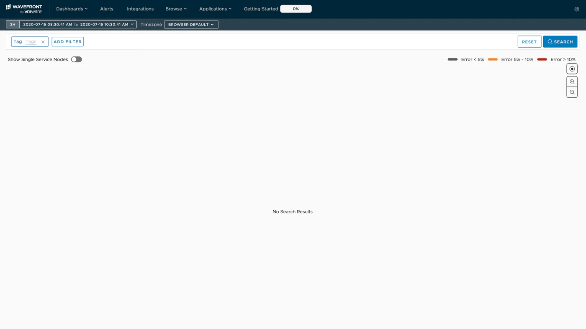
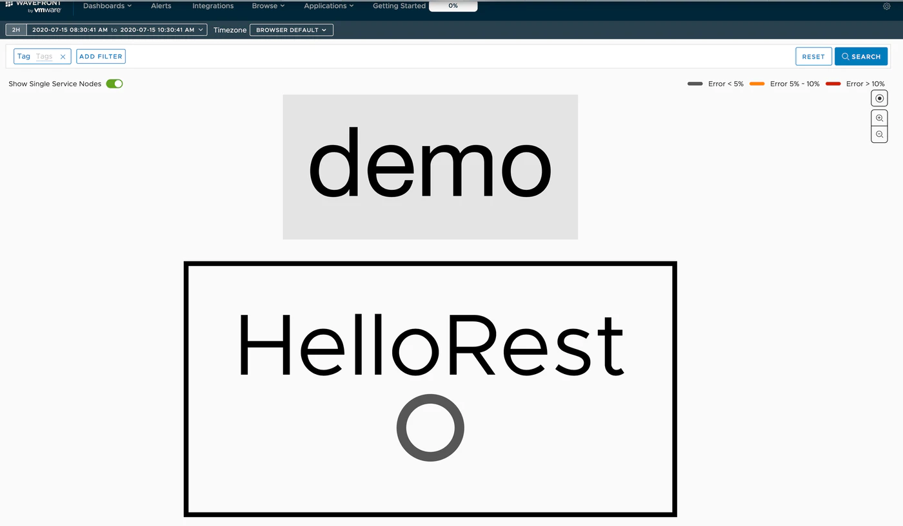
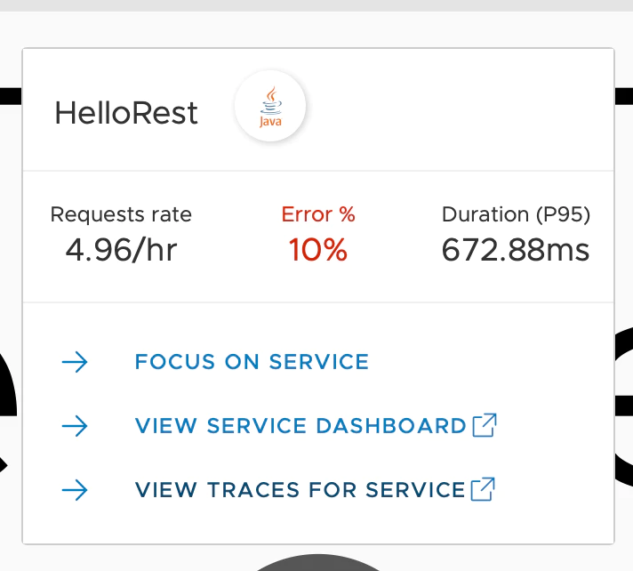
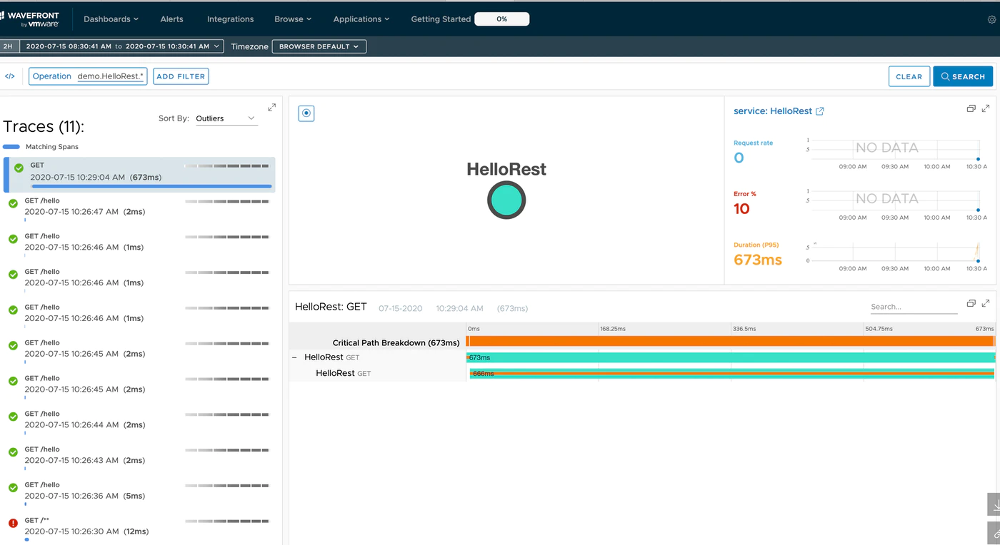
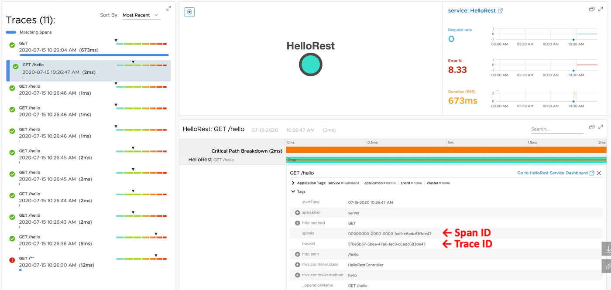

This is the second installment of the Learning Distributed Tracing with Wavefront series.<!--more-->

# Series

Part 1 : [Overview](../wf-demanabu-dt)  
Part 2 : Distributed tracing with Spring Boot **← you are here**  
Part 3 : [What are RED metrics?](../wf-demanabu-dt-03)  
Part 4 : [Connecting services together](../wf-demanabu-dt-04)  
Part 5 : [Distributed tracing with Python](../wf-demanabu-dt-05)  
Part 6 : [Distributed tracing with AMQP](../wf-demanabu-dt-06)  
Part 7 : [Distributed tracing with a service mesh](../wf-demanabu-dt-07)   

# Introduction

In this installment, to get to know Wavefront's distributed tracing as quickly as possible, we build an application with Spring Boot.
As for programming experience — none is fine. I come from an infrastructure background myself and can't write complex code.

# Preparation

Spring Boot is a Java framework. So at minimum you need:

* Java JDK 8+

Install the JDK following [Oracle JDK](https://www.oracle.com/java/technologies/javase-downloads.html).
That's all for this time.
Normally you'd also want an editor, but at this level we can do without, so I'll deliberately skip it.
And rest assured — everything in this installment is free.

# Source code

Published here:

https://github.com/mhoshi-vm/wf-demanabu-dis-tracing/tree/master/2

# Preparing the app

Once ready, access this URL:

[start.spring.io](https://start.spring.io)



Then do the following:

* Select Add Dependencies
* Search for and add Spring Web
* Add Sleuth the same way
* Add Wavefront the same way

Finally click Generate.
A zip file downloads; extract it anywhere you like.
After extraction the file structure should look like this:

```
mhoshino@mhoshino demo % tree
.
├── HELP.md
├── mvnw
├── mvnw.cmd
├── pom.xml
└── src
    ├── main
    │   ├── java
    │   │   └── com
    │   │       └── example
    │   │           └── demo
    │   │               └── DemoApplication.java
    │   └── resources
    │       ├── application.properties
    │       ├── static
    │       └── templates
    └── test
        └── java
            └── com
                └── example
                    └── demo
                        └── DemoApplicationTests.java

14 directories, 7 files
```

Let's edit the Java code just a little.
Open the following file in your favorite editor:

```
mhoshino@mhoshino demo % vi src/main/java/com/example/demo/DemoApplication.java
```

Replace it with this content:

```

package com.example.demo;

import java.util.Map;

import org.slf4j.Logger;
import org.slf4j.LoggerFactory;
import org.springframework.boot.SpringApplication;
import org.springframework.boot.autoconfigure.SpringBootApplication;
import org.springframework.http.ResponseEntity;
import org.springframework.web.bind.annotation.GetMapping;
import org.springframework.web.bind.annotation.RequestHeader;
import org.springframework.web.bind.annotation.RestController;

@SpringBootApplication
public class DemoApplication {

	public static void main(String[] args) {
		SpringApplication.run(DemoApplication.class, args);
	}

}

@RestController
class HelloRestController {

	private static final Logger LOGGER = LoggerFactory.getLogger(HelloRestController.class);

	@GetMapping("/hello")
	public ResponseEntity<String> hello (@RequestHeader Map<String, String> header){
		printAllHeaders(header);return
		ResponseEntity.ok("Hello World!");
	}

	private void printAllHeaders(Map<String, String> headers) {
		headers.forEach((key, value) -> {
			LOGGER.info(String.format("Header '%s' = %s", key, value));
		});
	}
}
```

Also open this file:

```
mhoshino@mhoshino demo % vi src/main/resources/application.properties
```

And append the following:

```
management.endpoints.web.exposure.include=wavefront
server.port=8081
wavefront.application.name=demo
wavefront.application.service=HelloRest
```

That's it for code editing. What the code above does is explained later.


# Trying distributed tracing right away

Now let's run the application.
Execute the following command:

```
mhoshino@mhoshino demo % ./mvnw spring-boot:run
```

The first startup may take a while, but subsequent ones get faster.
Success looks like this:

```
  .   ____          _            __ _ _
 /\\ / ___'_ __ _ _(_)_ __  __ _ \ \ \ \
( ( )\___ | '_ | '_| | '_ \/ _` | \ \ \ \
 \\/  ___)| |_)| | | | | || (_| |  ) ) ) )
  '  |____| .__|_| |_|_| |_\__, | / / / /
 =========|_|==============|___/=/_/_/_/
 :: Spring Boot ::        (v2.3.1.RELEASE)

2020-07-15 10:24:49.985  INFO [hellorest,,,] 66556 --- [           main] com.example.demo.DemoApplication         : No active profile set, falling back to default profiles: default
2020-07-15 10:24:50.487  INFO [hellorest,,,] 66556 --- [           main] o.s.cloud.context.scope.GenericScope     : BeanFactory id=930eeca1-6f00-3004-b800-9fca9761a189
2020-07-15 10:24:50.831  INFO [hellorest,,,] 66556 --- [           main] o.s.b.w.embedded.tomcat.TomcatWebServer  : Tomcat initialized with port(s): 8081 (http)
2020-07-15 10:24:50.837  INFO [hellorest,,,] 66556 --- [           main] o.apache.catalina.core.StandardService   : Starting service [Tomcat]
2020-07-15 10:24:50.837  INFO [hellorest,,,] 66556 --- [           main] org.apache.catalina.core.StandardEngine  : Starting Servlet engine: [Apache Tomcat/9.0.36]
2020-07-15 10:24:50.914  INFO [hellorest,,,] 66556 --- [           main] o.a.c.c.C.[Tomcat].[localhost].[/]       : Initializing Spring embedded WebApplicationContext
2020-07-15 10:24:50.914  INFO [hellorest,,,] 66556 --- [           main] w.s.c.ServletWebServerApplicationContext : Root WebApplicationContext: initialization completed in 917 ms
2020-07-15 10:24:50.990  INFO [hellorest,,,] 66556 --- [           main] i.m.c.instrument.push.PushMeterRegistry  : publishing metrics for WavefrontMeterRegistry every 1m
2020-07-15 10:24:51.583  INFO [hellorest,,,] 66556 --- [           main] o.s.s.concurrent.ThreadPoolTaskExecutor  : Initializing ExecutorService 'applicationTaskExecutor'
2020-07-15 10:24:51.853  INFO [hellorest,,,] 66556 --- [           main] o.s.b.a.e.web.EndpointLinksResolver      : Exposing 3 endpoint(s) beneath base path '/actuator'
2020-07-15 10:24:51.889  INFO [hellorest,,,] 66556 --- [           main] o.s.b.w.embedded.tomcat.TomcatWebServer  : Tomcat started on port(s): 8081 (http) with context path ''
2020-07-15 10:24:51.908  INFO [hellorest,,,] 66556 --- [           main] com.example.demo.DemoApplication         : Started DemoApplication in 3.558 seconds (JVM running for 3.794)

A Wavefront account has been provisioned successfully and the API token has been saved to disk.

To share this account, make sure the following is added to your configuration:

	management.metrics.export.wavefront.api-token=2b7543f5-2fc7-42ea-afdf-2c329a87d76e
	management.metrics.export.wavefront.uri=https://wavefront.surf

Connect to your Wavefront dashboard using this one-time use link:
https://wavefront.surf/us/pGqpk9QCjb
```

In another prompt, run the following command a few times:

```
mhoshino@mhoshino demo % curl localhost:8081/hello
```

If all is well, it should print `Hello World!`.
Then, after a short wait, open this URL:

http://localhost:8081/actuator/wavefront

And — surprise — you're taken to the Wavefront UI.<br/>

Select Application > Application Map(Beta) at the top.<br/>  

It probably shows nothing at first<br/>

Select Show Single Service Nodes at the top left.<br/>

Now our application appears.

Click HelloRest, then click View Traces For Service.

The Trace list is displayed.


And with that, we have experienced distributed tracing.

# Hold on — what just happened?

We got this far with barely any explanation, so let me fill in.
First, the application we built is, as the result shows, a simple REST API application returning `Hello World!`.

Spring Boot, which we used here, is a framework that makes building such REST API applications easy.
In the code, this part creates the URL and REST API:

```

@RestController
class HelloRestController {

	private static final Logger LOGGER = LoggerFactory.getLogger(HelloRestController.class);

	@GetMapping("/hello")
	public ResponseEntity<String> hello (@RequestHeader Map<String, String> header){
		printAllHeaders(header);return
		ResponseEntity.ok("Hello World!");
	}

	private void printAllHeaders(Map<String, String> headers) {
		headers.forEach((key, value) -> {
			LOGGER.info(String.format("Header '%s' = %s", key, value));
		});
	}
}
```
I'll skip explaining the code itself... but notice: there is almost no code representing the `Wavefront` integration. So why did the Wavefront integration work? Because of the dependencies added at [start.spring.io](start.spring.io) earlier — items ② to ④ below:


A bit more about what these dependencies do:

* Spring Web : provides the skeleton for REST services like the one we built
* Sleuth : the heart of distributed tracing. It **automatically attaches Trace and Span information** to each request.
* Wavefront : handles the connection to Wavefront.

The words Trace and Span appeared suddenly, but as written in the [overview](../wf-demanabu-dt):

* Trace : one unit of work made up of multiple Spans
* Span : a unit of processing — typically one REST request or AMQP request

The `Sleuth` we added plays the central role in distributed tracing, transparently assigning a Trace ID and Span ID to each HTTP request without touching the code.

Looking at the app logs, you probably see lines like:

```
2020-07-15 10:26:47.356  INFO [hellorest,5f0e5b575bea47a61ec9c6adc683de47,1ec9c6adc683de47,true] ...
```

Here, `5f0e5b575bea47a61ec9c6adc683de47` is the Trace ID added by Sleuth, and `1ec9c6adc683de47` is the Span ID.

In Wavefront too, this Trace ID and Span ID are visible from the logs.


As for the Wavefront side, the only settings needed were:

```
spring.application.name=hellorest
management.endpoints.web.exposure.include=health,info,wavefront
server.port=8081
wavefront.application.name=demo
wavefront.application.service=HelloRest
```

Of these, `wavefront.application.name` and `wavefront.application.service` control how things are displayed in Wavefront.

Starting the application in this state automatically creates a Freemium (free) account, ready to use.
Compared to a full account, a Freemium account has [various limitations](https://docs.wavefront.com/wavefront_spring_boot_faq.html#what-is-the-difference-between-the-freemium-cluster-and-a-wavefront-trial), but it's the quickest way to try things.

Also, the URL http://localhost:8081/actuator/wavefront
automatically forwards to this Freemium account.
This URL becomes available when you set `management.endpoints.web.exposure.include=wavefront`.

Being able to do this so simply and quickly is Spring Boot's advantage. As we'll cover later, other languages take much more work.
Both Spring Boot and Wavefront are under VMware, and the integration is set to keep getting stronger.

# Summary

Summarizing this installment:

* With Spring Boot, Wavefront integration works without any Wavefront-specific coding
* Sleuth handles distributed tracing's Trace IDs and Span IDs, again without coding
* The Wavefront connection auto-creates a Freemium account, usable immediately
* Spring Boot + Wavefront is pretty great

Next, Part 3: "[What are RED metrics?](../wf-demanabu-dt-03)"
