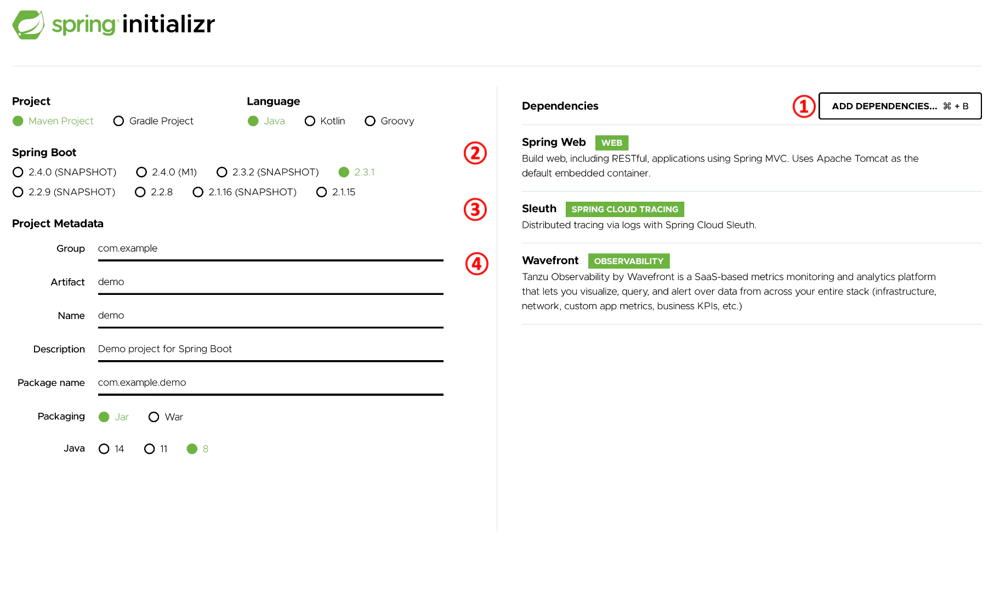
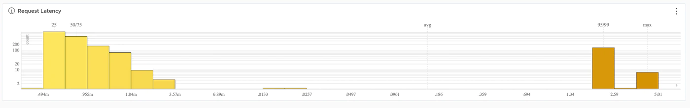

この文章は、Wavefrontで学ぶ分散トレーシング　シリーズの第三回目です。<!--more-->

# シリーズ

第一回　：　[概要編](../wf-demanabu-dt)  
第二回　：　[Spring Bootで分散トレーシング](../wf-demanabu-dt-02)   
第三回　：　REDメトリクスって何？ **← いまここ**  
第四回　：　[サービスをつなげてみる](../wf-demanabu-dt-04)  
第五回　：　[Pythonで分散トレーシング](../wf-demanabu-dt-05)  
第六回　：　[AMQPで分散トレーシング](../wf-demanabu-dt-06)  
第七回　；　[サービスメッシュで分散トレーシング](../wf-demanabu-dt-07)  


# 始めに

[前回](../wf-demanabu-dt-02)Wavefrontで簡単なアプリで分散トレーシングをしましたが、以下の画面がでてきたと思えます。


画面最初のペインは３行で構成されていますが、これはREDメトリクスをベースに作成されています。

REDメトリクスとは Rate, Error, Durationの頭文字で、[元々はWeaveworksのTom Wilkie氏が提唱した考え方です](https://grafana.com/blog/2018/08/02/the-red-method-how-to-instrument-your-services/)。

Wavefrontでは、各サービスの分散トレーシングのREDメトリクスを表示し、それぞれを測れるようにしています。
なお、Durationが見慣れない**P95**という表示になっていますが、これはパーセンタイル95%を表しています。あえて、ざっくりとした説明をしますが、これはやってきた全てのリクエストの95%目の遅いリクエストを表示しています。

さて、前回のデモでは特にErrorやDurationで面白い結果が表示されていないと思います。
今回はもうすこしこのREDについて理解を深めようというものです。

ここからの手順はほとんど前回と一緒ですが、微妙に違う箇所もあります。

# 準備編

Spring BootはJavaのフレームワークです。そのため、最低限以下が必要です。

* Java JDK 8+

[Oracle JDK](https://www.oracle.com/java/technologies/javase-downloads.html)に従いJDKをインストールしてください。

# ソースコード

ここに公開しています。

https://github.com/mhoshi-vm/wf-demanabu-dis-tracing/tree/master/3

# アプリの準備

準備ができたら、以下のURLにアクセスしてください。

[start.spring.io](https://start.spring.io)


ログイン後、以下を実施します。

* Add Dependencies を選択
* Spring Webを検索して追加
* Sleuth も同様に追加
* Wavefront も同様に追加

最後にGenerateをクリックします。
すると、zipファイルのダウンロードされるので、どこでもいいので展開してくだい。

お気に入りのエディターで以下のファイルを開いてください。

```
mhoshino@mhoshino demo % vi src/main/java/com/example/demo/DemoApplication.java
```

これを以下の内容に差し替えてください。

```

package com.example.demo;

import java.util.Map;

import org.slf4j.Logger;
import org.slf4j.LoggerFactory;
import org.springframework.boot.SpringApplication;
import org.springframework.boot.autoconfigure.SpringBootApplication;
import org.springframework.http.ResponseEntity;
import org.springframework.web.bind.annotation.GetMapping;
import org.springframework.web.bind.annotation.RequestHeader;
import org.springframework.web.bind.annotation.RestController;

@SpringBootApplication
public class DemoApplication {

	public static void main(String[] args) {
		SpringApplication.run(DemoApplication.class, args);
	}

}

@RestController
class HelloRestController {

	private static final Logger LOGGER = LoggerFactory.getLogger(HelloRestController.class);

        @GetMapping("/hello")
        public ResponseEntity<String> hello (@RequestHeader Map<String, String> header) throws InterruptedException{

                printAllHeaders(header);

                // Generate bad request 10%
                if ((long)(Math.random()*10%10) == 1) {
                    return ResponseEntity.badRequest().body("Good Bye World!");
                }
                int randomNumber = (int) (Math.random()*100);

                if (randomNumber > 97) {
                    //　Wait for 5 seconds in 2%
                    Thread.sleep(5000);
                }else if (randomNumber > 90) {
                    // Wait for 2 seconds in 10%
                    Thread.sleep(2000);
                }
                return ResponseEntity.ok("Hello World!");
        }

	private void printAllHeaders(Map<String, String> headers) {
		headers.forEach((key, value) -> {
			LOGGER.info(String.format("Header '%s' = %s", key, value));
		});
	}
}
```

さらに以下のファイルを開きます。

```
mhoshino@mhoshino demo % vi src/main/resources/application.properties
```

そして以下の内容を追記します。

```
management.endpoints.web.exposure.include=wavefront
server.port=8082
wavefront.application.name=demo2
wavefront.application.service=HelloRED
```

コード編集は以上です。


# 試してみる

それではアプリケーションを稼働させます。
以下のコマンドを実行してください。

```
mhoshino@mhoshino demo % ./mvnw spring-boot:run
```

うまくいけば、エラーなくアプリケーションが起動するはずです。
別プロンプトを開いて以下のコマンドをしばらく実行します。

```
watch -n 0.1 curl localhost:8082/hello
```

さて５分ほどながしたら、サービスダッシュボードを見てみましょう。
これは、前回と同じく以下のURLでアクセスできるはず。

https://localhost:8082/actuator/wavefront

# REDを分析する

しばらくすると、概ね以下のような図になるかと思います。


さて、この結果と実際のコードを照らし合わせてみましょう。
まず、Errorの以下の値をみてましょう。


これは以下のコードの結果です。
要は、10%の確率でエラーに陥らせた結果です。

```

                // Generate bad request 10%
                if ((long)(Math.random()*10%10) == 1) {
                    return ResponseEntity.badRequest().body("Good Bye World!");
                }
```
なのでこれは結果どおりかと思います。

さて面白いのが以下のDuration(P95)の結果です。


さて一番遅いのが2秒と結果が出ていますが、以下がコードの結果です。

```

                if (randomNumber > 97) {
                    //　Wait for 5 seconds in 2%
                    Thread.sleep(5000);
                }else if (randomNumber > 90) {
                    // Wait for 2 seconds in 10%
                    Thread.sleep(2000);
                }
```

注目がこのコードは本来**2%の確率で5秒まつ**が**10%の確率で2秒まつ**としている点です。
実際すこしスクロールダウンすると、実際には5秒待ちを検知しているのがわかります。

しかし、結果からわかるとおり、5秒まつの結果が無視されます。これが「パーセンタイル 95％」の意味です。要は、高い値の95% 以上の確率で発生する遅延はエラー値として、無視するという考えです。

この値に関して、色々考え方があるとは思いますが、とりあえず現段階で知って欲しいことはWavefrontがこういった分析結果を表示できる点です。（しかもタダで）

# まとめ

* REDメトリクスは、Rate Error Durationの頭文字
* WavefrontでもREDメトリクスを元に、分析できる
* パーセンタイル95%など難しい結果表示もWavefrontでできる

次回は「[サービスをつなげてみる](../wf-demanabu-dt-04)」です。
