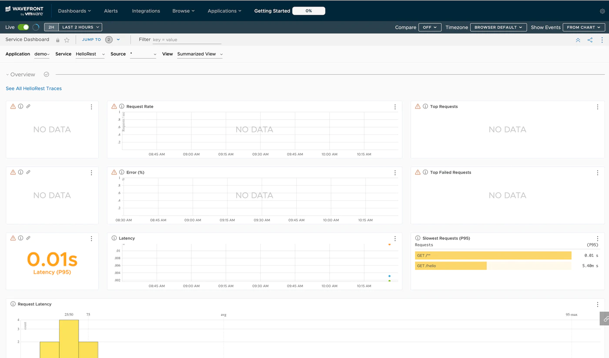
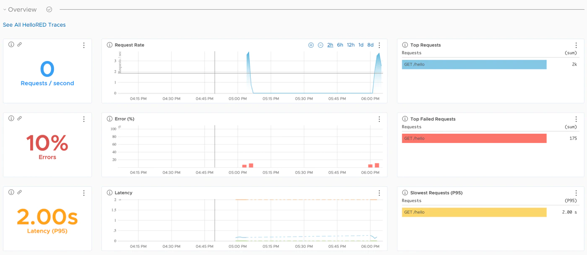
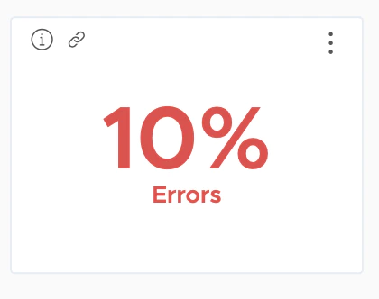
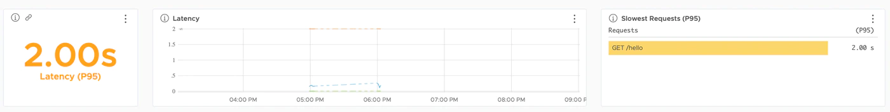

This is the third installment of the Learning Distributed Tracing with Wavefront series.<!--more-->

# Series

Part 1 : [Overview](../wf-demanabu-dt)  
Part 2 : [Distributed tracing with Spring Boot](../wf-demanabu-dt-02)   
Part 3 : What are RED metrics? **← you are here**  
Part 4 : [Connecting services together](../wf-demanabu-dt-04)  
Part 5 : [Distributed tracing with Python](../wf-demanabu-dt-05)  
Part 6 : [Distributed tracing with AMQP](../wf-demanabu-dt-06)  
Part 7 : [Distributed tracing with a service mesh](../wf-demanabu-dt-07)  


# Introduction

[Last time](../wf-demanabu-dt-02) we did distributed tracing with a simple app in Wavefront, and you probably saw this screen:



The first pane consists of three rows, and it is built on RED metrics.

RED metrics stands for Rate, Error, Duration — [a concept originally proposed by Tom Wilkie of Weaveworks](https://grafana.com/blog/2018/08/02/the-red-method-how-to-instrument-your-services/).

Wavefront displays the RED metrics of each service's distributed traces so each can be measured.
Duration shows an unfamiliar **P95** label — this represents the 95th percentile. To explain very roughly: of all requests that came in, it shows the one at the 95% mark of slowness.

Now, the previous demo probably didn't show anything interesting for Error or Duration.
This time we deepen our understanding of RED a bit.

The steps from here are mostly the same as last time, with subtle differences.

# Preparation

Spring Boot is a Java framework. So at minimum you need:

* Java JDK 8+

Install the JDK following [Oracle JDK](https://www.oracle.com/java/technologies/javase-downloads.html).

# Source code

Published here:

https://github.com/mhoshi-vm/wf-demanabu-dis-tracing/tree/master/3

# Preparing the app

Once ready, access this URL:

[start.spring.io](https://start.spring.io)


Then do the following:

* Select Add Dependencies
* Search for and add Spring Web
* Add Sleuth the same way
* Add Wavefront the same way

Finally click Generate.
A zip file downloads; extract it anywhere you like.

Open the following file in your favorite editor:

```
mhoshino@mhoshino demo % vi src/main/java/com/example/demo/DemoApplication.java
```

Replace it with this content:

```

package com.example.demo;

import java.util.Map;

import org.slf4j.Logger;
import org.slf4j.LoggerFactory;
import org.springframework.boot.SpringApplication;
import org.springframework.boot.autoconfigure.SpringBootApplication;
import org.springframework.http.ResponseEntity;
import org.springframework.web.bind.annotation.GetMapping;
import org.springframework.web.bind.annotation.RequestHeader;
import org.springframework.web.bind.annotation.RestController;

@SpringBootApplication
public class DemoApplication {

	public static void main(String[] args) {
		SpringApplication.run(DemoApplication.class, args);
	}

}

@RestController
class HelloRestController {

	private static final Logger LOGGER = LoggerFactory.getLogger(HelloRestController.class);

        @GetMapping("/hello")
        public ResponseEntity<String> hello (@RequestHeader Map<String, String> header) throws InterruptedException{

                printAllHeaders(header);

                // Generate bad request 10%
                if ((long)(Math.random()*10%10) == 1) {
                    return ResponseEntity.badRequest().body("Good Bye World!");
                }
                int randomNumber = (int) (Math.random()*100);

                if (randomNumber > 97) {
                    //　Wait for 5 seconds in 2%
                    Thread.sleep(5000);
                }else if (randomNumber > 90) {
                    // Wait for 2 seconds in 10%
                    Thread.sleep(2000);
                }
                return ResponseEntity.ok("Hello World!");
        }

	private void printAllHeaders(Map<String, String> headers) {
		headers.forEach((key, value) -> {
			LOGGER.info(String.format("Header '%s' = %s", key, value));
		});
	}
}
```

Also open this file:

```
mhoshino@mhoshino demo % vi src/main/resources/application.properties
```

And append the following:

```
management.endpoints.web.exposure.include=wavefront
server.port=8082
wavefront.application.name=demo2
wavefront.application.service=HelloRED
```

That's it for code editing.


# Trying it

Now let's run the application.
Execute the following command:

```
mhoshino@mhoshino demo % ./mvnw spring-boot:run
```

If all goes well, the application starts without errors.
Open another prompt and run the following command for a while:

```
watch -n 0.1 curl localhost:8082/hello
```

After letting it run about five minutes, let's look at the service dashboard.
As before, it should be reachable at:

https://localhost:8082/actuator/wavefront

# Analyzing RED

After a while, it should look roughly like this:




Now let's cross-reference this result against the actual code.
First, look at the Error value:



This is the result of the following code —
in short, forcing an error with 10% probability:

```

                // Generate bad request 10%
                if ((long)(Math.random()*10%10) == 1) {
                    return ResponseEntity.badRequest().body("Good Bye World!");
                }
```
So this matches the result.

Now, the interesting part is the Duration (P95) result:


The slowest reported value is 2 seconds, but here's the code behind it:

```

                if (randomNumber > 97) {
                    //　Wait for 5 seconds in 2%
                    Thread.sleep(5000);
                }else if (randomNumber > 90) {
                    // Wait for 2 seconds in 10%
                    Thread.sleep(2000);
                }
```

Note that this code actually waits **5 seconds with 2% probability** and **2 seconds with 10% probability**.
Indeed, scrolling down a bit shows the 5-second waits are actually being detected:

Yet, as the result shows, the 5-second waits are ignored. That's what "95th percentile" means: latencies occurring beyond the 95% mark are treated as outliers and ignored.

There are various schools of thought on this value, but what I want you to take away at this stage is that Wavefront can display this kind of analysis. (And for free.)

# Summary

* RED metrics stands for Rate, Error, Duration
* Wavefront can analyze based on RED metrics too
* Wavefront can even display tricky results like the 95th percentile

Next: "[Connecting services together](../wf-demanabu-dt-04)".
