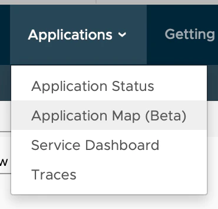
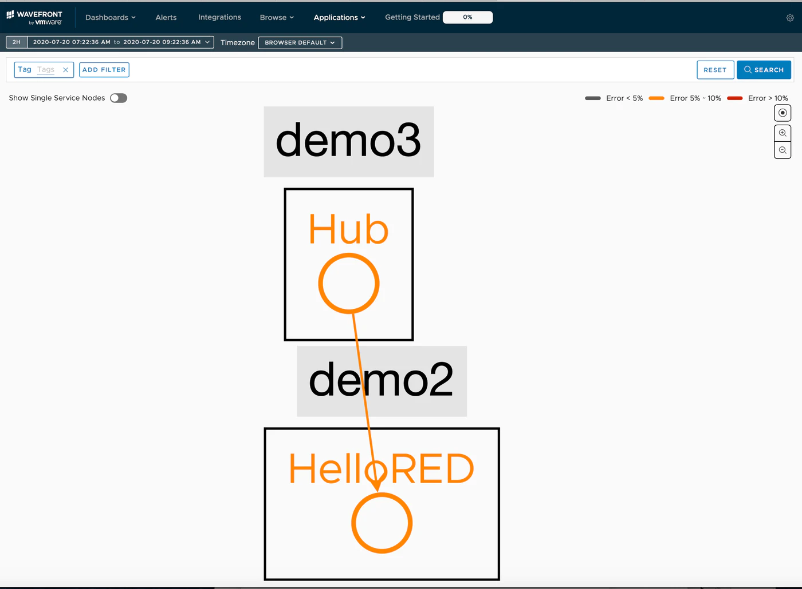
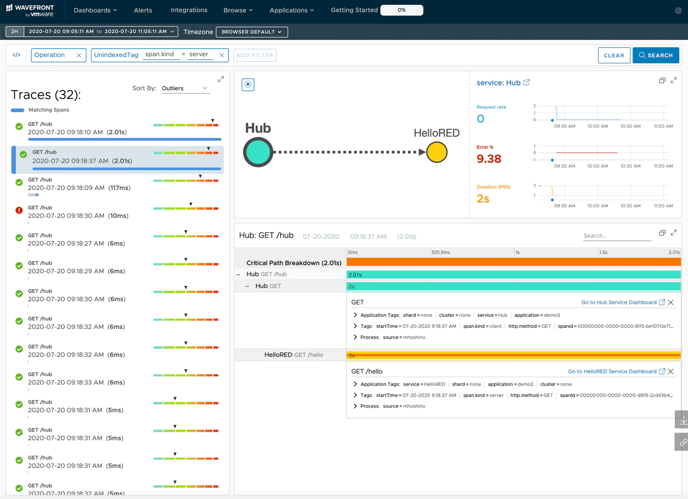

This is the fourth installment of the Learning Distributed Tracing with Wavefront series.<!--more-->

# Series

Part 1 : [Overview](../wf-demanabu-dt)  
Part 2 : [Distributed tracing with Spring Boot](../wf-demanabu-dt-02)   
Part 3 : [What are RED metrics?](../wf-demanabu-dt-03)  
Part 4 : Connecting services together **← you are here**  
Part 5 : [Distributed tracing with Python](../wf-demanabu-dt-05)  
Part 6 : [Distributed tracing with AMQP](../wf-demanabu-dt-06)  
Part 7 : [Distributed tracing with a service mesh](../wf-demanabu-dt-07)  


# Introduction

In [Part 2](../wf-demanabu-dt-02) and [Part 3](../wf-demanabu-dt-03) we watched distributed tracing with simple apps.

This time we connect two services and watch what happens.
We're aiming for this:


# Preparation

Build the app using the same [steps](../wf-demanabu-dt-02) as Part 2.
If configured correctly, the following URL should show "Hello World" or "Good Bye World":

```
curl localhost:8082/hello
```

To avoid confusion, this article calls that app the **RED app**.
In addition to the RED app, we'll build one more app and connect them.

The newly built one is called the **HUB app**.

# Source code

Published here:

https://github.com/mhoshi-vm/wf-demanabu-dis-tracing/tree/master/4


# Preparing the HUB app

Here's how to build the HUB app.

(It's practically boilerplate by now.)
Once ready, access this URL:

[start.spring.io](https://start.spring.io)


Then do the following:

* Select Add Dependencies
* Search for and add Spring Web
* Add Sleuth the same way
* Add Wavefront the same way

Finally click Generate.
Extract the zip somewhere that doesn't overlap with the current app.

Open the following file in your favorite editor:

```
mhoshino@mhoshino demo % vi src/main/java/com/example/demo/DemoApplication.java
```

Replace it with this content:

```
package com.example.demo;

import java.util.Map;

import org.slf4j.Logger;
import org.slf4j.LoggerFactory;
import org.springframework.beans.factory.annotation.Autowired;
import org.springframework.beans.factory.annotation.Value;
import org.springframework.boot.SpringApplication;
import org.springframework.boot.autoconfigure.SpringBootApplication;
import org.springframework.context.annotation.Bean;
import org.springframework.core.ParameterizedTypeReference;
import org.springframework.http.HttpMethod;
import org.springframework.web.bind.annotation.GetMapping;
import org.springframework.web.bind.annotation.RequestHeader;
import org.springframework.web.bind.annotation.RestController;
import org.springframework.web.client.RestTemplate;

@SpringBootApplication
public class DemoApplication {

	public static void main(String[] args) {
		SpringApplication.run(DemoApplication.class, args);
	}

}

@RestController
class HubController{

    private static final Logger LOGGER = LoggerFactory.getLogger(HubController.class);

	@Value("${hub.urls}")
	private String urls;

    @Autowired
    RestTemplate restTemplate;

    @Bean
    public RestTemplate getRestTemplate() {
        return new RestTemplate();
    }

    @GetMapping(value="/hub")
    public String MultiRest(@RequestHeader Map<String, String> header) {
		printAllHeaders(header);

		for( String url : urls.split(",") )
		{
			LOGGER.info(String.format("URLS = %s", url));
			restTemplate.exchange(url, HttpMethod.GET, null, new ParameterizedTypeReference<String>() {}).getBody();
		}
        return "REST Complete";
    }

	private void printAllHeaders(Map<String, String> headers) {
		headers.forEach((key, value) -> {
			LOGGER.info(String.format("Header '%s' = %s", key, value));
		});
	}
}
```

Also open this file:

```
mhoshino@mhoshino demo % vi src/main/resources/application.properties
```

And append the following:

```
management.endpoints.web.exposure.include=wavefront
server.port=8083
wavefront.application.name=demo3
wavefront.application.service=Hub

hub.urls=http://localhost:8082/hello
```

That's it for code editing.

# Connecting the services

Now start the apps. Run the following command for both the RED app and the HUB app. (Same command, so don't mix up the directories.)

```
./mvnw sprint-boot:run
```

Then run this command against the URL a few times:

```
curl localhost:8083/hub
```

After a while, log into the Wavefront URL:

http://localhost:8083/actuator/wavefront

After logging into Wavefront, select [Applications] > [Application Map(Beta)].


If it worked, the diagram should be connected like this:



Opening [Applications] > [Traces] should show the Trace logs.




# What's happening?

As usual, the explanation comes afterwards.
The HUB app we built is very simple — it just sends a REST API call to the RED app from last time.
In code, it's this part:


```
    @GetMapping(value="/hub")
    public String MultiRest(@RequestHeader Map<String, String> header) {
		printAllHeaders(header);

		for( String url : urls.split(",") )
		{
			LOGGER.info(String.format("URLS = %s", url));
			restTemplate.exchange(url, HttpMethod.GET, null, new ParameterizedTypeReference<String>() {}).getBody();
		}
        return "REST Complete";
    }
```

Which URL it calls is set by the `hub.urls` parameter in `application.properties`:

```
hub.urls=http://localhost:8082/hello
```

Let's look at the behavior in a little more detail.

Looking at the HUB app's logs, they should look like this:

```
2020-07-20 09:18:40.787  INFO [,5f14e2e08374d381d7534b5d89939527,d7534b5d89939527,true] 34562 --- [nio-8083-exec-2]
2020-07-20 09:18:40.787  INFO [,5f14e2e08374d381d7534b5d89939527,d7534b5d89939527,true] 34562 --- [nio-8083-exec-2]
2020-07-20 09:18:40.787  INFO [,5f14e2e08374d381d7534b5d89939527,d7534b5d89939527,true] 34562 --- [nio-8083-exec-2]
2020-07-20 09:18:40.787  INFO [,5f14e2e08374d381d7534b5d89939527,d7534b5d89939527,true] 34562 --- [nio-8083-exec-2]
```

Note the `[,5f14e2e08374d381d7534b5d89939527,d7534b5d89939527,true] ` part — as explained in Part 1, `5f14e2e08374d381d7534b5d89939527` is the Trace ID
and `d7534b5d89939527` is the Span ID.

Looking at the RED app's logs, they should look like this:

```
[hellorest,5f14e2e08374d381d7534b5d89939527,7ce53e353e48c2aa,true] 34007 --- [nio-8082-exec-2]
[hellorest,5f14e2e08374d381d7534b5d89939527,7ce53e353e48c2aa,true] 34007 --- [nio-8082-exec-2]
[hellorest,5f14e2e08374d381d7534b5d89939527,7ce53e353e48c2aa,true] 34007 --- [nio-8082-exec-2]
[hellorest,5f14e2e08374d381d7534b5d89939527,7ce53e353e48c2aa,true] 34007 --- [nio-8082-exec-2]
```

The things to note here:

* The Trace ID `5f14e2e08374d381d7534b5d89939527` matches
* The Span ID differs between the RED app and the HUB app

Further, looking to the right side of these logs, you should see:


```
2020-07-20 09:18:40.789  INFO Header 'accept' = text/plain, application/json, application/*+json, */*
2020-07-20 09:18:40.789  INFO Header 'x-b3-traceid' = 5f14e2e08374d381d7534b5d89939527
2020-07-20 09:18:40.789  INFO Header 'x-b3-spanid' = 067b8ed01abdb759
2020-07-20 09:18:40.789  INFO Header 'x-b3-parentspanid' = d7534b5d89939527
2020-07-20 09:18:40.789  INFO Header 'x-b3-sampled' = 1
2020-07-20 09:18:40.789  INFO Header 'user-agent' = Java/14.0.1
2020-07-20 09:18:40.789  INFO Header 'host' = localhost:8082
2020-07-20 09:18:40.789  INFO Header 'connection' = keep-alive
```

This prints the HTTP headers that arrived from the HUB app.
From this we learn:

* x-b3-trace-id contains the Trace ID
* x-b3-parentspanid contains the HUB app's Span ID

## x-b3?

So what on earth is x-b3? It's b3-propagation — HTTP headers defined by Zipkin for sharing Trace information.

For details, see [here](https://github.com/openzipkin/b3-propagation).

In Spring Boot, Sleuth handles unpacking these x-b3 headers from upstream and inserting them downstream, almost transparently to the code.
It's what we defined at ③ below:


# Summary

* To connect services in Spring Boot, simply making REST API calls is enough
* Services exchange Trace IDs and Span IDs via the HTTP "x-b3-*" headers
* In Spring Boot, Sleuth takes care of the "x-b3-*" headers for you — delightful

Next time, we'll see just how fiddly handling these x-b3 headers can be, using Python.
Next: "[Distributed tracing with Python](../wf-demanabu-dt-05)".
