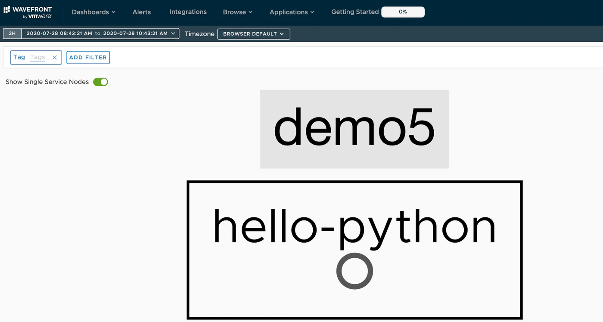
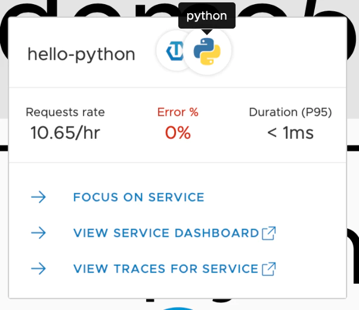
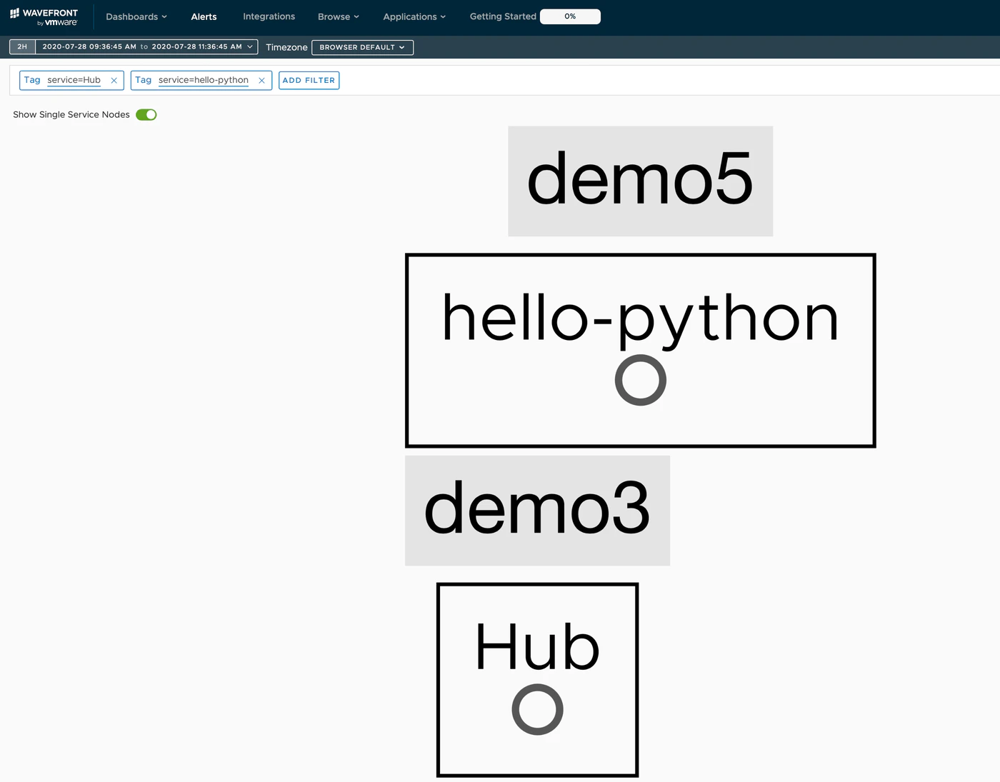
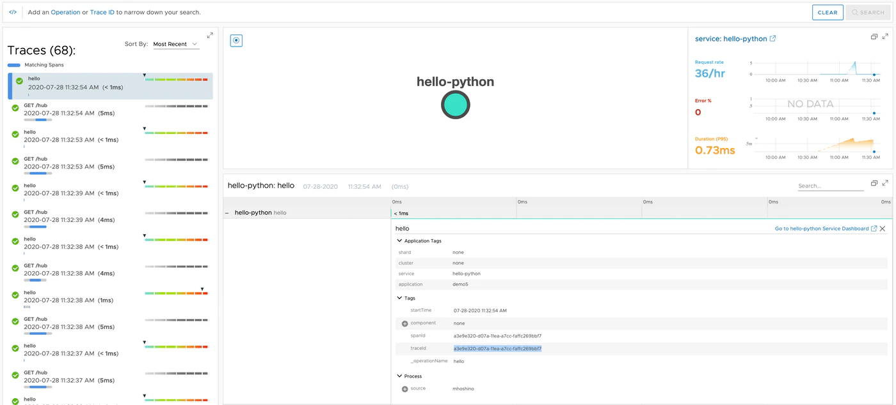
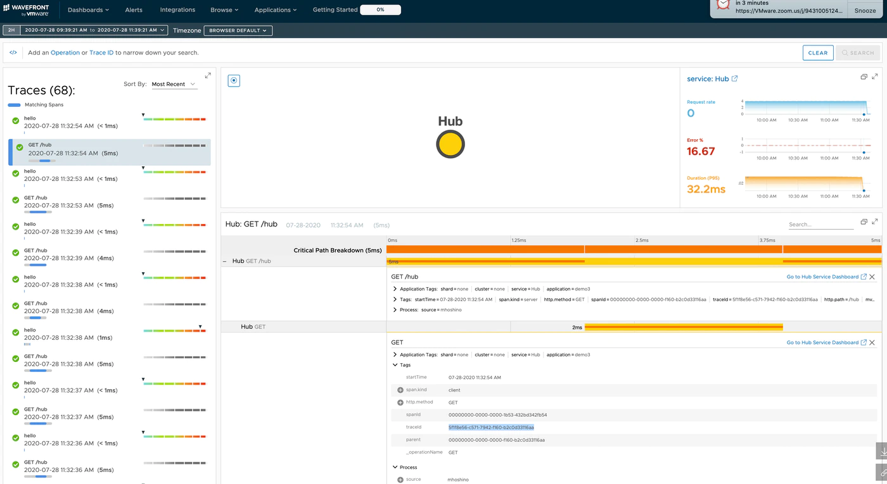
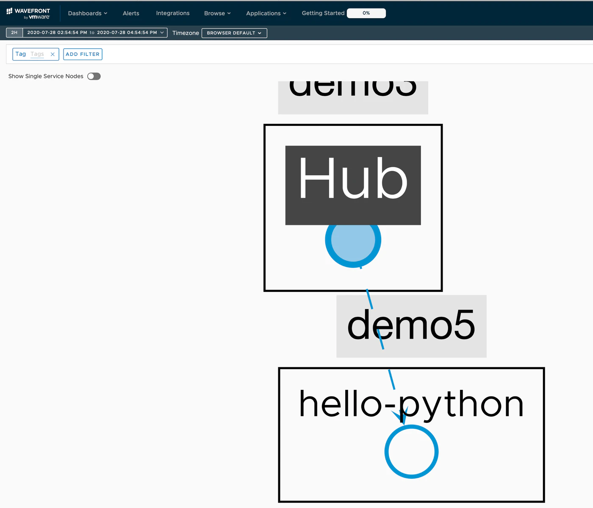
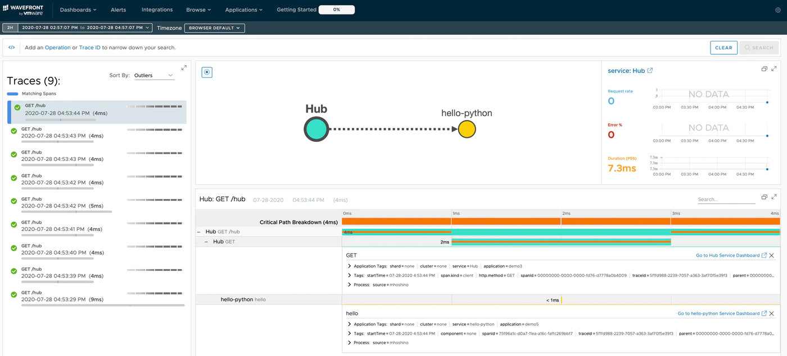

この文章は、Wavefrontで学ぶ分散トレーシング　シリーズの第五回目です。<!--more-->

# シリーズ

第一回　：　[概要編](../wf-demanabu-dt)  
第二回　：　[Spring Bootで分散トレーシング](../wf-demanabu-dt-02)   
第三回　：　[REDメトリクスって何？](../wf-demanabu-dt-03)  
第四回　：　[サービスをつなげてみる](../wf-demanabu-dt-04)  
第五回　：　Pythonで分散トレーシング　**← いまここ**  
第六回　：　[AMQPで分散トレーシング](../wf-demanabu-dt-06)  
第七回　；　[サービスメッシュで分散トレーシング](../wf-demanabu-dt-07)  


# 始めに

過去の回では、Spring Bootをつかった分散トレーシングを紹介しました。
そして、それらの復習をすると

 * 分散トレーシングのキモはTrace IDとSpan ID
 * HTTPヘッダーをもとにTrace IDとSpan IDをサービス間で共有することでサービスがつながる
 * Spring Bootでは[Slueth](https://docs.spring.io/spring-cloud-sleuth/docs/current-SNAPSHOT/reference/html/) をつかうことによって、ほぼコードからは透過的にTrace idとSpan idを取り扱うことができる

Spring Bootだとほとんど、コーディングで気にすることなく分散トレーシングが行えてしまいます。
これは便利なのですが、今回はあえてより大変な方法で理解を深めようと思います。

今回はPythonでやります。WavefrontではPythonのコードから分散トレーシングを行うための専用のSDKである、OpenTracing SDKを提供しています。

https://github.com/wavefrontHQ/wavefront-opentracing-sdk-python


# 準備編

今回必要なのは以下です。

* Python 3

インストール方法は[こちら](https://www.python.org/downloads/)を参照してください。
相変わらずですが高度なエディターは不要です。


Pythonがインストールできたら、まずは、依存関係をローカルでのみテストしたいので、`virtualenv`を作ります。任意のディレクトリーで以下を実行してください。

```bash
virtualenv env1
source env1/bin/activate
```

# ソースコード

ここに公開しています。

https://github.com/mhoshi-vm/wf-demanabu-dis-tracing/tree/master/5

# コードの準備

## hello.py

まず第一段階として、簡単なコードを用意します。
今回はREST APIにはFlaskを使用します。以下のファイルを`requirements.txt`として保存します。

```
flask
flask-jsonpify
flask-sqlalchemy
flask-restful
```

そうしたら、依存関係をインストールします。

```
pip install -r requirements.txt
```

コードは以下のようにしてください。ファイル名は`hello.py`として保存してください。

```

from flask import Flask

app = Flask(__name__)

@app.route("/")
def hello():
    return "Hello World!"


if __name__ == '__main__':
    app.run(debug=True,host='0.0.0.0')
```

これを起動します。

```
python hello.py
```

Curlでアクセスできることを確認します。

```
curk localhost:5000
```

この時点で`Hello World!`と帰ってくれば成功です。
現状はそれ以上、特になんの面白味もないです。当然Wavefront側には何も表示されません。
これに分散トレーシングの仕組みを追加していきます。

## コードのアップデート

さて、分散トレーシングのコードですが、まず依存関係を修正します。
`requirements.txt`を以下のファイルにアップデートしてください。

```
flask
flask-jsonpify
flask-sqlalchemy
flask-restful
wavefront-sdk-python
wavefront-opentracing-sdk-python
```

そうしたら、依存関係をインストールします。

```
pip install -r requirements.txt
```

そしてコードを以下の内容に差し替えます。

```
from flask import Flask,request

# Set up sender
import opentracing

from wavefront_opentracing_sdk import WavefrontTracer
from wavefront_opentracing_sdk import span_context
from wavefront_opentracing_sdk.reporting import CompositeReporter
from wavefront_opentracing_sdk.reporting import ConsoleReporter
from wavefront_opentracing_sdk.reporting import WavefrontSpanReporter

import wavefront_sdk
import argparse


app = Flask(__name__)

@app.route("/")
def hello():
    span_ctx=None
    with tracer.start_active_span('hello', child_of=span_ctx, ignore_active_span=True, finish_on_close=True):
      return "Hello World!"


if __name__ == '__main__':
    parser = argparse.ArgumentParser()
    parser.add_argument('token')
    args = parser.parse_args()
    application_tag = wavefront_sdk.common.ApplicationTags(
        application='demo5',
        service='hello-python')
    # Create Wavefront Span Reporter using Wavefront Direct Client.
    direct_client = wavefront_sdk.WavefrontDirectClient(
        server="https://wavefront.surf",
        token=args.token,
        max_queue_size=50000,
        batch_size=10000,
        flush_interval_seconds=5)
    direct_reporter = WavefrontSpanReporter(direct_client)


    # Create Composite reporter.
    # Use ConsoleReporter to output span data to console.
    composite_reporter = CompositeReporter(
        direct_reporter, ConsoleReporter())

    # Create Tracer with Composite Reporter.
    tracer = WavefrontTracer(reporter=composite_reporter,
                             application_tags=application_tag)


    app.run(debug=True,host='0.0.0.0')
```

数行のコードが突然複雑になったように感じると思いますが、一旦は起動します。
引数には、wavefrontのIDが必要ですが、前回までのSpring Bootを行っている場合、`~/.wavefront_freemium`というファイルにIDがはいっているはずです。なので以下のように起動します。

```

python hello.py `cat ~/.wavefront_freemium`
```

`~/.wavefront_freemium`が存在しない場合、[第二回] (https://qiita.com/hmachi/items/d3ab73238b8c9e3b16c9)の検証を実施してください。


Curlでアクセスできることを確認します。

```
curk localhost:5000
```

この時点で`Hello World!`と帰ってくれば成功です。
何回か実行して以下のURLにアクセスしてください。

https://wavefront.surf

そして[Applications] > [Applications Map(Beta)] を選択し、さらにShow Single Service Nodesをオンにします。
すると、`demo5`, `hello-python`が見えるはずです。



フォーカスをあてるとPythonだということも認識しています。



"View Service Dashboard"や"View Traces for Service"も選択してください。前回と同じような画面がみえるかと思います。（今回は詳細はふれません）

# コードの分析

さて、今回のコードですが、注目するべき点はただの2点です。
1点目がTracerオブジェクトを作成している以下の箇所です。

```

    # Create Tracer with Composite Reporter.
    tracer = WavefrontTracer(reporter=composite_reporter,
                             application_tags=application_tag)
```

このコードを含めた前段でどのようにWavefrontに接続するかを定義しています。
Tracerを生成したら、Pythonのwith構文でどの箇所をトレースするかを定義します。

コードでいう以下の箇所です。

```

@app.route("/")
def hello():
...
    with tracer.start_active_span('hello', child_of=span_ctx, ignore_active_span=True, finish_on_close=True):
      return "Hello World!"
```
このように任意の箇所でトレースしたいものをコーディングするのがライブラリーを使った分散トレーシングのやり方です。
逆にいうと注意が必要なのが正しい位置にこのようなコーディングを入れ込まないと意図しないトレース情報を送付してしまうかもしれません。

# サービスをつなげてみる

さて、前回つくったHUBアプリで今回新しくつくったPythonのアプリをつなげてみたいと思います。
前回の[HUBアプリの準備](../wf-demanabu-dt-04)に従って用意してください。

最後に起動コマンドを以下のようにします。こうすることで`hub.urls`の値をオーバーライドしてpythonのコードにアクセスを行おうとします。

```
./mvnw spring-boot:run -Dspring-boot.run.arguments=--hub.urls=http://localhost:5000
```

そして以下のURLにアクセスをしてみます。

```
curl localhost:8083/hub
```

うまくいくと以下のようなメッセージがみれるはずです。

```
REST Complete
```

すべて成功してしまっているように見えますが、WavefrontのURLにログインしてみます。

## つながっていないじゃん

おそらくしばらくまっても、以下のようになり、２つのサービスがつながらないと思います。


なぜか、Traceダッシュボードをみてましょう。
すると、Trace IDが２つのサービス間で一致していないことが確認できます。
たとえば、この例では、hello-pythonは`a3e9e320-d07a-11ea-a7cc-faffc269bbf7`ですが、

呼び出した方のサービスでは、`5f1f8e56-c571-7942-f160-b2c0d33116aa`となっています。



前回にもまとめたようサービス間はHTTPヘッダーをつかいながら、お互いのTrace IDを交換しています。
このときアプリケーション側でただしくTrace IDを展開しないと関連のないサービスとして見えてきません。
これをさけるためにコードをもう一段階修正しなくてはいけません。


## コードを修正

Pythonのコードを以下に修正してください。

```

from flask import Flask,request

# Set up sender
import opentracing

from wavefront_opentracing_sdk import WavefrontTracer
from wavefront_opentracing_sdk import span_context
from wavefront_opentracing_sdk.reporting import CompositeReporter
from wavefront_opentracing_sdk.reporting import ConsoleReporter
from wavefront_opentracing_sdk.reporting import WavefrontSpanReporter

import wavefront_sdk
import argparse
import uuid

app = Flask(__name__)

@app.route("/")
def hello():
    _BAGGAGE_PREFIX = 'x-b3-'
    _TRACE_ID = _BAGGAGE_PREFIX + 'traceid'
    _SPAN_ID = _BAGGAGE_PREFIX + 'spanid'
    _SAMPLE = _BAGGAGE_PREFIX + 'sample'

    trace_id = None
    span_id = None
    sampling = None
    baggage = {}
    for key, val in dict(request.headers).items():
        key = key.lower()
        if key == _TRACE_ID:
            trace_id = uuid.UUID(val.zfill(32))
        elif key == _SPAN_ID:
            span_id = uuid.UUID(val.zfill(32))
        elif key == _SAMPLE:
            sampling = bool(val == 'True')
        elif key.startswith(_BAGGAGE_PREFIX):
            baggage.update({strip_prefix(_BAGGAGE_PREFIX, key): val})
    if trace_id is None or span_id is None:
       span_ctx=None
    else:
       span_ctx = span_context.WavefrontSpanContext(trace_id, span_id, baggage,
                                                 sampling)
    # Create span1, return a newly started and activated Scope.
    with tracer.start_active_span('hello', child_of=span_ctx, ignore_active_span=True, finish_on_close=True):
      return "Hello World!"

def strip_prefix(prefix, key):
    """
    Strip the prefix of baggage items.
    :param prefix: Prefix to be stripped.
    :type prefix: str
    :param key: Baggage item to be striped
    :type key: str
    :return: Striped baggage item
    :rtype: str
    """
    return key[len(prefix):]


if __name__ == '__main__':
    parser = argparse.ArgumentParser()
    parser.add_argument('token')
    args = parser.parse_args()
    application_tag = wavefront_sdk.common.ApplicationTags(
        application='demo5',
        service='hello-python')
    # Create Wavefront Span Reporter using Wavefront Direct Client.
    direct_client = wavefront_sdk.WavefrontDirectClient(
        server="https://wavefront.surf",
        token=args.token,
        max_queue_size=50000,
        batch_size=10000,
        flush_interval_seconds=5)
    direct_reporter = WavefrontSpanReporter(direct_client)


    # Create Composite reporter.
    # Use ConsoleReporter to output span data to console.
    composite_reporter = CompositeReporter(
        direct_reporter, ConsoleReporter())

    # Create Tracer with Composite Reporter.
    tracer = WavefrontTracer(reporter=composite_reporter,
                             application_tags=application_tag)


    app.run(debug=True,host='0.0.0.0')
```

さらに長くなりましたが、修正後もう一度アプリを起動します。

```
python hello.py `cat ~/.wavefront_freemium`
```

そして、しばらくcurlを実行します。

```
curl localhost:8083/hub
```

するとうまくいけばWavefront上の画面でサービスがつながります。


修正したコードで注目すべきは以下の箇所です。
ここでHTTPヘッダーを解釈して、正しいTrace IDを抽出しています。

```

@app.route("/")
def hello():
...
    for key, val in dict(request.headers).items():

        key = key.lower()
        if key == _TRACE_ID:
            trace_id = uuid.UUID(val.zfill(32))
        elif key == _SPAN_ID:
            span_id = uuid.UUID(val.zfill(32))
        elif key == _SAMPLE:
            sampling = bool(val == 'True')
        elif key.startswith(_BAGGAGE_PREFIX):
            baggage.update({strip_prefix(_BAGGAGE_PREFIX, key): val})

```

再びTraceのダッシュボードを参照すると、接続されたサービスが同じTrace IDをもっていることが記録されているはずです。



以上でサービスをつなげる方法を紹介しました。

# まとめ

* 分散トレーシングを行う上では、コーディング側でどこをTraceしたいか明示的に記載しないといけない
* 他のサービスとの連携をする際、受け取ったHTTPヘッダーからTrace IDを取り出さないとつながって表示されない

今回はSpring Bootを使わず、他言語でどのように分散トレーシングができるようになるか紹介しました。
次回は「[AMQPで分散トレーシング](../wf-demanabu-dt-06)」です。
