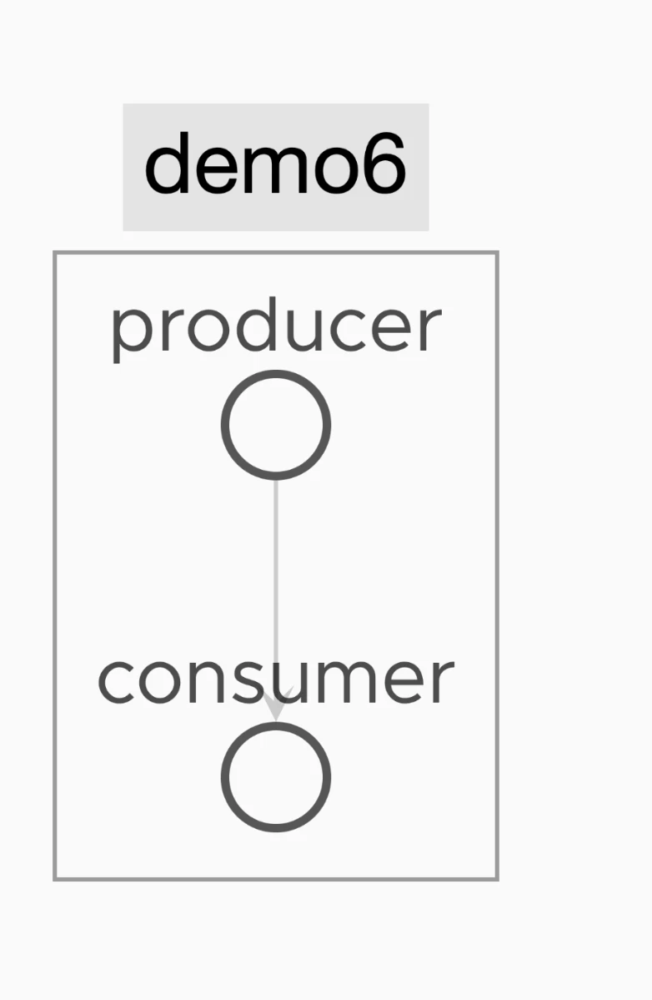
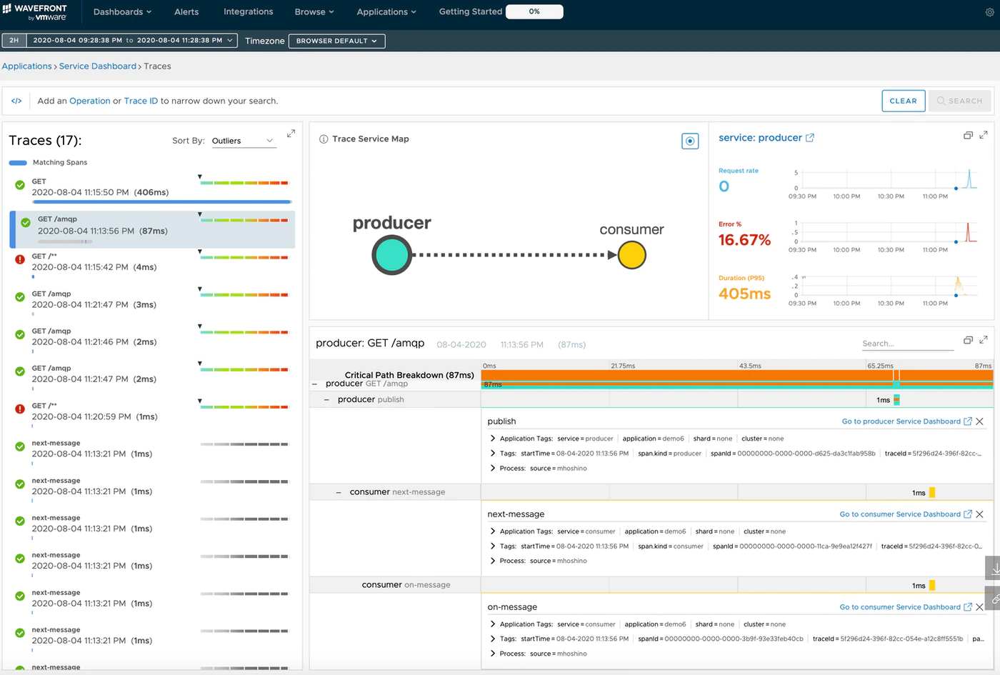
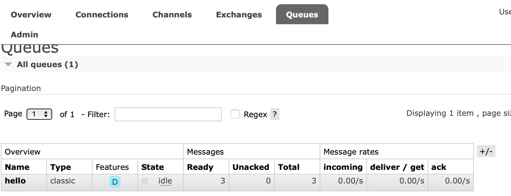
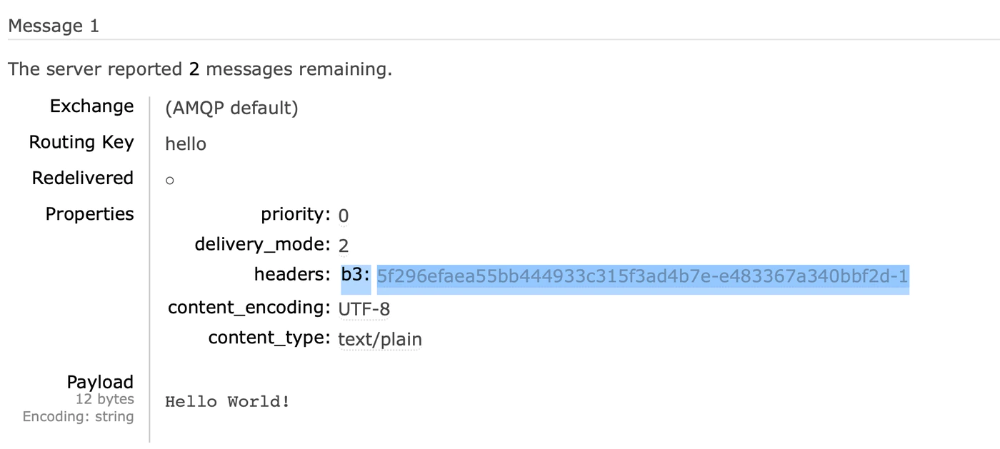

This is the sixth installment of the Learning Distributed Tracing with Wavefront series.<!--more-->

# Series

Part 1 : [Overview](../wf-demanabu-dt)  
Part 2 : [Distributed tracing with Spring Boot](../wf-demanabu-dt-02)   
Part 3 : [What are RED metrics?](../wf-demanabu-dt-03)  
Part 4 : [Connecting services together](../wf-demanabu-dt-04)  
Part 5 : [Distributed tracing with Python](../wf-demanabu-dt-05)  
Part 6 : Distributed tracing with AMQP **← you are here**   
Part 7 : [Distributed tracing with a service mesh](../wf-demanabu-dt-07)  


# Introduction

Past installments covered distributed tracing with Spring Boot and Python.
To review once more:

 * The crux of distributed tracing is the Trace ID and Span ID
 * Services get connected by sharing Trace IDs and Span IDs via HTTP headers
 * The application must include code that unpacks the Trace ID and Span ID from the HTTP headers

Regarding the second point — all our verification so far has been based on "HTTP requests".
So a question may arise: does this work for "non-HTTP requests" too?

This time we use RabbitMQ to verify whether distributed tracing also works over AMQP.

# Preparation

We use RabbitMQ this time, so install it on your PC.
The steps differ per OS; install and start it based on:

https://www.rabbitmq.com/download.html

We'll write Spring Boot apps that put messages onto and take messages off RabbitMQ.
As before, install at minimum:

* Java JDK 8+

Install the JDK following [Oracle JDK](https://www.oracle.com/java/technologies/javase-downloads.html).

# Source code

Published here:

https://github.com/mhoshi-vm/wf-demanabu-dis-tracing/tree/master/6

# Preparing the apps

Two apps are needed: a Producer app and a Consumer app.

## Producer app

Since we're on Part 6 now, instead of downloading from [start.spring.io](https://start.spring.io) as before, we download the needed packages directly using the CLI:

```
curl https://start.spring.io/starter.tgz \
       -d artifactId=producer \
       -d baseDir=producer \
       -d dependencies=web,amqp,cloud-starter-sleuth,wavefront \
       -d packageName=com.example \
       -d applicationName=ProducerApplication | tar -xzvf -
```

Success looks like this output:

```
x producer/.mvn/
x producer/.mvn/wrapper/
x producer/.mvn/wrapper/maven-wrapper.properties
x producer/.mvn/wrapper/MavenWrapperDownloader.java
x producer/.mvn/wrapper/maven-wrapper.jar
x producer/.gitignore
x producer/HELP.md
x producer/mvnw.cmd
x producer/src/
x producer/src/main/
x producer/src/main/resources/
x producer/src/main/resources/templates/
x producer/src/main/resources/application.properties
x producer/src/main/resources/static/
x producer/src/main/java/
x producer/src/main/java/com/
x producer/src/main/java/com/example/
x producer/src/main/java/com/example/producer.java
x producer/src/test/
x producer/src/test/java/
x producer/src/test/java/com/
x producer/src/test/java/com/example/
x producer/src/test/java/com/example/producerTests.java
x producer/pom.xml
```

We add two pieces of code to this.
First create a file `producer/src/main/java/com/example/ProducerRestController.java` with the following:

```
package com.example;

import java.util.Map;

import org.slf4j.Logger;
import org.slf4j.LoggerFactory;
import org.springframework.beans.factory.annotation.Autowired;
import org.springframework.http.ResponseEntity;
import org.springframework.web.bind.annotation.GetMapping;
import org.springframework.web.bind.annotation.RequestHeader;
import org.springframework.web.bind.annotation.RestController;

@RestController
public class ProducerRestController {

        private static final Logger LOGGER = LoggerFactory.getLogger(ProducerRestController.class);

        @Autowired
        Producer producer;

        @GetMapping("/amqp")
        public ResponseEntity<String> hello (@RequestHeader Map<String, String> header){
                printAllHeaders(header);
            producer.send();
            return ResponseEntity.ok("Hello World!");
        }

        private void printAllHeaders(Map<String, String> headers) {
                headers.forEach((key, value) -> {
                        LOGGER.info(String.format("Header '%s' = %s", key, value));
                });
        }
}
```

Then create `producer/src/main/java/com/example/Producer.java`:

```
package com.example;

import org.springframework.amqp.core.Queue;
import org.springframework.amqp.rabbit.core.RabbitTemplate;
import org.springframework.beans.factory.annotation.Autowired;
import org.springframework.context.annotation.Bean;
import org.springframework.stereotype.Component;

@Component
public class Producer{

    @Bean
    public Queue hello() {
        return new Queue("hello");
    }

    @Autowired
    private RabbitTemplate template;

    @Autowired
    private Queue queue;

    public void send() {
        String message = "Hello World!";
        this.template.convertAndSend(queue.getName(), message);
        System.out.println(" [x] Sent '" + message + "'");
    }
}
```

Finally update `producer/src/main/resources/application.properties` to:

```
spring.application.name=producer

management.endpoints.web.exposure.include=wavefront
server.port=8086

wavefront.application.name=demo6
wavefront.application.service=producer

spring.rabbitmq.host=localhost
```


## Consumer app

Now build the Consumer app.
First run this curl command:

```
curl https://start.spring.io/starter.tgz \
       -d artifactId=consumer \
       -d baseDir=consumer \
       -d dependencies=web,amqp,cloud-starter-sleuth,wavefront \
       -d packageName=com.example \
       -d applicationName=ConsumerApplication | tar -xzvf -
```

Add `consumer/src/main/java/com/example/Consumer.java` to it:

```
package com.example;

import java.util.Map;

import org.slf4j.Logger;
import org.slf4j.LoggerFactory;
import org.springframework.amqp.rabbit.annotation.RabbitHandler;
import org.springframework.amqp.rabbit.annotation.RabbitListener;
import org.springframework.messaging.handler.annotation.Headers;
import org.springframework.messaging.handler.annotation.Payload;
import org.springframework.stereotype.Component;

@Component
@RabbitListener(queues = "hello")
public class Consumer {

    private static final Logger LOGGER = LoggerFactory.getLogger(Consumer.class);

    @RabbitHandler
    public void receive(@Payload String body, @Headers Map<String,Object> headers) {
		LOGGER.info(String.format(" [x] Received '" + body + headers + "'"));
    }

}
```

Finally update `consumer/src/main/resources/application.properties` to:

```
spring.application.name=consumer

management.endpoints.web.exposure.include=wavefront
server.port=18086

wavefront.application.name=demo6
wavefront.application.service=consumer

spring.rabbitmq.host=localhost
```
# Starting the apps

Once ready, start the apps.
First, RabbitMQ needs to be running.
This differs by OS; I'm on a Mac, so:

```
/usr/local/sbin/rabbitmq-server
```

Next start the Producer app:

```
cd producer
./mvnw spring-boot:run
```

Then start the Consumer app:

```
cd ..
cd consumer
./mvnw spring-boot:run
```

With both running, curl this URL:

```
curl localhost:8086/amqp
```

If it works, you should see ` [x] Sent 'Hello World!'`.
Run `curl` a few times over a while.

Then, after a bit, access:

http://localhost:8086/actuator/wavefront

And select Applications > Application Map(Beta).

If it worked, things connect like this:



In other words — distributed tracing works over AMQP too.
Looking at Applications > Traces, the objects are connected with matching Trace IDs:




# What's happening?

You're probably wondering what on earth is going on, so let me explain.
First, to make the situation clearer, stop the Consumer app (Ctrl + c).

With the Producer app still running, run this about three times:

```
curl localhost:8086/amqp
```

In this state, log into the RabbitMQ management console:

http://localhost:15672/#/　
User/password is guest/guest.

After logging in, the Queue tab shows that the hello Queue has accumulated as many messages as the number of curls:



So the Producer app is a very simple app that pushes a message onto the `hello` queue on every curl.
The Consumer app, on the other hand, reads messages off that `hello` queue.

## What about the x-b3 headers?

As repeated since last time, x-b3 headers are the mechanism for exchanging Trace IDs and such.
How does AMQP do this?

From the management console, select the `hello` queue and choose `Get Messages`.
The message contains a `b3` header:



So AMQP also exchanges Trace IDs via headers.
And again, this is thanks to `Sleuth` doing it transparently in the Spring Boot case:

https://docs.spring.io/spring-cloud-sleuth/docs/current-SNAPSHOT/reference/html/#sleuth-with-zipkin-over-rabbitmq-or-kafka

# Summary

* Distributed tracing works over AMQP too
* AMQP also exchanges Trace IDs and the like via headers
* With Spring Boot, tracing remains transparent to your code

Next time, at last: "[Distributed tracing with a service mesh](../wf-demanabu-dt-07)".
