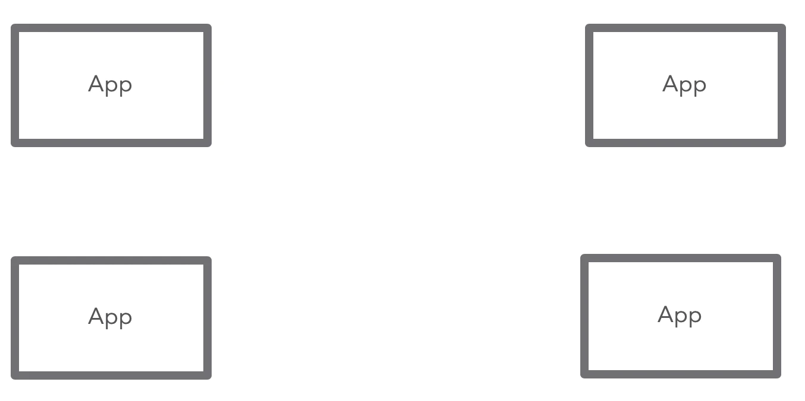
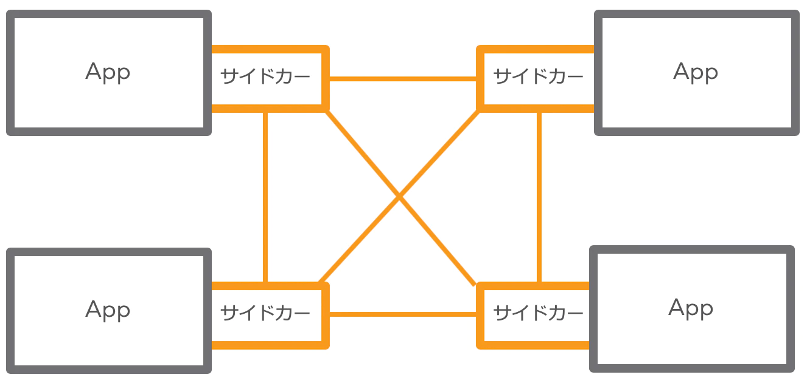
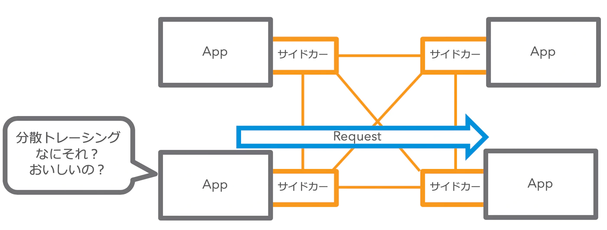
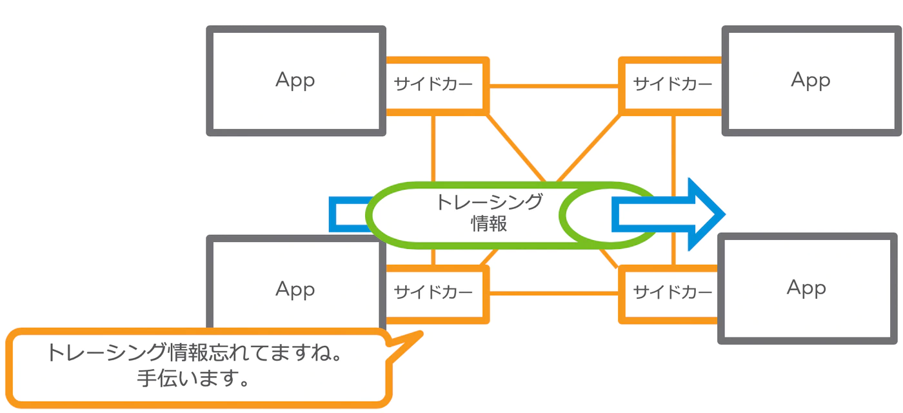
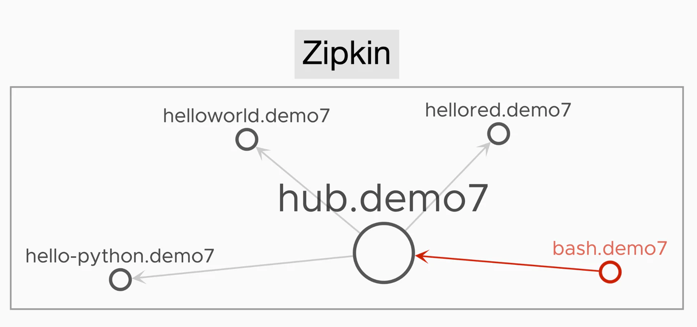
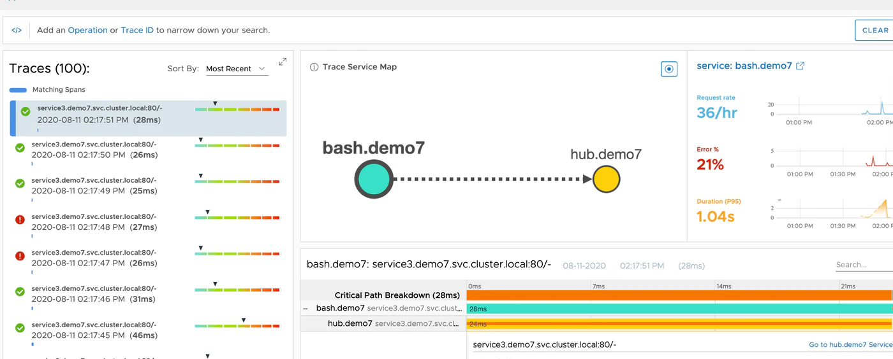
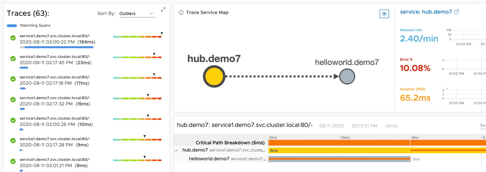
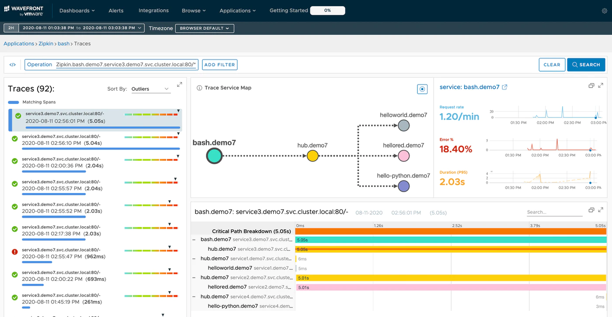

この文章は、Wavefrontで学ぶ分散トレーシング　シリーズの第七回目です。<!--more-->

# シリーズ

第一回　：　[概要編](../wf-demanabu-dt)  
第二回　：　[Spring Bootで分散トレーシング](../wf-demanabu-dt-02)   
第三回　：　[REDメトリクスって何？](../wf-demanabu-dt-03)  
第四回　：　[サービスをつなげてみる](../wf-demanabu-dt-04)  
第五回　：　[Pythonで分散トレーシング](../wf-demanabu-dt-05)  
第六回　：　[AMQPで分散トレーシング](../wf-demanabu-dt-06)  
第七回　；　サービスメッシュで分散トレーシング **← いまここ**  


# 始めに

全七回あった内容ですが、やっと[概要編](../wf-demanabu-dt)で記載したサービスメッシュと分散トレーシングの話をまとめます。

# 分散トレーシングとは何か？

いままで、やったシリーズで書いてきたものをまとめていきます。

* 分散トレーシングとは、アプリケーションを監視するための手段（[第一回](../wf-demanabu-dt)）
* 分散トレーシングでは、一連の処理を表すTrace IDと個別の処理を表すSpan IDがある。([第二回](../wf-demanabu-dt-02))
* 分散トレーシングを監視できるようになると、REDメトリクス（[第三回](../wf-demanabu-dt-03)）やサービス間の繋がりをみることができる([第四回](../wf-demanabu-dt-04))
* 分散トレーシングは、Trace IDとSpan IDを通信のヘッダー情報に加えてやり取りをする。([第三回](../wf-demanabu-dt-04)と[第六回](../wf-demanabu-06)）
* そのヘッダーにある情報を読み解いて、Span IDを更新したり、下位のアプリケーションへ伝搬するのは**アプリケーションの責任（つまりコーディングされている必要がある）** ([第五回](../wf-demanabu-dt-05))

色々書いていますが、最後のポイントが一番重要で分散トレーシングが**開発者の仕事になっている**という点です。正しくコーディングされていなければ、分散トレーシングのログは何も拾えないです。また間違ったコーディングをすれば、想定とは異なる結果となります。

## 「監視」なのに、開発者に頼らないといけない

分散トレーシングは、大枠で言えば本来「監視」というインフラ運用によった作業にもかかわらず、開発者に頼らないといけないため、非常にハードルの高い監視項目です。

筆者自身の経験となりますが、インフラチームが分散トレーシングを本番で監視しているというのは、みたことがないです。多くの現場では議題にすら上がらない項目ではないでしょうか？

ただし、昨今のマイクロサービス化の動きに伴って、サービス間の監視がどんどん重要性を増すことが予想されます。結果として、この分散トレーシングをインフラチームも監視できていく必要が今後出てくるかもしれません。

# サービスメッシュが颯爽と登場

そこでサービスメッシュです。
サービスメッシュは分散トレーシングという観点で見た場合、アプリケーションが分散トレーシングのコードがなされてなくとも、トレースを可視化できるというメリットをもっています。

## 漫画で書くと。。。

以下のようにアプリがあったとします。


サービスメッシュとは、このサービス間にサイドカーと呼ばれるものを稼働させる技術です。


仮に、「分散トレーシング、なにそれ？おいしいの？」つまり、分散トレーシングにまったく対応していないアプリがあったとします。


サイドカーはこのときHTTPヘッダーをみて、分散トレーシングがない場合、**勝手にトレーシングの情報を挿入**します。


つまり、開発者に頼ることなく、サービスメッシュの基盤を用意するだけで、分散トレーシング行えるようになります。これがサービスメッシュと分散トレーシングがセットで語られることが多い理由です。

実際の検証から、この挙動をみていきましょう。

# 準備編

さて今回の作業には、以下が必要です。

* Kubernetes + Istioの環境
* WavefrontアカウントとAPIキー

なお、今回の記事ではこれら全てが既に用意されている前提で話を始めてしまいます。
というのも、Istioがかなりヘビーであり、Minikubeなどの環境で試しても苦労するだけになってしまうことが多いです。
またWavefront側も今まで使っていたFreemiumアカウントがデフォルトでは、Istioの分散トレーシングをキャプチャーができないです。なのでここから記載する内容は、最低限Trialアカウント(サインアップ必要) or 本番アカウントが必要です。

なお、IstioとWavefront連携は以下の手順で実施してください。

https://github.com/wavefrontHQ/wavefront-kubernetes/tree/master/istio

# 準備編

今回はコードが以下に用意されています。

https://github.com/mhoshi-vm/wf-demanabu-dis-tracing/

kuberenetesに接続できる状態で以下のコマンドを実行します。

```
git clone https://github.com/mhoshi-vm/wf-demanabu-dis-tracing/
cd wf-demanabu-dis-tracing/7/kube-resources
kubectl apply -f ./
```

しばらくすると以下のようにPodが起動してきます。

```
kubectl get po -n demo7
NAME                            READY   STATUS    RESTARTS   AGE
bash-7bf77657d9-d944j           2/2     Running   0          14m
hello-python-6764dc77c8-z2ftr   2/2     Running   0          14m
hellored-6b6f86c4c6-nf4qx       2/2     Running   0          14m
helloworld-84c4c97c88-4g5zb     2/2     Running   0          14m
hub-54cd8f855f-mxvvc            2/2     Running   0          14m
```

この中の`bash-*`というPodにログインします。

```
kubectl exec -it <bash-XXXX> -n demo7 sh
```

プロンプトが上がったら、以下のコマンドを実行します。

```
apk add curl
curl service3/hub
```

最後のCurlは数回実行します。

# 解説

この状態でWavefrontを見にいきます。

すると、以下のような画面になっているはずです。



先の図のそれぞれのコンポーネントは以下のとおりです。

* helloworld.demo7 > [第二回](../wf-demanabu-dt-02)のアプリで**Sleuthを解除したもの**
* hellored.demo7 > [第三回](../wf-demanabu-dt-03) のアプリで**Sleuthを解除したもの**
* hub.demo7 > [第四回](../wf-demanabu-dt-04)でアプリの**Sleuthを解除したもの**。さらにここを起点にして、helloworld,hellored,hello-pythonへリクエストを実行している
* hello-python.demo7 > [第五回](../wf-demanabu-dt-05)のアプリの**Tracingを無効にしたもの**
* bash.demo7 > ただのalpineイメージであり、ここを起点にcurlを実行

なお、参考までにSluethの解除は以下のように、`spring.sleuth.enabled: "false"`をconfigmap上で仕込むことによって実現しています。(*Sleuthとは過去回でも触れたように、分散トレーシングをコードからは透過的に実施してくれるライブラリー）

https://github.com/mhoshi-vm/wf-demanabu-dis-tracing/blob/master/7/kube-resources/05-configmap.yaml#L7

ここでポイントなのが、**SleuthやTracingをアプリ側では全て解除したにもかかわらず、Istioを有効にした環境であれば、これらが全てTraceの情報がみえてくるという点です。**

面白いのが、ただのcurlコマンドを実行している`bash.demo7`からも分散トレーシングができてしまっています。

つまり、前述のよう、サービスメッシュのメリットである、アプリケーション側でのコーディングを入れることなく、分散トレーシングがおこなえることがわかりました。

## え、でも本当にコーデイング不要なの？

しかし、Istioのマニュアルには以下のように書いてあります。

https://istio.io/latest/faq/distributed-tracing/#how-to-support-tracing

> for a complete view of the traffic flow, applications must propagate the trace context between incoming and outgoing requests.

私の上の説明とは違い、「必ずアプリケーション側でヘッダーの展開、挿入が必要である」と書いてあります。これは、「for a complete view」がみそです。

さきほどのアプリで説明します。

`bash-*`podから`curl service3/hub`をしたとき、`hub`サービスが残りのサービスに対して、リクエストを実行していました。つまり`bash-*`podからみれば、すべてのリクエストが同じTrace IDをもっているべきです。

では、それを確認するためWavefront側のTrace Viewをみてます。
下記画像のTrace Service Mapビューでは、期待と異なりbash > hubでTraceが途絶えています。




さらに、hub > helloworldも別のTraceとして見えてきてしまいます。


この挙動が**アプリケーション側で分散トレーシングのコードを仕込まなかった場合の制約**です。
つまり、Istioなどのサービスメッシュが分散トレーシングの補助をできるのは、**あくまで2点間の通信だけです**。複数サービスがつながっているようなものは正しくマッピングできません。

最後のこの説明を検証していきます。

# アプリケーション側の分散トレーシングを有効にしてみる

まったく同じkubernetesのリソースで`spring.sleuth.enabled: "true"`として、Spring boot側の分散トレーシングを有効にしたものを配置しました。

```

mhoshino@mhoshino 7 % diff kube-resources kube-update
diff kube-resources/05-configmap.yaml kube-update/05-configmap.yaml
7c7
<   spring.sleuth.enabled: "false"
---
>   spring.sleuth.enabled: "true"
15c15
<   spring.sleuth.enabled: "false"
---
>   spring.sleuth.enabled: "true"
23c23
<   spring.sleuth.enabled: "false"
---
>   spring.sleuth.enabled: "true"
mhoshino@mhoshino 7 %
```

これを使いもう一度デプロイしなおします。

```
git clone https://github.com/mhoshi-vm/wf-demanabu-dis-tracing/
cd wf-demanabu-dis-tracing/7/kube-update
kubectl delete -f ./
kubectl apply -f ./
```

起動したら先ほどと同じく、`bash-*`というPodにログインします。

```
kubectl exec -it <bash-XXXX>  -n demo7 sh
```

プロンプトが上がったら、これもさきほどと同じく、以下のコマンドを実行します。

```
apk add curl
curl service3/hub
```

この状態で、もういちどWavefront側のTraceビューをみています。
すると、さきほど違い、Trace Serivce Mapビューが期待通り、全てのアプリケーションがつながった状態で表示されるようになります。



つまり、より正しい状態を表すには、サービスメッシュがあろうとなかろうと、アプリケーション側でのヘッダーの処理は必要になってくることがこの検証からわかります。

# まとめ

この回をまとめていきます。

* サービスメッシュとは、過去にアプリケーション開発者の責任となっていた一部コードをインフラからも管理できるようにする
* サービスメッシュがあると、分散トレーシングを全く対応していないアプリもトレース情報を表示できるようにしてくれる
* サービスメッシュがが手助けしてくれるのは、あくまで2点間のサービスの可視化
* 複数サービスにまたがるようなサービスの可視化にはアプリケーションのコーディングは避けられない

さて、第七回まであったこのシリーズをここまで書き終えました。個人的には追加で以下の点も感じていただければと思います。

* 分散トレーシングはまだまだ発展途上であり、かつ今後はインフラ担当者もしっていく必要がある
* WavefrontはSaaSサービスにかかわらず、分散トレーシングをすぐに、しかもタダで検証が始められる
* Wavefrontは今後もっとしってもらいたい
