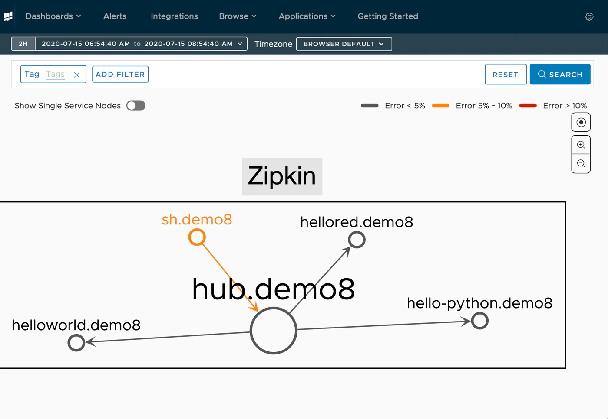
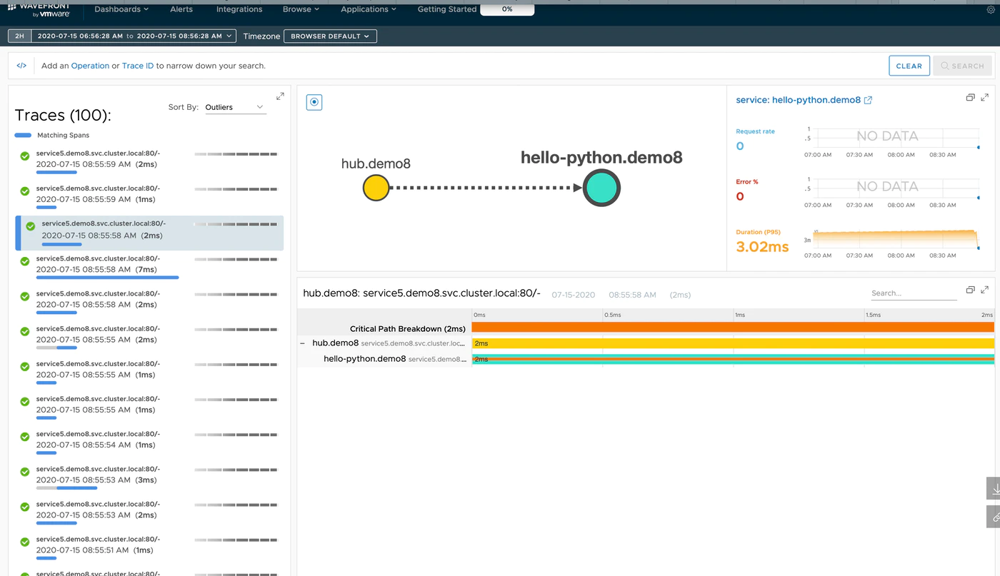

この文章は、Wavefrontで学ぶ分散トレーシング　シリーズの第一回目です。<!--more-->
# シリーズ

第一回　：　概要編　**← いまここ**  
第二回　：　[Spring Bootで分散トレーシング](../wf-demanabu-dt-02)  
第三回　：　[REDメトリクスって何？](../wf-demanabu-dt-03)  
第四回　：　[サービスをつなげてみる](../wf-demanabu-dt-04)  
第五回　：　[Pythonで分散トレーシング](../wf-demanabu-dt-05)  
第六回　：　[AMQPで分散トレーシング](../wf-demanabu-dt-06)  
第七回　；　[サービスメッシュで分散トレーシング](../wf-demanabu-dt-07)  

# Wavefrontとはなんぞや？

WavefrontとはいうのはSaaSベースのクラウドおよびアプリケーションの監視プラットフォームです。
現在はVMwareに買収されており、Tanzu Observabilityと呼ばれています。 
このシリーズでは、旧称のWavefrontを多用しますが同じものです。

# 分散トレーシングとはなんぞや？

分散トレーシングについては弊社のClement氏の動画がわかりやすいので貼っておきます。

[  
https://www.youtube.com/watch?v=Z7mf_oZfcSE

はい、英語です。というわけで要点を説明すると… 

* Lift（Uberみたいなもの）を例に考え方を説明
* 分散トレーシングは主に２つの要素がある、それがTraceとSpan
* Traceとは、あるまとまった一つの処理のこと、動画ではLiftで乗車を依頼してから降車するまでの処理として説明
* Spanとは、Traceを形成する個々の処理の単位のこと
* 分散トレーシングとは、**それらを視覚的に捉えやすくし**、どこに問題があるか、どの処理に時間がかかっているかなどをみること

Wavefrontは、この分散トレーシングを使ってアプリケーションの可視化を行えるようにしているツールです。

例えば、マイクロサービスでの各コンテナーどうつながっているかを以下のようなグラフで表現したり

どの処理がどのくらい時間かかったか、失敗している処理はなどがわかるようになります。

# このシリーズはなんぞや？

さて、本題のこのシリーズについて、少し説明します。私自身、分散トレーシングに初めて触れたのは３年前でした。そして、その触れた要因がサービスメッシュ、Istioを勉強している時でした。IstioとZipkin(やJaeger)をセットで紹介されていることが多かったです。ただ、正直よく理解はしていなかったです。また環境の用意にも重い腰があがりませんでした。

このシリーズは（きっと）私のようなレベルの方々に向けて、以下の点に注力して、分散トレーシングをとりあげたいと思います。

* なるべく、お金も時間もかけない
* アプリケーションがまったく書けない、という人向けにHello Worldレベルから解説する
* なんで、Istioと分散トレーシングが関連しているか理解する
* Wavefront/Tanzu Observabilityをしってもらう

というわけで、早速次回は「[Spring Bootで分散トレーシング](../wf-demanabu-dt-02)」です。
