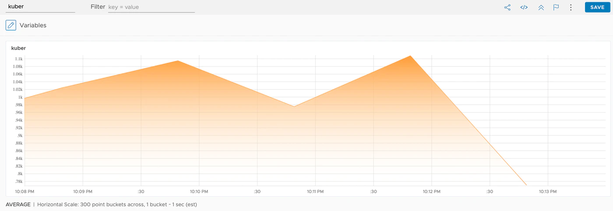

この文章は、Wavefrontで学ぶHorizontal Pod Autoscaler　シリーズの第二回目です。<!--more-->
# シリーズ

第一回　：　[概要編](../wf-demanabu-hpa)  
第二回　：　Wavefront情報からスケールする　**← いまここ**  
第三回　：　[サーバーレスもどきを実装する](../wf-demanabu-hpa-03)

# 始めに

[概要](../wf-demanabu-hpa)にも記載したよう、この記事では、Wavefrontのメトリクスをもとに、HPAを実装する方法を紹介します。

今回はまずシンプルにCPUベースでのHPAを実装します。

## 前提知識

前提知識として、HPAとしてKuberenetesの利用できるAPIとしては３つあります。

1. `metrics.k8s.io` : Coreとよばれるメトリクスである、マニュアルにあるよう、CPUとMemoryの使用率を報告します。実際の収集方法は[metrics-server](https://github.com/kubernetes-incubator/metrics-server)もしくは [Heapster](https://github.com/kubernetes/heapster)経由で取得します。なお、それらはKubernetesのデフォルトで動いているわけではなく、別途起動しないといけないものです。
2. `custom.metrics.k8s.io` : 上とは別に外部データソースからメトリクスを収集してメトリクスに反映するものです。[ここ](https://github.com/kubernetes/metrics/blob/master/IMPLEMENTATIONS.md#custom-metrics-api)に一部実装可能なものが紹介されています。CNCF的にはPrometheusが推奨されています。
3. `external.metrics.k8s.io` : これも外部データソースからメトリクスですが、さらに自由度の高い定義ができるようになっています。

このうち、Wavefrontでは、2と3の方法をサポートしています。
2で使えるメトリクス一覧は以下の定義されています。

https://github.com/wavefrontHQ/wavefront-kubernetes-adapter/blob/master/docs/metrics.md

これが実際のどのWavefrontのメトリクスとマッピングされるかはあとで、触れます。
3の方法では、Annotationを使い好きなメトリクスをマッピングさせることもできます。

https://github.com/wavefrontHQ/wavefront-kubernetes-adapter/blob/master/docs/metrics.md

# 準備編

さて検証を始める前に以下が必要です。

* WavefrontのアカウントとAPIキー
* Kubernetes環境
* Helm(v3がおすすめ) cli

なお、Wavefrontのアカウントないよ、という場合ですが、Trialの申し込みをお勧めします。
もし、それも面倒な場合、非常に多くの制約をもちますが、サインアップ不要のFreemiumアカウントもあるにはあります。

https://docs.wavefront.com/wavefront_spring_boot_faq.html#what-is-the-retention-and-service-level-agreement-sla-on-the-freemium-cluster

現状WavafrontのFreemiumアカウントはSpring Boot経由でないと、作成ができないようになっています。最低限、[ここ](../wf-demanabu-dt-02)で紹介したようにHelloWorldアプリを作成してください。作成すると`~/.wavefront_freemium`にAPIキーが含まれます。

# インストール

まずは、Wavefrontのコンポーネントをインストールします。
インストールするのは、以下の２つです。

* Wavefront Collector
* Wavefront HPA Adaptor

どちらでも使うので、以下の`myvalues.yaml`を用意します。
XXXXには取得したWavefrontのアカウントとAPIキーを指定します。また`ClusterName`は判別しやすい任意の名前をつけてください。

```
clusterName: mhoshi-test

wavefront:
  url: https://XXXXX.wavefront.com
  token: XXXXXXXXXXXXXXX
```

さらに、HelmのRepositoryをダウンロードします。

```
helm repo add wavefront https://wavefronthq.github.io/helm/
helm repo update
```

## Wavefront Collectorのインストール

以下の手順でインストールします。

```
kubectl create namespace wavefront
helm install -f myvalues.yaml wavefront wavefront/wavefront --namespace wavefront
```

## Wavefront HPA Adapterのインストール

以下の手順でインストールします。

```
kubectl create namespace wavefront-adapter
helm install -f myvalues.yaml wavefront-adapter wavefront/wavefront-hpa-adapter --namespace wavefront-adapter
```

以上でインストールの完了です。

# CPU情報でスケールしてみる

では、HPAを早速ためしてみます。
まず作業用のネームスペースを作成します。

```
kubectl create ns hpa
```

なんでもいいのでKubernetesのDeploymentを作成します。
筆者の場合は手っ取り早く以下で作ります。

```
kubectl create deployment --image=nginx hpa-pods -n hpa
```

次に、HPAの定義を作ります。

```

cat <<EOF | kubectl apply -n hpa -f -
apiVersion: autoscaling/v2beta1
kind: HorizontalPodAutoscaler
metadata:
  name: example-hpa-custom-metrics
spec:
  minReplicas: 1
  maxReplicas: 5
  metrics:
  - type: Pods
    pods:
      metricName: cpu.usage_rate
      targetAverageValue: 300m
  scaleTargetRef:
    apiVersion: apps/v1
    kind: Deployment
    name: hpa-pods
EOF
```
これは、最小１、最大5Podまでを定義したHPAです。
そして、`targetAverageValue: 300m`にあるよう、300millisecondのCPU使用率に落ち着くことを期待しています。


HPAができたことを確認します。なお、直後は`TARGETS`が`unknown`になっているかもしれないですが、これはメトリクスがまだWavefrontに届いていない場合で、すこしまてば、値が取得されます。

```
kubectl get hpa -n hpa
NAME                         REFERENCE             TARGETS          MINPODS   MAXPODS   REPLICAS   AGE
example-hpa-custom-metrics   Deployment/hpa-pods   <unknown>/300m   1         5         0          8s
```

しばらくすると、`TARGETS`に値が入るはずです。

```
kubectl get hpa -n hpa
NAME                         REFERENCE             TARGETS   MINPODS   MAXPODS   REPLICAS   AGE
example-hpa-custom-metrics   Deployment/hpa-pods   0/300m    1         5         1          6m20s
```

CPU負荷をあげていきます。
手っ取り早い方法がContainerに入って、無限ループをつくってしまう方法です。

```
kubectl exec -it `kubectl get pods -l app=hpa-pods -n hpa -o name` -n hpa bash
```

Containerログイン後、以下のコマンドを実行します。以下のコマンドは何もしない無限ループを１つ作ります。理論的には、このコマンドによって１つのvCPU使用率を100%にします。

```
while true ; do : ; done &
```

WavefrontのUIを開きます。
Metrics Viewerを開いて、以下の式を入力します。ClusterNameはそれぞれ指定したものを記載してください。

```
ts("kubernetes.pod.cpu.usage_rate",  pod_name="hpa-*" and namespace_name="hpa")
```

これは、namepsace名hpaのpod名`hpa-*`の全てのCPU使用率を算出しています。
すると以下のようにCPU使用率があがっていることがわかります。




現在設定上はCPU使用率300mを超えた場合で、スケリーングを開始するようにしています。
しばらく放置すると、pod数が5に変動します。

```
% kubectl get hpa -n hpa
NAME                         REFERENCE             TARGETS        MINPODS   MAXPODS   REPLICAS   AGE
example-hpa-custom-metrics   Deployment/hpa-pods   219200m/300m   1         5         5          19m
% kubectl get po -n hpa
NAME                       READY   STATUS    RESTARTS   AGE
hpa-pods-8d86f4dc5-2xn52   1/1     Running   0          8m46s
hpa-pods-8d86f4dc5-7wnpw   1/1     Running   0          8m46s
hpa-pods-8d86f4dc5-qbdn9   1/1     Running   0          7m12s
hpa-pods-8d86f4dc5-r55hb   1/1     Running   0          8m46s
hpa-pods-8d86f4dc5-wgc8g   1/1     Running   0          20m
```

また、CPUをぶん回したPodを止めるには以下を実行します。

```
kubectl delete po hpa-pods-8d86f4dc5-wgc8g -n hpa
```

しばらくすると、Podがまた1で落ち着きます。

```
kubectl get hpa -n hpa
NAME                         REFERENCE             TARGETS   MINPODS   MAXPODS   REPLICAS   AGE
example-hpa-custom-metrics   Deployment/hpa-pods   0/300m    1         5         1          35m
```

# どうやってメトリクスは計算されている?

これについては、コードがみるのが早いです。
まず、WavefrontへのQueryを担っているのが以下の部分です。

https://github.com/wavefrontHQ/wavefront-kubernetes-adapter/blob/v0.9.4/pkg/provider/translator.go#L36-L50

この中でCodeのコメントアウト行にもコメントされていますが、HPAの定義をもとに以下に変換されます。

```go

	// if Prefix=kubernetes, metric='cpu.usage_rate', resType='pod', namespace='default' and names=['pod1', 'pod2']
	// ts(kubernetes.pod.cpu.usage_rate, (pod_name="pod1" or pod_name="pod2") and (namespace_name="default"))
	query := fmt.Sprintf("ts(%s.%s.%s%s)", t.prefix, resType, metric, filters)
```

つまり、HPAを以下のように定義した場合、

```yaml

spec:
  ...
  metrics:
  - type: Pods
    pods:
      metricName: cpu.usage_rate
      targetAverageValue: 300m
```

Wavefrontへは`<prefix>.<type>.<metricName>`のメトリクスを探しにいきます。
この場合

* `<prefix>` は起動オプションで`kubernetes`がデフォルト
* `<type>` はHPAの定義の`type: Pods`から`pod`に変換
* `<metricName>` はHPA定義の`metricName: cpu.usage_rate`から`cpu.usage_rate`

つまり、`kubernetes.pod.cpu.usage_rate`を参照し、pod名やNamespaceを絞り込んでいくようになっています。

より標準の実装方法は、[こちら](https://kubernetes.io/docs/tasks/run-application/horizontal-pod-autoscale-walkthrough/#autoscaling-on-multiple-metrics-and-custom-metrics)にも詳しく記載されています。


# まとめ

* Wavefrontでは、`custom.metrics.k8s.io`と`external.metrics.k8s.io`をつかってHPAができる
* `custom.metrics.k8s.io`で使える一覧はhttps://github.com/wavefrontHQ/wavefront-kubernetes-adapter/blob/master/docs/metrics.mdにある
* `custom.metrics.k8s.io`では、定義してHPAの情報を解釈してWavefrontへのメトリクスに変換して問い合わせる

この回では、Wavefrontの統計にやってくるCPU情報をもとにHPAを実装しました。
次回の「[サーバーレスもどきを実装する](../wf-demanabu-hpa-03)」ではより突飛なメトリクスを元にHPAを実装してみます。
