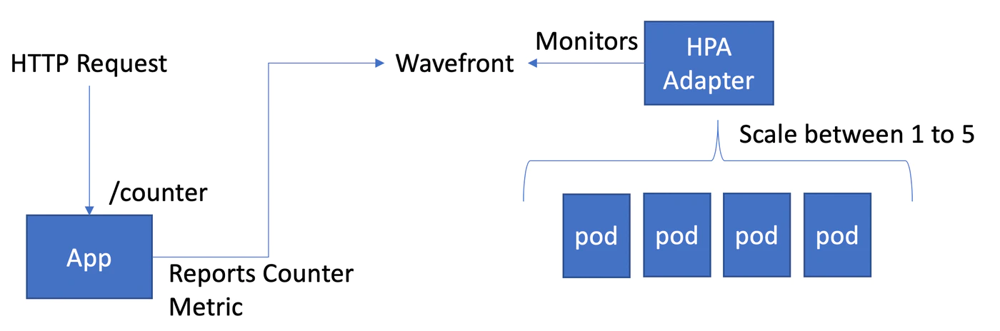
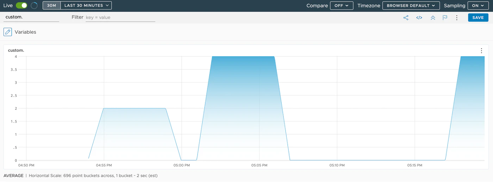

This is the third installment of the Learning Horizontal Pod Autoscaler with Wavefront series.<!--more-->
# Series

Part 1 : [Overview](../wf-demanabu-hpa)  
Part 2 : [Scaling from Wavefront data](../wf-demanabu-hpa-02)  
Part 3 : Implementing a serverless look-alike **← you are here**


# Introduction

As covered in the previous [background knowledge](../wf-demanabu-hpa), Kubernetes supports three APIs for HPA.

Among them, Wavefront supports highly flexible metric definitions using `external.metrics.k8s.io`.

More detail here:

https://github.com/wavefrontHQ/wavefront-kubernetes-adapter/blob/master/docs/introduction.md#externalmetricsk8sio

The point: you can effectively use any Wavefront metric for HPA, freely. This time we use it to build a "serverless look-alike" application.

# Verification approach

We verify with the configuration illustrated below:



That is, a setup where requests sent to a web app (`/counter`) running separately from Kubernetes cause a scale-up. When no requests come, it gradually scales back down.

Despite calling this a "serverless look-alike", at least one Pod always keeps running.
That's because `HPAScaleToZero` — which allows an HPA min instance value of `0` — is still an Alpha implementation at the time of writing, not GA:

https://kubernetes.io/docs/reference/command-line-tools-reference/feature-gates/#feature-gates-for-alpha-or-beta-features

Once it goes GA, this gets closer to truly "serverless look-alike", but we give up on that for now.

# Preparation

Refer to the previous [preparation](https://qiita.com/hmachi/items/cfeeb53ea37f12ac27af#準備編) and [installation](https://qiita.com/hmachi/items/cfeeb53ea37f12ac27af#インストール).

# Preparing the app

This time we write an application that sends Metrics to the Wavefront account we already have. There are many ways, but here we build the quickest kind: a Spring Boot app.

The app below can run anywhere that can reach Wavefront — your PC is fine. At minimum, OpenJDK must be installed.

https://github.com/mhoshi-vm/wf-demanabu-hpa

Clone this repository:

```
git clone https://github.com/mhoshi-vm/wf-demanabu-hpa
cd wf-demanabu-hpa
```

Then edit this file:

```
vi src/main/resources/application.properties
```

Register your Wavefront account and API key inside:

```
wavefront.freemium-account=false
management.metrics.export.wavefront.uri=https://<account>.wavefront.com
management.metrics.export.wavefront.api-token=<API key>
```

Once ready, start it:

```
./mvnw spring-boot:run
```

Once it's up, send requests to the URL for a while from another prompt:

```
curl localhost:8080/counter
```

If it prints `Count Complete`, all is well.

Now log into the Wavefront UI
and run this Query:

```
mdiff(5m, ts(custom.metrics.counter))
```

If you see a graph like below — plateauing for 5 minutes at the number of curls executed — you're good:



Leave the app running and move to the next step.

# Preparing the HPA

Recreate the working namespace, which doubles as cleanup of last time's leftovers:

```
kubectl delete ns hpa
kubectl create ns hpa
```

Create the Kubernetes Deployment:

```
kubectl create deployment --image=nginx hpa-pods -n hpa
```

And this time create the following HPA:

```
cat <<EOF | kubectl apply -n hpa -f -
apiVersion: autoscaling/v2beta1
kind: HorizontalPodAutoscaler
metadata:
  name: example-hpa-external-metrics
  annotations:
    wavefront.com.external.metric/scale_counter: 'mdiff(5m, ts(custom.metrics.counter))'
spec:
  minReplicas: 1
  maxReplicas: 5
  metrics:
  - type: External
    external:
      metricName: scale_counter
      targetAverageValue: 1
  scaleTargetRef:
    apiVersion: apps/v1
    kind: Deployment
    name: hpa-pods
EOF
```

The crux:

* The metric to reference is expressed via an Annotation. In this case, `wavefront.com.external.metric/scale_counter: 'mdiff(5m, ts(custom.metrics.counter))'`
* spec.metrics defines the name specified in the Annotation. In this case, `scale_counter`

That's the whole definition. Let's look at the created HPA:

```
kubectl get hpa -n hpa
NAME                           REFERENCE             TARGETS     MINPODS   MAXPODS   REPLICAS   AGE
example-hpa-external-metrics   Deployment/hpa-pods   0/1 (avg)   1         5         1          25m
```

In this state, run `curl localhost:8080/counter` three times.
After a while, the TARGETS value should settle near `1` — the curls executed. The Replica count also becomes 3:

```
kubectl get hpa -n hpa
NAME                           REFERENCE             TARGETS        MINPODS   MAXPODS   REPLICAS   AGE
example-hpa-external-metrics   Deployment/hpa-pods   967m/1 (avg)   1         5         3          26m
```

This is because the per-Pod average is computed: `3 (number of curls) / 3 (number of pods) = 1`.

Then, five minutes later, it returns to `0`, and the Replica count slowly approaches `1` again:

```
kubectl get hpa -n hpa
NAME                           REFERENCE             TARGETS     MINPODS   MAXPODS   REPLICAS   AGE
example-hpa-external-metrics   Deployment/hpa-pods   0/1 (avg)   1         5         1          35m
```

# Summary

* With Wavefront's `external.metrics.k8s.io`, HPA can work off any metric whatsoever.

Across this three-part series, we experienced how simply Wavefront + HPA can be implemented.
